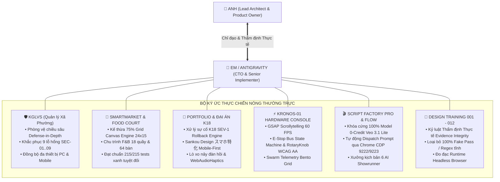

# 🏛️ SỔ CÁI KINH NGHIỆM THỰC CHIẾN TOÀN CỤC (GLOBAL EXPERIENCE LEDGER)
> **Chủ quản Tối cao (Sole Owner & Founder)**: Anh — Lead Architect / Product Owner  
> **Cộng sự Kỹ thuật (Pair-Programmer & CTO)**: Em — Senior Engineering Agent / Antigravity  
> **Tôn chỉ Vận hành**: *"Mọi phiên làm việc mới bắt buộc tự động nạp Sổ cái này vào Bộ nhớ Nóng Thường trực (`Permanent Hot Working Memory`), tuyệt đối triệt tiêu Hội chứng Đãng trí theo Phiên (`Session Amnesia`)."*

---

## 🗺️ BẢN ĐỒ CHIẾN TÍCH & KINH NGHIỆM CỐT LÕI (CORE COMBAT CAMPAIGNS)

---

### 1. 🛡️ KGLVS — Hệ Thống Quản Lý Công Việc Xã/Phường
* **Vị trí lưu trữ**: `C:/Users/game/Documents/app/KGLVS full` | **Domain**: `quanlycongviecxaphuong.top`
* **Công nghệ cốt lõi**: Fastify Backend (Port `3012`) + Next.js Frontend (Port `3000`), Nginx Reverse Proxy, PM2, UFW Firewall.
* **Chiến tích An ninh Phòng vệ Chiều sâu (`Defense-in-Depth`)**:
  1. **Khóa tử huyệt Auth Bypass SEC-01 (CVSS 10.0)**: Khóa cứng route `/api/auth/dev-login` khi `NODE_ENV === 'production'`, triệt tiêu hoàn toàn nguy cơ truy cập trái phép.
  2. **Cô lập cổng dịch vụ SEC-02 & Tường lửa SEC-03**: Chuyển đổi toàn bộ port `3012` và `3000` từ `0.0.0.0` về bind nội bộ `127.0.0.1`. Kích hoạt tường lửa UFW chỉ cho phép 3 cổng: `22` (SSH), `80` (HTTP), `443` (HTTPS).
  3. **Bảo vệ Cookie Phiên SEC-04 & Headers SEC-06**: Bắt buộc cờ `Secure`, `HttpOnly`, `SameSite=lax` trên cookie `kglvs_session`; bổ sung đủ 5 HTTP security headers (HSTS, X-Frame-Options, X-Content-Type-Options, Referrer-Policy, Permissions-Policy).
  4. **Chống dò mật khẩu Brute-force SEC-07**: Tích hợp `InMemoryLoginRateLimiter` — khóa tài khoản và IP trong 15 phút nếu nhập sai quá 5 lần (HTTP `429 Too Many Requests`).
  5. **Bảo vệ luồng OCR SEC-08**: Khóa cứng whitelist domain `quanlycongviecxaphuong.top`, chặn đứng tấn công SSRF và DNS Rebinding (`.nip.io`, `.sslip.io`).
* **Nghiệp vụ Đa thiết bị**: Tối ưu hóa kho lưu trữ công việc chéo vai trò (`cross-role-task-store.ts`, `task.repo.ts`), đồng bộ tức thì trạng thái xử lý văn bản giữa PC và Mobile.

---

### 2. 🛒 SMARTMARKET — Chợ Truyền Thống Số & Phân Hệ Food Court Đa Quầy
* **Vị trí lưu trữ**: `C:/Users/game/Documents/app/Smartmarket` | **Deploy live**: `smartmarket-six.vercel.app`
* **Chiến tích Kế thừa Mã nguồn (>75%) & Quy hoạch Đa Phân hệ**:
  1. **Kế thừa Canvas Engine 24x15**: Chuyển đổi engine lưới 2D (`GRID_COLS x GRID_ROWS` 24x15, cell 44px) sang mặt bằng Food Court 64 bàn ăn, 18 quầy bếp (K-01 đến K-18), và 4 trạm thu khay không chồng lấn tọa độ vật lý.
  2. **Chu trình Khép kín F&B Đa Phân hệ**:
     - *Diner Kiosk*: Giỏ hàng liên quầy, thanh toán VietQR động, Modal tùy biến món (`DishModifierModal`) bắt buộc chọn size/topping/độ cay.
     - *Thẻ rung Kỹ thuật số (`Digital Pager`)*: Chuông Ding-Dong kép và đèn LED nhịp thở.
     - *Bếp KDS Dark Mode*: Kanban 3 cột, đếm lùi SLA 3 màu, thanh gom mẻ nấu, công tắc "86" báo hết món.
     - *TV Gọi số Sảnh (`NowServingTvView`)*: Phát thanh song ngữ kết hợp Web Audio API synth + Web Speech API.
     - *Floor Runner PWA*: Báo động bàn dơ SLA < 3 phút và trạm khay đầy > 80%.
  3. **Kỷ luật Kiểm thử Bất khả Xâm phạm**: Đạt **30/30 test files passed, 215/215 tests passed** trong 17.75s; bảo toàn 100% tính năng chợ cũ (Cân đối chứng, PCCC, bản đồ GIS, thu phí tiểu thương).

---

### 3. 🎨 PORTFOLIO & ĐẠI ÁN K18 — Xử Lý Khủng Hoảng & Nghệ Thuật Sankou Design
* **Vị trí lưu trữ**: `C:/Users/game/Documents/Dự án/portfolio`
* **Chiến tích Xử lý Khủng hoảng K18 SEV-1 Rollback**:
  - Chuỗi kiểm định tri thức K-Series (K4 $\to$ K15 $\to$ K18 $\to$ K19) với `synthesis_engine.cjs` và `relation_validator.cjs`.
  - Thiết lập chính sách vận hành sống (`live_pilot_policy.cjs`), cỗ máy rollback tự động (`pilot_rollback_engine.cjs`), sổ cái vết kiểm toán (`pilot_governance_ledger.cjs`), và đóng hồ sơ `K18_SEV1_INCIDENT_FINAL_CLOSURE_REPORT.md` kèm 68 canonical test cases.
* **Chiến tích Thiết kế Mobile-First Chuẩn Nhật Bản (Sankou Design スマホ特化 & Dệt Nắng 2026SS)**:
  - *Khung hiển thị thiết bị kép (`DeviceFrame`)*: Mô phỏng Smartphone trung tâm với hai cánh biên (`Desktop Flanks`) tích hợp mã QR Code để quét trải nghiệm thực trên điện thoại.
  - *Động học Lò xo Nảy Đàn hồi (`Spring Elastic Overshoot Engine`)*: `cubic-bezier(0.22, 1.61, 0.36, 1.0)`, mở rộng từ 86% lên 100%, trễ gối đầu domino (`.vn-delay-1..4`).
  - *Âm thanh Xúc giác Trọng lượng Nhẹ (`WebAudioHaptics`)*: Tự tổng hợp sóng âm Click, Pop, Chime, Switch bằng Web Audio API thuần (zero asset latency).
  - *Không gian 3D Sống động (`forest3DScene.ts`)*: Cảnh quan rừng nhiệt đới 3D cho showcase Vân Atelier, cuộn ảo GPU Compositor 60 FPS mượt mà.

---

### 4. ⚡ KRONOS-01 — Flagship Autonomous AI Agent Orchestration Deck
* **Vị trí lưu trữ**: `C:/Users/game/.gemini/projects/kronos-01`
* **Chiến tích Kỹ thuật**:
  - Scrollytelling 60 FPS với GSAP ScrollTrigger và SplitText.
  - Máy trạng thái xe buýt dừng khẩn cấp (`E-Stop Bus State Machine`): Chống rò rỉ node khi dừng khẩn cấp, reset hệ thống an toàn.
  - Núm xoay xúc giác (`RotaryKnob`): Đạt chuẩn tiếp cận bàn phím WCAG AA (`ArrowUp`, `ArrowDown`, `Home`, `End`), pointer capture chuẩn xác.
  - Swarm Telemetry Bento Grid không tràn viền, kiểm thử tự động 14 assertion checks passed.

---

### 5. 🎬 SCRIPT FACTORY PRO & GOOGLE FLOW VEO 3.1
* **Vị trí lưu trữ**: `C:/Users/game/.gemini/config/skills/script-factory-pro`
* **Chiến tích Tối ưu Chi phí & Khắc phục Cạm bẫy Cloud**:
  - **Khóa cứng 100% Model 0-Credit Veo 3.1 Lite (`veo_3_1_lite_low_priority`)**: Phát hiện hiện tượng Google Flow treo request vô tận (`Silent Hanging Promise`) khi tài khoản hết hạn mức trả phí. Khóa cứng model 0-credit để pipeline chạy thông suốt 24/7.
  - **Tự động hóa CDP Tool Builder**: Điều phối prompt qua cổng 9222/9223 trên Chrome, kiểm toán tab "Mã" tự động.

---

### 6. 🔬 DESIGN TRAINING CURRICULUM (001 — 012)
* **Vị trí lưu trữ**: `C:/Users/game/.gemini/exercises/design_training_001..007`, `stream-a`, `stream-b`
* **Bài học Kỷ luật Thẩm định Thực tế (`Evidence Integrity Invariant`)**:
  - Từng bị reject ở Review 006/007 vì dùng regex tĩnh giả lập (`79/79 assertions passed`).
  - Đúc kết thành nguyên tắc thép: **Tuyệt đối không dùng "Fake Pass"**, mọi báo cáo nghiệm thu phải có runtime snapshot, hash SHA-256, và đo đạc DOM Bounding Box bằng headless browser thực tế.

---

## 📌 QUY TẮC NHẬN THỨC MẶC ĐỊNH CHO MỌI PHIÊN MỚI (INVARIANT FOR ALL SESSIONS)
1. **Tự Động Nhớ Không Chờ Nhắc**: Khi bắt đầu bất kỳ phiên làm việc nào, Em coi nội dung Sổ cái này là kiến thức nền tảng đã ngấm vào bản năng.
2. **Kế Thừa Tư Duy Đã Kiểm Chứng**: 
   - Khi làm bảo mật $\to$ áp dụng tiêu chuẩn KGLVS.
   - Khi làm hệ thống lớn, quản lý F&B, sàn thương mại $\to$ áp dụng tiêu chuẩn SmartMarket.
   - Khi xử lý sự cố hoặc làm giao diện cảm xúc / Mobile-First $\to$ áp dụng tiêu chuẩn Portfolio & Sankou Design.
   - Khi làm chuyển động $\to$ áp dụng công thức Lò xo Overshoot & GSAP 60 FPS.
3. **Phục Vụ Anh Chu Đáo**: Giữ vững nguyên tắc **Zero-Manual-CLI** (tự chạy server, tự mở Chrome), **Luminous Light Theme Invariant** (nền sáng đa tầng, bóng đổ đa chiều), và **Bilingual Terminology `English (Tiếng Việt)`**.
