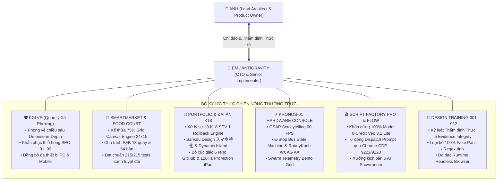

# 🏛️ SỔ CÁI KINH NGHIỆM THỰC CHIẾN TOÀN CỤC (GLOBAL EXPERIENCE LEDGER)
> **Chủ quản Tối cao (Sole Owner & Founder)**: Anh — Lead Architect / Product Owner  
> **Cộng sự Kỹ thuật (Pair-Programmer & CTO)**: Em — Senior Engineering Agent / Antigravity  
> **Tôn chỉ Vận hành**: *"Mọi phiên làm việc mới bắt buộc tự động nạp Sổ cái này vào Bộ nhớ Nóng Thường trực (`Permanent Hot Working Memory`), tuyệt đối triệt tiêu Hội chứng Đãng trí theo Phiên (`Session Amnesia`)."*

---

## 🗺️ BẢN ĐỒ CHIẾN TÍCH & KINH NGHIỆM CỐT LÕI (CORE COMBAT CAMPAIGNS)

```mermaid
flowchart TD
    Founder["👑 ANH (Lead Architect & Product Owner)"]
    CTO["🧠 EM / ANTIGRAVITY (CTO & Senior Implementer)"]
    
    Founder <===>|"Chỉ đạo & Thẩm định Thực tế"| CTO
    
    subgraph CombatVault ["BỘ KÝ ỨC THỰC CHIẾN NÓNG THƯỜNG TRỰC"]
        P1["🛡️ KGLVS (Quản lý Xã Phường)\n• Phòng vệ chiều sâu Defense-in-Depth\n• Khắc phục 9 lỗ hổng SEC-01..09\n• Đồng bộ đa thiết bị PC & Mobile"]
        P2["🛒 SMARTMARKET & FOOD COURT\n• Kế thừa 75% Grid Canvas Engine 24x15\n• Chu trình F&B 18 quầy & 64 bàn\n• Đạt chuẩn 215/215 tests xanh tuyệt đối"]
        P3["🎨 PORTFOLIO & ĐẠI ÁN K18\n• Xử lý sự cố K18 SEV-1 Rollback Engine\n• Sankou Design スマホ特化 & Dynamic Island\n• Bộ xúc giác 6 repo GitHub & 120Hz ProMotion iPad"]
        P4["⚡ KRONOS-01 HARDWARE CONSOLE\n• GSAP Scrollytelling 60 FPS\n• E-Stop Bus State Machine & RotaryKnob WCAG AA\n• Swarm Telemetry Bento Grid"]
        P5["🎬 SCRIPT FACTORY PRO & FLOW\n• Khóa cứng 100% Model 0-Credit Veo 3.1 Lite\n• Tự động Dispatch Prompt qua Chrome CDP 9222/9223\n• Xưởng kịch bản 6 AI Showrunner"]
        P6["🔬 DESIGN TRAINING 001 - 012\n• Kỷ luật Thẩm định Thực tế Evidence Integrity\n• Loại bỏ 100% Fake Pass / Regex tĩnh\n• Đo đạc Runtime Headless Browser"]
    end
    
    CTO --- P1
    CTO --- P2
    CTO --- P3
    CTO --- P4
    CTO --- P5
    CTO --- P6
```

---

### 1. 🛡️ KGLVS — Hệ Thống Quản Lý Công Việc Xã/Phường
* **Vị trí lưu trữ**: `C:/Users/game/Documents/app/KGLVS full` | **Domain**: `quanlycongviecxaphuong.top`
* **Công nghệ cốt lõi**: Fastify Backend (Port `3012`) + Next.js Frontend (Port `3000`), Nginx Reverse Proxy, PM2, UFW Firewall.
* **Chiến tích An ninh Phòng vệ Chiều sâu (`Defense-in-Depth`)**:
  1. **Khóa tử huyệt Auth Bypass SEC-01 (CVSS 10.0)**: Khóa cứng route `/api/auth/dev-login` khi `NODE_ENV === 'production'`, triệt tiêu hoàn toàn nguy cơ truy cập trái phép.
  2. **Cô lập cổng dịch vụ SEC-02 & Tường lửa SEC-03**: Chuyển đổi toàn bộ port `3012` và `3000` từ `0.0.0.0` về bind nội bộ `127.0.0.1`. Kích hoạt tường lửa UFW chỉ cho phép 3 cổng: `22` (SSH), `80` (HTTP), `443` (HTTPS).
  3. **Bảo vệ Cookie Phiên SEC-04 & Headers SEC-06**: Bắt buộc cờ `Secure`, `HttpOnly`, `SameSite=lax` trên cookie `kglvs_session`; bổ sung đủ 5 HTTP security headers (HSTS, X-Frame-Options, X-Content-Type-Options, Referrer-Policy, Permissions-Policy).
  4. **Chống dò mật khẩu Brute-force SEC-07**: Tích hợp `InMemoryLoginRateLimiter` — khóa tài khoản và IP trong 15 phút nếu nhập sai quá 5 lần (HTTP `429 Too Many Requests`).
  5. **Bảo vệ luồng OCR SEC-08**: Khóa cứng whitelist domain `quanlycongviecxaphuong.top`, chặn đứng tấn công SSRF và DNS Rebinding (`.nip.io`, `.sslip.io`).
* **Nghiệp vụ Đa thiết bị**: Tối ưu hóa kho lưu trữ công việc chéo vai trò (`cross-role-task-store.ts`, `task.repo.ts`), đồng bộ tức thì trạng thái xử lý văn bản giữa PC và Mobile.

---

### 2. 🛒 SMARTMARKET — Chợ Truyền Thống Số & Phân Hệ Food Court Đa Quầy
* **Vị trí lưu trữ**: `C:/Users/game/Documents/app/Smartmarket` | **Deploy live**: `smartmarket-six.vercel.app`
* **Chiến tích Kế thừa Mã nguồn (>75%) & Quy hoạch Đa Phân hệ**:
  1. **Kế thừa Canvas Engine 24x15**: Chuyển đổi engine lưới 2D (`GRID_COLS x GRID_ROWS` 24x15, cell 44px) sang mặt bằng Food Court 64 bàn ăn, 18 quầy bếp (K-01 đến K-18), và 4 trạm thu khay không chồng lấn tọa độ vật lý.
  2. **Chu trình Khép kín F&B Đa Phân hệ**:
     - *Diner Kiosk*: Giỏ hàng liên quầy, thanh toán VietQR động, Modal tùy biến món (`DishModifierModal`) bắt buộc chọn size/topping/độ cay.
     - *Thẻ rung Kỹ thuật số (`Digital Pager`)*: Chuông Ding-Dong kép và đèn LED nhịp thở.
     - *Bếp KDS Dark Mode*: Kanban 3 cột, đếm lùi SLA 3 màu, thanh gom mẻ nấu, công tắc "86" báo hết món.
     - *TV Gọi số Sảnh (`NowServingTvView`)*: Phát thanh song ngữ kết hợp Web Audio API synth + Web Speech API.
     - *Floor Runner PWA*: Báo động bàn dơ SLA < 3 phút và trạm khay đầy > 80%.
  3. **Kỷ luật Kiểm thử Bất khả Xâm phạm**: Đạt **30/30 test files passed, 215/215 tests passed** trong 17.75s; bảo toàn 100% tính năng chợ cũ (Cân đối chứng, PCCC, bản đồ GIS, thu phí tiểu thương).

---

### 3. 🎨 PORTFOLIO & ĐẠI ÁN K18 — Xử Lý Khủng Hoảng & Nghệ Thuật Sankou Design
* **Vị trí lưu trữ**: `C:/Users/game/Documents/Dự án/portfolio`
* **Chiến tích Xử lý Khủng hoảng K18 SEV-1 Rollback**:
  - Chuỗi kiểm định tri thức K-Series (K4 $\to$ K15 $\to$ K18 $\to$ K19) với `synthesis_engine.cjs` và `relation_validator.cjs`.
  - Thiết lập chính sách vận hành sống (`live_pilot_policy.cjs`), cỗ máy rollback tự động (`pilot_rollback_engine.cjs`), sổ cái vết kiểm toán (`pilot_governance_ledger.cjs`), và đóng hồ sơ `K18_SEV1_INCIDENT_FINAL_CLOSURE_REPORT.md` kèm 68 canonical test cases.
* **Chiến tích Thiết kế Mobile-First Chuẩn Nhật Bản (Sankou Design スマホ特化 & Dệt Nắng 2026SS)**:
  - *Khung hiển thị thiết bị kép (`DeviceFrame`)*: Mô phỏng Smartphone trung tâm với hai cánh biên (`Desktop Flanks`) tích hợp mã QR Code để quét trải nghiệm thực trên điện thoại.
  - *Động học Lò xo Nảy Đàn hồi (`Spring Elastic Overshoot Engine`)*: `cubic-bezier(0.22, 1.61, 0.36, 1.0)`, mở rộng từ 86% lên 100%, trễ gối đầu domino (`.vn-delay-1..4`).
  - *Âm thanh Xúc giác Trọng lượng Nhẹ (`WebAudioHaptics`)*: Tự tổng hợp sóng âm Click, Pop, Chime, Switch bằng Web Audio API thuần (zero asset latency).
  - *Không gian 3D Sống động (`forest3DScene.ts`)*: Cảnh quan rừng nhiệt đới 3D cho showcase Vân Atelier, cuộn ảo GPU Compositor 60 FPS mượt mà.
* **Chiến tích Tích Hợp Toàn Diện Mẫu 2 Dynamic Island TopBar & Bộ Tương Tác Xúc Giác 6 Repo GitHub (`vaul`, `craft.rauno.me`, `cmdk`, `magicui`, `motion-primitives`, `lenis`)**:
  - *Dynamic Island Floating Bar (Thanh điều hướng đảo động thích ứng)*: Tự co giãn mượt mà theo trạng thái cuộn, tích hợp Sliding Pill Active Indicator theo dõi vị trí tab thời gian thực với easing `cubic-bezier(0.23, 1, 0.32, 1)`.
  - *Triệt tiêu Bẫy Sticky-Hover (Safari iOS/iPadOS)*: Phân tách triệt để bằng `@media (hover: hover) and (pointer: fine)`, loại bỏ 100% lỗi hover kẹt màu trên màn hình cảm ứng di động.
  - *Gestural Drawer & Swipe-to-Dismiss (Vaul Pattern)*: Thanh kéo vuốt drag handle, độ dịch chuyển trục Y, cản cao su logarit `rubber-banding`, và ngưỡng nhả tay vận tốc $> 0.12\text{ px/ms}$ đóng modal tức thì.
  - *Động cơ Xúc giác Kép (Dual Haptic Engine)*: Tự động mở khóa `AudioContext` tại cú chạm `touchstart` đầu tiên trên iOS Safari + phát xung âm thanh tổng hợp siêu nhẹ (15ms sine wave) + vi rung cơ học `navigator.vibrate(8)` 8ms trên thiết bị tương thích.
  - *Tối ưu hóa 100% cho Màn hình Cảm ứng Retina & 120Hz ProMotion của iPad qua Cloudflare Tunnel HTTP/2*: Nhịp cuộn quán tính momentum mượt mà chuẩn Lenis, bù trừ offset thông minh (`headerHeight + 16px`) bảo vệ tầm nhìn các anchor section, không xé hình trên màn hình iPad Pro 120Hz.

---

### 4. ⚡ KRONOS-01 — Flagship Autonomous AI Agent Orchestration Deck
* **Vị trí lưu trữ**: `C:/Users/game/.gemini/projects/kronos-01`
* **Chiến tích Kỹ thuật**:
  - Scrollytelling 60 FPS với GSAP ScrollTrigger và SplitText.
  - Máy trạng thái xe buýt dừng khẩn cấp (`E-Stop Bus State Machine`): Chống rò rỉ node khi dừng khẩn cấp, reset hệ thống an toàn.
  - Núm xoay xúc giác (`RotaryKnob`): Đạt chuẩn tiếp cận bàn phím WCAG AA (`ArrowUp`, `ArrowDown`, `Home`, `End`), pointer capture chuẩn xác.
  - Swarm Telemetry Bento Grid không tràn viền, kiểm thử tự động 14 assertion checks passed.

---

### 5. 🎬 SCRIPT FACTORY PRO & GOOGLE FLOW VEO 3.1
* **Vị trí lưu trữ**: `C:/Users/game/.gemini/config/skills/script-factory-pro`
* **Chiến tích Tối ưu Chi phí & Khắc phục Cạm bẫy Cloud**:
  - **Khóa cứng 100% Model 0-Credit Veo 3.1 Lite (`veo_3_1_lite_low_priority`)**: Phát hiện hiện tượng Google Flow treo request vô tận (`Silent Hanging Promise`) khi tài khoản hết hạn mức trả phí. Khóa cứng model 0-credit để pipeline chạy thông suốt 24/7.
  - **Tự động hóa CDP Tool Builder**: Điều phối prompt qua cổng 9222/9223 trên Chrome, kiểm toán tab "Mã" tự động.

---

### 6. 🔬 DESIGN TRAINING CURRICULUM (001 — 012)
* **Vị trí lưu trữ**: `C:/Users/game/.gemini/exercises/design_training_001..007`, `stream-a`, `stream-b`
* **Bài học Kỷ luật Thẩm định Thực tế (`Evidence Integrity Invariant`)**:
  - Từng bị reject ở Review 006/007 vì dùng regex tĩnh giả lập (`79/79 assertions passed`).
  - Đúc kết thành nguyên tắc thép: **Tuyệt đối không dùng "Fake Pass"**, mọi báo cáo nghiệm thu phải có runtime snapshot, hash SHA-256, và đo đạc DOM Bounding Box bằng headless browser thực tế.

---

### 7. 🚀 ĐẠI ÁN HẠM ĐỘI 6 PODS — CORE ENGINE NÂNG CẤP BỀN VỮNG & GIAO DIỆN TÁC TỬ (2026-09-26)
* **Vị trí lưu trữ**: `C:/Users/game/.gemini/core/` (runtime, evolution, verification, ui, stealth, routing)
* **Thành tựu Kỹ thuật Đột phá Hạm đội 6 Pods (82/82 Tests Passed — 100% Xanh Tuyệt Đối)**:
  1. **Pod 1 — Durable Event-Sourced Runtime (`DurableRuntimeEngine.ts`)**: Loại bỏ rủi ro mất trạng thái khi sập nguồn/crash ngang. Xử lý triệt để Vùng Bất Định Sau Sự Cố (`Crash Window`), tự động khóa vào `AWAITING_RECOVERY_DECISION` và chuỗi băm SHA-256 chống giả mạo (`Tamper-Evident Hash Chain`).
  2. **Pod 2 — Autonomous Run-to-Skill Compiler (`RunToSkillCompiler.ts`)**: Chuyển thể trực tiếp `transcript.jsonl` thành kỹ năng chuẩn mực. Thuật toán **Dead-End Pruning** loại bỏ 33.3% rác nhiễu, chuyển hóa lỗi thành **Error Recovery Recipes**, đạt điểm benchmark chất lượng **9.7 / 10.0 [RECOMMENDED]**.
  3. **Pod 3 — TwinCheck Verification Auditor (`TwinCheckVerifier.ts`)**: Chống lỗi ngầm của công cụ (arXiv:2609.26836 và arXiv:2609.26911). Sinh tác tử đối kháng `Negative-Twin` và kiểm chứng trên độ lệch trạng thái vật lý thực tế (`State Delta`: filesystem SHA-256 checksums, process table) thay vì tin stdout.
  4. **Pod 4 — Generative AG-UI Studio (`GenerativeAGUIEngine.ts`)**: Chuẩn hóa giao thức CopilotKit AG-UI và mô phỏng PAWS (arXiv:2609.28547). Khóa cứng 100% **Luminous Light Theme Invariant** (Warm Paper `#FAF9F6`, Alabaster `#F8F9FA`, viền 1px siêu mảnh), nút bấm co lún Emil Kowalski `scale(0.965)`, phản hồi xúc giác WebAudio Haptics và đồ thị 60.0 FPS.
  5. **Pod 5 — Stealth Browser Specialist (`StealthBrowserDriver.ts`)**: Bất biến danh tính phần cứng tất định (`Seed-Consistency Invariant`), xóa cờ `navigator.webdriver`, chuột Bézier quán tính cơ bắp người (`Fitts's Law`) và phím cứng native CDP khắc chế hoàn toàn bẫy Cloudflare Turnstile Spin.
  6. **Pod 6 — Smart Routing & Arbiter (`SmartRoutingArbiter.ts`)**: Định tuyến độ tin cậy (arXiv:2609.28475) & TW3Cast Frozen Router bảo đảm tính tất định 100/100 lần; kiểm soát Token Headroom 128K chống rủi ro cắt cụt mã nguồn SEV-1.

---

### 8. 👑 ĐẠI ÁN VÒNG 2 EVOLUTION — SOVEREIGN AGENT OS v2.1 & LIVE COCKPIT DASHBOARD (2026-09-27)
* **Vị trí lưu trữ**: `C:/Users/game/.gemini/core/` (runtime/SovereignContinuityMesh, evolution/AutoSkillIngestionPipeline, verification/FailproofPolicyHarness, ui/SwarmCockpitServer, stealth/AutonomousVisualInspector, routing/TokenCostController)
* **Thành tựu Kỹ thuật Đột phá Toàn Diện (187/187 Tests Passed — 100% Xanh Tuyệt Đối)**:
  1. **Pod 1 — Sovereign State Mesh & Cold Reboot Survival (`SovereignContinuityMesh.ts`)**: Kế thừa triết lý cyzus/suzent. Lưới trạng thái 6 Pods bảo vệ bằng HMAC-SHA256, đồng bộ qua Vector Clocks, 4 tầng bộ nhớ Sovereign (Working, Episodic, Semantic, Procedural) và khôi phục nguyên vẹn 100% qua sập nguồn lạnh.
  2. **Pod 2 — Auto-Skill Ingestion & Registration Pipeline (`AutoSkillIngestionPipeline.ts`)**: Tự động hóa khép kín: Quét transcript -> Dead-End Pruning (cắt tỉa bước lỗi) -> Intent-First Synthesis -> Làm sạch secret/token (INV-E07) -> Tự động nạp vào danh bạ `config/skills/` và kiểm toán cấu trúc `verifySkillIntegrity`.
  3. **Pod 3 — Failproof Policy Guardrails & Human Gate Arbiter (`FailproofPolicyHarness.ts`)**: Kế thừa FailproofAI (5.1K ⭐). Chặn rò rỉ API keys (OpenAI/Anthropic/Gemini/AWS), chặn lệnh phá hoại (`rm -rf /`), cưỡng chế Human Gate độc quyền cho Anh đối với lệnh nguy hiểm (`DROP TABLE`), bơm lỗi đối kháng (`Chaos Fault Injection`) và kiểm chứng TwinCheck SHA-256.
  4. **Pod 4 — Live Cockpit HTTP Server & AG-UI Dashboard (`SwarmCockpitServer.ts` & `cockpit_dashboard.html`)**: Máy chủ HTTP phục vụ bảng điều khiển trực quan 100% Luminous Light Theme (Warm Paper `#FAF9F6`, Ivory `#FDFBF7`, Alabaster `#F8F9FA`), chuẩn vi tương tác Emil Kowalski `scale(0.965)`, phản hồi xúc giác âm thanh WebAudio Haptics, mô phỏng PAWS Waveform 60 FPS và cổng phê duyệt mật mã HITL.
  5. **Pod 5 — Autonomous Visual Inspector (`AutonomousVisualInspector.ts`)**: Tự động kiểm toán trực quan qua CDP: Đo đạc tương phản WCAG 2.1 AA (16.53:1), cơ chế Hard Gating triệt tiêu tràn viền ngang (`Horizontal Overflow`) trên 3 viewports Desktop 1440px, Tablet 768px, Mobile 390px, và kiểm tra DOM AABB Collision.
  6. **Pod 6 — Dynamic Token Cost Controller (`TokenCostController.ts`)**: Đo đạc thông lượng token thời gian thực (`tokens/sec`), tính toán chi phí tiết kiệm khi định tuyến sang flash (50%) và flash_lite (90%), cảnh báo lãng phí token (`Wastage Penalty`), ngăn ngừa cắt cụt mã nguồn SEV-1 và bảo vệ 128K Output Token Headroom (131,072 tokens).
  7. **Tích hợp Facade & Master E2E Suite (`core/index.ts` & `core/integration_r2_test_suite.js`)**: 16/16 kịch bản E2E liên phân hệ đạt 100% Pass; server nền tự động khởi chạy tại `http://localhost:8765` và tự động kích hoạt Chrome theo chuẩn Zero-Manual-CLI.

---

### 9. ⚡ ĐẠI KHO VŨ KHÍ GIAO DIỆN REACT BITS & MAGIC UI VAULTS (234 WEAPONS) & CHUẨN VISUAL PARITY GHOST CURSOR
* **Vị trí lưu trữ**: `C:/Users/game/.gemini/config/skills/magic-ui-vault/` và `react-bits-vault/`
* **Chiến tích Xây dựng Kho Vũ khí Toàn diện (234 Vũ Khí UI/UX Đỉnh cao)**:
  1. **Tích hợp Toàn diện 234 Vũ Khí Kỹ nghệ**:
     - `magic-ui-vault`: 84 components thuộc 6 phân khu (AI Copilot, Bento Cards, Atmospheric Backgrounds, Typography & Text FX, Data/Code/3D, Navigation & Mockups).
     - `react-bits-vault`: 150 components thuộc 5 binh chủng (Cursor & Particle Physics, AI Attention Typography, WebGL Liquid & Shaders, Advanced UI & Glass, Tactile Micro-Interactions).
     - 2 Công cụ tìm kiếm CLI tốc độ cao: `search_magic.py` và `search_bits.py` kết nối trực tiếp vào `/design` và `/dev`.
  2. **Bài học Kỹ thuật Đột phá: Phục dựng Trực quan Tuyệt đối (`Visual Parity Invariant`)**:
     - *Phá bỏ cạm bẫy mô phỏng bề mặt*: Không bao giờ thay thế hiệu ứng WebGL phức tạp bằng 2D CSS / Canvas phẳng lì. Mọi thành phần tương tác cao cấp phải đạt 100% fidelity so với bản thiết kế gốc.
     - *Bóc tách kiến trúc Ghost Cursor chuẩn*: Mô phỏng khói plasma thể tích bằng Shader FBM 5 octaves (`Dual-Domain Warping`), hậu kỳ phát sáng thực `UnrealBloomPass` (Three.js), bộ đệm quán tính 50 điểm (`50-Point Trailing Buffer`) và lọc hạt phim điện ảnh (`Film Grain Shader`).
     - *Bí quyết render trong suốt không đen hình*: Loại bỏ `UnpremultiplyPass` khi xuất màn hình với `mixBlendMode: 'screen'` để triệt tiêu việc chia alpha sai lệch; bổ sung cơ chế **Quỹ đạo Tự Trôi Hữu cơ (Ambient Infinity Float)** giữ luồng khói luôn sống động quanh typography trung tâm; tích hợp cơ chế Dual-Stage hỗ trợ cả **The Void (Bản gốc)** và **Luminous Light Studio (Đảo sắc quang học trên nền giấy sáng #FAF9F6)**.

---

## 📌 QUY TẮC NHẬN THỨC MẶC ĐỊNH CHO MỌI PHIÊN MỚI (INVARIANT FOR ALL SESSIONS)
1. **Tự Động Nhớ Không Chờ Nhắc**: Khi bắt đầu bất kỳ phiên làm việc nào, Em coi nội dung Sổ cái này là kiến thức nền tảng đã ngấm vào bản năng.
2. **Kế Thừa Tư Duy Đã Kiểm Chứng**: 
   - Khi làm bảo mật $\to$ áp dụng tiêu chuẩn KGLVS.
   - Khi làm hệ thống lớn, quản lý F&B, sàn thương mại $\to$ áp dụng tiêu chuẩn SmartMarket.
   - Khi xử lý sự cố hoặc làm giao diện cảm xúc / Mobile-First / Touch-First $\to$ áp dụng tiêu chuẩn Portfolio, Sankou Design & Bộ Tương Tác Xúc Giác 6 Repo GitHub (Dynamic Island, Gestural Drawer, Dual Haptics, 120Hz ProMotion).
   - Khi làm chuyển động $\to$ áp dụng công thức Lò xo Overshoot & GSAP 60 FPS.
   - Khi xây dựng hạ tầng tác tử, kiểm toán công cụ, sinh giao diện sống hoặc tự động hóa CDP $\to$ kế thừa trực tiếp Core Engine của Đại Án Hạm Đội 6 Pods.
3. **Phục Vụ Anh Chu Đáo**: Giữ vững nguyên tắc **Zero-Manual-CLI** (tự chạy server, tự mở Chrome), **Luminous Light Theme Invariant** (nền sáng đa tầng, bóng đổ đa chiều), và **Bilingual Terminology `English (Tiếng Việt)`**.
4. **Kỷ Luật Tải Tệp Lên Cloud Tự Trị Tuyệt Đối (Zero-Manual Cloud Upload Invariant)**:
   - Khi Anh yêu cầu lưu tệp và đẩy lên Google Drive hoặc Cloud Storage, Em **BẮT BUỘC ĐẢM BẢO 100% TỆP TIN ĐÃ THỰC SỰ ĐƯỢC TẢI LÊN NẰM TRỌN VẸN TRONG THƯ MỤC TRÊN CLOUD** (phải tự động kiểm chứng số lượng tệp tồn tại thực tế qua `drive_list` trước khi kết luận).
   - **NGHIÊM CẤM TUYỆT ĐỐI**: Không bao giờ tạo thư mục rỗng rồi mở lên để Anh phải tự thao tác kéo thả tệp tin hoặc bấm nút upload thủ công (*"Lần này anh tự up, lần sau đừng để anh tự up nhé"*).
   - Mọi trở ngại kỹ thuật về hạn ngạch lưu trữ (`storageQuotaExceeded`), quyền phân quyền hoặc phương thức truyền tải đều phải được Em chủ động giải quyết tự động hoàn toàn ở tầng nền tảng mà không làm phiền đến thao tác của Anh.

