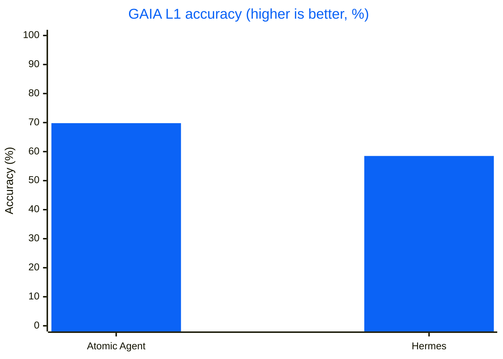
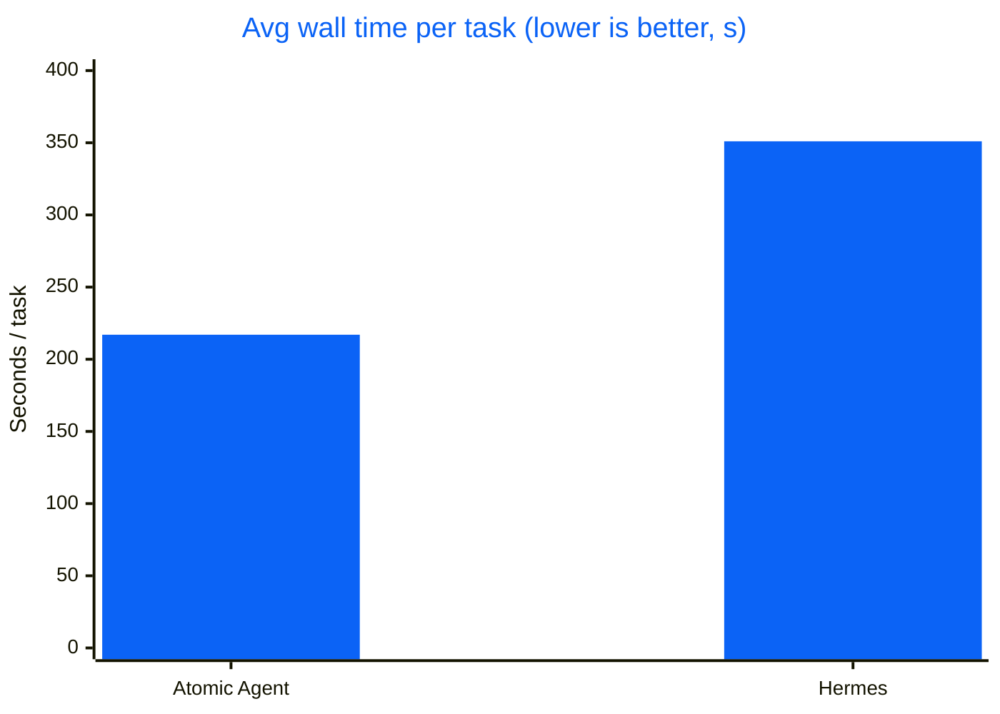
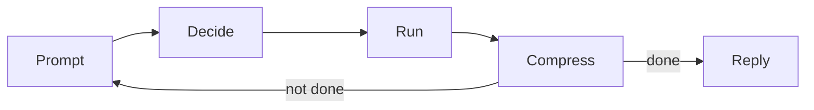

<div align="center">


# Atomic Agent

### A local-first AI agent that runs on your machine, with local or cloud models.

Drives your browser, edits files, runs approved commands, and remembers context across sessions. Open source, running on our TurboQuant `llama.cpp` for +30-50% throughput on small local models.

[](#benchmarks)
[](https://github.com/AtomicBot-ai/atomic-agent/actions/workflows/release.yml)
[](https://github.com/AtomicBot-ai/atomic-agent/releases)
[](package.json)
[](LICENSE)
[](https://nodejs.org/)
[](https://www.typescriptlang.org/)


**[Quick Install](#quick-install) · [Uninstall](#uninstall) · [Benchmarks](#benchmarks) · [Why Local-First](#why-local-first) · [Ways to Use It](#ways-to-use-it) · [Docs](#development)**


</div>

---

A local-first AI agent that runs the control loop and all state on your machine. It works across your machine: browse the web, read and edit files, run approved shell commands, inspect documents, remember context across sessions, schedule follow-ups, and call external tools over MCP. Run it on a local model, a cloud model, or both at once in **Fusion** mode, where one model plans and a pool of workers executes. Embed it in your own apps over HTTP or a Tauri sidecar. `llama.cpp` first, so small quantized models stay useful for long, multi-step work on consumer hardware.

## Quick Install

macOS / Linux:

```bash
curl -fsSL https://atomicagent.io/install | sh
```

Windows (PowerShell):

```powershell
irm https://atomicagent.io/install.ps1 | iex
```

The installer downloads the release archive, verifies the checksum, and installs the CLI plus support assets (`grammars/`, native prebuilds, and bundled `ripgrep`). Atomic Agent updates itself in place; after an update the TUI prompts you to restart. Outside the TUI, run `atomic-agent update` (or `atag update`) to check for a newer release and re-run the installer in place; `atomic-agent update --check` probes without installing, and `--version <tag>` pins a specific release. Only the installed binary can self-update; a dev checkout updates via git.

> [!NOTE]
> Developer preview. APIs, commands, config, and behavior are still moving, so pin a release if you need a stable integration point. Current builds: macOS (Apple Silicon), Linux x64 / arm64, and Windows x64. Intel Macs are not supported yet; Windows on ARM runs the x64 build under emulation.

### Run

```bash
atomic-agent
```

Both installers also drop a short alias next to the binary, so this is the same thing:

```bash
atag
```

> [!TIP]
> Need a second agent? Press **Ctrl+N** (or run `/window`) inside the TUI: it opens a new terminal window with a fresh atomic-agent in the same directory.

> [!TIP]
> Want to go through first-time setup again? Run `/onboarding` (or `/setup`) in the TUI, or start it with `atomic-agent tui --onboarding`. Your providers, keys, sessions and memory are kept.

> [!TIP]
> Coming from another agent? The first run offers to bring your data over: tick the sources it found and the import runs, without overwriting anything already here and without touching the source. What moves depends on the source:
>
> - **Claude Code:** skills, memory, MCP servers, sessions, and (opt-in) provider keys
> - **Codex:** skills, memory, sessions, and (opt-in) provider keys
> - **Oh-My-Pi:** skills, MCP servers, and sessions
> - **Pi:** skills and sessions
> - **Hermes:** sessions, cron jobs, and (opt-in) provider keys
> - **OpenClaw:** sessions and cron jobs
>
> Later, run `/import` in the TUI or `atomic-agent import <hermes|openclaw|claude-code|codex|pi|oh-my-pi>` from the shell.

### Uninstall

One command removes everything: the state directory (config, memory, sessions, tasks, traces, downloaded models), the binary and its `atag` alias, the asset directories beside them, and the PATH line the installer added to your shell rc file:

```bash
atomic-agent uninstall
```

It prints exactly what it will delete, with sizes, and then asks you to type the word `uninstall`. Nothing is uploaded and nothing is kept; this cannot be undone. Preview it with `atomic-agent uninstall --dry-run`, keep your data with `--keep-data`, keep the binary with `--keep-binary`, leave your shell rc file alone with `--keep-path`, or skip the prompt in a script with `--yes`. The same flow is the last entry in the TUI's own menu (**Esc → Danger zone**, or `/uninstall`).

### Troubleshooting

If something isn't working:

1. Copy your error logs and system specs.
2. Open an issue on [GitHub](https://github.com/AtomicBot-ai/atomic-agent/issues).
3. Or ask for help in our [Discord](https://discord.gg/kXWDFSJpMW).

## Talk to Us

Building something with Atomic Agent, stuck on setup, or just want to share what you are working on? Grab a slot and talk to the team directly: **[cal.com/atomicagent/demo](https://cal.com/atomicagent/demo)**. No agenda required. Questions, feedback, feature requests, or a plain hello all count. We read every issue and every Discord message too, but sometimes a 15-minute call beats a week of comments.

## Benchmarks

On the public **GAIA validation Level 1** split (53 tasks), Atomic Agent and Hermes drove the **same** local `qwen-3.6-35b-a3b` (`llama-server`, UD-Q4_K_XL), with the same step budget and timeout. The only variable is the agent loop.


| Metric | Atomic Agent | Hermes |
|---|---|---|
| **Accuracy** | **37/53 = 69.8%** | 31/53 = 58.5% |
| Avg wall / task | **~217 s** | ~351 s |
| Head-to-head wins | **+15 atomic-only** | +9 Hermes-only |

<details>
<summary><b>Charts (accuracy &amp; speed)</b></summary>





</details>

### Model Scaling

The same loop holds up as the local model shrinks. Same GAIA L1 split, Atomic Agent alone:

| Chat model | Accuracy | Avg wall / task |
|---|---|---|
| `qwen-3.6-35b-a3b` (UD-Q4_K_XL) | **37/53 = 69.8%** | ~217 s |
| `qwen-3.5-9b` (Q4_K_M) | **28/53 = 52.8%** | ~152 s |
| `gemma-4-12b` (it-qat UD-Q4_K_XL) | **24/53 = 45.3%** | ~423 s |

Even a 9B model clears half of GAIA L1 through the same context-frugal loop. (Different Atomic Agent versions per row; see the write-up for provenance.)

Full reproducible write-up: [`GAIA-L1-EXPERIMENT.md`](eval-agents/docs/GAIA-L1-EXPERIMENT.md) · Raw artifacts (matrices, NDJSON traces, logs): [gaia-l1-eval-2026-06-11 release](https://github.com/AtomicBot-ai/atomic-agent/releases/tag/gaia-l1-eval-2026-06-11).

## Why Local-First

The control loop and all state run on your machine, not a hosted service:

- **State lives on your disk.** Sessions, memory, tasks, traces, skills, browser profile, config, and `.env` secrets live under `<stateDir>` as plain files and SQLite databases. See [Privacy and Egress](#privacy-and-egress) for what can leave the machine and how to switch it off.
- **No API costs with local models.** Run quantized models locally through `llama.cpp`. Bring your own `llama-server` or let the CLI manage one. Cloud providers and Fusion are opt-in.
- **Nothing is hidden.** Inspect the prompt, replay trace drift, edit skills, and swap parts without waiting for a vendor. Plain local models, SQLite files, and NDJSON traces.
- **Runs on your hardware.** Small quantized models run on everyday consumer GPUs and CPUs, no datacenter needed.

## Core Idea

### How the Agent Loop Works

An agent is a loop: the model picks an action, something runs it, the result feeds back in, and it repeats until the job is done. The catch is cost. Every turn re-sends the growing context through the model, so a naive loop gets slower and pricier each pass, and small local models choke on it fastest.

Atomic Agent keeps the loop cheap. One inference produces one JSON array of tool calls, and it runs them without re-encoding the whole world every turn:



1. **Prompt:** a compact prompt goes to the local model.
2. **Decide:** the model returns one JSON array of tool calls. On a local `llama-server` the output is grammar-constrained (GBNF) so the format is always valid; cloud providers use native tool calling.
3. **Run:** the core executes them; independent reads run in parallel, risky actions ask first.
4. **Compress:** results and state are summarized, not pasted back in full.
5. **Repeat:** loop again until reply, finish, or cancel. Long jobs keep going past 25-step checkpoints while they make progress, bounded by a per-task ceiling (1000 steps or 2 hours by default), and end with a summary rather than a cut-off.

The model chooses actions. Atomic Agent owns the loop, the state, the approvals, the traces, the stop conditions, and the failure boundaries.

### Built to Make Local Models Work

We run local models on our own TurboQuant `llama.cpp` ([`AtomicBot-ai/atomic-llama-cpp-turboquant-nightly`](https://github.com/AtomicBot-ai/atomic-llama-cpp-turboquant-nightly)):

- **TurboQuant KV-cache:** WHT-rotated low-bit quantization compresses the KV-cache up to ~6.4× versus F16, with a fused Metal decode kernel, so long-context sessions fit in far less memory.
- **TurboQuant weights:** Lloyd-Max weight quantization with WHT rotation and fused Metal/Vulkan kernels keeps quality usable while small models fit on consumer hardware.
- **Custom speculative decoding:** purpose-built Gemma 4 MTP and Qwen 3.6 NextN heads reuse the loaded model (no second context, tokenizer, or model load) for +30-50% throughput.
- **Curated quantized models:** hand-picked GGUF quants that keep quality usable while fitting real VRAM budgets.
- **Managed mode:** the CLI downloads, keeps up to date, and runs the backend and models for you, no manual `llama.cpp` setup. Set `localModels.managed.autoUpdate: false` to pin the backend.

### Tuned for Small Local Models

Atomic Agent's prompt is engineered so a small model never wastes tokens or breaks format:

- **Stable prefix:** persona, rules, tools, skills, capabilities, and instructions stay byte-stable inside a session so, on a local `llama-server`, `cache_prompt` and slot pinning can reuse KV-cache instead of re-encoding the prompt every turn.
- **Bounded tail:** conversation, memory, world state, recalled notes, lessons, procedures, and loaded skill bodies are clipped into a predictable prompt budget.
- **Externalized state:** sessions, memory, tasks, skills, traces, browser snapshots, and model config live outside the prompt.
- **GBNF tool calls:** on local backends, completions are constrained into a JSON array of tool calls, including the solo case `[{...}]`.
- **Parallel read batches:** independent read-only calls can run concurrently after a single inference; dangerous actions remain approval-gated.
- **Compact browser view:** ordinary web operation uses accessibility / ARIA snapshots clipped to a character budget (24k by default) instead of screenshot-heavy page dumps.

This is why small local models can stay useful across long, tool-heavy work.

## What It Can Do

Atomic Agent drives a full desktop tool surface. Dangerous actions are routed through approvals; independent read-only calls run in parallel.

| Area | Capabilities |
|---|---|
| **Browser** | Navigate, click, type, search, manage tabs, scroll, and read compact ARIA state via `playwright-core` (Chrome / Edge / Brave / Chromium). |
| **Web & HTTP** | Web search with configurable providers (Exa, DuckDuckGo, Brave, SearXNG); fetch and extract pages or make arbitrary HTTP requests, both SSRF-guarded, separate from the browser. |
| **Filesystem & shell** | Read, write, edit, patch, glob, grep, diff, watch, hash, list, archive extract, run approved shell commands, and inspect or kill processes. |
| **Desktop** | Clipboard read/write, desktop notifications, and window list/focus. |
| **Documents** | Extract text locally from PDF, DOC, DOCX, XLSX, PPTX, ODT, RTF, and plain text. |
| **Git** | Read-only status, log, diff, show, blame, and branch inspection, plus local write tools (init, add, commit, checkout, merge) behind the same approval ladder as file writes. Remote sync (clone, fetch, pull, push, remote) is off by default; turn on `git.remoteSync` in the Integrations tab and every sync is approval-gated. |
| **GitHub** | Act on GitHub as you once a token is saved in the Integrations tab: list pull requests and issues, create them, and comment on issues. Writes are approval-gated. `/report` files a bug report with your logs at the privacy level you pick and sends nothing until you confirm. |
| **E-mail** | Give the agent its own `@atomicmail.ai` inbox from the Integrations tab (Atomic Mail) to list its inbox (sender, subject, preview) and send plain-text messages; sends are approval-gated and cannot be granted for the session. Background model downloads can mail you when they finish. |
| **Verify** | `verify.syntax` checks files by type and never reports an unchecked file as passing; `verify.run` runs a command, a service or a page against a throwaway copy of the working directory (off macOS, build and dependency folders are linked rather than copied, and a tree over 2 GB runs in place), with checks like `exit 0` or `status 200`. |
| **Memory** | Profile facts, notes with hybrid recall, links, lessons, procedures, voting, and reflection. |
| **Tasks** | Durable deferred turns, cron schedules, intervals, webhooks, and agent-created reminders. |
| **Skills** | View and run Markdown skill playbooks (scripts are approval-gated), install more from ClawHub or GitHub skill repos. Ships with 18 starter skills (Docker, GitHub, Notion, Obsidian, PDF, and more; 15 outside macOS, where the Apple ones are skipped), auto-installed on first run. |
| **Vision** | Optional `vision.describe` for multimodal models with `mmproj`, kept outside the text transcript. |
| **MCP** | Connect external MCP servers; their tools, resources, and prompts join the same registry. |
| **Fusion** | One model plans and hands the independent bulk of a job (wide reads, drafts, tests) to a pool of workers via `fusion.delegate`, then checks and merges their results. Usually a cloud orchestrator with local workers; either side can be any configured provider. |
| **Providers** | Local `llama-server` by default; OpenAI-compatible, [OpenRouter](https://openrouter.ai), AI/ML API, and Gemini providers when configured, plus one-click presets for Anthropic, Groq, DeepSeek, Mistral, xAI, Together, Ollama, LM Studio, Atomic Chat and more, with live model catalogs and mid-session switching. Your existing **Claude Code and OpenAI Codex subscriptions** work too, driven through their own signed-in CLIs with no API key. Reasoning-only completions from reasoning models are recovered instead of failing the turn. |
| **Telegram & Discord** | Remote control from your phone: a session per chat, approval buttons, files both ways, and opt-in scheduled-task reports on Telegram. Run several bots at once from the Swarm tab (`/swarm`), each with its own token and owner. |
| **[Composio](https://composio.dev)** | Connect 1500+ SaaS toolkits (Gmail, Slack, Notion, Linear, and more) with OAuth handled for you. Set up from the Integrations tab; tools arrive as `mcp.composio.*` and every write to a real account stays approval-gated. |

### Memory That Grows Outside the Prompt

Atomic Agent's memory is not a giant chat log pasted back into the prompt. It's a local, inspectable store: durable identity, episodic notes, associations, distilled lessons, and reusable procedures. The prompt sees compact pointers, and full bodies are recalled by tool call only when the agent needs them.

- **Profile facts** render into `### profile` with contextual keyword gating; facts are versioned, with queryable history.
- **Notes** are stored in SQLite + FTS5, optionally paired with embeddings for hybrid recall.
- **Links** connect related memories into a bounded graph.
- **Lessons** distill repeated episodes into reusable principles.
- **Procedures** distill how-to templates without auto-executing them.
- **Voting** lets useful or harmful memories, lessons, procedures, and profile facts drift up or down.
- **Dedup and eviction** merge near-duplicate memories and evict by usefulness, not age, on by default.
- **Reflection** runs after turns, off the main agent slot, and writes memory without blocking the reply.
- **Obsidian export:** `atomic-agent memory export --vault <dir>` writes notes, lessons and procedures into a vault as linked Markdown files.

New to this? [MEMORY_GUIDE.md](MEMORY_GUIDE.md) walks the whole loop end to end: what gets stored when, where the SQLite file lives, how recall shows up in prompts, worked example transcripts, and how to inspect or wipe it all.

## Ways to Use It

<details>
<summary><b>TUI and CLI</b></summary>

Use the CLI for simple sessions, automation, and debugging. Use the TUI for an interactive control console: approvals, logs, models, skills, tasks, memory, MCP, channels, and traces.

```bash
atomic-agent run --cwd /path/to/work
atomic-agent tui --cwd /path/to/work
atomic-agent skill list
atomic-agent task list
atomic-agent trace list --limit 10
```

**Context.** The chip at the right of the composer shows the transcript against its ceiling and the model's window. History is limited in tasks, not tokens: one task is a thing you asked plus everything the agent did answering it, and `agent.conversationMaxPairs` (1-1000, default 200) sets how many the prompt carries. Click the chip or run `/context` to change the count and see the cost before you send.

| Mode | What it does |
|---|---|
| `default` | Approvals follow `agent.approvalLevel`. |
| `plan` | Read-only; the agent presents a plan, then you can run it in `auto` or `bypass permissions`. |
| `auto` | File writes inside the workspace stop asking. |
| `bypass permissions` | Nothing asks this session; hardline shell-guard rules still block. |

Switch modes with `/mode`, `ctrl+g M`, or the composer chip. On an approval prompt, `ctrl+y` approves, `ctrl+d` denies, `ctrl+f` grants the category, `ctrl+b` retargets a write or grants a shell command's shape, `esc` aborts, and typing answers the agent in words. `/theme` switches between six palettes: `classic-dark`, `classic-light`, `toxic-green`, `khorne-red`, `darky-dark`, `moon-yellow`. The TUI is clickable; to select text, drag over plain text, or turn the mouse off with `/mouse off` or `--no-mouse`. Handy slash commands: `/help`, `/tools`, `/model`, `/privacy`. A failed or long turn raises a desktop notification, sessions are named from their first prompt, and inside a [herdr](https://github.com/herdrdev/herdr) pane the TUI labels the pane with its state.

Full TUI guide: [TUI.md](TUI.md).

</details>

<details>
<summary><b>Run modes: Local · Cloud · Fusion</b></summary>

`local` and `cloud` are the two routes the composer always offered. **Fusion** adds a third: one model orchestrates and a pool of workers executes the parts it delegates. The usual pairing is a cloud orchestrator with local llama-server workers, but neither leg is tied to a kind: a local model can plan for cloud workers, and `/runmode swap` trades the two legs. The only rule is that the legs are two different providers. The block is additive and `llm.activeTextProvider` stays authoritative:

```json
"llm": {
  "activeTextProvider": "openrouter",
  "runMode": {
    "mode": "fusion",
    "fusion": { "orchestratorProvider": "openrouter", "workerProvider": "local-llama", "workers": 3 }
  }
},
"localModels": { "managed": { "parallel": 3 } }
```

`workers` (1..8, default 2) is the default fan-out width when the orchestrator does not name one; it is not a ceiling, and the orchestrator can ask for more on a given call. What bounds the width on a local leg is `localModels.managed.parallel`, the llama-server `--parallel` slot count (default `"auto"`, sized from the daemon's context; a number pins it; applied on the next daemon start). On a cloud worker leg the width is capped by `cloudWorkers` (1..32, default 4). The orchestrator model is the provider's `defaultChatModel`; on a local leg the worker model is the one the managed daemon serves. `reviewStallSteps` (default 6, `0` disables) nudges an orchestrator that keeps reading instead of delegating or replying.

In the TUI, fusion is the last row of the composer's **Where it runs** switch (`ctrl+r`, or click the backend word): it needs two providers that can answer, one per leg, and says which one is missing otherwise. While it is on, the backend word is an orange chip and the composer and the chat bubbles take the same tint. `/runmode local|cloud|fusion` and `ctrl+g 1/2/3` pick a mode from the keyboard; `/runmode swap` trades the orchestrator and worker legs; `/runmode status` says what the mode resolves to.

On the fusion route the strip gains a fourth control, **Workers** (`→` past the model, or click the worker count): it picks the worker model and the default fan-out width, and `/runmode workers N` does the same from the keyboard. The provider and model controls address the orchestrator leg. On a local worker leg the worker count also sets `localModels.managed.parallel`, so restart the local daemon to apply it.
Once fusion is on, the orchestrator gains one tool, `fusion.delegate`, and prompt guidance telling it to plan first and hand the independent bulk down: reading many files, first drafts, boilerplate, tests, wide searches. Each part it delegates runs as its own throwaway worker turn (several at a time), and their replies come back into the same call for the orchestrator to check and merge; you see each worker start and finish in the chat feed. The orchestrator itself does not run mutating tools. Workers cannot delegate further, cannot reach you, and cannot schedule tasks or write memory. Approving a fan-out lets its workers write and run commands inside the directories it names; anything outside them comes back as a named path, and the orchestrator sends the task out again with that path so you can approve the wider scope.

</details>

<details>
<summary><b>Managed local models</b></summary>

The CLI can manage a paired `llama.cpp` setup for chat and embeddings:

```bash
atomic-agent models update
atomic-agent models list
atomic-agent models pull qwen-3.5-4b
atomic-agent models use qwen-3.5-4b

atomic-agent models list-embeddings
atomic-agent models pull-embedding <model>
atomic-agent models use-embedding <model>

atomic-agent models start

atomic-agent tui --cwd /path/to/work
```

Managed mode downloads the backend, pulls GGUF models, selects the active model, and starts detached chat / embedding daemons when configured.

Big models can download in the background, detached from the terminal that started them:

```bash
atomic-agent models pull --background qwen-3.5-35b   # returns at once; keeps running after the terminal closes
atomic-agent models downloads                        # list background downloads, progress, interrupted ones
atomic-agent models pull qwen-3.5-35b                # follow a running download in the foreground (Ctrl+C detaches)
atomic-agent models downloads cancel qwen-3.5-35b    # stop it; what was fetched stays on disk
```

The TUI runs every model download through the same worker. Quit mid-download (Ctrl+C, closing the window) and the download continues; open the TUI again and the chip picks it up where it is, and when the file lands the model is activated and the daemon started as if you had waited. A worker that died mid-way is resumed automatically on the next launch; one you cancelled is not. On the LLM tab's Local pane, `x` stops the download in flight and keeps what it fetched, and Enter on the row resumes it.

The worker is a detached copy of the CLI writing its progress to `<stateDir>/models/downloads/<job>.json` and its log next to it, the same arrangement as the managed `llama-server` daemon. A worker that dies mid-way (a reboot, a `kill -9`) shows as `interrupted` in `models downloads`, and running the same `pull` again, with or without `--background`, resumes from the partial file. `pull --mmproj` also fetches a vision model's projector; `pull-embedding --background` works the same way for embedding models.

Model downloads resume. An interrupted pull (a dropped connection, Ctrl+C, a closed terminal) keeps what it has fetched next to the destination as `<file>.part`, and the next `models pull` of the same model continues from that point with a `Range` request rather than starting over. The downloader validates the partial against the server's `ETag` before appending, so a file re-uploaded under the same name is fetched afresh; within one pull, transport errors and stalls retry from the partial with backoff before giving up.

The managed chat daemon stops when the last session exits, freeing the RAM and VRAM the model was holding; set `localModels.managed.stopOnExit: false` in `config.json` to keep the model warm between sessions. Daemons started standalone with `models start` are never touched.

On Windows the backend zip is picked per machine (CUDA when a capable NVIDIA driver is present, Vulkan otherwise). If the GPU build cannot serve a model on your hardware (typical for iGPU-only boxes), the start falls back to the CPU build automatically and records `localModels.managed.backendVariant: "cpu"` in `config.json`; set it to `"auto"`, `"vulkan"`, `"cuda-12.4"` or `"cuda-13.3"` to pick a build yourself (for example after a driver update).

On Linux arm64 there is a single build and it is used on every machine. It bundles the CUDA runtime and cuBLAS for the NVIDIA GB10 superchip in DGX Spark, and it also carries the dispatched CPU backends (armv8.0 through armv9.2); the GPU backend is loaded at runtime, so a box with no NVIDIA driver runs the same build on its CPU. That bundle makes the download large, ~554 MB against ~30 MB on x64. It needs glibc 2.38 or newer (Ubuntu 24.04, Debian 13, DGX OS 7); on an older or musl system managed mode says so before downloading anything and external mode is the way to run.

Cloud models are searchable from the same command: by id, vendor, or capability, across every configured cloud provider:

```bash
atomic-agent models search claude vision
atomic-agent models search free tools --json
atomic-agent models search "1m cache" --provider openrouter --limit 10
atomic-agent models search kimi --refresh   # pull live /models lists first
```

Every term has to match (`claude vision` is not a substring of any id), a size term names a whole-unit bucket whatever the row displays (`1m` finds windows from 1M up to 2M, including the 1,048,576-token ones that render as `1.0M`; a 2M window answers to `2m`; `128k` finds 131,072), results are ranked best-first, and the same query works in the TUI Cloud pane (press `f`).

</details>

<details>
<summary><b>External <code>llama-server</code></b></summary>

Already have your own `llama.cpp` process? Point `atomic-agent` at it with `localModels.url` in `<stateDir>/config.json` (external mode; the default is `http://127.0.0.1:8080`), or save the URL in the TUI's LLM tab, External pane:

```jsonc
// <stateDir>/config.json
{
  "localModels": { "mode": "external", "url": "http://127.0.0.1:8080" }
}
```

```bash
./llama-server -m Qwen3.5-9B-Q4_K_M.gguf \
  --slots 4 \
  --parallel 4 \
  --port 8080 \
  --cache-reuse 256

atomic-agent tui --cwd /path/to/work
```

The LLM tab in the TUI has an External pane for this setup. Saving a URL runs an honest health probe: it validates the `/health` body, reports llama.cpp's 503 answer while a model loads as loading rather than dead, and recognizes when the URL is a different OpenAI-compatible runner that should be added as a cloud provider instead.

</details>

<details>
<summary><b>Ollama, LM Studio and Atomic Chat (local)</b></summary>

Running models under [Ollama](https://ollama.com), [LM Studio](https://lmstudio.ai) or Atomic Chat? All three are OpenAI-compatible servers, and all three are presets in the provider wizard, so there is no base URL to type.

```bash
ollama serve
ollama pull qwen2.5:0.5b

atomic-agent tui --cwd /path/to/work
```

In the TUI, open the LLM tab, add a provider, and pick **Ollama (local)** (or **LM Studio (local)**, **Atomic Chat (local)**). A local server has no API key, so the wizard skips the key screen and goes straight to the model choice: two screens, service then model.

Model ids are the tags the server reports, `qwen2.5:0.5b` or `llama3.2:latest` for Ollama, so use the same name you passed to `ollama pull`. The list comes from the server's own `/v1/models`, which means anything you have pulled shows up without a restart.

The preset is a fixed `http://localhost:11434` endpoint; it does not probe for a running server. If `ollama serve` isn't up when you reach the model step, the list fails to load (`could not list models from Ollama (local)`), and the wizard falls back to letting you type a model id by hand; in the LLM panel the list shows `model list unavailable` and only the current model. Start the server (`ollama serve`, then `ollama pull <model>` for anything you want) and re-open the preset.

| Preset | Endpoint |
| --- | --- |
| Ollama (local) | `http://localhost:11434` |
| LM Studio (local) | `http://localhost:1234` |
| Atomic Chat (local) | `http://127.0.0.1:1337` |

For Atomic Chat, the endpoint is the desktop app's Local API Server (Settings › Local API Server). The app only raises it while a model is loaded, so start a model first or the model list will not load. It needs no key unless you set one in those settings; if you did, put the same value in `ATOMIC_CHAT_API_KEY` in the state dir's `.env`. An External llama.cpp URL on `:1337` is recognized and offered this preset, the same way `:11434` is offered Ollama.

Two things to know. Ollama's OpenAI-compatible surface lives under `/v1`, but the base URL is stored without it, since every call site appends `/v1/...` itself. And **Ollama (local)** is a different entry from **Ollama Cloud**: the first is the server on your machine and needs no key, the second is the hosted endpoint.

Tool calling works over this path, so the agent loop runs normally, but it is only as reliable as the model you picked. Very small models emit malformed tool calls more often; if the loop stalls, try a larger one before assuming the provider is at fault.

</details>

<details>
<summary><b>OpenAI-compatible HTTP</b></summary>

Run `atomic-agent` as a local HTTP service:

```bash
atomic-agent serve \
  --host 127.0.0.1 \
  --port 8787 \
  --cwd /path/to/work \
  --api-key "$ATOMIC_AGENT_API_KEY"
```

`POST /v1/chat/completions` maps one request to one full macro-turn: `user -> 0..N tool steps -> reply`. Atomic-specific routes expose sessions, approvals, tasks, webhooks, events, skills, config, and capabilities.

`serve` boots the same runtime the TUI does, so enabled Telegram and Discord bots, and every enabled Swarm bot that has a token, come up in this process too. That makes `serve` the way to keep the bots answering with no TUI open; it stays in the foreground until you stop it and does not restart itself. Each bot runs in one process at a time; see Channels below.

**`serve` does not outlive whoever started it.** When the process that started it goes away, the server finishes any turn still running and then shuts down, the same way it would on `SIGTERM` — so a killed editor, a crashed desktop app or a closed test harness cannot strand a server that holds its port and its database handles for weeks.

**To daemonise it, pass `--no-parent-exit`** (or set `ATOMIC_AGENT_SERVE_NO_PARENT_EXIT=1`). That is the supported way to run `serve` in the background from a shell — including under `nohup` and with `& disown`, neither of which detaches the process from the shell, so neither survives on its own. A `serve` started with no parent at all, as under `launchd` or `systemd`, needs no flag.

Each server records itself under `<stateDir>/serve/` and sweeps strays left by earlier runs; `atomic-agent serve --reap` does the same sweep by hand and prints what it found. The sweep signals a process only when it has positive evidence the server was abandoned — the exact process that started it is gone — *and* `/health` on the recorded port identifies it as that same atomic-agent, reparented and idle. A server marked as a daemon is never touched, no matter how long it runs; anything still working, and anything the sweep cannot confirm, is left alone and keeps its record.

</details>

<details>
<summary><b>Tauri sidecar</b></summary>

The sidecar speaks newline-delimited JSON over stdio, making it easy to embed in desktop apps:

```json
{"kind":"request","id":"r-1","type":"start_session","payload":{"workingDir":"/home/me"}}
{"kind":"request","id":"r-2","type":"send_message","payload":{"sessionId":"s-1","text":"Check the inbox and summarize urgent mail."}}
```

Events stream back as the turn runs:

```json
{"kind":"event","id":"e-1","type":"turn_started","correlationId":"r-2","payload":{"sessionId":"s-1","turnIndex":0}}
{"kind":"event","id":"e-2","type":"tool_call_result","correlationId":"r-2","payload":{"sessionId":"s-1","stepIndex":0,"tool":"browser.read_aria","status":"ok","summary":"url: https://mail.google.com/ ..."}}
{"kind":"event","id":"e-3","type":"assistant_reply","correlationId":"r-2","payload":{"sessionId":"s-1","text":"You have 3 urgent threads."}}
```

</details>

<details>
<summary><b>Channels: Telegram · Discord · Swarm</b></summary>

Drive the same agent from a Telegram or Discord bot. Tokens live in `<stateDir>/.env`, never in `config.json`:

```jsonc
// <stateDir>/config.json
{
  "telegram": { "enabled": true, "ownerUserId": null },
  "discord":  { "enabled": true, "ownerUserIds": ["123456789012345678"] }
}
```

```bash
# <stateDir>/.env
TELEGRAM_BOT_TOKEN=123456789:AA-your-bot-token
DISCORD_BOT_TOKEN=your-discord-bot-token
```

Both can be set up from the Integrations tab in the TUI. Each bot answers only its owner: in a DM, or in a group or server channel when you @mention it or reply to it. Every chat, forum topic, Discord channel and thread gets its own session, and both bots understand `/status`, `/sessions`, `/switch <id>`, `/new`, `/model [provider] [model-id]` and `/cancel`. Approvals arrive as buttons in the chat the turn came from; only an owner can press them. Messages and files pass through Telegram's or Discord's servers.

Channels belong to the runtime, not to the TUI: `atomic-agent serve` boots them the same way, so the bots keep answering with no terminal UI open. Each bot is guarded by its own lockfile in the state dir; a second process that tries to start the same bot leaves it down with `already running in another atomic-agent (pid N)` and does not retry, so start bots from `serve` or from the TUI, not from both.

**Telegram.** Pair from the TUI: pairing mode makes the first DM the owner. In groups, turn off the bot's privacy mode in @BotFather, or plain @mentions are not delivered to it. While a turn runs, the bot keeps one silent progress bubble updated with step labels only, never tool output; turn it off with `"telegram": { "progressIndicator": false }`. Files you send in the DM are saved under `<stateDir>/inbox/telegram/`, one folder per day, and the agent gets the path with your caption (albums arrive as one message; Telegram lets bots fetch up to 20 MB). Files the agent attaches to a reply follow the text, images inline and the rest as documents, up to Telegram's 50 MB bot limit. Scheduled tasks can report back: `atomic-agent task create --cron "0 9 * * *" --message "morning digest" --notify telegram` (or `notify: "telegram"` when the agent schedules it) posts each run's result to your paired DM. Reporting is per task, Telegram only; if the channel is down the report is skipped with a logged warning.

**Discord.** There is no pairing: put your user id (as a string) in `ownerUserIds`; an empty list refuses every message. The bot needs no privileged intents, because Discord delivers DMs and @mentions without them. Inbound files up to 50 MB go to `<stateDir>/inbox/discord/`; reply attachments are uploaded one message each, within your server's upload limit. There is no progress bubble.

**Swarm.** Run extra Telegram or Discord bots beside the two above, each with its own token, owner, lockfile and sessions. Manage them in the Swarm tab (`/swarm`), which writes `swarm.units` and the token for you:

```jsonc
"swarm": { "units": [
  { "id": "ops", "kind": "telegram", "label": "Ops", "role": "on-call triage",
    "enabled": true, "tokenEnv": "TELEGRAM_BOT_TOKEN_OPS", "ownerUserId": null }
] }
```

The Swarm tab names the token key `<KIND>_BOT_TOKEN_<ID>`. Each unit has one owner; Telegram units pair from the Swarm tab, Discord units take the id directly. `role` is a free-text note shown in the tab and does not change what the bot does.

</details>

<details>
<summary><b>Composio toolkits</b> (1500+ SaaS apps)</summary>

[Composio](https://composio.dev) is a hosted catalogue of 1500+ SaaS toolkits (Gmail, Slack, Notion, Linear, and more) that also brokers each app's OAuth, so you never register an OAuth client yourself.

Open the **Integrations** tab in the TUI and follow the setup, or drop a key into `<stateDir>/.env`:

```sh
COMPOSIO_API_KEY=ck-your-key
```

The key is the real gate: with no key the runtime opens no connection and registers no tool. Set `"composio": { "enabled": false }` in `config.json` to keep the key on disk with the toolkits off.

Under the hood this is not a new subsystem. Composio's tool router speaks Streamable HTTP MCP and authenticates with a static header, which is exactly the transport the MCP client already supports, so the agent treats it as one more MCP server. Tools land as `mcp.composio.*`.

Rather than loading 1500 toolkits into the prompt, the session exposes four meta-tools: the agent searches for a tool by use case, fetches its schema, then executes. Discovery is annotated read-only and flows without prompting; `COMPOSIO_MULTI_EXECUTE_TOOL` and `COMPOSIO_MANAGE_CONNECTIONS` are marked destructive, so every write to a real account still hits the approval gate.

Connected accounts are scoped by a random install id minted once and stored in `config.json`, never your email. Losing it means re-authorising every connected app.

Note that Composio is a hosted service: your OAuth tokens for connected apps live on Composio's infrastructure, and tool calls are executed through their servers rather than from your machine.

</details>

<details>
<summary><b>MCP client</b></summary>

Configure MCP servers in `config.json`, and their tools join the same registry as local tools. Trusted read-only servers can batch with other reads; untrusted servers default to approval-gated execution.

```jsonc
{
  "mcp": {
    "servers": [
      {
        "name": "docs",
        "enabled": true,
        "transport": {
          "kind": "stdio",
          "command": "npx",
          "args": ["-y", "@example/mcp-server"]
        },
        "trust": "pure_read"
      }
    ]
  }
}
```

The TUI MCP panel supports live add / remove without restarting the process. When a stdio server fails to connect, the tail of its stderr is surfaced in the error instead of a bare disconnect message.

</details>

## Safety and Observability

Everything Atomic Agent does is inspectable and interruptible:

- **Approval gates:** shell, filesystem writes, patches, archive extraction, process kill, HTTP requests, skill scripts, untrusted MCP tools (except ones the server marks read-only), git writes and remote sync, trash and restore, GitHub and e-mail sends, reads outside the working scope, Fusion fan-out, and non-web browser navigation are gated by policy.
- **Append-only traces:** prompts, completions, tool invocations, outcomes, failure categories, votes, and lifecycle events recorded as local NDJSON.
- **Prompt drift replay:** `atomic-agent trace replay <sessionId>` compares current stable-prefix hashes against recorded traces.
- **Failure taxonomy:** transport, grammar, model, tool, and cancellation failures classified across events, traces, metrics, TUI, sidecar, and HTTP.
- **No-progress guard:** repeated identical tool calls draw a warning at 3 repeats and a hard veto at 5; after 3 consecutive vetoes the agent is forced into a graceful reply.
- **Per-session FIFO:** every surface enters the same `TurnController`; one session stays ordered while different sessions run concurrently.
- **Explicit state:** sessions, memory, tasks, skills, browser profile, MCP config, and traces are ordinary local files or SQLite databases.
- **Replaced files come back:** before a write replaces a file the agent did not create this session, the previous content is copied to `<stateDir>/restore/` (the last 20 copies per working directory, files up to 5 MB), and `os.fs.restore` puts it back.
- **Deletes go to the Trash:** `os.fs.trash` moves files to the system Trash or Recycle Bin instead of deleting them, behind approval.
- **Long commands detach:** a shell command still running after 10 minutes becomes a background job the agent can wait on or kill; it stops when the turn ends unless kept (1-hour cap from start, 3 jobs per session).
- **Reads stay in the workspace:** with `agent.readScope` at its default, `working-dir`, a read outside the working directory asks first; `unrestricted` turns this off.

> [!IMPORTANT]
> Treat traces and `<stateDir>/.env` as sensitive local artifacts. Secret redaction and per-tool environment filtering are not complete isolation layers.

### Privacy and Egress

By default, Atomic Agent does not require a hosted agent provider. Model calls go to your configured backend, and local artifacts stay under `<stateDir>`.

Anonymous usage analytics is on by default. Every event carries a random install id shared by the terminal and desktop apps on the same machine (stored in `~/.atomic-agent-install-id`; the desktop app reuses the terminal's existing id unless analytics is off in the terminal's config), your OS platform and CPU architecture, the app version, the desktop app version when it comes from the desktop app, which surface sent it (terminal UI, command line, or desktop), and the install channel (the install script, or the desktop `dmg`, `exe`, `AppImage`, or `deb` package). It sends the provider and model names exactly as configured, including a custom provider's name and, for a model added from Hugging Face, its repository id, plus turn-shape numbers (latency, step count, outcome, token counts, estimated cost). It also records that the app launched, which first-run screen was reached (a fixed list of screen names, never anything you typed), and that a backend was set up: the provider name and whether it is local or cloud, never the key, the URL, or the host. The desktop app adds these event groups: launch and health (startup timings, agent start failures and restarts, window crashes, app close), onboarding screens, model downloads and backend start, chat turn timing, approval answers, button and menu usage by action id only, and feature usage counts (settings panes, sessions, voice, tasks, skills, MCP servers, Telegram setup, import). If you turn analytics off, one last event records that it was switched off and how many days after install. Message content, file paths, tool arguments, full URLs, keys, and your IP address are never sent.

Crash reports go to Sentry on the same switch. They carry path-stripped stack frames, the error type and category, safe scalar codes, a bounded tool name, the surface, install channel and app versions as tags, and, for a failed connection, only the class of the endpoint host (`localhost`, `private`, `known_cloud`, or `other`), never the host itself. No native memory dumps are sent. Turn both off with `/privacy analytics off` in the TUI, the Privacy switch in the desktop app, or `"analytics": { "enabled": false }` in `config.json`. The TUI toggle applies live; an edit to `config.json` applies to processes started after it. In the desktop app the switch stops the app's own reporting at once, and the bundled agent stops after its runtime restarts. Setting `ATOMIC_AGENT_ANALYTICS=off` in the environment turns both off for that process whatever the config says.

Local-first bounds where control lives, not where packets go. Network egress happens when:

- the browser navigates to a website;
- an HTTP tool calls a requested endpoint;
- a web search provider answers a query;
- a configured cloud LLM or embedding provider receives its request;
- a `subscription-cli` provider is active and the vendor CLI (`claude` or `codex`) receives your prompt on its stdin, then sends it on under its own account;
- an MCP server receives a tool call you routed to it;
- the Telegram or Discord channel (or a Swarm bot) is enabled and exchanges messages with your paired chat, including opt-in scheduled task reports;
- Composio is set up and its tools run through Composio's servers;
- the agent's e-mail integration reads or sends mail;
- the GitHub tools open issues or pull requests, or `git.remoteSync` is on and a repository syncs;
- managed mode downloads a model from Hugging Face or the `llama.cpp` backend from GitHub Releases;
- you install a skill from ClawHub or a GitHub skill repo;
- the TUI checks GitHub Releases for a newer version at startup (set `ATOMIC_AGENT_UPDATE_CHECK_ON_STARTUP=false` to skip), or `atomic-agent update` fetches the installer;
- analytics or crash reporting is enabled, as described above.

> [!NOTE]
> Skills and shell commands inherit the agent process environment, including `.env` secrets, so anything you run can itself reach the network.

The promise is not magic secrecy. The promise is that the agent control plane does not need to be remote.

## Requirements & Configuration

<details>
<summary><b>Requirements</b> (Node, llama-server, browser, git) + Linux notes</summary>

- Node.js for development; release bundles ship as Node SEA binaries.
- A reachable `llama-server`, either managed by `atomic-agent models` or launched externally.
- Managed mode picks the GPU backend automatically: Metal on Apple Silicon, CUDA on Windows when `nvidia-smi` reports a supported driver (including the reworked driver 610+ headers) with Vulkan as the fallback, Vulkan on Linux, a single CUDA-enabled build on Linux arm64 (tuned for the NVIDIA GB10 in DGX Spark) that uses the GPU when an NVIDIA driver is present and the CPU otherwise, CPU when no GPU is usable.
- Chrome, Microsoft Edge, or another configured Chromium-family executable. Browser binaries are not bundled.
- `git` for git tools.
- macOS workflows may need Accessibility, Screen Recording, Automation, or Reminders permissions.

**Linux notes:**
- **Desktop tools** (install via your package manager): `ripgrep` (file search; bundled binary used when present), `xclip`/`xsel` (X11) or `wl-clipboard` (Wayland) for clipboard, `libnotify-bin` for notifications, `wmctrl` for window control (X11/XWayland only), `gio` (glib2) or `trash-cli` for `fs.trash`.
- **Browser:** Chromium-family sandboxing can fail under some Linux setups (containers, certain kernels). If Chrome refuses to launch, set `ATOMIC_AGENT_BROWSER_NO_SANDBOX=1` so the agent starts it with `--no-sandbox` (containers and CI only).
- **GPU acceleration (managed mode):** the backend always starts and falls back to CPU when no GPU driver is available. For GPU offload install a Vulkan driver. Intel/AMD: `mesa-vulkan-drivers` (+ `vulkan-loader`/`libvulkan1`); NVIDIA: the stock proprietary driver bundles its Vulkan ICD. Device auto-selected at start; override with `atomic-agent models use-device <auto|cpu|Vulkan0>`, inspect with `atomic-agent models devices`, or press `G` on the TUI LLM tab's Local pane. Multi-GPU: set `localModels.managed.tensorSplit` in `config.json` (e.g. `[3, 1]` for a 75%/25% layer split) to launch llama-server with `--split-mode layer --tensor-split` across every visible GPU; combine with `use-device Vulkan0,Vulkan1` to restrict which devices join the split.

</details>

<details>
<summary><b>How long a reply may run</b> (output ceilings)</summary>

Cloud models are **uncapped by default**: the service applies the model's own maximum, so one turn can write a whole file. To bound it (spend, or a service that requires the field) set `maxOutputTokens` on the provider entry:

```json
"llm": { "providers": [{ "id": "openrouter", "kind": "openrouter", "maxOutputTokens": 64000 }] }
```

Reasoning models spend that same budget on thinking, so a low ceiling can be used up before any answer appears.

Local models use `localModels.completionMaxTokens` (llama.cpp's `n_predict`, default `16384`). Set it to `0` in `config.json` for no cap; generation then stops at a stop token or when the context window fills. That knob bounds time and runaway loops, not memory: what your machine commits is decided at daemon start by the model and `--ctx-size`, and does not grow with the length of one reply.

</details>

<details>
<summary><b>Models that need strict tool schemas</b> (<code>strictTools</code>)</summary>

Some models call tools reliably only when the provider constrains decoding to the tool's schema: OpenAI's **strict mode**. Set `strictTools` on the provider entry to send every function as `strict`:

```json
"llm": { "providers": [{ "id": "mercury", "kind": "openai-compatible", "strictTools": true }] }
```

Off by default, and only for OpenAI-compatible kinds (`openai-compatible`, `qwen-openai-compatible`, `openrouter`, `aimlapi`, `gemini`). `strict` is a field on each tool, so `extraBody` cannot reach it; `tools` is a reserved key that is re-applied after that merge.

With the flag on, every tool schema is rewritten into the subset strict mode accepts: objects are closed, every property is listed in `required` (an optional one becomes nullable instead of being omitted), and value-range keywords the runtime validators enforce anyway (`minItems`, `minLength`, `pattern`, `format`, `default`, …) are stripped. A handful of tools take a free-form map (`os.http.request`'s headers and body, `mcp.prompt.get`'s arguments), and those cannot be expressed strictly; they are sent unconstrained (`strict: false`) rather than silently losing their arguments.

Because optionals become nullable, a strict model sends `"pinned": null` where it used to omit the key; on these providers a top-level `null` argument is dropped again before the call runs, so tools that check for presence behave as they always did.

The flag also sends `parallel_tool_calls: false`. Strict decoding and parallel calls do not compose (OpenAI's guidance is that a parallel call "may not match supplied schemas"), so a provider asked for strict tools is asked for one call per response. `agent.maxParallelToolCalls` still governs how the runtime executes a batch.

Turn it on only for a service that implements strict mode: one that does not will reject the whole request, not just the field.

</details>

<details>
<summary><b>Choosing OpenRouter's upstream host</b> (<code>providerPreferences</code>)</summary>

OpenRouter serves most models from several hosts and picks one per request. To steer that (pin a host, forbid fallbacks, skip hosts that keep your data), set `providerPreferences` on an `openrouter` entry. It is sent unchanged as the request's `provider` routing object:

```json
"llm": { "providers": [{ "id": "openrouter", "kind": "openrouter", "providerPreferences": { "order": ["z-ai"], "allow_fallbacks": false } }] }
```

It applies to every chat completion the entry makes (turns, memory sub-calls and `vision.describe`), and other kinds ignore it. The pre-save key check does not send it: that check asks the cheapest paid model for one token, and a host pinned for your model may not serve that one. If you already set `extraBody.provider`, that keeps winning.

</details>

<details>
<summary><b>Configuration and secrets</b> (state dir, env vars, .env)</summary>

User-facing configuration lives in `<stateDir>/config.json`.

Useful environment variables:
- `ATOMIC_AGENT_STATE_DIR`: state, config, skills, browser profile, memory, tasks, traces. Default: `~/.atomic-agent`.
- `ATOMIC_AGENT_LLAMA_API_KEY`: optional bearer token for `llama-server`. In managed mode the daemon is launched with this key; when it is unset, a key is generated once and kept in `<models dir>/llama-server.key` (mode 0600), so a web page in a local browser cannot call the daemon. The same key is used in external mode when `localModels.url` points at the managed port. Anything else that calls the managed daemon directly (scripts, other apps) must send `Authorization: Bearer <key>` with that key.
- `ATOMIC_AGENT_LLAMA_MAX_TOKENS`: completion cap, clamped to 64-131072.
- `ATOMIC_AGENT_BROWSER_CHANNEL`: `chrome`, `msedge`, or `chromium`.
- `ATOMIC_AGENT_BROWSER_EXECUTABLE_PATH`: explicit Chromium-family executable path.
- `ATOMIC_AGENT_BROWSER_CDP_URL`: attach to an already-running browser via CDP.
- `ATOMIC_AGENT_BROWSER_HEADLESS`: `1` to run the browser headless.
- `ATOMIC_AGENT_BROWSER_NO_SANDBOX`: `1` to launch the browser with `--no-sandbox` (containers and CI only).
- `ATOMIC_AGENT_UPDATE_CHECK_ON_STARTUP`: `false` to skip the TUI's update check.

The external `llama-server` URL is set in `config.json` (`localModels.url`), not through the environment.

Secrets for skills and channels belong in `<stateDir>/.env`, not in `config.json`:

```text
NOTION_API_KEY=ntn_xxxxxxxx
GITHUB_TOKEN=ghp_xxxxxxxx
TELEGRAM_BOT_TOKEN=123456789:AA-your-bot-token
EXA_API_KEY=exa_xxxxxxxx
OBSIDIAN_VAULT_PATH=/Users/me/Documents/Obsidian Vault
```

Shell-exported variables win over `.env`. The built-in parser intentionally supports only simple `KEY=VALUE` lines.

The Integrations tab (`/integrations`) writes these for you. Its **GitHub** entry stores `GITHUB_TOKEN` and carries the **Remote sync** switch (`git.remoteSync`, off by default): while it is off, a repository the agent versions stays on this machine (`git push`, `fetch`, `pull`, `clone` and `remote add` are refused, through the git tools and through the shell alike), so you keep full local history without publishing anything. Turn it on when a project should reach GitHub; every sync then goes through the approval ladder. The dedicated tools (`os.git.remote`, `fetch`, `pull`, `push`, `clone`) honour the same switch and hand the token to git only for `github.com`, only through the child process's environment (never in a URL, in argv, or in `.git/config`) and scrub it from every line of output.

</details>

<details>
<summary><b>Claude Code / OpenAI Codex subscriptions</b> (no API key)</summary>

Drives a vendor CLI you are already signed into, so a flat-rate subscription can power the agent with no API key and no per-token billing. Two are supported: `claude` (Claude Code) and `codex` (OpenAI Codex).

**Prerequisite:** the CLI installed and signed in: `claude` then `/login`, or `npm i -g @openai/codex` then `codex login`. Atomic only spawns the binary; it never reads, copies, or replays its OAuth tokens or keychain entries.

In the TUI: **Providers → `n` →** pick the subscription row, then type a model. For Claude that is `sonnet`, `opus`, `haiku`, `fable`, or a pinned id like `claude-sonnet-5`; **for Codex leave it blank**: under a ChatGPT login Codex rejects explicit model ids (`not supported when using Codex with a ChatGPT account`) and resolves one itself. There is no API-key screen, because there is no key. Equivalent `config.json`:

```json
{
  "llm": {
    "activeTextProvider": "claude-cli",
    "providers": [
      {
        "id": "claude-cli",
        "kind": "subscription-cli",
        "defaultChatModel": "sonnet",
        "subscriptionCli": { "cli": "claude" }
      }
    ]
  }
}
```

Optional keys inside `subscriptionCli`: `binPath` (absolute path when the CLI is not on `PATH`), `extraArgs` (appended verbatim, for example `["--effort", "high"]`), `streaming` (set `false` to buffer), `maxBudgetUsd`.

Swap `"cli": "claude"` for `"cli": "codex"` to drive Codex instead, and drop `defaultChatModel`.

Each completion spawns the CLI fresh with the prompt on **stdin** (a two-zone prompt exceeds the 128 KiB argv limit). For `claude` it runs `claude --print` with these flags, which are load-bearing rather than cosmetic:

- **`--tools ""`**: disables Claude Code's own Bash/Edit/Write. Without it a second agent would act on your machine outside Atomic's approval ladder.
- **`--strict-mcp-config`** with no config: keeps your MCP servers out of what should be a stateless completion.
- **`--system-prompt`**: replaces Claude Code's coding-agent prompt, which would otherwise compete with the prompt Atomic already built.
- **`--no-session-persistence`**: Atomic owns session state; CLI-side history would double-count context.
- **`--bare` is never passed.** Its own docs say OAuth and keychain are never read under it, which would defeat the whole feature.

For `codex` it runs `codex exec --json` with `--ephemeral`, `--skip-git-repo-check`, `--ignore-user-config` and `-s read-only`. Three differences are worth knowing, because Codex is a more opinionated agent than Claude's headless mode:

- **There is no `--tools ""` equivalent.** `-s read-only` confines Codex's own tools to reading; it cannot remove them. Left to itself, Codex will try to *perform* the request with its own tools instead of emitting Atomic's tool-call protocol; in testing it answered "I can't find `probe.txt`" after looking in its own working directory. The fix is an explicit completion-engine instruction prepended to the prompt (Codex has no system-prompt flag). It works (verified turns drive `os.fs.read` → `reply` and `os.fs.read` → `os.fs.write` → `reply` with no parse retries), but it is a prompt-level guarantee, not a structural one like `--tools ""`.
- **Codex exits 0 even when the turn fails.** A bad model id, an expired login and a rate limit all produce a clean exit with a `turn.failed` event, so the adapter treats a missing `turn.completed` as a failure rather than trusting the exit code.
- **No streaming.** `codex exec --json` emits the answer in one `item.completed`, with no incremental text events, so this provider buffers instead of pretending to stream.

Not supported on either CLI: vision, embeddings (they stay on the local daemon), and the sampling knobs `temperature` / `top_p` / `top_k` / `seed` / `stop` / `maxTokens`: neither CLI exposes a flag for them, so they are dropped rather than silently approximated. Reconfiguring `binPath` or `extraArgs` means editing `config.json`; the model is changeable from the LLM tab.

Two things worth knowing before you switch a long-running agent onto either: each completion pays roughly 0.8 s of process startup, and subscription plans have session and weekly caps that an autonomous multi-step agent reaches much faster than interactive use. When a cap is hit, the CLI's own message is surfaced verbatim.

> [!NOTE]
> Whether driving a subscription CLI from another agent is acceptable use is the vendor's call, not this project's. Atomic uses the officially documented headless mode and nothing else; the decision to use it is yours.
</details>

<details>
<summary><b>Qwen / Tinker tagged tool calls</b> (opt-in compatibility provider)</summary>

Some Qwen-serving OpenAI-compatible backends (Tinker, certain vLLM/llama.cpp front-ends) emit tool calls as inline `<tool_call><function=…>…</function></tool_call>` text instead of the native `tool_calls` field; they show up as assistant prose and never execute (#105).

To enable the adapter, set the provider `kind` to **`qwen-openai-compatible`** in `config.json` (with `baseUrl` + `defaultChatModel`). Plain `openai-compatible` does **not** enable it; the generic kind is left untouched on purpose. There is no TUI wizard row for this kind yet; it is config-only for now.

```json
{
  "llm": {
    "providers": [
      {
        "id": "tinker",
        "kind": "qwen-openai-compatible",
        "baseUrl": "https://your-tinker-host",
        "defaultChatModel": "Qwen3-32B"
      }
    ]
  }
}
```

Behavior:
- The tagged call is read from `content`, or from `reasoning_content` when content is empty or holds unparseable tag noise.
- Argument values are coerced against the offered tool's JSON schema; a call that does not match is dropped (fail-closed) rather than executed with guessed args.
- Streaming stays live: text/reasoning deltas stream as usual and the buffered final message is adapted once the stream closes.

**Limitation for MCP tools:** the schema coercion supports a fixed JSON-Schema subset and rejects unknown keywords such as `$ref`. Atomic's built-in tools are fine, but MCP tools that ship a draft-07 `inputSchema` with `$ref` (or other unsupported keywords) will fail coercion and remain prose. MCP + tagged Qwen is therefore unsupported for now.
</details>

## Development

```bash
npm install
npm run lint
npm test
npm run build
```

Core docs:

- [PROMPT.md](PROMPT.md): prompt anatomy
- [MEMORY_GUIDE.md](MEMORY_GUIDE.md): memory end to end, with worked examples
- [MEMORY.md](MEMORY.md): memory and recall internals
- [MEMORY_FABRIC_V2.md](MEMORY_FABRIC_V2.md) / [MEMORY_FABRIC_V2.5.md](MEMORY_FABRIC_V2.5.md): memory fabric design
- [SKILLS.md](SKILLS.md): skill format
- [BUNDLING.md](BUNDLING.md): release packaging
- [AGENTS.md](AGENTS.md): contributor invariants

## Acknowledgements

Built on the shoulders of giants:

- [llama.cpp](https://github.com/ggml-org/llama.cpp): the local inference engine TurboQuant builds on
- [Playwright](https://github.com/microsoft/playwright): browser automation the agent drives
- [better-sqlite3](https://github.com/WiseLibs/better-sqlite3): embedded SQLite (FTS5) for local memory and state
- [Model Context Protocol SDK](https://github.com/modelcontextprotocol/typescript-sdk): external tool and resource integration
- [Ink](https://github.com/vadimdemedes/ink) + [React](https://github.com/facebook/react): the terminal UI
- [grammY](https://github.com/grammyjs/grammY): the Telegram channel
- [pdf.js](https://github.com/mozilla/pdf.js): PDF text extraction, by Mozilla
- [Tauri](https://github.com/tauri-apps/tauri): the desktop shell the agent runs inside as a sidecar