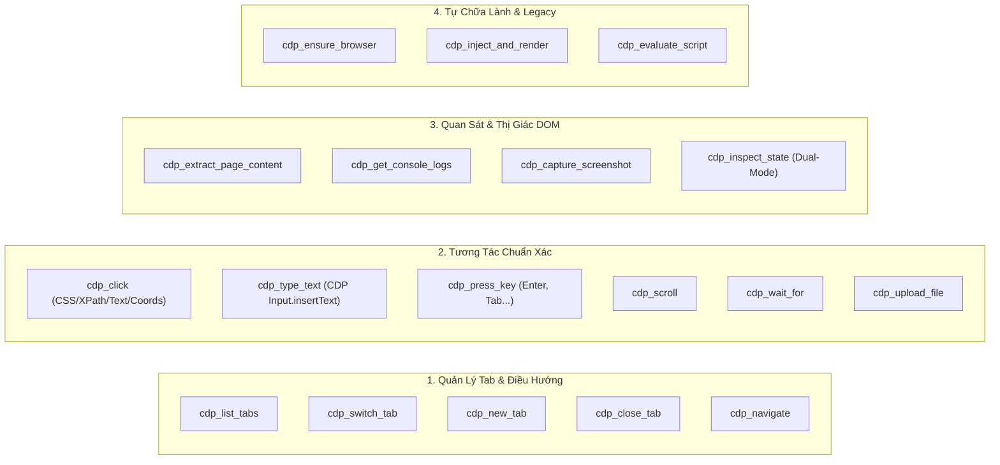

# 🌐 CDP ENTERPRISE SUPER-ENGINE v2.0 — CẨM NANG VẬN HÀNH

## 📌 1. TỔNG QUAN HỆ THỐNG (SYSTEM OVERVIEW)
Cỗ máy **CDP Enterprise Super-Engine (v2.0)** là hệ thống cầu nối chuẩn **MCP (Model Context Protocol)** kết nối trực tiếp Antigravity với trình duyệt Google Chrome thông qua giao thức **CDP (Chrome DevTools Protocol)** tại cổng **9222** (với cơ chế tự động fallback sang **9223**).

Hệ thống giải quyết triệt để các hạn chế của phiên bản cũ, cung cấp 18 công cụ mạnh mẽ phân bổ theo 4 trụ cột:



---

## 🛠️ 2. DANH MỤC CÔNG CỤ & HƯỚNG DẪN SỬ DỤNG

### 🎯 Trụ Cột 1: Quản Lý Tab & Điều Hướng
* **`cdp_list_tabs`**: Xem danh sách toàn bộ tab đang mở trên Chrome kèm index, ID, tiêu đề và URL.
  ```json
  { "port": 9222 }
  ```
* **`cdp_switch_tab`**: Đổi target làm việc sang tab mong muốn bằng `urlPattern` (vd: `"localhost:3000"`, `"chatgpt.com"`), `tabIndex` hoặc `tabId`.
  ```json
  { "urlPattern": "chatgpt.com", "bringToFront": true }
  ```
* **`cdp_new_tab`**: Mở tab mới với URL bất kỳ.
  ```json
  { "url": "https://google.com", "waitUntil": "domcontentloaded" }
  ```
* **`cdp_navigate`**: Điều hướng tab hiện tại (`goto`, `reload`, `back`, `forward`).
  ```json
  { "action": "goto", "url": "http://localhost:5173" }
  ```

---

### 🖱️ Trụ Cột 2: Tương Tác Chuẩn Xác
* **`cdp_click`**: Click chính xác theo CSS Selector, XPath, Text hoặc Tọa độ. Hỗ trợ `clickCount: 2` (double click), `button: "right"` và `hoverOnly: true`.
  ```json
  { "selector": "button.submit-btn" }
  ```
* **`cdp_type_text`**: Gõ văn bản vào trường nhập liệu. Hỗ trợ `mode: "insertText"` (gọi CDP native `Input.insertText`, hoạt động mượt mà 100% trên React/ProseMirror/Lexical/Monaco mà không bị mất focus).
  ```json
  { "selector": "#prompt-textarea", "text": "Nội dung cần nhập...", "clearBefore": true }
  ```
* **`cdp_press_key`**: Bấm các phím đặc biệt hoặc phím tắt (`Enter`, `Escape`, `Tab`, tổ hợp phím `modifiers: ["Control"]`).
  ```json
  { "key": "Enter" }
  ```
* **`cdp_scroll`**: Cuộn trang theo pixel hoặc cuộn phần tử vào viewport (`scrollIntoView`).
  ```json
  { "deltaY": 300 }
  ```
* **`cdp_wait_for`**: Chờ selector xuất hiện/biến mất hoặc chờ văn bản xuất hiện trên màn hình.
  ```json
  { "selector": ".success-message", "timeoutMs": 10000 }
  ```

---

### 👁️ Trụ Cột 3: Quan Sát & Thị Giác DOM
* **`cdp_extract_page_content`**: "Mắt thần" trích xuất cấu trúc trang:
  - `mode: "interactive"`: Bản đồ các phần tử tương tác (Buttons, Inputs, Links kèm CSS selector duy nhất).
  - `mode: "text"` / `"markdown"`: Nội dung văn bản sạch của trang.
* **`cdp_get_console_logs`**: Lấy lịch sử log console (`log`, `warn`, `error`) phục vụ debug frontend.
* **`cdp_capture_screenshot`**: Chụp ảnh màn hình thật (hỗ trợ `fullPage: true` hoặc chụp riêng một selector).
* **`cdp_inspect_state`**: Đọc trạng thái sâu (Tự động nhận diện Google Flow React Fiber hoặc Universal Web DOM).

---

### 🛡️ Trụ Cột 4: Tự Chữa Lành
* **`cdp_ensure_browser`**: Tự động kiểm tra và khởi động Google Chrome với cờ Remote Debugging nếu trình duyệt đang tắt (`Zero-Manual-CLI`).
