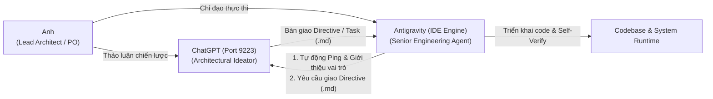

# CHATGPT CDP BRIDGE — SYSTEM SKILL SPECIFICATION

## 🌐 1. TỔNG QUAN HỆ THỐNG (SYSTEM OVERVIEW)

Skill **`chatgpt-bridge`** là cầu nối tự động hóa thời gian thực giữa **Antigravity (Em — AI Senior Engineering Agent / Lead Implementer & Integrator)** và **ChatGPT (Architectural Ideator / Strategic Directive Designer)** thông qua giao thức **CDP (Chrome DevTools Protocol)** tại cổng **`127.0.0.1:9223`** (với cơ chế tự động fallback sang `9222`).

Mô hình vận hành tuân thủ nguyên tắc **Dual-Agent Collaboration Protocol (Giao thức cộng tác hai tác tử)** dưới sự chỉ huy trực tiếp của **Anh — Lead Architect / Product Owner**:



---

## 🧭 2. THÔNG SỐ TỌA ĐỘ KỸ THUẬT (TOPOLOGY & PORTS)

| Thành Phần | Cổng / Đường Dẫn | Giao Thức | Vai Trò Kỹ Thuật |
| :--- | :--- | :--- | :--- |
| **Chrome Profile 2** | `127.0.0.1:9223` | CDP / WebSocket | Chạy tab `chatgpt.com` (Hội thoại: *Xây dựng hệ kiến thức*) |
| **Chrome Profile 1** | `127.0.0.1:9222` | CDP / WebSocket | Fallback port khi Profile 2 không khả dụng |
| **Runner Script** | `~/.gemini/config/skills/chatgpt-bridge/scripts/ping_chatgpt.js` | Node.js | Script kết nối CDP, tương tác DOM, gửi prompt và đọc kết quả |
| **1-Click Batch Launcher** | `~/.gemini/config/skills/chatgpt-bridge/ping.bat` | Batch CLI | File khởi động nhanh dành cho Windows terminal |
| **Thư Mục Tiếp Nhận Directive** | `C:\Users\game\cdp_reader\` | Filesystem | Nơi lưu trữ tài liệu directive (`latest_chatgpt_directive.md`) & ảnh chụp bằng chứng (`chatgpt_latest_proof.png`) |

---

## ⚡ 3. CÁCH KÍCH HOẠT VÀ SỬ DỤNG (USAGE & COMMANDS)

### Lệnh 1: Tự Động Ping Giới Thiệu Vai Trò & Yêu Cầu Giao Việc (Default Handoff)
Chạy trực tiếp từ PowerShell hoặc command tool:
```powershell
node "C:\Users\game\.gemini\config\skills\chatgpt-bridge\scripts\ping_chatgpt.js"
```
*Hành vi:*
1. Kết nối CDP vào port 9223 (hoặc 9222).
2. Định vị tab `chatgpt.com`.
3. Gửi thông điệp giới thiệu vai trò Antigravity và yêu cầu bàn giao nhiệm vụ theo hướng đã chốt với Lead Architect.
4. Lắng nghe streaming cho tới khi ChatGPT hoàn tất phản hồi.
5. Tự động lưu nội dung chỉ đạo vào `C:\Users\game\cdp_reader\latest_chatgpt_directive.md`.
6. Chụp ảnh màn hình bằng chứng trực quan `chatgpt_latest_proof.png`.

### Lệnh 2: Gửi Nội Dung Tùy Biến (Custom Message / Question)
```powershell
node "C:\Users\game\.gemini\config\skills\chatgpt-bridge\scripts\ping_chatgpt.js" --message "Nội dung cần hỏi ChatGPT..."
```

### Lệnh 3: Kiểm Tra Kết Nối (Check-Only Mode)
```powershell
node "C:\Users\game\.gemini\config\skills\chatgpt-bridge\scripts\ping_chatgpt.js" --check-only
```

---

## 🔒 4. NGUYÊN TẮC BẢO VỆ VÀ KIỂM CHỨNG (SAFETY PROTOCOL)

1. **Non-destructive Interaction**: Không đóng tab, không tải lại trang (`reload`), giữ nguyên toàn bộ lịch sử hội thoại hiện có của Anh trên trình duyệt.
2. **Streaming Guard**: Giám sát nút Stop (`button[data-testid="stop-button"]`) với timeout an toàn tối đa 120s, đảm bảo không trích xuất văn bản khi ChatGPT chưa viết xong.
3. **Spec-First Alignment**: Mọi directive nhận từ ChatGPT chỉ được coi là bản thảo kỹ thuật; Antigravity phải đối chiếu lại với tiêu chí của Anh trước khi tiến hành viết code.
