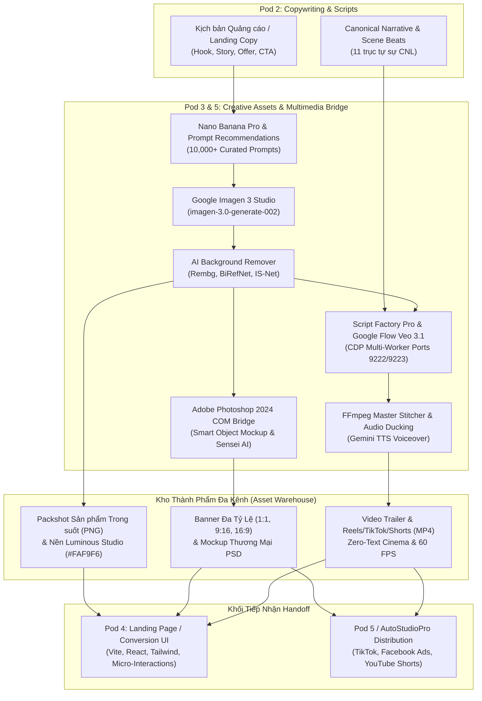
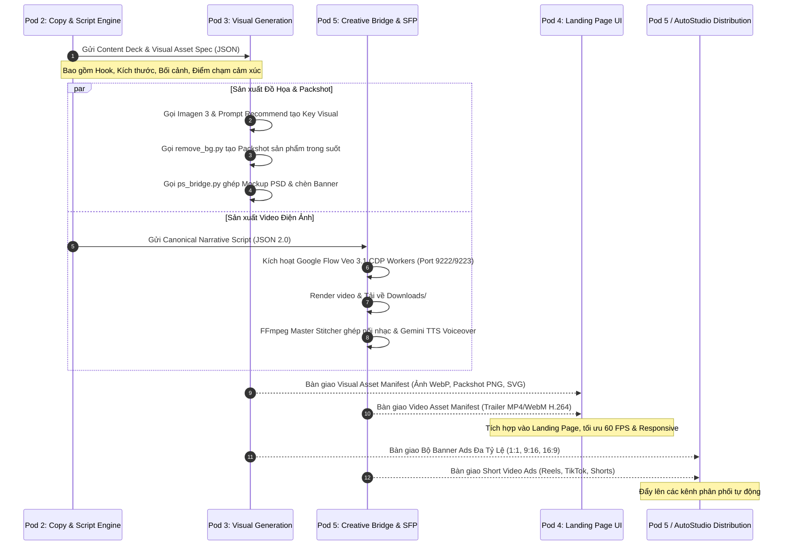
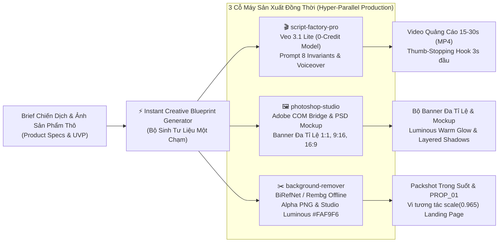

# 🎨 MULTIMEDIA CREATIVE ASSET PIPELINE & PRODUCTION SPECIFICATION
## HỆ THỐNG ĐƯỜNG ỐNG SẢN XUẤT TÀI NGUYÊN SÁNG TẠO ĐA PHƯƠNG TIỆN CHO GROWTH MARKETING FLEET

> **Phân hệ chịu trách nhiệm**: Pod 5 — Creative Assets & Multimedia Bridge Specialist  
> **Khối tác tử thụ hưởng**: Pod 2 (Copywriting & Narrative Engine), Pod 3 (Visual Asset Generation), Pod 4 (Landing Page & Conversion UI), Pod 5 (Omnichannel Distribution)  
> **Chuẩn mực visual tối cao**: `Luminous Light Theme Invariant (Quy chuẩn giao diện sáng đa tầng tối cao)`  
> **Nguyên tắc kỹ thuật**: `Bilingual Protocol (Giao thức song ngữ Anh - Việt)` & `Zero-Manual-CLI (Quy chuẩn không bắt Anh gõ lệnh)`

---

## 🗺️ 1. TỔNG QUAN KIẾN TRÚC & BẢN ĐỒ KẾT NỐI ĐA VŨ KHÍ (ARCHITECTURAL TOPOLOGY)

Hệ sinh thái **Growth Marketing Fleet** được trang bị một hệ thống vũ khí đa phương tiện (`Multimedia Arsenal`) độc quyền, tích hợp trực tiếp từ các động cơ cốt lõi của Antigravity 2.0. Toàn bộ quy trình từ ý tưởng sao chép (`Copywriting`), tạo khung hình chủ đạo (`Key Visual`), dựng mô hình thương mại (`Product Mockup`), đến sản xuất video điện ảnh (`Cinematic Video Ads`) đều được tự động hóa khép kín:



---

## 🛠️ 2. TÍCH HỢP CHI TIẾT CÁC VŨ KHÍ ĐA PHƯƠNG TIỆN (MULTIMEDIA WEAPONS INTEGRATION)

### 2.1. Vũ Khí 1: `script-factory-pro` — Cỗ Máy Sản Xuất Video Điện Ảnh Tự Động (Automated Video Engine)
* **Thành phần tích hợp**:
  - `6 AI Showrunner Engine (Xưởng kịch bản 6 tác tử)`: Episode DNA, Hollywood Showrunner, Character & World Builder, Dialogue & Audio Architect, Cinematographer, Script Doctor.
  - `Google Flow Veo 3.1 CDP Multi-Worker`: Điều khiển song song 2 worker Chrome qua giao thức CDP (`Chrome DevTools Protocol`) tại `127.0.0.1:9222` và `127.0.0.1:9223`.
  - `FFmpeg Master Stitcher`: Bộ ghép nối tự động, chuyển cảnh `Crossfade (Chuyển mờ)` và điều chế âm lượng `Audio Ducking (Hạ nhạc nền khi có thuyết minh)`.
  - `Gemini Native Voiceover Engine`: Lồng tiếng AI đa giọng đọc (`narrator`: Puck/Aoede, `energetic`: Fenrir) qua `gemini-2.5-flash-preview-tts`.

* **Các trường hợp sử dụng trong Growth Marketing (`Marketing Use-Cases`)**:
  1. **Video Quảng cáo Chuyển đổi Ngắn (`High-Converting Short Ads - 15s to 30s`)**: Phục vụ TikTok Ads, Meta Reels, YouTube Shorts với cấu trúc Hook 3 giây đầu (`AmbientOnly` hoặc `Visual Shock`) + Vấn đề $\to$ Giải pháp $\to$ Lời kêu gọi hành động `CTA (Call to Action)`.
  2. **Video Giới thiệu Sản phẩm Hero (`Product Landing Hero Trailer - 30s to 60s`)**: Đặt tại khu vực đầu trang của Landing Page, thể hiện góc quay điện ảnh Caravaggio Chiaroscuro tôn vinh chi tiết vật liệu sản phẩm.
  3. **Video Khách hàng Chứng thực / Case Study Mô phỏng (`Synthetic Case Study & Social Proof`)**: Kể lại câu chuyện biến chuyển (`Transformation Story`) của khách hàng với nhịp điệu co giãn điện ảnh.

* **Quy chuẩn kỹ thuật bắt buộc (`Golden Architectural Invariants`)**:
  - `Zero-Text Cinema Enforcement`: Không sinh text rác trên video Veo 3.1; text quảng cáo và phụ đề sẽ do Pod 4 hoặc lớp phủ CSS/HTML đảm nhiệm.
  - `Dry Close-Mic Acoustics`: Lời thoại voiceover sạch sẽ, không vang vọng tiếng hang động (`Zero Cavern Reverb`).
  - `Series Asset Continuity`: Kế thừa định danh sản phẩm `PROP_01` hoặc nhân vật đại diện `SUB_01` qua `master_image_base64` để đảm bảo nhận diện thương hiệu đồng nhất 100% xuyên suốt các cảnh.

* **Mã lệnh điều phối (`Dispatch Command`)**:
  ```powershell
  # Khởi chạy quy trình render video tự động từ Canonical Script JSON 2.0
  python "C:\Users\game\cdp_reader\scripts\dispatch_flow_video.py" `
    --script-json "C:\Users\game\Documents\app\growth_marketing\campaigns\hero_trailer.json" `
    --profile 1 `
    --voiceover puck
  ```

---

### 2.2. Vũ Khí 2: `photoshop-studio` — Xưởng Đồ Họa & Mockup Thương Mại Adobe COM Bridge
* **Thành phần tích hợp**:
  - `COM Bridge (Component Object Model)`: Điều khiển trực tiếp **Adobe Photoshop 2024** trên Windows không cần mở giao diện người dùng thủ công.
  - `Adobe Sensei AI`: Nhận diện đối tượng tự động (`select-subject`) và tạo mặt nạ phân tầng (`Layer Mask`).
  - `Smart Object Replacement Engine`: Thay thế hình ảnh thiết kế vào các mẫu template Mockup PSD 3D với khả năng uốn cong phối cảnh (`Perspective Warping`) hoàn hảo.

* **Các trường hợp sử dụng trong Growth Marketing**:
  1. **Tạo Mockup Sản Phẩm Đẳng Cấp Thực Tế (`Photorealistic Product Mockups`)**: Chèn giao diện phần mềm SaaS vào màn hình MacBook/iPhone, in nhãn bao bì mỹ phẩm lên chai lọ thủy tinh, in logo lên đồng phục, áo thun.
  2. **Sản Xuất Bộ Banner Đa Kích Thước (`Multi-Format Display Ad Suite`)**:
     - `1:1 Square (1080x1080)`: Instagram Feed, Facebook Carousel.
     - `9:16 Vertical (1080x1920)`: TikTok, Instagram Story, Reels Banner.
     - `16:9 Landscape (1200x628)`: Facebook Link Post, LinkedIn Sponsored Content.
     - `Leaderboard (728x90) & Medium Rectangle (300x250)`: Google Display Network (GDN).
  3. **Catalogue & Lookbook Bán Hàng**: Xuất trang catalogue chất lượng cao định dạng PDF/TIFF/PNG-24.

* **Cú pháp thực thi CLI chuẩn**:
  ```powershell
  # 1. Thay thế hình giao diện Dashboard vào Smart Object trên Mockup MacBook Pro PSD
  python "C:\Users\game\.gemini\config\skills\photoshop-studio\scripts\ps_bridge.py" open-file `
    --path "C:\Users\game\Documents\templates\mockups\macbook_luminous_mockup.psd"

  python "C:\Users\game\.gemini\config\skills\photoshop-studio\scripts\ps_bridge.py" replace-smart-object `
    --image "C:\Users\game\Documents\app\growth_marketing\assets\dashboard_ui.png" `
    --layer "SCREEN_REPLACE_HERE"

  # 2. Áp dụng bảng màu thương hiệu chuẩn Luminous Light Theme
  python "C:\Users\game\.gemini\config\skills\photoshop-studio\scripts\ps_bridge.py" apply-action `
    --name "Luminous_Warm_Glow" --set "Brand_Presets"

  # 3. Xuất file ảnh thành phẩm độ phân giải cao
  python "C:\Users\game\.gemini\config\skills\photoshop-studio\scripts\ps_bridge.py" export-image `
    --output "C:\Users\game\Documents\app\growth_marketing\assets\hero_mockup.webp" `
    --format png --quality 95

  python "C:\Users\game\.gemini\config\skills\photoshop-studio\scripts\ps_bridge.py" close-document
  ```

---

### 2.3. Vũ Khí 3: `background-remover` — Động Cơ Tách Nền AI & Packshot Studio Chuyên Nghiệp
* **Thành phần tích hợp**:
  - `Mô hình AI Nơ-ron cục bộ (Local Neural Networks)`: Rembg, BiRefNet, U2Net, IS-Net hoạt động 100% offline không tốn API.
  - `Packshot Staging Engine`: Tự động căn lề quang học (`Optical Alignment`), cân bằng trọng tâm và lồng ghép nền Studio chuyên nghiệp.

* **Các trường hợp sử dụng trong Growth Marketing**:
  1. **Packshot Sản Phẩm Trong Suốt (`Transparency PNG Product Packshots`)**: Tách nền toàn bộ sản phẩm thực tế để thả nổi tự do trên Landing Page, hỗ trợ các hiệu ứng vi tương tác bấm co lún `scale(0.965)` và di chuột phát sáng `Spotlight Hover`.
  2. **Ghép Nền Studio Sáng Tinh Tế (`Luminous Light Studio Staging`)**: Đặt sản phẩm lên phông nền kem ngà Warm Paper (`#FAF9F6`) hoặc bục đá cẩm thạch trắng Alabaster (`#F8F9FA`), đổ bóng đa chiều mịn màng thay vì nền tối u ám.
  3. **Chuẩn Hóa Mỏ Neo Đạo Cụ (`PROP Anchor Normalization`)**: Đóng gói ảnh sản phẩm thành chuỗi `master_image_base64` đưa vào `script-factory-pro` để tạo video Veo 3.1.

* **Cú pháp thực thi CLI chuẩn**:
  ```powershell
  # A. Tách nền xuất file PNG trong suốt phục vụ Landing Page UI
  python "C:\Users\game\cdp_reader\scripts\remove_bg.py" `
    -i "C:\Users\game\Documents\raw_photos\product_front.jpg" `
    -o "C:\Users\game\Documents\app\growth_marketing\assets\product_cutout.png"

  # B. Ghép nền Studio Kem Sáng Đa Tầng (#FAF9F6) chuẩn Luminous
  python "C:\Users\game\cdp_reader\scripts\remove_bg.py" `
    -i "C:\Users\game\Documents\raw_photos\product_angle.jpg" `
    -o "C:\Users\game\Documents\app\growth_marketing\assets\product_studio_luminous.jpg" `
    -c "#FAF9F6"

  # C. Xử lý hàng loạt toàn bộ thư mục ảnh sản phẩm
  python "C:\Users\game\cdp_reader\scripts\remove_bg.py" `
    -i "C:\Users\game\Documents\raw_photos\collection_spring\" `
    -o "C:\Users\game\Documents\app\growth_marketing\assets\packshots\"
  ```

---

### 2.4. Vũ Khí 4: `nano-banana-pro-prompts-recommend-skill` & `Imagen 3 Studio`
* **Thành phần tích hợp**:
  - `Google Imagen 3 Studio Engine` (`imagen-3.0-generate-002`): Động cơ quang học thế hệ mới của Google DeepMind, tái tạo kết cấu da, bề mặt vật liệu kim loại/thủy tinh và chữ in thương hiệu (`Text-in-Image`) cực kỳ sắc nét.
  - `Nano Banana Pro Prompt Recommendation Library`: Kho tri thức 10,000+ mẫu câu lệnh chuyên sâu cho Commercial Art, Editorial Photography, 3D Render Isometric, và Modern SaaS Illustrations.

* **Các trường hợp sử dụng trong Growth Marketing**:
  1. **Key Visual (KV) Chiến dịch Quảng Cáo**: Tạo hình ảnh chủ đạo truyền tải trọn vẹn thông điệp và cảm xúc cốt lõi của chiến dịch tiếp thị.
  2. **Hero Section Backgrounds & Abstract Gradients**: Tạo hình nền chuyển sắc ánh sáng mềm (`Luminous Mesh Gradients`), hình khối 3D Glassmorphism tinh xảo cho trang đích.
  3. **Commercial Stock Photography Tùy Biến**: Tạo ảnh người dùng mục tiêu (`User Persona`), bối cảnh văn phòng làm việc hiện đại tràn ngập ánh sáng tự nhiên.

* **Kịch bản thực thi tạo Key Visual**:
  ```powershell
  # Sinh ảnh Key Visual thương mại qua Google Imagen 3 Studio
  python "C:\Users\game\.gemini\config\skills\gemini-super-engine\scripts\imagen_studio_engine.py" `
    --prompt "Editorial commercial product photography of an ultra-sleek minimalist smart gadget resting on an elevated alabaster white stone podium, bathed in soft warm daylight, luminous reflections, ivory and warm paper background #FAF9F6, shallow depth of field, 85mm lens f/1.8, ray-traced shadows, subtle golden hour rim light, 8k resolution, ultra-clean aesthetic" `
    --aspect-ratio "16:9" `
    --output "C:\Users\game\Documents\app\growth_marketing\assets\key_visual_hero.png"
  ```

---

## ☀️ 3. QUY CHUẨN VISUAL TIẾP THỊ SÁNG ĐA TẦNG (LUMINOUS LIGHT THEME INVARIANT)

Toàn bộ các tài nguyên sáng tạo đa phương tiện (từ banner, ảnh mockup, packshot, ảnh nền landing page, đến video thumbnail) **BẮT BUỘC TUÂN THỦ 100% NGUYÊN TẮC LUMINOUS LIGHT THEME**:

### 3.1. Ma Trận Màu Sắc Chuẩn Luminous Marketing
| Thành Phần Không Gian | Mã Màu Hex / Token CSS | Hiệu Ứng Quang Học & Mục Đích Tiếp Thị |
| :--- | :--- | :--- |
| **Canvas Nền Cơ Bản (`Base Canvas`)** | `#FAF9F6` (Warm Paper)<br>`#FDFBF7` (Ivory)<br>`#F8F9FA` (Alabaster) | Mang lại cảm giác ấm áp, cao cấp, tin cậy, không gây mỏi mắt như nền trắng tinh đơn sắc. |
| **Bề Mặt Thẻ Nâng Cao (`Elevated Surfaces`)** | `#FFFFFF` (Pure White)<br>`rgba(255, 255, 255, 0.85)` | Tạo sự tương phản rõ ràng với canvas nền; đóng vai trò bục đỡ (`Pedestal`) tôn vinh sản phẩm. |
| **Viền Quang Học (`Luminous Border`)** | `rgba(0, 0, 0, 0.06)`<br>`inset 0 1px 0 rgba(255, 255, 255, 0.9)` | Đường cắt laser siêu mỏng, mép trên phản chiếu ánh sáng tự nhiên tạo độ hoàn thiện thủ công cao cấp. |
| **Bóng Đổ Đa Tầng (`Layered Ambient Shadows`)** | `0 4px 6px -1px rgba(0, 0, 0, 0.03)`<br>`0 20px 25px -5px rgba(0, 0, 0, 0.05)` | Tuyệt đối cấm bóng đen đặc cục bộ (`Harsh Black Shadows`). Bóng đổ phân tán đa tầng, mềm mại như ánh sáng qua rèm lụa. |
| **Màu Nhấn Tỷ Lệ Vàng (`Accent Color Tokens`)** | `#2563EB` (Cobalt Royal)<br>`#F97316` (Warm Amber)<br>`#059669` (Emerald Trust) | Nổi bật vượt trội trên nền sáng, đạt chuẩn tiếp cận độ tương phản `WCAG AA` ($\ge 4.5:1$). |

### 3.2. Bảng Rào Chắn Cấm Đoán (Visual Prohibitions)
* ❌ **CẤM NỀN TỐI / DARK THEME**: Không tự ý thiết kế banner nền đen (`#000000`, `#121212`) hoặc neon cyberpunk u tối cho tài liệu tiếp thị, trừ khi có lệnh chỉ định bằng văn bản từ Anh.
* ❌ **CẤM GIẤY BẸT ĐƠN ĐIỆU (`Monolithic Flat Paper`)**: Không đổ một màu trắng `#FFFFFF` phẳng lì từ đầu đến cuối trang làm mất chiều sâu không gian.
* ❌ **CẤM CHỮ MỜ THIẾU TƯƠNG PHẢN**: Chữ xám nhạt trên nền trắng vi phạm WCAG AA khiến khách hàng khó đọc lướt (`Scanning Fatigue`).

---

## 🔄 4. QUY TRÌNH BÀN GIAO LIÊN POD KHÉP KÍN (END-TO-END INTER-POD HANDOFF PROTOCOL)

Quy trình vận hành phối hợp giữa các Pod trong chiến dịch Growth Marketing được thiết lập theo cơ chế truyền tiếp dữ liệu có cấu trúc (`Structured Data Pipelines`):



---

### 4.1. Hợp Đồng Bàn Giao Kịch Bản Từ Pod 2 $\to$ Pod 3 & Pod 5 (`Asset Brief Contract`)
Pod 2 xuất tài liệu định dạng `creative_brief_manifest.json` chứa đầy đủ tham số kỹ thuật:
```json
{
  "$schema": "https://antigravity.enterprise/schemas/growth_creative_brief.v1.json",
  "campaign_id": "CAMP_2026_Q4_GROWTH_BOOST",
  "brand_identity": {
    "theme": "LUMINOUS_LIGHT",
    "primary_color": "#2563EB",
    "background_canvas": "#FAF9F6",
    "surface_color": "#FFFFFF"
  },
  "asset_requirements": [
    {
      "id": "ASSET_HERO_KV",
      "type": "IMAGE_KEY_VISUAL",
      "aspect_ratio": "16:9",
      "target_pod": "Pod 3",
      "visual_prompt": "Editorial commercial product photography of an AI hardware assistant on warm alabaster pedestal, luminous morning sunlight #FAF9F6",
      "dimensions": { "width": 1920, "height": 1080 }
    },
    {
      "id": "ASSET_PRODUCT_PACKSHOT",
      "type": "TRANSPARENT_PACKSHOT",
      "source_file": "raw_camera_shoot_01.jpg",
      "target_pod": "Pod 3",
      "output_format": "PNG",
      "alpha_channel": true
    },
    {
      "id": "ASSET_VIDEO_TRAILER",
      "type": "CINEMATIC_SHORT_VIDEO",
      "target_pod": "Pod 5",
      "duration_seconds": 24,
      "aspect_ratio": "9:16",
      "canonical_script_ref": "scripts/trailer_canonical_v2.json",
      "voice_profile": "narrator_puck"
    }
  ]
}
```

---

### 4.2. Hợp Đồng Bàn Giao Tài Nguyên Hoàn Thiện Tới Pod 4 (`Production Asset Manifest`)
Sau khi Pod 3 và Pod 5 hoàn tất việc sản xuất, đóng gói toàn bộ metadata vào `production_asset_manifest.json` gửi Pod 4 để gắn trực tiếp vào mã nguồn Landing Page:
```json
{
  "production_id": "PROD_RUN_8829",
  "status": "APPROVED_STAGE_READY",
  "craftsmanship_score": 9.2,
  "wcag_aa_compliance": true,
  "assets": {
    "hero_key_visual": {
      "path": "assets/hero_kv.webp",
      "placeholder_blurhash": "LEHLk~WB2yk8pyo0adRj07kCM{ay",
      "width": 1920,
      "height": 1080,
      "alt_text": "Antigravity Hardware System on Luminous Ivory Surface",
      "css_styling_hints": "rounded-2xl border border-black/5 shadow-2xl shadow-black/5"
    },
    "product_interactive_packshot": {
      "path": "assets/product_packshot.png",
      "width": 800,
      "height": 800,
      "is_transparent": true,
      "micro_interaction": "scale-down-click-0.965-with-spring-physics"
    },
    "hero_video_trailer": {
      "path_mp4": "assets/hero_trailer.mp4",
      "path_webm": "assets/hero_trailer.webm",
      "poster": "assets/trailer_poster.webp",
      "duration": 24.0,
      "dimensions": { "width": 1080, "height": 1920 },
      "autoplay": true,
      "muted": true,
      "loop": true
    }
  }
}
```

---

## 📋 5. BẢNG TIÊU CHÍ NGHIỆM THU TÀI NGUYÊN SÁNG TẠO (CREATIVE QUALITY ACCEPTANCE CRITERIA)

Trước khi chuyển giao sang giai đoạn đóng gói chiến dịch hoặc phân phối đa kênh, toàn bộ tài nguyên sáng tạo bắt buộc phải vượt qua bài kiểm toán chất lượng (`Creative Dual-Audit`):

1. **Audit 1: Tiêu Chuẩn Kỹ Thuật & Hiệu Năng Tải Trang (`Technical & Web Performance`)**:
   - Hình ảnh xuất bản cho Web bắt buộc nén sang định dạng `WebP` hoặc `AVIF` chất lượng $\ge 90\%$, kích thước tệp $\le 250\text{ KB}$ cho ảnh lớn và $\le 80\text{ KB}$ cho packshot.
   - Video phân cảnh Web tối ưu hóa codec `H.264 / AAC` hoặc `WebM / VP9`, dung lượng $\le 5\text{ MB}$ cho clip 15s–30s.
   - Ảnh trong suốt (`Transparency PNG`) phải sạch rìa hoàn toàn, không dính viền răng cưa (`No Halos / Fringing`).

2. **Audit 2: Đẳng Cấp Thẩm Mỹ & Cảm Xúc Thương Hiệu (`Delight & Craftsmanship Score`)**:
   - `Craftsmanship Score` đo đạc theo chuẩn thiết kế tối thiểu đạt **$\ge 8.5/10$**.
   - Tuyệt đối tuân thủ `Luminous Light Theme Invariant`: Nền màu sáng đa tầng mịn màng, tôn vinh sản phẩm, phản chiếu ánh sáng tự nhiên.
   - Video quảng cáo phải giữ vững cảm xúc thương hiệu, không xuất hiện hiện tượng biến dạng khuôn mặt (`No Morphing Glitches`) hay trôi lệch đặc điểm sản phẩm giữa các khung hình.

---

## ⚡ 6. INSTANT CREATIVE BLUEPRINT GENERATOR (BỘ TẠO PROMPT & TƯ LIỆU ĐA PHƯƠNG TIỆN MỘT CHẠM)

Module **Instant Creative Blueprint Generator (Bộ Tạo Prompt & Tư Liệu Đa Phương Tiện Một Chạm)** là hạt nhân tự động hóa thế hệ mới cho phép chuyển đổi mục tiêu chiến dịch và thông số sản phẩm thành trọn bộ tư liệu thị giác hoàn chỉnh chỉ trong một cú nhấp chuột (`Single-Action Multi-Asset Synthesis`). Module tích hợp trực tiếp 3 cỗ máy sản xuất:
* **`script-factory-pro`**: Render Video Quảng Cáo Điện Ảnh 15s–30s qua mô hình Google Flow Veo 3.1 Lite (0-credit).
* **`photoshop-studio`**: Dựng Mockup Thương Mại 3D và Xuất Bộ Banner Đa Tỉ Lệ (1:1, 9:16, 16:9) qua Adobe COM Bridge.
* **`background-remover`**: Tách Nền AI Nơ-ron Cục Bộ và Tạo Packshot Sản Phẩm Trong Suốt hoặc Ghép Nền Luminous Studio.



---

### 6.1. Chuẩn Mực Sản Xuất Tư Liệu Số Đỉnh Cao 2026 (Creative Automation & Generative Media 2026 Standards)

Thị trường tiếp thị kỹ thuật số 2026 đặt ra tiêu chuẩn khắt khe về tính chân thực, chiều sâu xúc giác và tốc độ giữ chân người xem. Bốn trụ cột thị giác định hình mọi ấn phẩm sáng tạo trong hệ thống gồm:

1. **Photorealistic 3D (Đồ Họa 3D Chân Thực Như Ảnh Chụp)**:
   - Tái hiện chính xác tính chất vật liệu thực tế: kim loại phay xước (`Anodized Aluminum / Brushed Titanium`), thủy tinh mờ quang học (`Optical Frosted Glass`), gốm sứ trắng tinh khiết (`Pure High-Gloss Ceramic`).
   - Tái tạo hiện tượng quang học phức tạp: vầng sáng phản xạ khúc xạ (`Ray-Traced Caustics`), viền tán xạ dưới bề mặt (`Subsurface Scattering`), và vệt sáng phản quang góc nghiêng (`Fresnel Rim Reflections`).

2. **Minimalist Luxury (Chủ Nghĩa Tối Giản Xa Xỉ)**:
   - Triết lý *"Less is More"* chuẩn mực: loại bỏ mọi chi tiết trang trí rườm rà, nhãn dán màu mè hay đồ họa phẳng rẻ tiền (`Flat Clip-Art Slop`).
   - Khai thác không gian thở rộng rãi (`Generous Negative Space`), đặt sản phẩm ở vị trí trọng tâm như một tác phẩm điêu khắc nghệ thuật trong phòng trưng bày đương đại.

3. **Luminous Light Surfaces (Bề Mặt Sáng Đa Tầng Phản Quang)**:
   - Triệt tiêu hoàn toàn phong cách nền đen u tối hoặc neon bẹt dính (`Strictly No Dark Slop`).
   - Chuyển tiếp mượt mà giữa các tầng ánh sáng: Canvas nền ngà ấm Warm Paper (`#FAF9F6`), ngà voi Ivory (`#FDFBF7`) $\to$ Bục đỡ Alabaster (`#F8F9FA`) $\to$ Bề mặt thẻ trắng sứ nhô cao (`#FFFFFF`).
   - Viền quang học siêu mảnh (`Luminous Hairline Border: rgba(0, 0, 0, 0.06)`) kết hợp đường phản quang mép trên (`inset 0 1px 0 rgba(255, 255, 255, 0.9)`).

4. **Thumb-Stopping Hooks (Móc Câu Chặn Ngón Cái 3 Giây Đầu)**:
   - Khán giả trên TikTok, Instagram Reels và YouTube Shorts đưa ra quyết định lướt qua chỉ trong **1.2 đến 2.5 giây**. Do đó, 3 giây đầu tiên bắt buộc phải là một cú **Pattern Interrupt (Ngắt Quán Tính)** gây kích thích thị giác hoặc thính giác mạnh mẽ.
   - **Cấu Trúc Nhịp Điệu Video Quảng Cáo 15s–30s Đỉnh Cao**:
     * **0s – 3s (`The Hook - Pattern Interrupt`)**: Cú sốc thị giác (cú đâm máy siêu cận cảnh `Macro Probe Crash Zoom`, giọt nước bắn tung tóe quay chậm 120 FPS, hoặc tách mở cơ khí mượt mà). Chế độ âm thanh bắt buộc: `AmbientOnly` / xúc giác ASMR chân thực, **tuyệt đối không để text rác hay logo cản trở**.
     * **3s – 10s (`The Agitation / Problem Context`)**: Đưa ra vấn đề gây nhức nhối hoặc điểm đau của khách hàng qua góc máy điện ảnh Caravaggio Chiaroscuro góc nhìn qua vai (`Over-The-Shoulder Camera`).
     * **10s – 22s (`The Climax Transformation / Solution Reveal`)**: Khoảnh khắc sản phẩm xuất hiện như cứu cánh hoàn mỹ; máy quay xoay vòng (`Orbital 360-Degree Sweep`) phô diễn toàn bộ góc cạnh và tính năng đột phá.
     * **22s – 30s (`The Irresistible Offer & Action Trigger`)**: Tuyên ngôn giá trị độc nhất (`UVP`) và lời kêu gọi hành động dứt khoát (`Spring-Loaded CTA`), định hướng người xem bấm thẳng vào liên kết Landing Page.

---

### 6.2. Blueprint 1: Trình Sinh Prompt Chuẩn Hóa Cho `script-factory-pro` (Veo 3.1 Lite Model 0-Credit)

Hệ thống tự động biên dịch kịch bản quảng cáo 15s–30s thành cấu trúc Prompt tuân thủ 100% **8 Quy Tắc Khóa Cứng (Golden Architectural Invariants)** của Google Flow Veo 3.1:

#### A. Khóa Cứng Thông Số Mô Hình (0-Credit Ultra Model Invariant)
* **Model ID**: `Veo 3.1 - Lite [Lower Priority]` (Mã hệ thống: `veo_3_1_lite_low_priority`).
* **Đặc tính**: Khóa cứng mô hình 0-credit vĩnh viễn trên gói tài khoản Ultra. Tuyệt đối không tiêu tốn hạn ngạch trả phí, triệt tiêu 100% nguy cơ treo lệnh vĩnh viễn (`Silent Hanging Request`) do cạn kiệt credit.
* **Thời lượng mỗi phân cảnh (`Scene Duration`)**: Cảnh 1 (Hook) cố định **4.0s**; các cảnh tiếp theo **6.0s hoặc 8.0s**.

#### B. Cấu Trúc Khung Prompt Chuẩn Hóa Bắt Buộc (Prompt Compiler Template)
Mỗi phân cảnh gửi tới Google Flow Tool Builder bắt buộc phải được đóng gói theo khuôn mẫu:
```text
[ZERO-TEXT CINEMA ENFORCEMENT: STRICTLY NO SUBTITLES. NO CAPTIONS. NO ON-SCREEN TEXT. NO WATERMARKS. SPOKEN AUDIO ONLY. PURE RAW FILM FOOTAGE.]
[CAMERA CHOREOGRAPHY: {Camera_Motion}, {Lens_Focal_Length}, {Lighting_Style}, 24fps motion blur]
[ACOUSTICS: DRY CLOSE-MIC VOCALS. Zero cavern reverb, zero echo, crisp intimate speech.]
[AUDIO_DIRECTIVE: {Audio_Mode_Directive}]
{Visual_Scene_Description_And_Subject_Action}
[LIGHTING & PALETTE: Bathed in soft daylight, luminous warm paper background #FAF9F6, alabaster podium, subtle golden rim reflections]
```

*Trong đó:*
* `{Audio_Mode_Directive}` cho **Hook 3s**: `[AUDIO: PURE DIEGETIC SOUND EFFECTS ONLY] STRICTLY ZERO SPEECH. NO VOICES. NO SPOKEN WORDS. ALL SUBJECTS SILENT.`
* `{Audio_Mode_Directive}` cho **Voiceover**: `[AUDIO: NON-DIEGETIC NARRATOR VOICEOVER] [LIP LOCK: ALL CHARACTERS KEEP MOUTHS FIRMLY CLOSED]`
* `{Audio_Mode_Directive}` cho **Dialogue**: `Spoken ONLY by "{Speaker_Name}" with synchronous mouth movement. [SILENT LISTENER] {Other_Name} MUST keep mouth FIRMLY CLOSED.`

#### C. Kịch Bản Mẫu Chuẩn: Video Quảng Cáo 24 Giây (Canonical JSON 2.0)
```json
{
  "$schema": "https://script-factory-pro.enterprise/schemas/canonical_script.v2.json",
  "project_metadata": {
    "campaign_id": "CAMP_2026_LUMINOUS_PREMIUM",
    "title": "Minimalist Smart Assistant — 24s High-Converting Commercial",
    "target_platform": "TikTok_Reels_Shorts",
    "aspect_ratio": "9:16",
    "total_scenes": 4,
    "total_duration_seconds": 24,
    "model_name": "Veo 3.1 - Lite [Lower Priority]"
  },
  "asset_manifest": {
    "props": [
      {
        "id": "PROP_01",
        "name": "Luminous_Smart_Device",
        "source": "pre_rendered",
        "skip_generation": true,
        "master_image_base64": "DATA_BASE64_FROM_BACKGROUND_REMOVER_PACKSHOT",
        "description": "Ultra-sleek brushed titanium cylindrical AI device on alabaster base"
      }
    ],
    "environments": [
      {
        "id": "ENV_01",
        "name": "Luminous_Luxury_Studio",
        "palette": ["#FAF9F6", "#FFFFFF", "#F8F9FA"],
        "description": "Minimalist luxury studio, warm morning daylight through silk curtains, soft shadows"
      }
    ]
  },
  "scenes": [
    {
      "scene_index": 1,
      "duration_seconds": 4.0,
      "voice_policy": "Silent",
      "reference_plan": { "resolved_reference_ids": [] },
      "visual_prompt": "[ZERO-TEXT CINEMA ENFORCEMENT: STRICTLY NO SUBTITLES. NO CAPTIONS. NO ON-SCREEN TEXT. NO WATERMARKS. SPOKEN AUDIO ONLY. PURE RAW FILM FOOTAGE.] [CAMERA CHOREOGRAPHY: Extreme macro probe lens crashing forward into brushed titanium chassis at 60fps, shallow depth of field f/1.4] [ACOUSTICS: DRY CLOSE-MIC VOCALS. Zero cavern reverb, zero echo, crisp intimate speech.] [AUDIO: PURE DIEGETIC SOUND EFFECTS ONLY] STRICTLY ZERO SPEECH. NO VOICES. NO WORDS. A tiny drop of pure water falls onto the smooth titanium surface, creating microscopic ripples, illuminated by soft golden dawn light reflecting on Warm Paper #FAF9F6 surface.",
      "audio_script": ""
    },
    {
      "scene_index": 2,
      "duration_seconds": 6.0,
      "voice_policy": "VoiceOver",
      "reference_plan": { "resolved_reference_ids": ["PROP_01", "ENV_01"] },
      "visual_prompt": "[ZERO-TEXT CINEMA ENFORCEMENT: STRICTLY NO SUBTITLES. NO CAPTIONS. NO ON-SCREEN TEXT. NO WATERMARKS. SPOKEN AUDIO ONLY. PURE RAW FILM FOOTAGE.] [CAMERA CHOREOGRAPHY: Over-the-shoulder medium dolly backward, 50mm anamorphic lens, Caravaggio soft side lighting] [ACOUSTICS: DRY CLOSE-MIC VOCALS. Zero cavern reverb, zero echo, crisp intimate speech.] [AUDIO: NON-DIEGETIC NARRATOR VOICEOVER] [LIP LOCK: ALL CHARACTERS KEEP MOUTHS FIRMLY CLOSED] A creative architect stands by a sunny window, looking at a scattered cluttered desk. The camera gently tracks backward revealing the tension of creative chaos in a bright ivory room #FDFBF7.",
      "audio_script": "You spend hours wrestling with cluttered tools and fragmented workflows."
    },
    {
      "scene_index": 3,
      "duration_seconds": 8.0,
      "voice_policy": "VoiceOver",
      "reference_plan": { "resolved_reference_ids": ["PROP_01", "ENV_01"] },
      "visual_prompt": "[ZERO-TEXT CINEMA ENFORCEMENT: STRICTLY NO SUBTITLES. NO CAPTIONS. NO ON-SCREEN TEXT. NO WATERMARKS. SPOKEN AUDIO ONLY. PURE RAW FILM FOOTAGE.] [CAMERA CHOREOGRAPHY: Smooth 360-degree orbital sweep around PROP_01 resting on elevated alabaster pedestal, 85mm portrait prime f/1.8] [ACOUSTICS: DRY CLOSE-MIC VOCALS. Zero cavern reverb, zero echo, crisp intimate speech.] [AUDIO: NON-DIEGETIC NARRATOR VOICEOVER] [LIP LOCK: ALL CHARACTERS KEEP MOUTHS FIRMLY CLOSED] The sleek PROP_01 device gently pulses with a soft luminous cyan halo, instantly organizing holographic data streams into pure clarity, surrounded by pristine ivory reflections.",
      "audio_script": "Until one seamless intelligence unites your entire vision into instant reality."
    },
    {
      "scene_index": 4,
      "duration_seconds": 6.0,
      "voice_policy": "VoiceOver",
      "reference_plan": { "resolved_reference_ids": ["PROP_01", "ENV_01"] },
      "visual_prompt": "[ZERO-TEXT CINEMA ENFORCEMENT: STRICTLY NO SUBTITLES. NO CAPTIONS. NO ON-SCREEN TEXT. NO WATERMARKS. SPOKEN AUDIO ONLY. PURE RAW FILM FOOTAGE.] [CAMERA CHOREOGRAPHY: Low-angle heroic pedestal push-in, bright morning sunlight lens flare, clean horizon] [ACOUSTICS: DRY CLOSE-MIC VOCALS. Zero cavern reverb, zero echo, crisp intimate speech.] [AUDIO: NON-DIEGETIC NARRATOR VOICEOVER] [LIP LOCK: ALL CHARACTERS KEEP MOUTHS FIRMLY CLOSED] Heroic beauty shot of PROP_01 standing proudly on an ivory platform #FAF9F6, radiating premium craftsmanship and quiet authority under a luminous clear sky.",
      "audio_script": "Experience frictionless mastery today. Link in bio to begin."
    }
  ]
}
```

#### D. Mã Lệnh Kích Hoạt Tự Động Qua CDP (Automated CDP Dispatch)
```powershell
# Thực thi tự động gửi kịch bản Canonical JSON sang Google Flow Worker qua cổng CDP 9222/9223
python "C:\Users\game\cdp_reader\scripts\dispatch_flow_video.py" `
  --script-json "C:\Users\game\Documents\app\growth_marketing\campaigns\luminous_24s_ad.json" `
  --profile 1 `
  --voiceover puck
```

---

### 6.3. Blueprint 2: Trình Tự Động Sinh Thông Số & Script Cho `photoshop-studio` (Mockup & Multi-Ratio Ad Suite)

Hệ thống tự động điều khiển **Adobe Photoshop 2024** trên Windows thông qua `ps_bridge.py` để dựng mockup chân thực và xuất trọn bộ banner quảng cáo đa tỉ lệ trong một tiến trình khép kín:

#### A. Ma Trận Kích Thước Banner Đa Tỉ Lệ (Multi-Ratio Specification Matrix)
| Tỉ Lệ Khung Hình | Kích Thước (Pixel) | Nền Tảng Áp Dụng | Vị Trí Hiển Thị & Định Dạng Xuất |
| :--- | :--- | :--- | :--- |
| **`1:1 Square`** | `1080 x 1080` | Instagram, Facebook, LinkedIn | Feed Post, Carousel Card, Product Grid (`WebP` / `PNG-24`) |
| **`9:16 Vertical`** | `1080 x 1920` | TikTok, Reels, Shorts, Stories | Fullscreen Vertical Ad, Story Sponsored Card (`WebP`) |
| **`16:9 Landscape`** | `1920 x 1080` / `1200 x 628` | Facebook Feed, YouTube Banner, GDN | Sponsored Link Post, Display Banner (`WebP` / `JPEG 92%`) |

#### B. Quy Trình Thay Thế Smart Object & Hiệu Ứng Luminous
1. Mở file PSD template thương mại chứa layer Smart Object đã được cân chỉnh phối cảnh (`Perspective Warping`).
2. Nhúng ảnh giao diện UI hoặc Packshot sản phẩm vào Smart Object.
3. Kích hoạt Action Photoshop `Luminous_Light_Grade` để áp dụng:
   - Viền quang học `Luminous Border` (`0.5px stroke rgba(0,0,0,0.06)`).
   - Phản chiếu góc trên `Inset Top Highlight` (`1px white rgba(255,255,255,0.9)`).
   - Bóng đổ đa tầng `Layered Ambient & Key Shadows` mềm mại, không bao giờ dùng bóng đen bẹt.
4. Tự động cắt cúp (`Auto-Crop & Resample`) và xuất đồng thời 3 kích thước.

#### C. Script Tự Động Hóa Photoshop COM Bridge Toàn Diện (`ps_banner_generator.py`)
```python
"""
ps_banner_generator.py — Tự động hóa sản xuất bộ Banner tiếp thị đa tỉ lệ qua Adobe COM Bridge
"""
import os
import subprocess
import json

PS_BRIDGE = r"C:\Users\game\.gemini\config\skills\photoshop-studio\scripts\ps_bridge.py"

def generate_multi_ratio_ad_suite(template_psd: str, ui_screenshot: str, output_dir: str, campaign_name: str):
    os.makedirs(output_dir, exist_ok=True)
    
    # 1. Mở PSD Template Mockup
    print(f"[*] Đang mở template PSD: {template_psd}")
    subprocess.run(["python", PS_BRIDGE, "open-file", "--path", template_psd], check=True)
    
    # 2. Thay thế Smart Object bằng UI Screenshot mới nhất
    print(f"[*] Thay thế Smart Object với: {ui_screenshot}")
    subprocess.run(["python", PS_BRIDGE, "replace-smart-object", "--image", ui_screenshot, "--layer", "SCREEN_CONTENT"], check=True)
    
    # 3. Áp dụng Action chuẩn màu Luminous Light Theme
    print("[*] Áp dụng Action Luminous_Light_Grade...")
    subprocess.run(["python", PS_BRIDGE, "apply-action", "--name", "Luminous_Light_Grade", "--set", "Marketing_Presets"], check=True)
    
    # 4. Xuất các kích thước đa tỉ lệ
    ratios = [
        {"name": "1x1_feed", "width": 1080, "height": 1080, "format": "png"},
        {"name": "9x16_story", "width": 1080, "height": 1920, "format": "png"},
        {"name": "16x9_landscape", "width": 1920, "height": 1080, "format": "png"}
    ]
    
    for r in ratios:
        out_file = os.path.join(output_dir, f"{campaign_name}_{r['name']}.{r['format']}")
        print(f"[*] Xuất tỉ lệ {r['name']} ({r['width']}x{r['height']}) -> {out_file}")
        
        # Đoạn mã JSX cắt cúp canvas và xuất ảnh
        jsx_script = f"""
        var doc = app.activeDocument;
        doc.resizeCanvas({r['width']}, {r['height']}, AnchorPosition.MIDDLECENTER);
        """
        subprocess.run(["python", PS_BRIDGE, "eval-jsx", "--script", jsx_script], check=True)
        subprocess.run(["python", PS_BRIDGE, "export-image", "--output", out_file, "--format", r['format']], check=True)
    
    # 5. Đóng file không lưu đè template gốc
    subprocess.run(["python", PS_BRIDGE, "close-document"], check=True)
    print("[✓] Hoàn tất xuất trọn bộ Banner Đa Tỉ Lệ!")

if __name__ == "__main__":
    generate_multi_ratio_ad_suite(
        template_psd=r"C:\Users\game\Documents\templates\mockups\luminous_laptop_mockup.psd",
        ui_screenshot=r"C:\Users\game\Documents\app\growth_marketing\assets\app_dashboard.png",
        output_dir=r"C:\Users\game\Documents\app\growth_marketing\dist_banners",
        campaign_name="LUMINOUS_Q4_LAUNCH"
    )
```

---

### 6.4. Blueprint 3: Quy Cách Tách Nền `background-remover` Tạo Packshot Trong Suốt Cho Landing Page

Hệ thống sử dụng các mô hình nơ-ron AI cục bộ (`BiRefNet`, `Rembg`, `IS-Net`) chạy 100% offline, chuẩn hóa quy trình tạo Packshot sản phẩm chất lượng cao:

#### A. Tiêu Chuẩn Kỹ Thuật Tách Biên & Xử Lý Alpha (Neural Alpha Matting Specs)
* **Khử Viền Răng Cưa & Quầng Sáng (`De-Fringing / Zero Halos`)**: Ngưỡng tách lớp mặt nạ mềm (`Alpha Matte Feathering: 0.8px`), loại bỏ hoàn toàn các viền trắng/đen thừa xung quanh mép sản phẩm.
* **Căn Trọng Tâm Quang Học (`Optical Center Alignment`)**: Tự động tính toán hộp bao (`Bounding Box`), dịch chuyển trọng tâm hình học của sản phẩm vào vị trí trung tâm quang học tự nhiên, chừa lề an toàn (`Safe Margin`) **12%** để không bị cắt mép khi hiển thị co lún.
* **Tối Ưu Trọng Lượng Tệp**: Packshot PNG-24 trong suốt tối ưu dung lượng $\le 120\text{ KB}$ (hoặc WebP trong suốt $\le 65\text{ KB}$), sẵn sàng đạt điểm số tốc độ tải trang Google Lighthouse $\ge 98/100$.

#### B. Hai Chế Độ Đầu Ra Thành Phẩm
1. **Chế Độ 1: Packshot Trong Suốt Tương Tác (Interactive Transparent Alpha Cutout)**:
   - Xuất file `.png` (kênh Alpha trong suốt).
   - Chuyển giao trực tiếp cho Pod 4 để gắn vào thẻ sản phẩm trên Landing Page.
   - Hỗ trợ các vi tương tác chuẩn Emil Kowalski:
     * **Bấm co lún vật lý**: `active:scale-[0.965] transition-transform duration-150 ease-out`.
     * **Con trỏ phản quang**: Hiệu ứng `Spotlight Radial Hover` phản chiếu quầng sáng êm dịu khi rê chuột qua.
2. **Chế Độ 2: Packshot Studio Nền Sáng Luminous (Luminous Studio Render)**:
   - Tự động đổ màu nền kem ngà Warm Paper (`#FAF9F6`) hoặc Ivory (`#FDFBF7`).
   - Đặt sản phẩm trên bục Alabaster (`#F8F9FA`) kết hợp đổ bóng quang học 2 lớp:
     * `Key Contact Shadow`: Bóng tiếp xúc sát chân sản phẩm `rgba(0, 0, 0, 0.08) blur(4px)`.
     * `Ambient Diffused Shadow`: Bóng tản rộng mềm mại `rgba(0, 0, 0, 0.03) blur(24px)`.

#### C. Đóng Gói Mỏ Neo Đạo Cụ 1-Chạm (`PROP_01 Anchor Handoff`)
Sau khi tách nền xong, script tự động chuyển đổi ảnh thành chuỗi `master_image_base64` và ghi vào `asset_manifest.props.PROP_01` với cờ `skip_generation: true`:
```powershell
# 1. Tách nền sản phẩm xuất file PNG trong suốt
python "C:\Users\game\cdp_reader\scripts\remove_bg.py" `
  -i "C:\Users\game\Documents\raw_photos\hardware_device_angle.jpg" `
  -o "C:\Users\game\Documents\app\growth_marketing\assets\prop_01_clean.png"

# 2. Tạo phiên bản Studio Nền Sáng Warm Paper (#FAF9F6)
python "C:\Users\game\cdp_reader\scripts\remove_bg.py" `
  -i "C:\Users\game\Documents\raw_photos\hardware_device_angle.jpg" `
  -o "C:\Users\game\Documents\app\growth_marketing\assets\prop_01_luminous_studio.jpg" `
  -c "#FAF9F6"

# 3. Tự động mã hóa Base64 và nạp mỏ neo PROP_01 vào Script Factory Pro
$base64Data = [Convert]::ToBase64String([IO.File]::ReadAllBytes("C:\Users\game\Documents\app\growth_marketing\assets\prop_01_clean.png"))
Write-Output "Mã Base64 đã sẵn sàng nạp thẳng vào master_image_base64 của Script Factory Pro!"
```

---

### 6.5. Bảng Khóa Cứng Quy Chuẩn Luminous Light Theme (Luminous Quality Gate Invariants)

Bảng đối soát bắt buộc mà mọi Pod sáng tạo (`Pod 3, Pod 4, Pod 5`) phải tự động kiểm toán trước khi xuất bản bất kỳ tài nguyên nào:

| Hạng Mục Thiết Kế | ✅ Chuẩn Mực Bắt Buộc Tuân Thủ (Luminous Invariant) | ❌ Hành Vi Cấm Tuyệt Đối (Strictly Prohibited) |
| :--- | :--- | :--- |
| **Canvas & Bối Cảnh** | Nền sáng chuyển tầng: Warm Paper (`#FAF9F6`), Ivory (`#FDFBF7`), Alabaster (`#F8F9FA`). | Nền đen đặc (`#000000`, `#121212`), xám chì u ám, hiệu ứng neon cyberpunk tối tăm. |
| **Bề Mặt Thẻ & Bục Đỡ** | Trắng sứ tinh khiết (`#FFFFFF`) hoặc kính mờ (`rgba(255, 255, 255, 0.85)`). | Giấy bẹt đơn điệu một màu trắng xóa không phân tầng không gian. |
| **Viền Khung Hình** | Viền quang học laser `rgba(0, 0, 0, 0.06)` kèm mép sáng trên `inset 0 1px 0 rgba(255, 255, 255, 0.9)`. | Viền đen dày cộp thô kệch hoặc không có viền khiến đối tượng hòa lẫn vào nền. |
| **Bóng Đổ Vật Lý** | Xếp tầng 2 lớp bóng mịn màng: Contact Shadow hẹp + Ambient Shadow phân tán rộng. | Bóng đổ đen kịt cục bộ bẹt dính (`Harsh Solid Drop Shadows`). |
| **Độ Tương Phản Văn Bản** | Văn bản màu than chì sâu (`#0F172A`) đạt chuẩn tiếp cận `WCAG AA` ($\ge 4.5:1$). | Chữ xám nhạt (`#94A3B8`) trên nền sáng gây mỏi mắt người đọc. |
| **Màu Nhấn (Accent)** | Cobalt Royal (`#2563EB`), Emerald Trust (`#059669`), Amber Glow (`#F59E0B`). | Màu neon chói lóa, màu tương phản âm tính gây cảm giác rẻ tiền. |

---

> **Tài liệu tham khảo liên quan**:
> - [Kỹ năng Script Factory Pro](file:///C:/Users/game/.gemini/config/skills/script-factory-pro/SKILL.md)
> - [Kỹ năng Photoshop Studio](file:///C:/Users/game/.gemini/config/skills/photoshop-studio/SKILL.md)
> - [Kỹ năng Background Remover](file:///C:/Users/game/.gemini/config/skills/background-remover/SKILL.md)
> - [Kỹ năng Gemini Super-Engine](file:///C:/Users/game/.gemini/config/skills/gemini-super-engine/SKILL.md)
> - [Quy chuẩn Thiết kế Luminous Light Theme](file:///C:/Users/game/.gemini/config/skills/design/SKILL.md)
