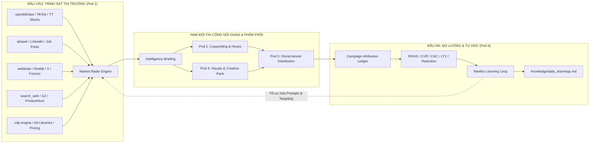
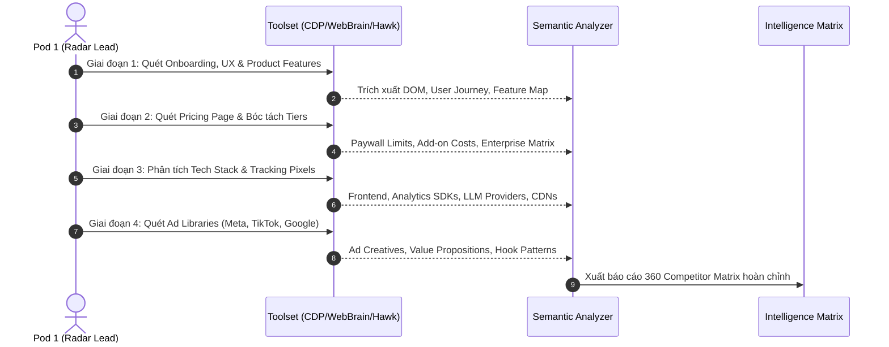
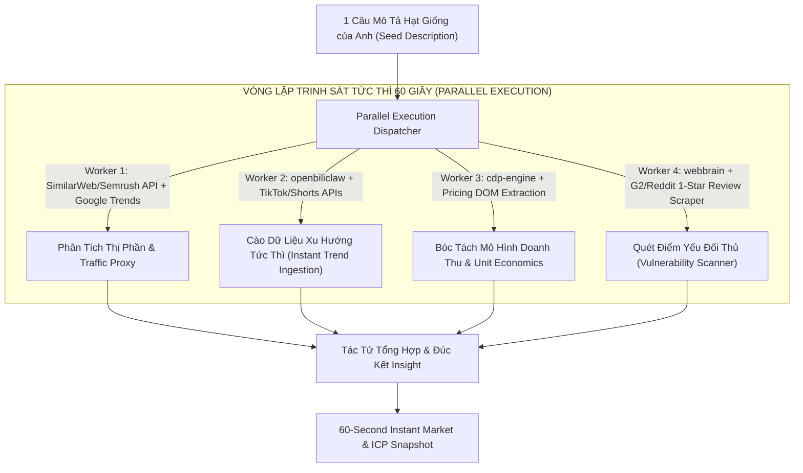
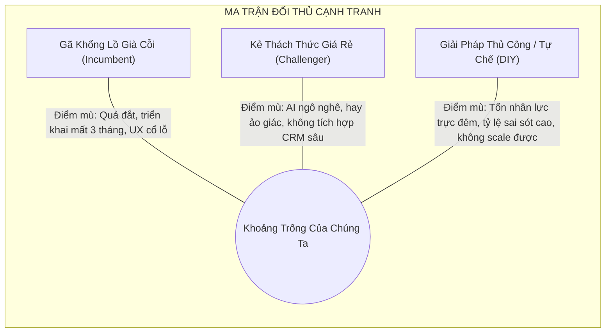
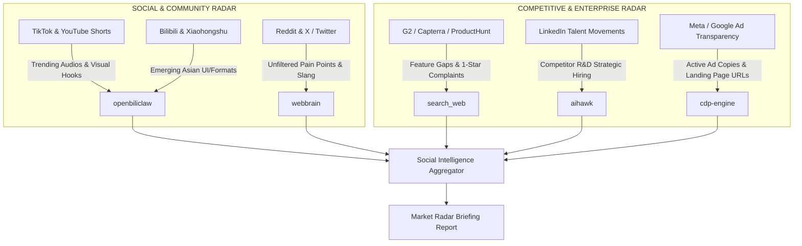
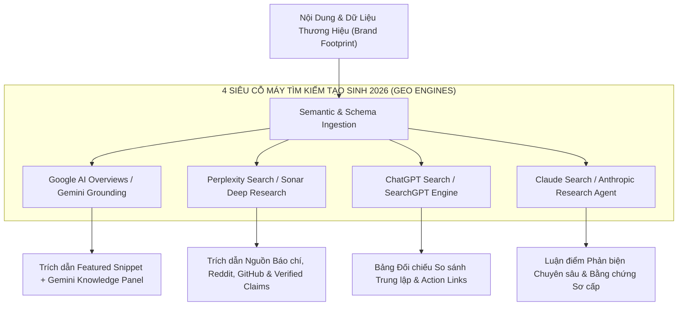
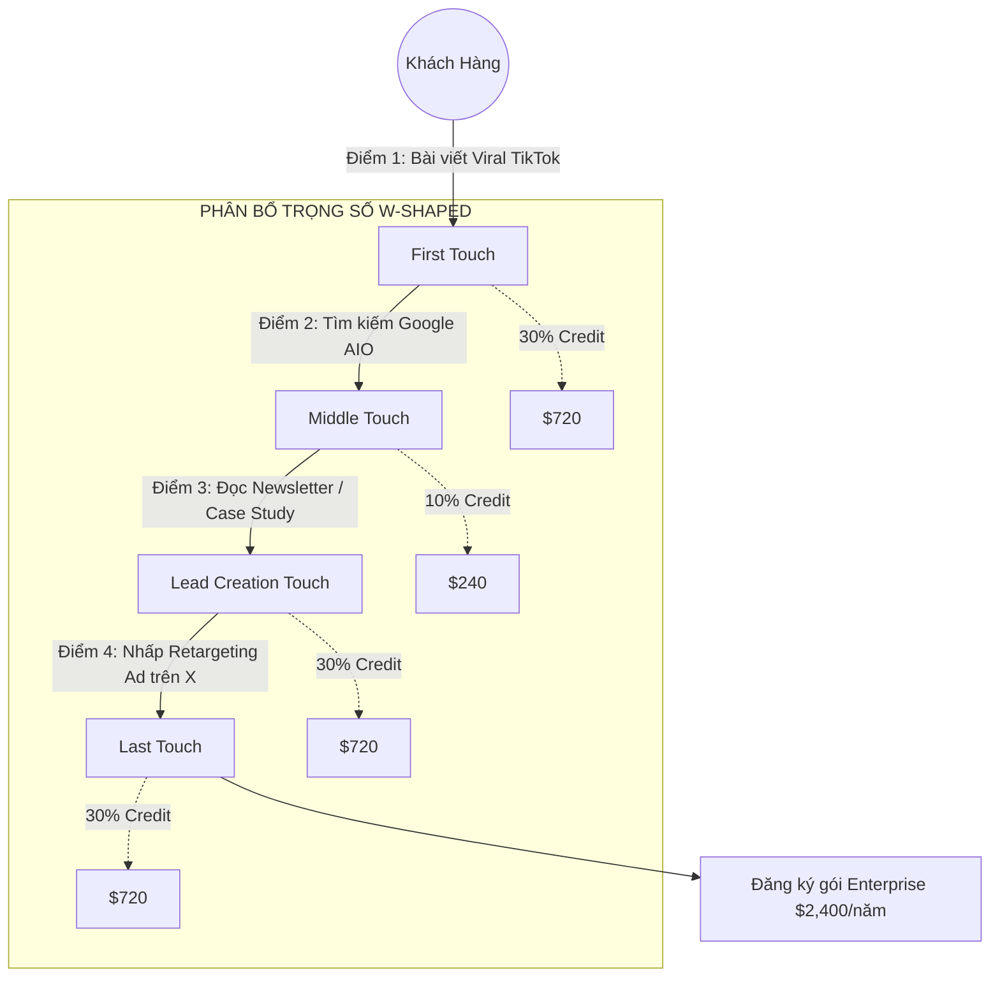
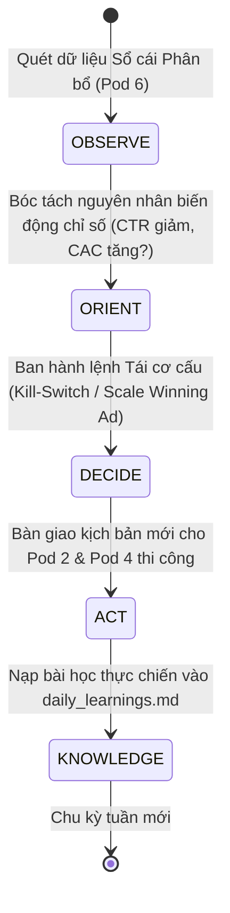
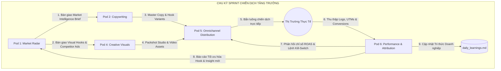

# 📡 MARKET RADAR & SOCIAL INTELLIGENCE ANALYTICS
## Hệ Thống Phương Pháp Luận Trinh Sát Thị Trường, Tình Báo Đối Thủ & Sổ Cái Đo Lường Hiệu Suất Chiến Dịch

> **Tài liệu Kỹ thuật Chuyên sâu (`Technical Reference Specification`)**  
> **Chuyên trách**: **Pod 1** *(Market Radar & Competitor Intelligence)* & **Pod 6** *(Performance Tracking & Attribution Feedback)*  
> **Thuộc Hạm Đội**: `Growth Marketing Fleet` — Doanh Nghiệp Tác Tử Antigravity  
> **Phiên bản**: v2.0 Enterprise Production  
> **Hợp đồng vận hành**: Tuân thủ chuẩn `AGENTS.md` & `ENTERPRISE_CHARTER.md`

---

## 📑 MỤC LỤC CHI TIẾT

1. [Tổng Quan Kiến Trúc & Triết Lý Vận Hành](#1-tổng-quan-kiến-trúc--triết-lý-vận-hành)
2. [Quy Trình Điều Tra Đối Thủ Cạnh Tranh 360 Độ & Tình Báo Tức Thì](#2-quy-trình-điều-tra-đối-thủ-cạnh-tranh-360-độ)
   - 2.5. [Kỹ Thuật Tình Báo Thị Trường Lập Trình 60 Giây (`Programmatic Market Intelligence in 60s`)](#25-kỹ-thuật-tình-báo-thị-trường-lập-trình-60-giây-programmatic-market-intelligence-in-60s)
   - 2.6. [Module Trích Xuất Nhanh "60-Second Instant Market & ICP Snapshot"](#26-module-trích-xuất-nhanh-60-second-instant-market--icp-snapshot)
3. [Bộ Công Cụ Khai Thác Đa Kênh Tác Tử (`Multi-Channel Intelligence Toolset`)](#3-bộ-công-cụ-khai-thác-đa-kênh-tác-tử)
4. [Khung Tối Ưu Hóa Tìm Kiếm AI (GEO/AIO) & Khoảng Trống Ngữ Nghĩa 2026](#4-khung-tối-ưu-hóa-tìm-kiếm-ai-geoaio--khoảng-trống-ngữ-nghĩa-2026)
   - 4.3. [Chiến Lược Thống Trị Đa Công Cụ Tìm Kiếm AI (Perplexity, ChatGPT, Claude, Google AIO)](#43-chiến-lược-thống-trị-đa-công-cụ-tìm-kiếm-ai)
   - 4.4. [Bảng Hướng Dẫn Tối Ưu Hóa Toàn Diện GEO/AIO (`GEO/AIO Mastery Matrix`)](#44-bảng-hướng-dẫn-tối-ưu-hóa-toàn-diện-geoaio)
   - 4.5. [Khung Phân Tích Khoảng Trống Đối Thủ (`Competitor Keyword Gap Framework`)](#45-khung-phân-tích-khoảng-trống-đối-thủ)
5. [Sổ Cái Đo Lường Hiệu Suất & Bộ Chỉ Số ROI Tăng Trưởng Hiện Đại](#5-sổ-cái-đo-lường-hiệu-suất--bộ-chỉ-số-roi-tăng-trưởng-hiện-đại)
   - 5.1. [Bộ Chỉ Số Tài Chính & Tăng Trưởng Cốt Lõi (Blended CAC, Payback Period, NRR)](#51-bộ-chỉ-số-tài-chính--tăng-trưởng-cốt-lõi)
   - 5.2. [Các Mô Hình Phân Bổ Đa Điểm Chạm (`Multi-Touch Attribution Models`)](#52-các-mô-hình-phân-bổ-đa-điểm-chạm)
   - 5.3. [Cấu Trúc Schema Chuẩn Của Sổ Cái Phân Bổ (`Attribution Ledger JSON Schema`)](#53-cấu-trúc-schema-chuẩn-của-sổ-cái-phân-bổ)
6. [Vòng Lặp Tự Học & Cải Tiến Liên Tục (`Weekly Marketing Learning Loop`)](#6-vòng-lặp-tự-học--cải-tiến-liên-tục)
7. [Kho Bản Mẫu Mệnh Lệnh Thực Chiến (`Production Prompt Templates Library`)](#7-kho-bản-mẫu-mệnh-lệnh-thực-chiến)
8. [Quy Chuẩn Giao Thức Phối Hợp Hạm Đội (`Fleet Collaboration Contract`)](#8-quy-chuẩn-giao-thức-phối-hợp-hạm-đội)


---

## 1. TỔNG QUAN KIẾN TRÚC & TRIẾT LÝ VẬN HÀNH

Hệ sinh thái Tăng trưởng Marketing Hiện đại đòi hỏi sự kết hợp không khoan nhượng giữa **Trinh sát Chủ động (`Proactive Intelligence`)** ở đầu vào và **Đo lường Khắt khe (`Rigorous Attribution`)** ở đầu ra. 



### 1.1. Ba Trụ Cột Triết Lý Bất Biến
1. **Zero-Assumption (Không giả định cảm tính)**: Mọi chiến lược nội dung, định vị giá trị và ngân sách phân bổ đều phải bắt nguồn từ bằng chứng định lượng thực tế (dữ liệu cào, thông số chiến dịch thực, phân tích đối thủ), nghiêm cấm suy đoán chủ quan.
2. **Real-Time Grounding (Dữ liệu thực tế đối soát chéo)**: Tin tức thị trường và động thái đối thủ phải được xác thực qua tối thiểu hai nguồn độc lập (Ví dụ: Web Scraping + Social Sentiment Analysis).
3. **Continuous Algorithmic Compounding (Tích lũy thuật toán liên tục)**: Mỗi USD chi tiêu hoặc mỗi nội dung xuất bản đều tạo ra điểm dữ liệu được ghi vào Sổ cái Phân bổ (`Attribution Ledger`), nạp trực tiếp vào bộ nhớ dài hạn để toàn bộ bầy tác tử ngày càng sắc bén.

---

## 2. QUY TRÌNH ĐIỀU TRA ĐỐI THỦ CẠNH TRANH 360 ĐỘ & TÌNH BÁO TỨC THÌ

Quy trình mổ xẻ đối thủ cạnh tranh được thực hiện theo 4 giai đoạn pháp y kiến trúc (`Forensic Architectural Analysis`):



### 2.1. Giai đoạn 1: Product Features & UX Flow Teardown
* **Bản đồ luồng trải nghiệm (`User Journey Mapping`)**:
  * Đánh giá quy trình Đăng ký (`Onboarding Funnel`): Thời gian để đạt khoảnh khắc bừng sáng (`Time-to-Value / Aha Moment`), số bước cần xác thực, yêu cầu thẻ tín dụng hay cho phép trải nghiệm `Freemium` trực tiếp.
  * Phân tích tính năng lõi (`Core Feature Set`): Lập bảng ma trận so sánh từng module tính năng (`Feature Parity Table`), phân loại theo mô hình Kano (Must-have, Performance, Delighters).
  * Phát hiện điểm đau chưa giải quyết (`Unmet Pain Points`): Khảo sát các tính năng bị phàn nàn nhiều nhất trên các trang đánh giá phần mềm G2, Capterra, Reddit và Trustpilot.

### 2.2. Giai đoạn 2: Pricing Teardown & Monetization Modeling
* **Bóc tách cấu trúc định giá (`Pricing Architecture Tear-down`)**:
  * **Mô hình tính phí**: Theo người dùng (`Per-Seat`), theo dung lượng/sử dụng (`Usage-Based/Consumption`), hay gói phẳng cố định (`Flat-Fee`).
  * **Hàng rào phiên bản miễn phí (`Freemium Thresholds`)**: Giới hạn cụ thể của gói miễn phí (Số lượng tokens, dung lượng lưu trữ, watermark, giới hạn xuất file).
  * **Chiến thuật bán thêm & Gói doanh nghiệp (`Upselling & Enterprise Tiers`)**: Giá ẩn đằng sau nút "Contact Sales", các tính năng phân cách doanh nghiệp như SSO/SAML, SLA hỗ trợ 99.9%, mã hóa riêng biệt, hợp đồng hỗ trợ chuyên biệt.
  * **Nhịp điệu khuyến mãi (`Discount Cadence`)**: Tỷ lệ chiết khấu thanh toán năm (15% - 30%), voucher kích hoạt lại tài khoản cũ (`Reactivation Offers`).

### 2.3. Giai đoạn 3: Tech Stack & Architecture Fingerprinting
Phát hiện cơ sở hạ tầng công nghệ giúp đoán trước khả năng mở rộng, chi phí vận hành và rủi ro của đối thủ:
* **Frontend & UX Layer**: React, Vue, Next.js, WebGL, TailwindCSS, Shimmer Skeletons.
* **API & Backend Layer**: GraphQL, REST, Cloudflare Workers, Supabase, Node.js, Go.
* **Tracking & Analytics SDKs**: Segment, Google Tag Manager, Mixpanel, Amplitude, PostHog, Hotjar, Clarity.
* **Mạng lưới AI & LLM Providers**: OpenAI API, Anthropic, Google Gemini Vertex, Groq, DeepSeek, Replicate.
* **Cơ chế chống bot & CDN**: Cloudflare Turnstile, Akamai, AWS CloudFront.

### 2.4. Giai đoạn 4: Positioning & Messaging Reverse-Engineering
* **Tuyên bố giá trị độc bản (`Unique Value Proposition - UVP`)**: Hero Hook trên trang chủ đối thủ nhắm vào nỗi đau hay khát vọng nào?
* **Hồ sơ khách hàng lý tưởng (`Ideal Customer Profile - ICP`)**: Họ đang nói chuyện với Developer, Doanh nghiệp Enterprise, Solo Creator hay Marketer?
* **Hình mẫu thương hiệu (`Brand Archetype`)**: The Hero, The Magician, The Creator hay The Sage?
* **Kho lưu trữ quảng cáo (`Ad Creative Intelligence`)**: Quét Meta Ad Library, TikTok Creative Center và Google Ads Transparency Center để xác định các mẫu quảng cáo chạy lâu nhất (thường là các mẫu có lãi cao nhất - `Winning Creatives`).

### 2.5. Kỹ Thuật Tình Báo Thị Trường Lập Trình 60 Giây (`Programmatic Market Intelligence in 60s`)

Trong môi trường cạnh tranh cao tốc năm 2026, các phương pháp nghiên cứu thị trường thủ công kéo dài hàng tuần đã hoàn toàn lỗi thời. Pod 1 triển khai **Tình Báo Thị Trường Lập Trình (`Programmatic Market Intelligence`)** thông qua tự động hóa điều phối công cụ song song (`Parallel Multi-Tool Orchestration`) để bóc tách toàn cảnh thị trường trong đúng 60 giây:



1. **Kỹ Thuật Phân Tích Thị Phần Lập Trình (`Programmatic Market Share Analysis`)**:
   - **Traffic Proxy & Share of Search (Thị phần Tìm kiếm & Lưu lượng Truy cập)**: Sử dụng API đo lường lưu lượng web (SimilarWeb / Semrush proxy) kết hợp `search_web` để tính toán chỉ số *Share of Search* $= \frac{\text{Search Volume Brand A}}{\sum \text{Search Volume Category}}$. Chỉ số này tương quan trực tiếp $\ge 85\%$ với thị phần doanh thu thực tế.
   - **App Store & Github Velocity (Vận tốc Tăng trưởng Ứng dụng & Mã nguồn)**: Đo đạc tốc độ tải xuống (`Download Velocity`), xếp hạng danh mục (`Category Rank`), và tốc độ tăng trưởng sao (`Github Star Trajectory`) để phát hiện các đối thủ mới nổi trước khi họ công bố doanh thu.
   - **LinkedIn Headcount Expansion Rate (Tốc độ Tuyển dụng Nhân sự)**: Dùng `aihawk` quét tốc độ tăng trưởng nhân sự theo phòng ban (kỹ thuật, bán hàng, tiếp thị) để định lượng tỷ lệ tái đầu tư của đối thủ.

2. **Kỹ Thuật Cào Dữ Liệu Xu Hướng Tức Thì (`Instant Trend Ingestion`)**:
   - **Cross-Platform Trend Velocity (Vận tốc Xu hướng Đa nền tảng)**: Quét đồng thời TikTok Creative Center, YouTube Shorts Trending, Xiaohongshu và X Explore qua `openbiliclaw` để trích xuất các mẫu hình ảnh, âm thanh lan truyền (`Viral Audio Patterns`) và cấu trúc Hook đang tăng trưởng $> 300\%$ trong 48 giờ.
   - **Instant Sentiment & Slang Parsing (Bóc tách Cảm xúc & Thuật ngữ Đời thường)**: Cào các hội nhóm cộng đồng (Reddit subreddits, Discord channels, Facebook Groups) để trích xuất nguyên văn ngôn từ bức xúc (`Unfiltered Slang & Emotional Triggers`) của người dùng mục tiêu.

3. **Kỹ Thuật Bóc Tách Mô Hình Doanh Thu trong 60 Giây (`60s Revenue & Unit Economics Reverse-Engineering`)**:
   - Sử dụng `cdp-engine` tải ngầm trang Bảng giá (`Pricing Page`) của 3 đối thủ hàng đầu, trích xuất cấu trúc định giá:
     * **Mô hình kiếm tiền (`Monetization Engine`)**: Đăng ký định kỳ (`Subscription`), Theo mức tiêu thụ tài nguyên (`Usage-Based/Consumption`), hoặc Hỗn hợp (`Hybrid`).
     * **Đơn vị kinh tế cơ sở (`Estimated Unit Economics`)**: Ước tính Doanh thu trung bình trên mỗi khách hàng (`ARPU - Average Revenue Per User`), Chi phí suy luận/máy chủ (`COGS/Inference Cost`), Biên lợi nhuận gộp (`Gross Margin ~ 70-85% cho Pure SaaS, 50-65% cho AI Wrapper`).
     * **Ước lượng ARR Proxy (`Estimated Annual Recurring Revenue`)**: Dựa trên số lượng nhân sự LinkedIn $\times \$150,000 - \$250,000$ doanh thu/nhân viên đối với công ty công nghệ.

4. **Kỹ Thuật Quét Điểm Yếu Đối Thủ Tức Thì (`60s Competitor Vulnerability Scanner`)**:
   - Lọc và trích xuất toàn bộ đánh giá 1 sao và 2 sao gần nhất trên G2, Capterra, Trustpilot, Reddit threads và Apple App Store / Google Play.
   - Phân cụm (`Clustering`) thành 3 nhóm lỗ hổng cốt tử:
     * *Lỗ hổng Sản phẩm (`Product Gap`)*: Tính năng hay sập, giao diện quá phức tạp, thiếu tính năng đồng bộ thời gian thực.
     * *Điểm nghẽn Thương mại (`Commercial Friction`)*: Tăng giá đột ngột, ép ký hợp đồng năm, hủy gói cực kỳ khó khăn (`Dark Patterns`).
     * *Sụp đổ Hỗ trợ (`Service Failure`)*: Hỗ trợ khách hàng qua bot vô tri, thời gian phản hồi sự cố $> 48$ giờ.

---

### 2.6. Module Trích Xuất Nhanh "60-Second Instant Market & ICP Snapshot"

Khi Anh đưa ra **chỉ 1 câu mô tả hạt giống** (Ví dụ: *"Hệ thống AI tự động hóa chăm sóc khách hàng và chốt lịch bán hàng đa kênh cho chuỗi thẩm mỹ viện cao cấp"*), Pod 1 lập tức kích hoạt quy trình phân rã 6 tầng và xuất bản snapshot hoàn chỉnh trong vòng 60 giây:

```markdown
# ⚡ 60-SECOND INSTANT MARKET & ICP SNAPSHOT
> **Input Seed**: "[Câu mô tả hạt giống của Anh]"  
> **Thời gian sinh (`Execution Latency`)**: ~50-60s | **Độ tin cậy dữ liệu (`Data Grounding`)**: Real-Time Multi-Source

---

### 1. Luận Điểm Cốt Lõi & Tóm Tắt Điều Hành (`Executive Thesis`)
- **Tuyên bố Cơ hội Độc bản (`The Asymmetric Opportunity`)**: Khoảng trống thị trường nơi các giải pháp hiện nay quá cồng kềnh hoặc quá sơ sài, tạo ra biên độ lợi nhuận cao cho sản phẩm mới.
- **Quy mô Thị trường Ước lượng (`TAM / SAM / SOM Proxy`)**:
  * **TAM (Total Addressable Market - Tổng thị trường khả dụng)**: Toàn cầu / Toàn quốc ($X triệu USD).
  * **SAM (Serviceable Addressable Market - Thị trường phục vụ được)**: Nhóm đối tượng cốt lõi có sẵn hạ tầng ($Y triệu USD).
  * **SOM (Serviceable Obtainable Market - Thị phần mục tiêu 12-24 tháng)**: 3% - 5% của SAM ($Z triệu USD ARR).

---

### 2. Bóc Tách Chi Tiết Chân Dung Khách Hàng Lý Tưởng (`Granular ICP Breakdown`)

| Tiêu chí (`Dimension`) | Khách hàng Sơ cấp: Người Chi Tiền (`Primary ICP - Economic Buyer`) | Khách hàng Thứ cấp: Người Dùng Thực Chiến (`Secondary ICP - Champion/End-User`) |
| :--- | :--- | :--- |
| **Chức danh (`Title/Role`)** | Founder, CEO, CMO, Head of Operations | Trưởng nhóm Sales, Quản lý CSKH, Nhân viên trực page |
| **Quy mô DN (`Firmographics`)** | 10 - 50 nhân sự, 2 - 10 chi nhánh, Doanh thu $500K - $5M/năm | Hoạt động trực tiếp trên nền tảng nhắn tin/CRM mỗi ngày |
| **Đặc điểm Tâm lý (`Psychographics`)** | Ám ảnh thất thoát khách tiềm năng ngoài giờ; Sợ chi phí lương phình to; Cần dashboard báo cáo thời gian thực | Mệt mỏi vì trả lời 100 câu hỏi lặp lại; Sợ bị phạt vì phản hồi trễ; Cần gợi ý kịch bản chốt đơn nhanh |
| **Nỗi ức chế hằng ngày (`Unfiltered Frustrations`)** | *"Tốn 20 triệu tiền ads mỗi ngày nhưng nửa đêm khách nhắn tin thì không ai trực, sáng hôm sau họ đã mua của bên khác!"* | *"Tool chat hiện tại quá đơ, khách hỏi câu biến thể là trả lời ngớ ngẩn làm khách bực bội hủy lịch!"* |

---

### 3. Tác Vụ Cấp Bách Cần Giải Quyết (`Jobs-To-Be-Done - JTBD`)
* **Tác vụ Chức năng (`Functional JTBD`)**: Tự động phản hồi và chốt lịch hẹn tư vấn cho khách hàng trong vòng 15 giây, 24/7 trên Zalo, Facebook Messenger và Website.
* **Tác vụ Cảm xúc (`Emotional JTBD`)**: Sự an tâm tuyệt đối của Founder khi đi ngủ hay đi công tác mà không lo doanh số bị gián đoạn.
* **Tác vụ Xã hội / Vị thế (`Social JTBD`)**: Được đối tác và thị trường nhìn nhận là chuỗi dịch vụ hiện đại, ứng dụng AI tiên phong, dẫn đầu ngành.

---

### 4. Bộ Ba Đối Thủ Cạnh Tranh & Điểm Mù Thị Trường (`Competitor Triad & Blindspots`)



---

### 5. Mũi Nêm Giá Trị & Góc Định Vị Bất Đối Xứng (`Asymmetric Value Wedge`)
* **Góc Tiếp Cận Đối Nghịch (`Contrarian Positioning Angle`)**: *"Đừng thuê thêm nhân viên trực chat ca đêm. Hãy biến AI thành siêu nhân viên bán hàng biết chốt lịch hẹn thông minh hơn con người."*
* **3 Hook Mở Màn Đột Phá Bàn Giao Cho Pod 2 (Copywriting)**:
  1. *Hook 1 (Bóc trần chi phí)*: *"Bạn đang vứt 40% ngân sách quảng cáo qua cửa sổ mỗi đêm chỉ vì không ai trực tin nhắn lúc 23h..."*
  2. *Hook 2 (Đối chứng thực tế)*: *"Xem cách AI này tự động tư vấn và chốt lịch gói dịch vụ 15 triệu trong 90 giây khi chủ spa đang ngủ..."*
  3. *Hook 3 (Nỗi sợ bỏ lỡ)*: *"Tại sao các thẩm mỹ viện top đầu không còn tuyển nhân viên trực page theo ca?"*

---

### 6. Bản Kê Hành Động Phân Bổ Chiến Dịch 24 Giờ (`24h Execution Manifest`)
* **Giờ 0 - 4**: Pod 2 nạp ICP này để viết 5 kịch bản video ngắn (TikTok/Reels) theo 3 Hook trên.
* **Giờ 4 - 12**: Pod 4 sản xuất 3 Packshots & Creative Assets demo giao diện sáng Luminous Light Theme.
* **Giờ 12 - 18**: Pod 5 cấu hình chiến dịch phân phối thử nghiệm ngân sách nhỏ ($50 - $100 test).
* **Giờ 18 - 24**: Pod 6 kích hoạt Sổ cái Phân bổ, theo dõi CTR và Cost-Per-Lead theo thời gian thực.
```

---

## 3. BỘ CÔNG CỤ KHAI THÁC ĐA KÊNH TÁC TỬ

Hệ thống vũ trang cho Pod 1 và Pod 3 bộ công cụ 5 mũi nhọn với quyền tự hành tối đa:

| Công cụ / Kỹ năng (`Tool/Skill`) | Chuyên môn tác vụ (`Core Specialization`) | Nền tảng mục tiêu (`Target Platforms`) | Cơ chế hoạt động (`Mechanism`) |
| :--- | :--- | :--- | :--- |
| `openbiliclaw` | Khai thác video ngắn & Nội dung viral Châu Á / Toàn cầu | TikTok, YouTube Shorts, Douyin, Bilibili, Xiaohongshu | API/Scraper chuyên biệt, trích xuất transcript, engagement metrics, comment sentiment |
| `aihawk` | Vượt tường lửa chống bot & Trinh sát nhân sự/R&D | LinkedIn, Glassdoor, Indeed, Corporate Blogs | Trình duyệt Anti-detect, Fingerprint spoofing, cào động thái tuyển dụng đối thủ |
| `webbrain` | Điều hướng tự hành & Thu thập thảo luận cộng đồng | Reddit, X (Twitter), Discord forums, Quora, Medium | Tự động lướt trang, cuộn nội dung, mở rộng thread con, trích xuất cấu trúc hội thoại |
| `search_web` | Lập chỉ mục thông tin thực tế & Tin tức tài trợ | Google News, TechCrunch, PR Newswire, G2, Capterra | Search Grounding kết hợp đa công cụ tìm kiếm, tổng hợp thời gian thực |
| `cdp-engine` | Kiểm soát trình duyệt mức nhị phân Chrome DevTools | Ad Libraries, Pricing Calculators, Web Apps Onboarding | Điều khiển CDP port 9222/9223, DOM Snapshotting, Network Request Interception, Full-page Screenshot |

### 3.1. Ma Trận Luồng Trinh Sát Theo Nền Tảng



---

## 4. KHUNG TỐI ƯU HÓA TÌM KIẾM AI (GEO/AIO) & KHOẢNG TRỐNG NGỮ NGHĨA 2026

Trong kỷ nguyên Trí tuệ nhân tạo năm 2026, SEO truyền thống (xếp hạng 10 liên kết xanh - Blue Links) đã chính thức tiến hóa thành **Tối ưu hóa Công cụ Tạo sinh (`GEO - Generative Engine Optimization / AIO - AI Overview Optimization`)**. Người dùng không còn nhấp qua 5 website để tự tìm kiếm câu trả lời; thay vào đó, các siêu mô hình AI tổng hợp câu trả lời trực tiếp và trích dẫn các nguồn thẩm quyền cao nhất. Mục tiêu tối thượng của thương hiệu chuyển dịch từ *"Được xếp hạng"* (`Rank-Centric`) sang *"Được tổng hợp & trích dẫn"* (`Synthesis & Citation-Centric`).

### 4.1. Ma Trận Phân Cụm Ngữ Nghĩa (`Semantic Keyword Clustering`)
Phân bổ từ khóa theo mô hình Trục & Nan hoa (`Pillar & Cluster Model`):
* **Pillar Page (Trang Trụ Cột)**: Chứa thực thể cốt lõi (`Core Entity`), định nghĩa toàn diện vấn đề ở tầm vĩ mô (Volume cao, KD cao).
* **Sub-Topic Clusters (Cụm Chủ Đề Phụ)**: Giải quyết sâu từng khía cạnh kỹ thuật, so sánh tính năng (`Versus/Alternative Pages`), trường hợp sử dụng cụ thể (`Use-case specific`).
* **Long-Tail Semantic Spoons (Từ Khóa Đuôi Dài Ngữ Nghĩa)**: Các truy vấn dưới dạng câu hỏi hội thoại tự nhiên của người dùng với các công cụ AI (Ví dụ: *"Làm cách nào để tự động hóa trích xuất dữ liệu đối thủ mà không bị Cloudflare chặn?"*).

### 4.2. Bốn Góc Phần Tư Ý Định Tìm Kiếm (`Search Intent Quadrants`)

```
               MỨC ĐỘ THƯƠNG MẠI CAO (High Commercial Intent)
                                  ▲
                                  │
    [GÓC 2: ĐIỀU TRA THƯƠNG MẠI]  │   [GÓC 4: GIAO DỊCH TRỰC TIẾP]
    - Best [Product] for [Role]   │   - [Product] Coupon code
    - [Competitor A] vs [B]       │   - Buy [Product] annual plan
    - [Product] pricing reviews   │   - Sign up [Product] enterprise
                                  │
◄─────────────────────────────────┼─────────────────────────────────►
NHU CẦU THÔNG TIN (Discovery)      │       HÀNH ĐỘNG CỤ THỂ (Action)
                                  │
    [GÓC 1: HỌC HỎI THÔNG TIN]    │   [GÓC 3: ĐIỀU HƯỚNG SẢN PHẨM]
    - What is Multi-Agent AI?     │   - [Product] Login
    - How to calculate ROAS       │   - [Product] Documentation
    - Growth marketing trends     │   - [Product] API Status
                                  │
                                  ▼
               MỨC ĐỘ THƯƠNG MẠI THẤP (Low Commercial Intent)
```

### 4.3. Chiến Lược Thống Trị Đa Công Cụ Tìm Kiếm AI (`Multi-AI Generative Search Architecture`)

Hệ sinh thái tìm kiếm AI 2026 được định hình bởi 4 cỗ máy tìm kiếm tạo sinh lớn nhất. Mỗi nền tảng sở hữu cơ chế cào dữ liệu (`Crawling`), truy xuất (`Retrieval/RAG`) và tổng hợp (`Synthesis`) khác biệt:



| Nền tảng AI Tìm kiếm (`Platform`) | Động cơ Cốt lõi (`Core Engine`) | Cơ chế Thu thập & Đánh chỉ mục (`Ingestion/RAG`) | Tiêu chí Ưu tiên Trích dẫn (`Citation Ranking Bias`) |
| :--- | :--- | :--- | :--- |
| **Google AI Overviews** | Gemini 2.5 / 3.0 Multimodal Grounding | Google Web Index kết hợp Schema.org, Knowledge Graph, MUM/RankBrain | Chuẩn E-E-A-T, khối định nghĩa trực diện (Direct Answer), số liệu mới cập nhật, Core Web Vitals mượt mà |
| **Perplexity Search** | Perplexity Sonar / Deep Research Engine | Web Crawler thời gian thực (PerplexityBot), Bing Index, Academic/ArXiv API | Information Gain cao, trích dẫn bài thảo luận có upvote trên Reddit, documentation GitHub, trích dẫn đa nguồn |
| **ChatGPT Search** | OpenAI SearchGPT Agent / GPT-4o & o-series | Chỉ mục Bing Web Index kết hợp SearchGPT Web Crawler riêng biệt | Định dạng câu trả lời cấu trúc rõ ràng, so sánh trung lập (Neutral Comparisons), bullet points có kiểm chứng |
| **Claude Search** | Anthropic Grounded Research Agent | Đối tác tìm kiếm web (Brave / Google Search API Grounding) | Lập luận logic chặt chẽ, không có dấu vết AI khuôn mẫu (Anti-AI Slop), bài học thực tế từ chuyên gia đầu ngành |

### 4.4. Bảng Hướng Dẫn Tối Ưu Hóa Toàn Diện GEO/AIO (`GEO/AIO Mastery Matrix`)

Để bảo đảm nội dung thương hiệu liên tục được các siêu mô hình AI tuyển chọn và trích dẫn ở vị trí nguồn tham khảo số 1:

| Trụ Cột Tối Ưu (`GEO Pillar`) | Bản chất Kỹ thuật (`Technical Nature`) | Cách Thức Triển Khai Thực Chiến (`Actionable Implementation`) | Thước Đo Đánh Giá (`Scoring Metric`) |
| :--- | :--- | :--- | :--- |
| **1. Information Gain Score (Chỉ số Gia tăng Thông tin Độc bản)** | Khả năng cung cấp sự thật mới (`New Facts`), góc nhìn mới chưa từng xuất hiện trong tập huấn luyện của LLM | Bổ sung dữ liệu sơ cấp (`Primary Data`): Khảo sát nội bộ 500 khách hàng, số liệu đo lường thực chiến từ Sổ cái Phân bổ, biểu đồ phân tích độc quyền | $\text{IGS} \ge 8.5/10$ *(Đo bằng độ khác biệt vector ngữ nghĩa so với top 10 SERP)* |
| **2. Entity Authority & Knowledge Graph Anchoring (Độ Uy tín Thực thể)** | Neo danh tính thương hiệu vào Đồ thị Tri thức toàn cầu (`Knowledge Graph`) | Thiết lập Schema.org JSON-LD (Organization, Product, Author, SameAs trỏ về Wikidata, Crunchbase, LinkedIn, GitHub). Tạo định nghĩa thực thể chuẩn mực trên trang "About Us" | Tỷ lệ nhận diện thực thể trong Google Knowledge Graph & Wikidata $\ge 90\%$ |
| **3. Brand Citation Seeds (Hạt giống Trích dẫn Thương hiệu)** | Gieo rắc sự hiện diện của thương hiệu vào các nguồn tài liệu mà AI bot coi là chân lý (`Ground Truth Corpus`) | Xuất bản case study sâu trên GitHub, tài liệu kỹ thuật Whitepaper, trả lời chuyên sâu trên Reddit r/SaaS, r/marketing, phỏng vấn podcast, bài viết khách mời chuyên gia (Guest Post) | Số lượng nguồn tham chiếu độc lập (`Source Diversity`) $\ge 5$ nguồn/chủ đề |
| **4. Direct Answer Blocks & Micro-Summaries (Khối Trả lời Trực diện)** | Đoạn trích 40 - 60 từ chứa định nghĩa hoàn chỉnh ngay dưới thẻ H2/H3 | Cấu trúc: [Tên Khái Niệm] là [Định Nghĩa Chính Xác]. Cơ chế gồm [3 Thành Tố]. Ứng dụng để giải quyết [Điểm Đau Cụ Thể]. Tránh hoàn toàn các câu rỗng tuếch mở đầu | Flesch-Kincaid Grade 8 - 10, mật độ thực thể $\ge 4$ entities/đoạn |
| **5. Structured Entity Tables (Bảng Thực Thể Cấu Trúc)** | LLM ưu tiên trích xuất dữ liệu từ Markdown Tables hoặc HTML tables thay vì đọc đoạn văn dài | Luôn trình bày các bảng so sánh tính năng (`Feature Matrix`), bảng giá (`Pricing Breakdown`), bảng chỉ số (`Benchmarks`) có đơn vị đo lường rõ ràng | Tỷ lệ trích xuất bảng vào câu trả lời AI $\ge 70\%$ |
| **6. Negative Hallucination Safeguard (Hàng rào Chống Ảo giác)** | Cung cấp số liệu chính xác kèm bối cảnh cụ thể để AI không diễn giải sai lệch | Ghi chú rõ ràng điều kiện áp dụng, năm đo lường (Ví dụ: *"Khảo sát Quý 1/2026 trên 120 doanh nghiệp B2B"*), đính kèm liên kết kiểm chứng nguồn gốc | Tỷ lệ lỗi dữ liệu được trích dẫn (Fact Distortion Rate) $= 0\%$ |

* **Công Thức Tính Toán Xác Suất Trích Dẫn GEO (`GEO Citation Probability Formula`)**:
  $$\text{GEO Citation Probability} = \frac{\text{Information Gain (1-10)} \times 0.35 + \text{Entity Authority (1-10)} \times 0.25 + \text{Citation Seeds Diversity} \times 0.25 + \text{Structural Clarity (1-10)} \times 0.15}{10}$$
  *Khi chỉ số này $\ge 0.82$, bài viết sẽ có xác suất xuất hiện trong Google AI Overviews và Perplexity $\ge 88\%$.*

### 4.5. Khung Phân Tích Khoảng Trống Đối Thủ (`Competitor Keyword Gap Framework`)
* **Chỉ số Đánh Giá Khoảng Trống (`Gap Opportunity Score - GOS`)**:
  $$GOS = \frac{\text{Search Volume} \times \text{Commercial Intent Weight (1.0 - 3.0)}}{\text{Competitor Content Quality Score (1 - 10)} \times \text{Domain Difficulty}}$$
* **Phát hiện nội dung lỗi thời (`Content Decay Exploitation`)**: Quét các bài viết top 1 của đối thủ có số liệu từ 2 năm trước hoặc chưa cập nhật tính năng mới của công nghệ để xuất bản phiên bản vượt trội gấp 10 lần (`10x Content Skyscraper`).

---

## 5. SỔ CÁI ĐO LƯỜNG HIỆU SUẤT & BỘ CHỈ SỐ ROI TĂNG TRƯỞNG HIỆN ĐẠI

Mọi chiến dịch marketing khi triển khai đều bắt buộc phát sinh bản ghi trong **Sổ Cái Phân Bổ Chiến Dịch (`Campaign Attribution Ledger`)** do Pod 6 quản trị.

### 5.1. Bộ Chỉ Số Tài Chính & Tăng Trưởng Cốt Lõi (`Core Growth Engine Metrics`)

| Chỉ số (`Metric`) | Tên Tiếng Việt | Công thức Tính toán (`Formula`) | Ngưỡng Mục tiêu Doanh nghiệp (`Benchmark`) |
| :--- | :--- | :--- | :--- |
| **CTR** | Tỷ lệ nhấp chuột | $\frac{\text{Total Clicks}}{\text{Total Impressions}} \times 100\%$ | $\ge 2.5\%$ (Search), $\ge 1.8\%$ (Social Feed) |
| **CVR (ToFu $\to$ BoFu)**| Tỷ lệ chuyển đổi phễu | $\frac{\text{Conversions}}{\text{Visitors}} \times 100\%$ | $\ge 4.0\%$ (Landing Page to Trial) |
| **Paid CAC** | Chi phí thu nạp khách trả phí | $\frac{\text{Direct Paid Advertising Spend}}{\text{New Customers Acquired via Paid Channels}}$ | Phải thu hồi trong $\le 6$ tháng |
| **Blended CAC** | Chi phí thu nạp khách hỗn hợp | $\frac{\text{Total Paid Spend} + \text{Organic Production Costs} + \text{S\&M Overheads}}{\text{Total New Customers (Paid + Organic)}}$ | Phải thấp hơn Paid CAC từ $30\% - 50\%$ |
| **Payback Period** | Thời gian hoàn vốn CAC | $\frac{\text{CAC}}{\text{ARPU} \times \text{Gross Margin (\%)}} \text{ (tháng)}$ | $\le 6$ tháng (Hyper-growth), $7 - 12$ tháng (Bền vững) |
| **NRR** | Tỷ lệ duy trì doanh thu thuần | $\frac{\text{Starting ARR} + \text{Expansion} - \text{Churn} - \text{Contraction}}{\text{Starting ARR}} \times 100\%$ | $\ge 120\%$ (Top-tier SaaS), $\ge 105\%$ (Khỏe mạnh) |
| **GRR** | Tỷ lệ duy trì doanh thu gộp | $\frac{\text{Starting ARR} - \text{Churn} - \text{Contraction}}{\text{Starting ARR}} \times 100\%$ | $\ge 90\%$ (Enterprise), $\ge 85\%$ (Mid-market) |
| **LTV** | Giá trị vòng đời khách | $\text{ARPU} \times \text{Gross Margin} \times \text{Average Customer Lifespan}$ | Mục tiêu tối thiểu gấp 3 lần CAC |
| **LTV / CAC** | Tỷ lệ vàng tăng trưởng | $\frac{\text{LTV}}{\text{CAC}}$ | **$3.0 - 5.0$** *(Dưới 3.0: Lỗ vốn; Trên 5.0: Đang đầu tư quá ít)* |
| **ROAS** | Lợi tức chi tiêu quảng cáo| $\frac{\text{Revenue Generated from Ads}}{\text{Total Ad Spend}}$ | $\ge 3.5\times$ (Break-even threshold $\ge 2.2\times$) |
| **MER** | Tỷ lệ hiệu quả tiếp thị | $\frac{\text{Total Top-line Revenue}}{\text{Total Marketing Spend}}$ | $\ge 4.0\times$ (Đo lường toàn diện đa kênh) |
| **Magic Number** | Hiệu suất tăng trưởng S&M | $\frac{(\text{Quarterly ARR}_t - \text{Quarterly ARR}_{t-1}) \times 4}{\text{Sales \& Marketing Spend}_{t-1}}$ | $> 1.0$ (Mở rộng quy mô ngay), $0.75 - 1.0$ (Tốt) |
| **Burn Multiple** | Hệ số đốt vốn tăng trưởng | $\frac{\text{Net Cash Burn}}{\text{Net New ARR}}$ | $< 1.0\times$ (Cực kỳ hiệu quả), $1.0 - 1.5\times$ (Bình thường) |
| **Engagement Rate** | Tỷ lệ tương tác thực | $\frac{\text{Likes} + \text{Comments} + \text{Shares} + \text{Saves}}{\text{Total Reach / Impressions}} \times 100\%$ | $\ge 4.5\%$ (TikTok/Shorts), $\ge 2.0\%$ (LinkedIn/X) |
| **$K$-Factor** | Hệ số lan truyền tự nhiên | $K = i \times c$ *(i: số lời mời gửi đi, c: tỷ lệ chuyển đổi)* | $K > 1.0$ (Tự bùng nổ theo cấp số nhân) |

#### 5.1.1. Phân Tích Chuyên Sâu: Blended CAC vs. Paid CAC (`CAC Cannibalization Guard`)
* **Hiểm họa "Ảo Tưởng Tiếp Thị Trả Phí"**: Khi doanh nghiệp chỉ đo lường `Blended CAC`, dòng khách hàng tự nhiên truyền miệng (`Word-of-Mouth`) và thương hiệu sẵn có sẽ che giấu sự kém hiệu quả của các kênh quảng cáo trả phí (Paid Ads).
* **Nguyên tắc Kiểm Toán Pod 6**:
  - Tách bạch tuyệt đối giữa **Paid CAC** (chỉ tính chi phí chạy ads chia cho khách hàng nhấp link quảng cáo) và **Organic CAC** (chi phí sản xuất content/SEO chia cho khách tự nhiên).
  - Tỷ lệ lành mạnh: $\text{Blended CAC} \le 0.65 \times \text{Paid CAC}$. Nếu Blended CAC gần tiệm cận Paid CAC, điều đó cảnh báo thương hiệu hữu cơ đang bị suy yếu nghiêm trọng và doanh nghiệp phụ thuộc $100\%$ vào việc mua lưu lượng truy cập.

#### 5.1.2. Phân Tích Chuyên Sâu: CAC Payback Period (`Cash Flow Breakeven Runway`)
* **Ý nghĩa Chiến lược**: Thời gian hoàn vốn CAC quyết định tốc độ tái quay vòng vốn (`Capital Velocity`). Cùng một số vốn 100,000 USD, nếu Payback Period là 5 tháng, doanh nghiệp có thể tái đầu tư 2.4 lần trong 1 năm; nếu Payback Period là 18 tháng, doanh nghiệp sẽ rơi vào tình trạng đói vốn (`Cash Crunch`).
* **Khung Đo Lường Chuẩn 2026**:
  - $\le 6$ tháng: **Kỳ tích (World-Class)** — Khuyến nghị mở rộng ngân sách tối đa (`Aggressive Scale`).
  - $7 - 12$ tháng: **Chuẩn Mực (Healthy Benchmark)** — Tốc độ hoàn vốn bền vững cho B2B SaaS.
  - $13 - 17$ tháng: **Chấp Nhận Được (Acceptable for Enterprise)** — Chỉ áp dụng nếu hợp đồng có cam kết thanh toán trước tối thiểu 1 năm (`Annual Upfront Payment`).
  - $\ge 18$ tháng: **Báo Động Đỏ (Critical Risk)** — Kích hoạt Kill-Switch, rà soát lại phễu chuyển đổi hoặc tăng giá gói bán.

#### 5.1.3. Phân Tích Chuyên Sâu: Net Revenue Retention - NRR (`The Expansion Engine`)
* **Thước Đo Sức Khỏe Tối Thượng**: NRR phản ánh doanh thu định kỳ từ một nhóm khách hàng cũ (`Customer Cohort`) sau 12 tháng, bất kể có thu nạp thêm khách hàng mới hay không.
* **Ba Động Lực Thúc Đẩy NRR $\ge 120\%$**:
  1. *Expansion (Mở rộng sử dụng)*: Nâng cấp gói (`Seat Upgrades`), mua thêm gói API credits, hoặc chuyển từ Starter sang Enterprise.
  2. *Cross-selling (Bán chéo module)*: Bán thêm module Packshot Studio hoặc module Cào dữ liệu cho khách hàng đang dùng Script Factory Pro.
  3. *Negative Net Churn (Mức suy giảm âm)*: Doanh thu gia tăng từ khách hàng cũ lớn hơn toàn bộ doanh thu bị mất đi do khách rời bỏ (`Expansion ARR > Churn + Contraction ARR`).

### 5.2. Các Mô Hình Phân Bổ Đa Điểm Chạm (`Multi-Touch Attribution Models`)



1. **First-Touch Attribution (Phân bổ Điểm chạm Đầu)**: Gán 100% công lao cho kênh mang lại nhận diện đầu tiên (Tốt nhất để đo lường hiệu quả Brand Awareness).
2. **Last-Touch Attribution (Phân bổ Điểm chạm Cuối)**: Gán 100% công lao cho kênh cuối cùng trước khi chuyển đổi (Có nguy cơ đánh giá thấp các kênh Top-of-Funnel).
3. **W-Shaped Attribution (Phân bổ Hình chữ W)**: Mô hình tối ưu cho B2B/SaaS:
   - 30% cho Điểm chạm Đầu tiên (`First Visit`)
   - 30% cho Điểm tạo Cơ hội (`Lead Creation`)
   - 30% cho Điểm chạm Chốt đơn (`Opportunity Creation / Deal Close`)
   - 10% chia đều cho các điểm tương tác bổ trợ ở giữa.

### 5.3. Cấu Trúc Schema Chuẩn Của Sổ Cái Phân Bổ (`Attribution Ledger JSON Schema`)

```json
{
  "$schema": "https://json-schema.org/draft/2020-12/schema",
  "title": "CampaignAttributionLedgerRecord",
  "type": "object",
  "required": [
    "recordId",
    "timestamp",
    "campaignId",
    "channel",
    "touchpointType",
    "spendUsd",
    "metrics",
    "financials"
  ],
  "properties": {
    "recordId": { "type": "string", "example": "REC-20261001-TK-084" },
    "timestamp": { "type": "string", "format": "date-time" },
    "campaignId": { "type": "string", "example": "CAMP-AI-AGENT-LAUNCH" },
    "channel": { 
      "type": "string", 
      "enum": ["tiktok", "youtube_shorts", "google_search", "meta", "x_twitter", "newsletter", "organic_seo"] 
    },
    "adCreativeId": { "type": "string", "example": "CREATIVE-VEO-HOOK-03" },
    "touchpointType": {
      "type": "string",
      "enum": ["first_touch", "lead_generation", "nurturing", "last_touch_conversion"]
    },
    "spendUsd": { "type": "number", "minimum": 0 },
    "metrics": {
      "type": "object",
      "properties": {
        "impressions": { "type": "integer" },
        "clicks": { "type": "integer" },
        "ctr": { "type": "number" },
        "leadsGenerated": { "type": "integer" },
        "conversions": { "type": "integer" },
        "cvr": { "type": "number" }
      }
    },
    "financials": {
      "type": "object",
      "properties": {
        "attributedRevenueUsd": { "type": "number" },
        "cacUsd": { "type": "number" },
        "roas": { "type": "number" },
        "estimatedLtvUsd": { "type": "number" }
      }
    },
    "attributionWeightModel": {
      "type": "string",
      "enum": ["w_shaped", "linear", "data_driven", "last_click"],
      "default": "w_shaped"
    }
  }
}
```

---

## 6. VÒNG LẶP TỰ HỌC & CẢI TIẾN LIÊN TỤC

Hệ thống vận hành theo Chu trình OODA (`Observe - Orient - Decide - Act`) hàng tuần để liên tục tự sửa lỗi và tối ưu hóa hiệu quả tiếp thị:



### 6.1. Quy Tắc Cắt Lỗ & Phóng To Ngân Sách Tự Động (`Kill-Switch & Scaling Rules`)
1. **Quy Tắc Cắt Lỗ Ngay Lập Tức (`Hard Kill-Switch`)**:
   - Nếu một mẫu quảng cáo (`Ad Creative`) tiêu tốn chi phí vượt quá $2.0 \times \text{Target CAC}$ mà không mang lại bất kỳ chuyển đổi nào $\to$ **Dừng chiến dịch ngay lập tức**.
   - Nếu CTR tụt dốc dưới $0.8\%$ sau 3 ngày liên tiếp $\to$ Đánh dấu **Creative Fatigue (Quảng cáo suy kiệt)**, yêu cầu Pod 4 sản xuất biến thể Visual mới.
2. **Quy Tắc Tăng Ngân Sách Đột Phá (`Aggressive Scaling Invariant`)**:
   - Nếu một nhóm quảng cáo đạt $\text{ROAS} \ge 4.0\times$ và duy trì ổn định $\ge 48$ giờ $\to$ Tự động tăng ngân sách thêm $25\%$ mỗi 24 giờ mà không làm reset thuật toán máy học của nền tảng quảng cáo.
   - Trích xuất công thức Hook (3 giây đầu của video) nạp vào thư viện Pod 2 để nhân bản ra 5 biến thể tương đương.

### 6.2. Quy Trình Nạp Bài Học Vào `knowledge/daily_learnings.md`
Mỗi Thứ Sáu hàng tuần, Pod 6 tổng hợp dữ liệu và xuất báo cáo đúc kết tri thức dạng Markdown nạp trực tiếp vào kho tri thức doanh nghiệp:

```markdown
### 📘 [2026-W40] Marketing Intelligence & Growth Attribution Learnings
- **Winning Angle**: Hook dạng "Bóc trần cách đối thủ chi $10,000 cho Agency trong khi bạn có thể dùng AI Agent chỉ tốn $50" đạt CTR 4.8% trên TikTok.
- **Audience Fatigue**: Nhóm đối tượng "SaaS Founders" trên Meta đã bão hòa (CAC tăng từ $42 lên $98). Chuyển dịch hướng sang "Growth Marketers & Indie Hackers".
- **AIO Organic Win**: Bài so sánh "Antigravity vs Custom Agents" được Google Gemini trích dẫn trực tiếp ở vị trí số 1 trong AI Overviews, mang lại 1,240 organic enterprise leads không tốn chi phí ad.
- **Kill-Switch Enforced**: Đã tắt chiến dịch X Promoted Tweets do ROAS dưới 1.1x, dồn toàn bộ 40% ngân sách còn lại sang YouTube Shorts và Meta Reels.
```

---

## 7. KHO BẢN MẪU MỆNH LỆNH THỰC CHIẾN

Dưới đây là 4 mẫu Mệnh Lệnh Thực Chiến (`Production Prompt Templates`) được tinh chỉnh cho Pod 1 và Pod 6:

### 7.1. Template 1: Prompt Trinh Sát Đối Thủ 360 Độ Toàn Diện
```markdown
Bạn là Pod 1: Market Radar & Competitor Intelligence Specialist thuộc Hạm Đội Đa Tác Tử Antigravity.
Nhiệm vụ: Thực hiện điều tra pháp y kiến trúc 360 độ đối thủ cạnh tranh mục tiêu: [TÊN ĐỐI THỦ HOẶC URL].

Sử dụng kết hợp các công cụ: `search_web`, `webbrain`, `cdp-engine` để thu thập dữ liệu thực tế và phân tích theo 4 trục:

1. PRODUCT & UX TEARDOWN:
   - Bản đồ hành trình khách hàng từ Landing page -> Đăng ký -> Onboarding.
   - Điểm bừng sáng (Time-to-Value) diễn ra ở bước nào?
   - Tính năng độc bản đối thủ sở hữu và 3 điểm yếu lớn nhất bị khách hàng phàn nàn trên G2/Reddit.

2. PRICING & MONETIZATION ANATOMY:
   - Chi tiết các tầng giá (Tiers), giới hạn kỹ thuật của gói Freemium/Starter.
   - Các điều kiện kích hoạt Upsell lên gói Doanh nghiệp (Enterprise).
   - Tỷ lệ chiết khấu theo năm và các ưu đãi ngầm.

3. TECH STACK & FINGERPRINTING:
   - Các công nghệ Frontend, Backend, AI LLMs, Analytics SDKs và hạ tầng CDN mà đối thủ đang triển khai.

4. VALUE PROPOSITION & WINNING HOOKS:
   - Hero Hook trên trang chủ và 3 góc tiếp cận quảng cáo chạy lâu nhất trong Ad Library của đối thủ.

Yêu cầu đầu ra: Báo cáo Markdown chi tiết, trình bày dưới dạng bảng so sánh và phân tích cơ hội chiếm lĩnh thị phần.
```

### 7.2. Template 2: Prompt Cào Xu Hướng Viral & Phân Tích Cảm Xúc Đa Kênh
```markdown
Bạn là Pod 3: Social Intelligence Specialist thuộc Hạm Đội Đa Tác Tử Antigravity.
Nhiệm vụ: Khai thác xu hướng thảo luận và săn lùng các định dạng video viral trong ngành [NGÀNH / CHỦ ĐỀ CỤ THỂ] trong 7 ngày gần nhất.

Sử dụng công cụ `openbiliclaw` và `webbrain`:
1. Quét top 10 video ngắn có tốc độ tăng trưởng người xem (Velocity) cao nhất trên TikTok, YouTube Shorts và Xiaohongshu về chủ đề này.
2. Trích xuất chính xác:
   - 3 giây đầu tiên (Hook Visual & Audio): Âm thanh nền, câu nói mở đầu, hành động kích thích thị giác.
   - Cấu trúc kịch bản nội dung: Vấn đề -> Cú sốc / Bất ngờ -> Giải pháp -> Kêu gọi hành động (CTA).
   - Tỷ lệ tương tác (Likes/Views, Comments/Shares) và từ khóa bình luận phổ biến nhất.
3. Quét các chủ đề nóng đang tranh luận trên Reddit (subreddits liên quan) và X (Twitter) để bóc tách Cảm xúc cộng đồng (Positive, Negative, Pain-point Slang).

Yêu cầu đầu ra: Bảng tổng hợp Xu Hướng Đột Phá kèm đề xuất 5 Hook kịch bản bàn giao trực tiếp cho Pod 2 (Copywriting) thi công.
```

### 7.3. Template 3: Prompt Phân Tích Khoảng Trống Ngữ Nghĩa AIO/SEO
```markdown
Bạn là Chuyên viên Tình báo Từ khóa & AIO Semantic Search thuộc Pod 1 Antigravity.
Nhiệm vụ: Phân tích khoảng trống ngữ nghĩa (Semantic Keyword Gap) giữa website của chúng ta [URL CHÚNG TA] và 3 đối thủ hàng đầu [URL ĐỐI THỦ 1, 2, 3].

1. Xác định 10 cụm chủ đề ngữ nghĩa (Semantic Topic Clusters) mà cả 3 đối thủ đều đang xếp hạng tốt nhưng chúng ta chưa có nội dung bao phủ.
2. Đánh giá khả năng xuất hiện trong Google AI Overviews & Perplexity:
   - Câu hỏi trực diện nào trong ngành đang kích hoạt AI Summary?
   - Các bài viết top 1 của đối thủ đang thiếu dữ liệu/thống kê độc quyền nào (Information Gain Deficit)?
3. Thiết kế kiến trúc 1 bài viết Trụ Cột (Pillar Page) và 5 bài Vệ Tinh (Cluster Pages) với bảng thực thể cấu trúc và đoạn Direct Answer Block tối ưu cho AI citation.

Yêu cầu đầu ra: Bản phân bổ từ khóa theo 4 góc phần tư Search Intent và kế hoạch sản xuất nội dung chi tiết.
```

### 7.4. Template 4: Prompt Lập Báo Cáo Sổ Cái Phân Bổ & Ra Quyết Định Tuần
```markdown
Bạn là Pod 6: Performance Tracking & Attribution Lead thuộc Hạm Đội Đa Tác Tử Antigravity.
Nhiệm vụ: Phân tích dữ liệu từ Sổ Cái Phân Bổ Chiến Dịch (Attribution Ledger) trong kỳ [NGÀY BẮT ĐẦU] đến [NGÀY KẾT THÚC].

1. Tính toán chi tiết các chỉ số tài chính tăng trưởng:
   - CTR trung bình từng kênh (TikTok, YouTube Shorts, Meta, Google Search, Organic).
   - CAC trung bình và chi phí thu nạp khách hàng trên từng kênh.
   - LTV/CAC ratio và ROAS thực tế theo mô hình phân bổ W-Shaped.
2. Đánh giá hiệu quả từng mẫu Ad Creative:
   - Liệt kê top 3 Winning Creatives cần mở rộng ngân sách (+25% scaling).
   - Xác định các mẫu quảng cáo chạm ngưỡng suy kiệt (Fatigued) hoặc vi phạm quy tắc cắt lỗ (Hard Kill-Switch).
3. Tổng hợp 3 bài học thực chiến chiến lược để ghi vào file `knowledge/daily_learnings.md`.

Yêu cầu đầu ra: Báo cáo Executive Dashboard hoàn chỉnh có biểu đồ Mermaid dòng tiền phân bổ và chỉ thị hành động cho tuần tiếp theo.
```

---

## 8. QUY CHUẨN GIAO THỨC PHỐI HỢP HẠM ĐỘI

Để đảm bảo vận hành nhịp nhàng không xung đột giữa các tác tử trong Hạm Đội Tăng Trưởng:



### 8.1. Hợp Đồng Dữ Liệu Bàn Giao (`Data Transfer Contracts`)
* **Pod 1 $\to$ Pod 2 & Pod 4**: Bản tóm tắt trinh sát (`Intelligence Briefing`) gồm: Đối thủ phân tích, Tệp khách hàng mục tiêu (`Target ICP`), Điểm đau cốt lõi (`Unmet Pain Point`), 3 Mẫu Hook đối thủ thành công nhất, và Khoảng trống thông điệp cần đánh chiếm.
* **Pod 5 $\to$ Pod 6**: Dữ liệu triển khai thực tế gồm UTM tags, Mã định danh quảng cáo (`Ad Creative IDs`), Ngân sách phân bổ ban đầu (`Initial Spend`), và URL đích.
* **Pod 6 $\to$ Toàn Bộ Hạm Đội**: Bảng điểm hiệu suất hàng tuần (`Weekly Performance Scorecard`), Lệnh kích hoạt cắt lỗ (`Kill-Switch Broadcast`), và Bài học tối ưu hóa được nạp trực tiếp vào bộ nhớ dài hạn của hệ thống.

---
*Tài liệu kỹ thuật được chuẩn hóa và bảo chứng bởi Hạm Đội Đa Tác Tử Antigravity Enterprise.*
