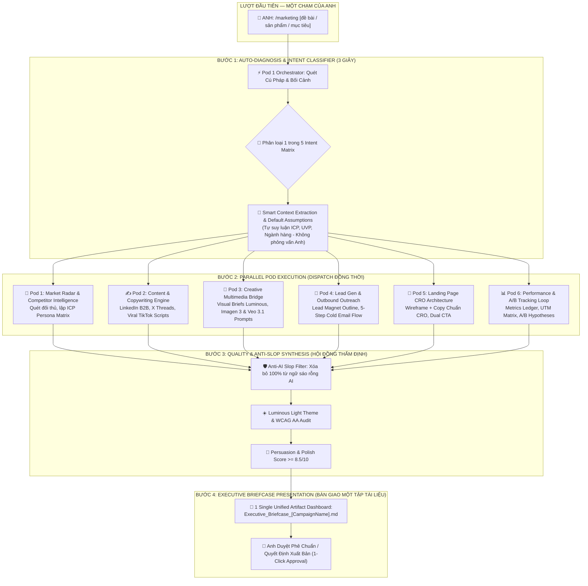
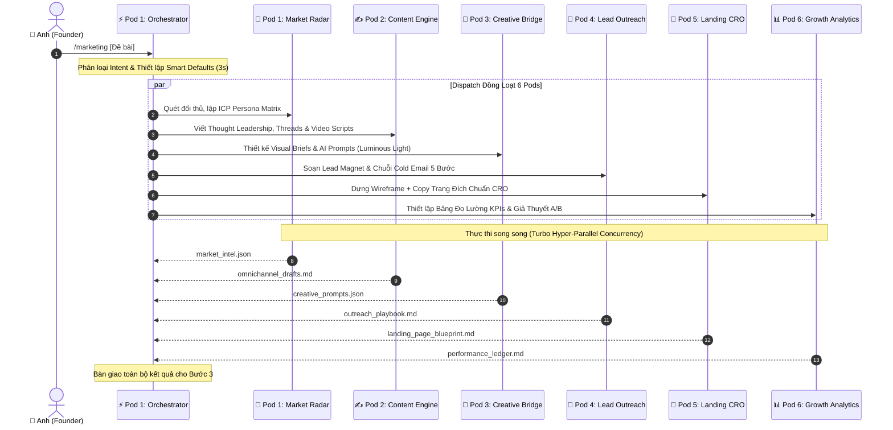

# ⚡ AUTONOMOUS MARKETING PIPELINE SPECIFICATION
## Quy Chuẩn Vận Hành Độc Bản Lệnh Một Chạm `/marketing` & Quy Trình 4 Bước Tự Động Hóa Toàn Hạm Đội

> **Chủ quản Tối cao (Supreme Owner & Founder)**: Anh — Lead Architect / Head of Growth / Founder  
> **Kiến trúc sư Điều hành (Orchestrator Architect)**: Em — Pod 1: Fleet Orchestrator & Slash Command Architect  
> **Cơ chế Điều hành Cốt lõi**: Giao thức Một Chạm Tối Giản (`Zero-Friction One-Touch Protocol`) qua lệnh `/marketing [đề bài / sản phẩm / mục tiêu]`.  
> **Nguyên tắc Tối thượng**: **KHÔNG BẮT ANH PHẢI TRẢ LỜI KHẢO SÁT RƯỜM RÀ (`Zero-Interview Invariant`)**. Tự động nhận diện ý định, phân bổ song song 6 Pods, thanh lọc rác AI và xuất trình 1 Executive Briefcase Dashboard duy nhất.

---

## 🧭 1. KIẾN TRÚC TỔNG QUAN LUỒNG ĐIỀU HÀNH 4 BƯỚC (END-TO-END WORKFLOW)

Khi Anh nhập lệnh:
```text
/marketing [đề bài / sản phẩm / mục tiêu / ý tưởng bất kỳ]
```

Toàn bộ Hạm đội Tác tử Tiếp thị & Tăng trưởng tự động khởi động một chu trình khép kín, chuẩn xác, không đòi hỏi Anh phải can thiệp thủ công cho đến khi nhận được bản thành phẩm cuối cùng:



---

## ⚡ 2. BƯỚC 1: AUTO-DIAGNOSIS & INTENT CLASSIFIER (KHÁM BỆNH & PHÂN LOẠI TRONG 3 GIÂY)

### 2.1. Ma Trận 5 Ý Định Tăng Trưởng Cốt Lõi (`The 5 Intent Archetypes`)
Hệ thống tự động đối soát nội dung sau từ khóa `/marketing` để phân loại ngay lập tức vào 1 trong 5 mẫu bài toán:

| Mã Ý Định (`Intent Code`) | Tên Chiến Dịch | Tín Hiệu Từ Khóa Nhận Diện | Trọng Tâm Điều Phối Hạm Đội |
| :--- | :--- | :--- | :--- |
| **`NEW_PRODUCT_LAUNCH`** | Ra Mắt Sản Phẩm Mới / GTM Toàn Diện | `ra mắt`, `launch`, `sản phẩm mới`, `GTM`, `new feature`, `mvp`, `release` | Kích hoạt tối đa 6 Pods: Từ nghiên cứu thị trường, định vị UVP, phễu ra mắt đến Landing Page và Event tracking. |
| **`B2B_LEAD_GEN`** | Tìm Kiếm Khách Hàng Tiềm Năng B2B | `lead`, `khách hàng B2B`, `outbound`, `cold email`, `săn khách`, `doanh nghiệp`, `prospecting` | Trọng tâm Pod 1 (ICP Target), Pod 4 (Cold Outreach & Lead Magnet), Pod 2 (Social Selling Scripts). |
| **`VIRAL_OMNICHANNEL_CONTENT`** | Sáng Tạo Nội Dung Đa Kênh & Lan Tỏa | `content`, `bài viết`, `linkedin`, `x/twitter`, `tiktok`, `viral`, `truyền thông`, `social media` | Trọng tâm Pod 2 (Thought Leadership, Thread, Short video scripts), Pod 3 (Visual Assets Prompts). |
| **`LANDING_PAGE_CRO`** | Dựng Phễu & Tối Ưu Chuyển Đổi Trang Đích | `landing page`, `trang đích`, `tăng chuyển đổi`, `cro`, `opt-in`, `sales page`, `funnel` | Trọng tâm Pod 5 (Copy & Wireframe chuẩn CRO), Pod 1 (Phân tích đối thủ), Pod 6 (A/B Test Hypotheses). |
| **`BRAND_REPOSITIONING_AUDIT`** | Tái Định Vị Thương Hiệu & Kiểm Toán Tăng Trưởng | `rebrand`, `đổi thương hiệu`, `audit`, `kiểm toán`, `tái cấu trúc marketing`, `chiến lược` | Trọng tâm Pod 1 (Competitor Gap Analysis), Pod 2 (New Brand Voice), Pod 6 (Unit Economics & Funnel Audit). |

### 2.2. Giao Thức Không Phỏng Vấn Rườm Rà (`Zero-Interview Protocol`)
- **Triết lý Bất biến**: Anh là Nhà sáng lập / Lãnh đạo cấp cao, thời gian của Anh là tài sản quý giá nhất. **CẤM TUYỆT ĐỐI** đặt câu hỏi kiểu: *"Sản phẩm của anh là gì? Đối tượng khách hàng là ai? Ngân sách của anh bao nhiêu? Điểm mạnh của anh là gì?"*.
- **Cơ chế Tự Suy Luận Thông Minh (`Smart Context Extraction & Inference Engine`)**:
  1. **Quét mã nguồn / Codebase hiện tại**: Tự động nhận diện domain của dự án (SaaS, FinTech, E-Commerce, Agency, AI Tool, Developer Platform...).
  2. **Tự thiết lập Giả định Tối ưu (`Smart Defaults`)**:
     - *Phân khúc ICP*: Tự xác định dựa trên tính năng sản phẩm (ví dụ: Tool B2B hướng tới CTO/Head of Growth; Ứng dụng F&B hướng tới Chủ nhà hàng/Quản lý chuỗi).
     - *Giá trị UVP Sơ bộ*: Tự tổng hợp từ giải pháp công nghệ vượt trội nhất của sản phẩm.
     - *Tone & Voice*: Tự gán phong cách: Chuyên nghiệp, Tự tin, Tinh gọn, Có căn cứ số liệu (`Authoritative, Crisp, Data-Backed`).
  3. **Xác nhận Ngầm 1 Dòng Duy Nhất (`Silent Confirmation Line`)**:
     Chỉ in ra đúng 1 dòng tóm tắt định hướng:  
     `🎯 [Auto-Diagnosed: NEW_PRODUCT_LAUNCH] Target: B2B Tech Founders | UVP: Giảm 80% thời gian ra kịch bản | Fleet Dispatching 6 Pods in Parallel...`

---

## 🚀 3. BƯỚC 2: PARALLEL POD EXECUTION (DISPATCH ĐỒNG THỜI 6 PODS SONG SONG)

Lead Orchestrator (Pod 1) tự động chia tách Work Packages và dispatch đồng thời tới 6 Pods. Mỗi Pod làm việc trên một nhánh nhiệm vụ độc lập, ghi nhận kết quả theo hợp đồng dữ liệu chuẩn:



### Chi Tiết Phân Phối Trách Nhiệm Từng Pod:
1. **`Pod 1: Market Radar & Competitor Intelligence`**:
   - Quét thị trường thực tế hoặc giả định phân khúc tương quan.
   - Bóc tách 2-3 đối thủ trực tiếp / gián tiếp và tìm ra khoảng trống thị trường (`Market White Space`).
   - Xuất bảng chân dung khách hàng lý tưởng (`ICP Matrix`) kèm các điểm đau buốt (`Burning Pain Points`).
2. **`Pod 2: Multi-Channel Content & Copywriting Engine`**:
   - 1 Bài viết LinkedIn Thought Leadership định vị vị thế chuyên gia (Authority B2B).
   - 1 Chuỗi X/Twitter Thread 5-7 tweets với hook giật nảy tâm lý và nhịp ngắt dòng thoáng đãng.
   - 2 Kịch bản Short-form Video (TikTok/Reels/Shorts) chuẩn 3 giây đầu giật khựng (`Pattern Interrupt`).
   - Áp dụng các framework kinh điển: PAS, AIDA, BAB, StoryBrand.
3. **`Pod 3: Creative Assets & Multimedia Production Bridge`**:
   - Visual Creative Brief cho Banner quảng cáo (tỷ lệ 1:1, 16:9, 9:16).
   - Prompt sinh ảnh Imagen 3 chuẩn giao diện sáng đa tầng (`Luminous Light Theme` - Warm Ivory, Alabaster, Elevated Glass, viền quang học, bóng đổ siêu mịn).
   - Prompt sinh video quảng cáo 5 giây cho Google Veo 3.1 qua CDP bridge.
4. **`Pod 4: Lead Gen & Outbound Outreach Funnel`**:
   - Ý tưởng và đề cương quà tặng mồi dẫn giá trị cao (`High-Value Lead Magnet`).
   - Chuỗi 5 Email tiếp cận lạnh (`Cold Outreach Sequence`):
     - Email 1: The Specific Observation (Quan sát cụ thể điểm đau).
     - Email 2: The Value Drop / Case Study (Dẫn chứng thành công).
     - Email 3: The Frictionless Question (Câu hỏi không ma sát).
     - Email 4: The Breakup with Value (Tạm biệt lịch sự kèm tài liệu hữu ích).
     - Email 5: The Re-engagement (Kích hoạt lại sau 14 ngày).
5. **`Pod 5: Landing Page CRO & Conversion Architecture`**:
   - Toàn văn Copywriting & Cấu trúc Wireframe từng khối (`Block-by-Block Architecture`):
     - Block 1: Hero Section (H1 Hook, Subhead, Dual CTA, Social Proof Bar).
     - Block 2: Problem Aggravation (Bóc tách nỗi đau hiện tại của khách hàng).
     - Block 3: Solution Showcase & Feature-to-Benefit Matrix (Tính năng quy ra Lợi ích thiết thực).
     - Block 4: Social Proof & Case Studies (Bảo chứng uy tín).
     - Block 5: Risk Reversal & Guarantee (Triệt tiêu rủi ro mua hàng).
     - Block 6: Objection-Handling FAQ (Giải tỏa khúc mắc).
     - Block 7: Final Sticky Call To Action (Chốt hạ chuyển đổi).
6. **`Pod 6: Performance Tracking & ROI Feedback Loop`**:
   - Bảng chỉ số mục tiêu (`Target KPIs`): CPC, CPL, CAC, Target Conversion Rate.
   - Kế hoạch UTM Tracking và cấu trúc phễu đo lường.
   - Ma trận 3 Giả thuyết Thử nghiệm A/B (`A/B Testing Matrix`).
   - Sổ cái Bằng chứng Nghiệm thu (`Evidence Ledger`).

---

## 🛡️ 4. BƯỚC 3: QUALITY & ANTI-SLOP SYNTHESIS (TỔNG HỢP & THANH LỌC RÁC AI)

Trước khi đóng gói đệ trình Anh, toàn bộ nội dung bắt buộc phải đi qua **Cổng Kiểm Duyệt Khắt Khe (`Adversarial Quality Gate`)**:

### 4.1. Bảng Từ Điển Cấm Rác AI (`The Anti-AI Slop Blacklist`)
Mọi nội dung có chứa các từ ngữ sau sẽ bị loại bỏ và viết lại ngay lập tức:

| Nhóm Từ Ngữ Rác AI Bị Cấm Tuyệt Đối | Nguyên Nhân Cấm | Giải Pháp Thay Thế Chuẩn Mực |
| :--- | :--- | :--- |
| `In today's fast-paced digital world...` | Mở bài sáo rỗng vô cảm, dấu hiệu nhận biết AI rõ rệt nhất. | Đi thẳng vào vấn đề bằng 1 số liệu nhức nhối hoặc 1 nghịch lý kinh doanh. |
| `Game-changer`, `Revolutionary`, `Cutting-edge` | Tự xưng vô căn cứ, làm giảm độ uy tín thương hiệu. | Dùng bằng chứng kỹ thuật: "Giảm 68% chi phí vận hành", "Xử lý trong 120ms". |
| `Unleash`, `Delve into`, `Harness the power` | Từ vựng dịch máy khuôn mẫu của các LLM sơ cấp. | Dùng động từ hành động cụ thể: "Tự động hóa", "Cắt giảm", "Khai thác". |
| `A testament to...`, `Beacon of innovation` | Lời văn ca tụng rỗng tuếch, xa rời tâm lý khách hàng. | Dẫn lời nhận xét chân thực từ người dùng hoặc case study thực tế. |
| `Look no further!`, `Are you ready to...?` | Giọng điệu bán hàng chèo kéo thế kỷ trước. | Đặt câu hỏi kích thích tư duy hoặc đưa ra đề xuất hợp tác bình đẳng. |

### 4.2. Kiểm Toán Thẩm Mỹ & Trải Nghiệm Chuẩn Sáng (`Luminous Light Standard`)
- Đảm bảo 100% tài sản hình ảnh và gợi ý thiết kế tuân thủ **Luminous Light Theme Invariant**:
  - Nền Canvas: Sáng ấm (`Warm Paper #FAF9F6`, `Ivory #FDFBF7`, `Alabaster #F8F9FA`).
  - Thẻ bề mặt: Trắng sứ nhô cao (`Pure White #FFFFFF`), viền quang học siêu mảnh (`rgba(0,0,0,0.06)`).
  - Tương phản văn bản đạt chuẩn WCAG AA ($\ge 4.5:1$ đối với body text, $\ge 3:1$ đối với large text).
  - Tuyệt đối không để lọt giao diện Dark Theme trừ khi có chỉ thị riêng từ Anh.

---

## 💼 5. BƯỚC 4: EXECUTIVE BRIEFCASE PRESENTATION (BÀN GIAO CHIẾC CẶP GIÁM ĐỐC)

Hệ thống **KHÔNG XUẤT RỜI RẠC** hàng chục file nhỏ gây rối mắt Anh. Thay vào đó, toàn bộ sản phẩm của 6 Pods được đúc kết thành **ĐÚNG 1 ARTIFACT DASHBOARD DUY NHẤT**:

### 5.1. Định Danh & Vị Trí Lưu Trữ
- **Tên tệp**: `Executive_Briefcase_[CampaignName].md` (hoặc hiển thị trực quan dạng Markdown Artifact).
- **Vị trí**: Được nạp thẳng vào khu vực Artifact của phiên làm việc để Anh xem toàn màn hình hoặc duyệt từng mục.

### 5.2. Cấu Trúc Khung Chiếc Cặp Giám Đốc (`Executive Briefcase Architecture`)
Chiếc cặp gồm 6 Phần tương tác rành mạch:

```text
========================================================================================
💼 CHIẾC CẶP GIÁM ĐỐC TĂNG TRƯỞNG: [TÊN CHIẾN DỊCH / SẢN PHẨM CỦA ANH]
========================================================================================
🎯 MỤC TIÊU: [Mục tiêu cốt lõi] | ⏱️ THỜI GIAN TRIỂN KHAI: 7 - 14 Ngày | 📈 CHỈ SỐ KỲ VỌNG: [CAC / Lead / ROAS]

[PHẦN 1] 🔭 TÌNH BÁO THỊ TRƯỜNG & CHÂN DUNG KHÁCH HÀNG (ICP & COMPETITORS)
├── 3 Điểm Khác Biệt Độc Tôn (UVP)
├── Chân Dung Khách Hàng Mục Tiêu (ICP Profile & Burning Pains)
└── Phân Tích 2 Đối Thủ Trực Tiếp & Khoảng Trống Thị Trường (White Space)

[PHẦN 2] ✍️ KHO NỘI DUNG ĐA KÊNH SẴN SÀNG ĐĂNG TẢI (READY-TO-POST CONTENT)
├── Bài Viết LinkedIn B2B Thought Leadership (Kèm Hook & CTA)
├── Chuỗi X/Twitter Thread (5-7 Tweets ngắt dòng chuẩn nhịp)
└── 2 Kịch Bản Video Ngắn (TikTok / Reels 30s kèm Visual Action Notes)

[PHẦN 3] 🎨 BẢN ĐẶC TẢ TƯ LIỆU THỊ GIÁC (CREATIVE & MULTIMEDIA BRIEFS)
├── Prompt Sinh Ảnh Banner Luminous (Imagen 3 Ready)
├── Prompt Sinh Video Quảng Cáo 5s (Google Veo 3.1 Ready)
└── Bảng Quy Chuẩn Thiết Kế & Bố Cục Thẩm Mỹ (Luminous Light Standard)

[PHẦN 4] 🎯 KỊCH BẢN TIẾP CẬN & PHỄU THU HÚT KHÁCH HÀNG (OUTBOUND & LEAD MAGNET)
├── Bản Thiết Kế Quà Tặng Mồi Dẫn (Lead Magnet Architecture)
└── Trọn Bộ Chuỗi 5 Email Tiếp Cận Lạnh (Cold Outreach Sequence - Tỷ lệ phản hồi cao)

[PHẦN 5] 💎 THIẾT KẾ & TOÀN VĂN TRANG ĐÍCH CHUYỂN ĐỔI CAO (LANDING PAGE CRO BLUEPRINT)
├── Hero Section: Tiêu đề H1, Subhead, Nút Kêu Gọi Kép (Dual CTA), Social Proof
├── Ma Trận Lợi Ích & Bằng Chứng Bảo Chứng Xã Hội
├── Khối Xử Lý Khúc Mắc & Câu Hỏi Thường Gặp (Objection-Handling FAQ)
└── Danh Mục Kiểm Tra 24 Điểm Chuyển Đổi (CRO Checklist)

[PHẦN 6] 📊 BẢNG ĐO LƯỜNG HIỆU SUẤT & KẾ HOẠCH HÀNH ĐỘNG 7 NGÀY (ACTION PLAN & KPIS)
├── Bảng Chỉ Số Đo Lường Chính (KPIs & Target Conversion Rates)
├── Ma Trận 3 Giả Thuyết Thử Nghiệm A/B (A/B Testing Matrix)
└── Sổ Cái Bằng Chứng Nghiệm Thu (Evidence Ledger)
========================================================================================
```

### 5.3. Cổng Phê Chuẩn Của Anh (`Human-In-The-Loop PO Gate`)
Tại cuối Executive Briefcase, Em đệ trình 3 lựa chọn hành động một chạm để Anh quyết định:
1. **[Lựa chọn 1 — Triển khai Toàn diện (`Deploy All`)]**: Xuất bản nội dung, dựng landing page trực tiếp vào mã nguồn, nạp kịch bản email vào hệ thống gửi.
2. **[Lựa chọn 2 — Tinh chỉnh Chuyên sâu (`Refine Pod X`)]**: Chỉ thị tập trung viết lại copy kênh cụ thể hoặc đổi góc tiếp cận mồi dẫn.
3. **[Lựa chọn 3 — Thử nghiệm A/B Thu nhỏ (`Pilot Run`)]**: Chạy thử nghiệm quy mô nhỏ trên 1 kênh đơn lẻ (ví dụ: Test chuỗi Cold Email trên 50 prospects).

---

## 🛠️ 6. BỘ VÍ DỤ MẪU THỰC CHIẾN (REAL-WORLD BATTLE EXAMPLES)

### 📌 Ví Dụ 1: Ra Mắt Sản Phẩm Mới (SaaS AI)
- **Lệnh của Anh**:
  ```text
  /marketing Ra mắt công cụ Antigravity AI Code Reviewer tự động tìm lỗi bảo mật cho team Golang
  ```
- **Hệ thống tự động thực thi**:
  - `Intent`: `NEW_PRODUCT_LAUNCH`.
  - `Smart Defaults`: Target: VP of Engineering, Lead Golang Devs. Burning Pain: Lỗi memory leak, race conditions và lỗ hổng SQLi lọt qua CI/CD.
  - `Fleet Execution`: Kích hoạt đồng thời 6 Pods.
  - `Sản phẩm bàn giao`: Chiếc Cặp Giám Đốc gồm bài LinkedIn bóc tách vụ hack điển hình vì race condition, chuỗi Cold Email gửi đến 100 Engineering Managers, bản sao Landing Page với Hero Section nhấn mạnh "Zero False Positives", và bộ prompt banner visual phong cách Luminous Light.

### 📌 Ví Dụ 2: Tìm Kiếm Khách Hàng Tiềm Năng B2B
- **Lệnh của Anh**:
  ```text
  /marketing Tìm 20 khách hàng doanh nghiệp F&B dùng phần mềm SmartMarket quản lý quầy bếp KDS
  ```
- **Hệ thống tự động thực thi**:
  - `Intent`: `B2B_LEAD_GEN`.
  - `Smart Defaults`: Target: Chủ nhà hàng chuỗi, Giám đốc Vận hành F&B. Burning Pain: Cháy vé order giờ cao điểm, thất thoát món ăn, nhân viên bếp cãi nhau.
  - `Fleet Execution`: Pod 1 lập chân dung chủ chuỗi từ 3 chi nhánh; Pod 4 viết kịch bản 5 email "Làm sao giảm 4 phút mỗi món giờ cao điểm"; Pod 2 viết bài Case Study tăng 28% doanh thu bàn xoay vòng.

### 📌 Ví Dụ 3: Sáng Tạo Nội Dung Viral Ngắn
- **Lệnh của Anh**:
  ```text
  /marketing Viết chuỗi bài viral về bí kíp dùng AI Agent thay thế 80% công việc lập trình thủ công
  ```
- **Hệ thống tự động thực thi**:
  - `Intent`: `VIRAL_OMNICHANNEL_CONTENT`.
  - `Smart Defaults`: Target: Tech Leads, Solo Founders, AI Enthusiasts.
  - `Fleet Execution`: Pod 2 sản xuất 1 bài LinkedIn Thought Leadership dài 800 từ, 1 Twitter Thread 7 bài giật hook "Đừng học gõ code nữa, hãy học cách điều hành bầy Agent", 2 kịch bản TikTok/Reels 30s với ghi chú hành động ngón tay giật màn hình.

---

## 📜 7. KỶ LUẬT NGHIỆM THU VĨNH CỬU (OPERATIONAL INVARIANTS)

1. **Tuyệt đối tôn trọng quyền làm chủ của Anh**: Em là cánh tay điều hành, Anh là người quyết định cuối cùng.
2. **Quy chuẩn Luminous Light Theme**: Mọi giao diện, màu sắc được đề xuất luôn là nền sáng đa tầng cao cấp, không dùng dark theme.
3. **Kỷ luật Song ngữ**: Luôn tuân thủ định dạng `English (Tiếng Việt)` trong mọi trao đổi kỹ thuật.
4. **Không để sót rác AI**: Mọi văn bản xuất xưởng đều phải đạt điểm chất lượng và độ thuyết phục $\ge 8.5/10$.
