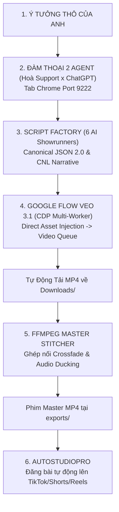

# SCRIPT FACTORY PRO & HOÀ SUPPORT — MASTER ARCHITECTURE SPECIFICATION

Hệ thống **Script Factory Pro** là hệ sinh thái tự động hóa sản xuất điện ảnh và video AI khép kín chuẩn công nghiệp, kết hợp cùng **Hoà Support** (Senior AI Pair-Programmer & System Co-Pilot).

---

## 🗺️ 1. BẢN ĐỒ TỌA ĐỘ VÀ CỔNG DỊCH VỤ (PORT & DIRECTORY TOPOLOGY)

| Thành Phần | Đường Dẫn Trên Ổ Đĩa | Cổng & Giao Thức | Chức Năng Cốt Lõi |
| :--- | :--- | :--- | :--- |
| **Hoà Support Master Hub** | `C:\Users\game\cdp_reader\` | `http://localhost:3005` | API Gateway, Quản lý Micro-Skills, CDP Multi-Worker Controller & Web Deck |
| **Script Factory App** | `C:\Users\game\Documents\app\script factory final\` | `http://localhost:5180` | Xưởng kịch bản độc lập (React/Vite), Story Engine 3.0 |
| **Script Factory Studio 02** | `C:\Users\game\Documents\app\SCRIPT_FACTORY_PRO_ECOSYSTEM\02_SCRIPT_FACTORY_STUDIO\` | `http://localhost:5173` | Studio sản xuất chính, Candidate Pool, Character Vault, Auto-Pilot Modal |
| **9Router Local AI** | Dịch vụ Local Gateway | `http://localhost:20127` | Điều phối LLM (`ag/gemini-3.7-flash` & `ag/gemini-3.7-flash-thinking`) |
| **Chrome Profile 1** | Chrome User Data 1 | `127.0.0.1:9222` (CDP) | Chạy Google Flow Worker 1 + Tab ChatGPT (`chatgpt.com`) |
| **Chrome Profile 2** | Chrome User Data 2 | `127.0.0.1:9223` (CDP) | Chạy Google Flow Worker 2 (San tải render song song) |
| **Kho Video Tải Về** | `C:\Users\game\Downloads\` | Filesystem | Chứa các clip `.mp4` do Google Flow tự động tải xuống |
| **Kho Phim Master** | `C:\Users\game\Documents\app\script factory final\exports\` | Filesystem | Chứa các phim `.mp4` đã được FFmpeg ghép hoàn chỉnh |
| **AutoStudioPro** | `C:\Users\game\Downloads\AutoStudioPro\AutoStudioPro\` | `jobs.db` / Python | Tự động xuất bản đa nền tảng (TikTok, YouTube Shorts, Facebook Reels) |
| **1-Click Launcher** | `C:\Users\game\Desktop\KHOI_DONG_HOA_SUPPORT_PRO.bat` | Batch Script | Khởi động toàn bộ các dịch vụ bằng 1 cú click |

---

## 🎬 2. QUY TRÌNH SẢN XUẤT 5 BƯỚC KHÉP KÍN (END-TO-END WORKFLOW)

---

## 👥 3. ĐỘI NGŨ 6 AI SHOWRUNNER (WRITERS ROOM ENGINE)

1. **Episode DNA Compiler**: Thiết kế bộ gen câu chuyện (11 trục tự sự CNL, Lời hứa khán giả, Cú đền đáp, Vân tay phong cách).
2. **Hollywood Showrunner**: Đạo diễn cấu trúc nhịp điệu (Co ↔ Giãn nhịp thở), mạch nhân quả liền mạch và loại bỏ 100% cảnh chiến tranh/bạo lực sáo rỗng.
3. **Character & World Builder**: Thiết kế Identity Asset (Nhân vật `SUB`, Đạo cụ `PROP`, Bối cảnh `ENV`) chuẩn Studio `#1a1a1a`.
4. **Dialogue & Audio Architect**: Biên kịch lời thoại theo Voice Policy (Hybrid, VoiceOver, Silent 4s, Dialogue), đồng bộ lip-sync và âm hưởng không gian.
5. **Cinematographer**: Chỉ đạo camera điện ảnh (Arri Alexa 65, lens 24mm/35mm/50mm/85mm, Caravaggio Chiaroscuro lighting, 24fps motion blur).
6. **Script Doctor & Canonical Packager**: Khám bệnh kịch bản, ép chuẩn **Zero-Text Cinema Lock**, **Speaker Binding**, và đóng gói **Canonical JSON Schema 2.0**.

---

## 🎙️ 4. QUY TẮC THÉP VỀ CHẾ ĐỘ ÂM THANH (VOICE POLICIES)

| Chế độ | Thời lượng Scene | Tham chiếu Slots | Hành vi âm thanh |
| :--- | :--- | :--- | :--- |
| **🎬 Hybrid (Mặc định)** | Scene 1 = **4.0s** Scene 2..N = **6s hoặc 8s** | Scene 1 = **0 slots** (Text-to-Video) Scene 2..N = **Tối đa 3 slots** | Scene 1 `AmbientOnly` giữ chân 3s đầu, các scene sau `VoiceOver`/`Dialogue`. |
| **🎙️ VoiceOver** | **6.0s hoặc 8.0s** | **Tối đa 3 slots** (`SUB_01`, `PROP_01`, `ENV_01`) | 100% scene có lời dẫn chuyện điện ảnh sâu sắc. |
| **🤫 Silent (AmbientOnly)** | **Cố định đúng 4.0s** (CẤM 6s/8s) | **Khóa cứng 0 slots** (`resolved_reference_ids = []`) | 100% scene không lời thoại, Text-to-Video thuần túy, cảnh quan ASMR/xúc giác. |
| **💬 Dialogue** | **6.0s hoặc 8.0s** | **Tối đa 3 slots** + Speaker Binding | Nhân vật đối thoại trực tiếp, khóa chuyển động môi nhân vật đang nói. |

### 4.1. Động Cơ Lồng Tiếng Tự Động (Gemini Native Voiceover Engine)
- **Module thực thi**: [`gemini_voiceover_engine.py`](file:///C:/Users/game/.gemini/config/skills/script-factory-pro/scripts/gemini_voiceover_engine.py).
- **Nguồn cấp**: Google Gemini API (`models/gemini-2.5-flash-preview-tts`), sử dụng khóa `GEMINI_API_KEY` trong `.env.local`.
- **Speaker Binding Matrix**:
  * `narrator`: Giọng `Puck` (Nam ấm áp) hoặc `Aoede` (Nữ truyền cảm).
  * `female`: Giọng `Kore` (Dịu dàng, thanh lịch).
  * `authoritative`: Giọng `Charon` (Trầm ấm, đĩnh đạc).
  * `energetic`: Giọng `Fenrir` (Mạnh mẽ, năng động).
- **Đầu ra**: Tự động xuất từng file WAV 24kHz cho mỗi phân cảnh + file `scene_durations.json` ghi nhận thời lượng chính xác để điều phối thời lượng render Veo 3.1 và đưa vào dòng thời gian CapCut qua `arcreel`.

---

## 🧬 5. CƠ CHẾ ĐỒNG NHẤT SERIES (SERIES ASSET CONTINUITY & DIRECT INJECTION)

1. **Kho Nhân Vật Vũ Trụ (Persistent Character Vault)**:
   - Nhân vật chỉ cần tạo/tải ảnh chân dung studio chuẩn **ĐÚNG 1 LẦN** tại Ep 1 (`master_image_base64`).
2. **Kế Thừa Series Tự Động (Series Inheritance Contract)**:
   - Khi bấm **"Tạo Tập Tiếp Theo"** (Ep 2, Ep 3...), `WritersRoomEngine` tự động kế thừa `SUB_01` (Naru) và `ENV_01` từ Ep 1, đính kèm `master_image_base64` và `skip_generation: true` vào JSON gửi sang Flow.
3. **Cơ Chế Bỏ Qua Vẽ Lại Trên Google Flow Tool Builder**:
   - Tool `Batch video final` nhận diện `source === "pre_rendered"` ➔ Tự động gọi `Flow.upload({ base64: cleanBase64 })` nạp thẳng vào khay `referenceImageMediaIds`.
   - **BỎ QUA HOÀN TOÀN** bước gọi AI vẽ lại bằng Nano Banana Pro (`Flow.generate.image()`) ➔ **100% nhân vật ở Ep 2 giữ nguyên vẹn gương mặt của Ep 1!**

---

## 🛡️ 6. BỘ GIÁM SÁT DUAL-LAYER CDP VÀ TỰ PHỤC HỒI RENDER

1. **Layer 1 (React Fiber Inspector)**: Trích xuất trực tiếp `stateNode` từ Fiber DOM để theo dõi tiến độ từng scene.
2. **Layer 2 (DOM Cards Fallback)**: Quét mảng các thẻ video, kiểm tra `video.duration > 0` và nút `DOWNLOAD CLIP` để tính `doneCount` ngay cả khi React Fiber bị unmount.
---

## 🔒 7. BỘ QUY TẮC KHÓA CỨNG BATCH VIDEO VEO 3.1 (GOLDEN ARCHITECTURAL INVARIANTS)

Module `04_GOOGLE_FLOW_APPLET_SOURCE/batch_video_final/` đã đạt trạng thái **GOLDEN PRODUCTION RELEASE (Kiểm chứng 100% qua CDP)**. Mọi phiên làm việc trong tương lai **TUYỆT ĐỐI KHÔNG ĐƯỢC THAY ĐỔI** 8 quy tắc sau:

1. **Zero-Text Cinema Enforcement**: Mọi prompt video bắt buộc có tiền tố: `[ZERO-TEXT CINEMA ENFORCEMENT: STRICTLY NO SUBTITLES. NO CAPTIONS. NO ON-SCREEN TEXT. NO WATERMARKS. SPOKEN AUDIO ONLY. PURE RAW FILM FOOTAGE.]`.
2. **Camera Intelligence Engine (`extractCameraDirectorSpecs`)**: Tự động trích xuất Cỡ cảnh, Góc máy, Chuyển động và Cú pháp Multi-Shot (`[CAMERA CHOREOGRAPHY: ...]`) gắn lên đầu Prompt.
3. **Profile Âm Thanh Phòng Thu Khô (`ACOUSTICS: DRY CLOSE-MIC`)**: Dialogue bắt buộc mang `[ACOUSTICS: DRY CLOSE-MIC VOCALS. Zero cavern reverb, zero echo, crisp intimate speech.]` để triệt tiêu tiếng vang dội của hang động.
4. **Cách Ly Độc Quyền Người Nói & Khóa Môi Người Nghe (`Dialogue Single-Speaker Isolation`)**: Nhân vật nói mang `Spoken ONLY by "Name" with synchronous mouth movement`, tất cả người còn lại mang `[SILENT LISTENER] Name MUST keep mouth FIRMLY CLOSED`.
5. **Khóa Môi VoiceOver Bằng Góc Máy Sau Lưng (`VoiceOver Silhouette Lock`)**: VoiceOver mang `[AUDIO: NON-DIEGETIC NARRATOR VOICEOVER]` + `[LIP LOCK: ALL CHARACTERS KEEP MOUTHS CLOSED]`, visual action bắt buộc dùng góc quay Over-The-Shoulder từ sau lưng / bóng nghiêng.
6. **Khóa Cứng Chế Độ Câm (`Silent Mode Lock`)**: Cảnh Silent bắt buộc mang `[AUDIO: PURE DIEGETIC SOUND EFFECTS ONLY] STRICTLY ZERO SPEECH. NO VOICES. NO SPOKEN WORDS. NO DIALOGUE. ALL ACTORS REMAIN SILENT.` để ngăn Veo 3.1 sinh tiếng Anh lảm nhảm.
7. **Làm Sạch Dấu Chấm Lửng (`cleanSpokenWords`)**: Tự động chuyển toàn bộ dấu `...` thành dấu phẩy `, ` để triệt tiêu triệt để các âm ngập ngừng phụ ("ah", "um", mumble).
8. **Tri-Asset Reference Packing**: Nạp tối đa 3 asset theo thứ tự ưu tiên: `SUB_01` -> `SUB_02` -> `ENV_01` / `PROP_01` (hoặc trực tiếp theo `reference_plan.resolved_reference_ids`).
9. **Google Flow Autonomous Closed-Loop Law (Quy chuẩn 3 bước tự động qua Prompt Builder)**: 
   - Google Flow Tool Builder hoạt động trên Cloud và **CHỈ NHẬN THAY ĐỔI QUA PROMPT BUILDER** hoặc tab "Mã", tuyệt đối không tự động đồng bộ từ code local.
   - Khi Anh giao lệnh sửa code Flow:
     - **Bước 1**: Tự động gửi Prompt chuẩn vào Prompt Builder ("Trình tạo công cụ") qua kết nối CDP cổng 9222/9223.
     - **Bước 2**: Giám sát và đợi AI của Tool Builder hoàn tất chỉnh sửa mã nguồn trên Cloud.
     - **Bước 3**: Tự động chuyển sang tab "Mã", trích xuất code live và review đối soát nghiêm ngặt đúng phạm vi yêu cầu (In-Scope Code Review), bảo đảm không phát sinh lỗi hồi quy trước khi báo cáo kết quả.
10. **Khóa Cứng Model 0-Credit Ultra Cho Video (`Veo 3.1 - Lite [Lower Priority]`)**:
   - Toàn bộ hệ thống Script Factory Pro, Applet Tool Builder và JSON kịch bản bắt buộc đặt mặc định cứng 100% model: **`Veo 3.1 - Lite [Lower Priority]`** (định danh host: `veo_3_1_lite_low_priority`).
   - Đảm bảo tài khoản Ultra render video không giới hạn credit, tuyệt đối tránh hiện tượng hết hạn ngạch trả phí dẫn đến máy chủ Google Flow âm thầm treo request vĩnh viễn (`Silent Hanging Promise`).
   - Hàm `mapModelToCanonical` bắt buộc luôn trả về `'Veo 3.1 - Lite [Lower Priority]'`.

---

*(Tài liệu chuẩn hóa kiến trúc được lưu trữ tự động trong hệ thống Customization Skills của Antigravity).*

