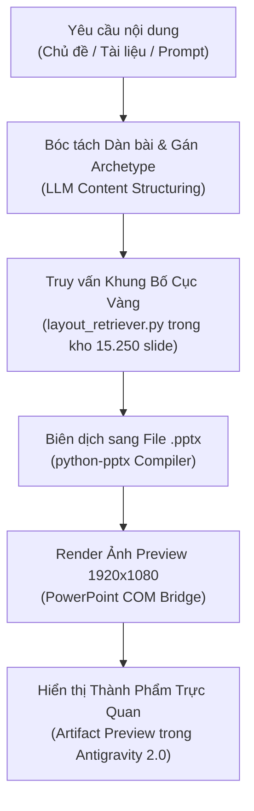

# Antigravity 2.0 Slide Architect — Cẩm Nang Kỹ Năng & Cỗ Máy Sinh Slide Độc Bản

> **Phiên bản**: v2.0 Enterprise Release  
> **Động cơ cốt lõi**: `AI Slide Dataset Factory Engine`  
> **Nguồn tri thức**: 15.250 slide mẫu, 596 decks PPTX, 128.173 phần tử hình học bóc tách  
> **Đường dẫn thư viện**: `C:\Users\game\.gemini\antigravity\scratch\ai-slide-dataset-factory\`

---

## 1. Bản Chất Kiến Trúc & Giá Trị Đột Phá (Architectural Essence)

Kỹ năng này nâng cấp Antigravity 2.0 từ một trợ lý viết code thông thường thành **Giám Đốc Thiết Kế Trình Chiếu (Presentation Art Director & Compiler)**:
* **Xóa bỏ hoàn toàn "Ảo giác bố cục" (`Zero Spatial Hallucination`)**: Không bao giờ đoán mò tọa độ hay để chữ đè lên nhau. Mọi bố cục đều kế thừa trực tiếp từ các khung tọa độ vàng (`Golden Grid Coordinates`) của các nhà thiết kế chuyên nghiệp trong kho dữ liệu.
* **Tự động phân loại 9 nguyên mẫu slide (`9 Semantic Archetypes`)**:
  1. `Cover / Title Slide`: Bìa mở đầu ấn tượng, căn lề chuẩn 16:9.
  2. `Infographic / Multi-Card Grid`: Bố cục chia khối thẻ, icon, quy trình (chiếm 6.715 mẫu).
  3. `Minimal / Statement`: Thông điệp chủ đạo, trích dẫn lãnh đạo hoặc số liệu điểm nhấn.
  4. `Team / People`: Giới thiệu ban lãnh đạo, nhân sự, cố vấn.
  5. `Financial / Pricing`: Bảng giá 3 cột, cơ cấu doanh thu, dự toán chi phí.
  6. `Roadmap / Timeline`: Lộ trình phát triển 4-5 giai đoạn.
  7. `Agenda / Table of Contents`: Mục lục phân cấp, lịch trình hội thảo.
  8. `Content / Multi-Column`: Trình bày nội dung so sánh 2-3 cột song song.
  9. `Ending / Thank You`: Trang kết thúc, thông tin liên hệ, Q&A.

---

## 2. Quy Trình Vận Hành 3 Bước Khép Kín (Execution Runbook)

Khi Anh hoặc người dùng yêu cầu tạo slide:



### Bước 1: Bóc tách Nội Dung & Gán Nhãn Ngữ Nghĩa
* Phân tích yêu cầu thành các slide cụ thể: Tiêu đề (`Title`), Phụ đề (`Subtitle`), và danh sách các luận điểm chính (`Bullets / Cards`).
* Chọn nguyên mẫu phù hợp (`Cover`, `Infographic`, `Roadmap`, `Team`,...).

### Bước 2: Truy vấn Bố Cục Chuẩn từ Kho Tri Thức
* Kích hoạt script:
  ```powershell
  python C:\Users\game\.gemini\antigravity\scratch\ai-slide-dataset-factory\layout_retriever.py
  ```
* Script tự động tìm mẫu có số lượng thẻ bài tương ứng và trích xuất tọa độ Bounding Box pixel `1920x1080` chuẩn xác.

### Bước 3: Biên dịch & Xuất Bản Khép Kín
* Tạo file `.pptx` nguyên bản tại thư mục scratch của dự án.
* Tự động gọi `slide_renderer.py` để xuất ảnh PNG độ phân giải cao và nhúng vào Artifact cho Anh xem ngay tại chỗ.

---

## 3. Các Quy Tắc Thẩm Mỹ Bất Biến (Design Invariants)

1. **Light Theme Mặc Định 100%**: Luôn ưu tiên nền sáng (trắng tinh khiết `#FFFFFF`, xám nhạt `#F8FAFC`, be kem `#FDFBF7`) với chữ màu xanh thẫm `#1E293B` hoặc đen than `#0F172A`. Tuyệt đối không tự ý làm nền đen trừ khi Anh yêu cầu.
2. **Độ tương phản WCAG AA**: Mọi văn bản phải đảm bảo tỷ lệ tương phản tối thiểu $4.5:1$ so với màu nền.
3. **Quy tắc An toàn Không Tràn Lề**: Mọi khối nội dung cách mép màn hình tối thiểu 5% chiều rộng (`safe margin > 0.05`).
