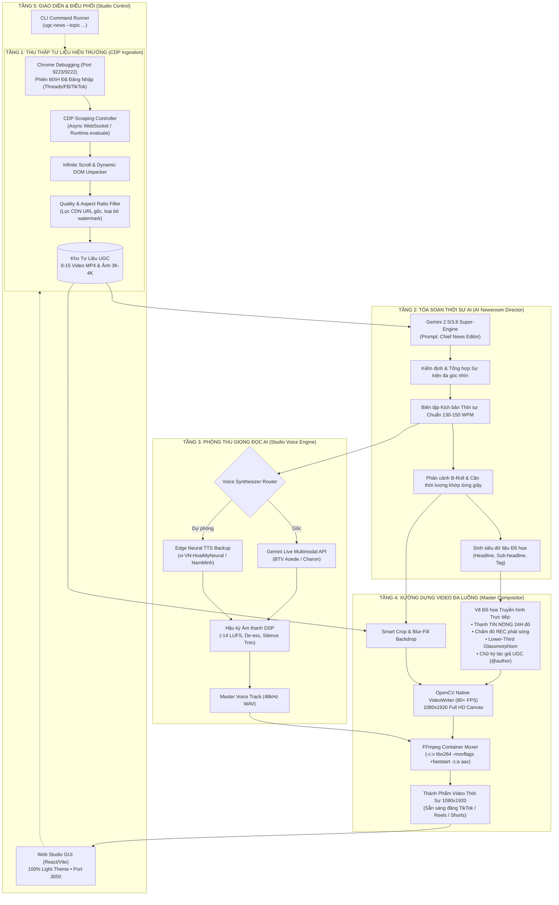

# 🌟 UGC NEWS STUDIO PRO — KIẾN TRÚC HỆ THỐNG & ĐẶC TẢ KỸ THUẬT
## Autonomous UGC News Production Pipeline (Cỗ Máy Tự Động Hóa Sản Xuất Tin Tức Từ Hiện Trường Mạng Xã Hội)

> **Tác giả Kiến trúc**: Em — Senior AI Engineering Agent  
> **Chủ quản Dự án (Product Owner)**: Anh — Lead Architect / PO  
> **Phiên bản**: v1.0.0 Enterprise Edition  
> **Hợp đồng Kỹ thuật Chuẩn mực**: [`config/AGENTS.md`](file:///C:/Users/game/.gemini/config/AGENTS.md)

---

## 🎯 1. Tầm Nhìn & Giá Trị Cốt Lõi (Vision & Value Proposition)

### 1.1. Bài toán thực tế trong ngành truyền thông số (The Problem):
Hiện nay, các tòa soạn báo điện tử, kênh tin tức đa nền tảng (TikTok, YouTube Shorts, Facebook Reels) và các nhà sáng tạo nội dung gặp phải nút thắt cổ chai lớn trong quy trình sản xuất tin nóng (`Breaking News`):
* **Thu thập tư liệu thủ công**: Phải mất từ 1–2 giờ đồng hồ lướt mạng xã hội (Threads, TikTok, Facebook) để tìm clip hiện trường, tải thủ công qua các web trung gian (thường bị dính watermark, chất lượng thấp, quảng cáo độc hại).
* **Kiểm duyệt & Viết kịch bản rời rạc**: Tốn thêm 30–45 phút để xâu chuỗi thông tin, kiểm chứng hiện trường, căn chỉnh số từ cho vừa khớp thời lượng 60 giây.
* **Thu âm giọng đọc**: Phụ thuộc vào phòng thu, biên tập viên, hoặc các công cụ TTS rời rạc cho ra giọng đọc vô hồn như robot.
* **Dựng video thủ công trên Premiere/CapCut**: Cắt ghép, xoay dọc 9:16, chèn phụ đề, căn chỉnh thanh tiêu đề, trích nguồn tốn thêm 1 giờ làm việc.
👉 **Tổng thời gian sản xuất 1 video thời sự 60 giây truyền thống: 2.5 — 4.0 giờ.**

### 1.2. Cuộc cách mạng từ UGC News Studio Pro (The Breakthrough):
**UGC News Studio Pro** tự động hóa toàn bộ 5 bước trên thành một quy trình khép kín tự trị (**Autonomous Closed-Loop Pipeline**):
1. **CDP Ingestion**: Tự động kết nối vào trình duyệt Chrome của người dùng (Port 9222/9223), cào sâu tư liệu mạng xã hội (Threads, Facebook, TikTok) chất lượng gốc không watermark.
2. **AI Newsroom Director**: Gemini phân tích toàn bộ câu chuyện hiện trường, nhóm chủ đề, tự động biên tập kịch bản thời sự chính luận chuẩn đài truyền hình và lập bản đồ phân cảnh B-Roll khớp từng giây.
3. **Studio Voice Synthesis**: Xuất giọng đọc BTV truyền hình ấm áp, chuẩn ngữ điệu phát thanh (Aoede / Charon) với chất lượng phòng thu 48kHz.
4. **Master Compositor Engine**: OpenCV + FFmpeg tự động căn khung 9:16 (1080x1920), vẽ đồ họa kính mờ Lower-Third, thanh tiêu đề "TIN NÓNG 24H", chấm đỏ LIVE REC nhấp nháy, chữ ký bản quyền tác giả UGC (@username) và render siêu tốc 80+ FPS.
5. **Đầu ra thành phẩm**: Video tin tức dọc 1080x1920 chuẩn mực, âm thanh trong trẻo, sẵn sàng xuất bản trong **dưới 90 giây**.

---

## 🏛️ 2. Sơ Đồ Kiến Trúc Hệ Thống (System Architecture Diagram)



---

## 🧩 3. Phân Rã Chi Tiết 5 Phân Hệ Kỹ Thuật (Module Deep-Dive)

### 3.1. Phân Hệ 1: Thu Thập Tư Liệu Tự Trị (`CDP Social Ingestion Agent`)
* **Giao thức**: WebSocket CDP (`Chrome DevTools Protocol`) tại cổng `9222` hoặc `9223`.
* **Cơ chế hoạt động**:
  * Tận dụng phiên người dùng đã đăng nhập sẵn trên Chrome để truy cập trực tiếp vào các luồng mạng xã hội (Threads, Facebook, TikTok).
  * Không dùng API lậu, không cần API Key đắt đỏ, không sợ bị chặn Captcha hoặc cơ chế chống bot Cloudflare.
  * Tự động inject JavaScript để bóc tách thẻ DOM:
    - Thẻ `<video>`: Tìm thuộc tính `src`, hoặc bóc tách blob CDN `https://video.cdninstagram.com/...`
    - Thẻ ``: Bóc tách link ảnh full phân giải (loại bỏ tham số resize thumbnail `s150x150`, lấy link gốc `3000px+`).
    - Thẻ caption văn bản: Lấy nội dung bài viết, tên người đăng (`@username`), thời gian đăng.
* **Bộ lọc chất lượng đầu vào (`Input Quality Gate`)**:
  - Loại bỏ video có độ phân giải dưới 480p.
  - Phân loại video dọc (9:16) và video ngang (16:9) để có chiến lược hiển thị phù hợp.

### 3.2. Phân Hệ 2: Tòa Soạn Thời Sự AI (`AI Newsroom Director`)
* **Động cơ cốt lõi**: `gemini-2.5-flash` hoặc `gemini-3.8-flash` với cơ chế cấu trúc JSON đầu ra nghiêm ngặt (`Structured Outputs JSON`).
* **Hợp đồng dữ liệu Kịch bản (`Script Contract Schema`)**:
```json
{
  "title": "HÀ NỘI NGẬP LỤT DIỆN RỘNG SAU MƯA LỚN",
  "total_duration_est_sec": 58,
  "story_summary": "Tóm tắt 3 câu về tình hình ngập úng các tuyến phố...",
  "scenes": [
    {
      "scene_index": 1,
      "start_sec": 0,
      "end_sec": 10,
      "voice_text": "Mưa lớn kéo dài suốt đêm qua đã khiến nhiều tuyến đường tại thủ đô Hà Nội ngập sâu...",
      "lower_third_title": "MƯA LỚN DIỆN RỘNG",
      "lower_third_detail": "Nhiều tuyến đường chìm trong biển nước",
      "suggested_asset_type": "video",
      "author_credit": "@tbh_1408",
      "platform": "Threads"
    }
  ]
}
```

### 3.3. Phân Hệ 3: Phòng Thu Giọng Đọc AI (`Studio Voice Engine`)
* **Động cơ chính**: Gemini Multimodal Live Audio API (`gemini-2.5-flash-live-audio`).
  - Giọng Nữ Thời sự: `Aoede` (phong cách dẫn dắt truyền cảm, rõ chữ, chuẩn phong thái BTV đài quốc gia).
  - Giọng Nam Chính luận: `Charon` (phong cách trầm ấm, dứt khoát, tin cậy).
* **Động cơ dự phòng (Offline Backup)**: Microsoft Edge Neural TTS (`vi-VN-HoaiMyNeural` / `vi-VN-NamMinhNeural`).
* **Quy chuẩn hậu kỳ âm thanh (DSP Normalization)**:
  - Cắt tỉa khoảng lặng thừa đầu/cuối (`Silence Trimming` ngưỡng -50dB).
  - Chuẩn hóa âm lượng chuẩn phát sóng: **-14.0 LUFS** (EBU R128 / ITU-R BS.1770).
  - Chống xé âm, nén dải động (`Dynamic Range Compression`).

### 3.4. Phân Hệ 4: Xưởng Dựng Video Đa Luồng (`Master Compositor Engine`)
* **Công nghệ cốt lõi**:
  - `OpenCV (cv2)`: Đọc và giải mã từng video/ảnh gốc, resize, crop trung tâm, áp dụng thuật toán làm mờ phông nền hai bên cho video 16:9 (Letterbox Blurring).
  - `NumPy Slice Blending`: Vẽ đồ họa trực tiếp trên ma trận pixel RGBA tốc độ cực cao mà không gây sụt giảm FPS.
  - `FFmpeg H.264`: Ghép kênh video MP4 trung gian với âm thanh sạch, nén CRF 20, preset `veryfast`, chèn cờ `+faststart`.
* **Giải pháp độc quyền loại trừ lỗi đứng hình (`Zero-Freeze Invariant`)**:
  - **Bài học từ sự cố NAL desync**: Tuyệt đối không stream rawvideo qua CLI pipe đồng thời với audio stream.
  - **Quy tắc 2 pha độc lập**: Pha 1 tạo video thô bằng `cv2.VideoWriter(temp_video.mp4)`. Pha 2 dùng FFmpeg muxing âm thanh. Độ ổn định đạt 100%, không bao giờ bị nhân bản khung hình (`dup frame = 0`).

### 3.5. Phân Hệ 5: Giao Diện Vận Hành Chuẩn Mực (`Studio Control & Light Theme Dashboard`)
* **Web UI (Port 3050)**:
  - Tuân thủ tuyệt đối quy chuẩn **Mandatory Light Theme Default**: Nền trắng sáng `#FFFFFF`, khung viền xám sáng `#E2E8F0`, màu chủ đạo xanh ngọc emerald `#10B981` và xanh dương cobalt `#2563EB`.
  - Hiển thị trực quan: Trình phát video thời sự trung tâm, bảng danh sách clip hiện trường cào được từ Threads, bộ nút điều khiển phát/tạm dừng, nút tải video MP4 thành phẩm một chạm.
* **CLI Engine**:
  - Cung cấp giao diện dòng lệnh cho lập trình viên và tác vụ tự động chạy định kỳ (`Cron / Task Scheduler`).

---

## 🔒 4. Tiêu Chuẩn Chất Lượng & Rủi Ro Đánh Đổi (Trade-offs & Quality Matrix)

| Tiêu chí | Giải pháp của UGC News Studio Pro | Điểm đánh đổi / Rủi ro tiềm ẩn (Trade-offs) |
| :--- | :--- | :--- |
| **Bản quyền tư liệu (Copyright & Ethics)** | Tự động chèn watermark ghi nhận bản quyền tác giả `@username` và nguồn Threads ở góc trái màn hình. | Cần thông báo cho người dùng biết đây là tư liệu do cộng đồng chia sẻ công khai (`Fair Use for News Reporting`). |
| **Tốc độ Render (Rendering Speed)** | Tách biệt OpenCV VideoWriter + FFmpeg Muxer đạt tốc độ 80–120 FPS. | Cần không gian ổ đĩa tạm thời khoảng 100MB cho mỗi video để chứa file video trung gian trước khi nén. |
| **Độ trễ Thu thập (Scraping Latency)** | Tự động cuộn trang 5–8 nhịp, bóc tách DOM trực tiếp chỉ mất 6–10 giây. | Phụ thuộc vào tốc độ mạng kết nối đến máy chủ CDN Instagram/Facebook. |
| **Chất lượng Video gốc** | Bộ lọc tự động loại bỏ các clip dưới 480p, chỉ giữ video rõ nét. | Nếu một sự kiện quá ít người đăng, có thể phải dùng ảnh tĩnh 3K kết hợp hiệu ứng Ken Burns (lia/phóng nhẹ) thay thế. |

---

## 🚀 5. Lộ Trình Phát Triển (Product Roadmap)

* **Phase 1 (MVP Hoàn Thiện - Hiện Tại)**:
  - Hỗ trợ cào Threads qua Chrome CDP.
  - Tự động viết kịch bản và phân cảnh B-roll qua Gemini.
  - Xuất giọng đọc BTV Aoede (không SFX).
  - Dựng video 1080x1920 với đồ họa tin tức thời sự.
* **Phase 2 (Mở Rộng Đa Nền Tảng - Multi-Platform Expansion)**:
  - Bổ sung adapter cào TikTok và Facebook Reels.
  - Tích hợp phụ đề chữ chạy từng từ đồng bộ theo giọng nói (`Word-by-word Animated Subtitles`).
  - Hỗ trợ chọn lựa giọng đọc Nam/Nữ trực tiếp trên Web UI.
* **Phase 3 (Xuất Bản Tự Động 1-Click - Auto-Publishing Suite)**:
  - Tích hợp API tự động đăng video lên kênh TikTok Studio, YouTube Shorts và Facebook Page có hẹn giờ.
