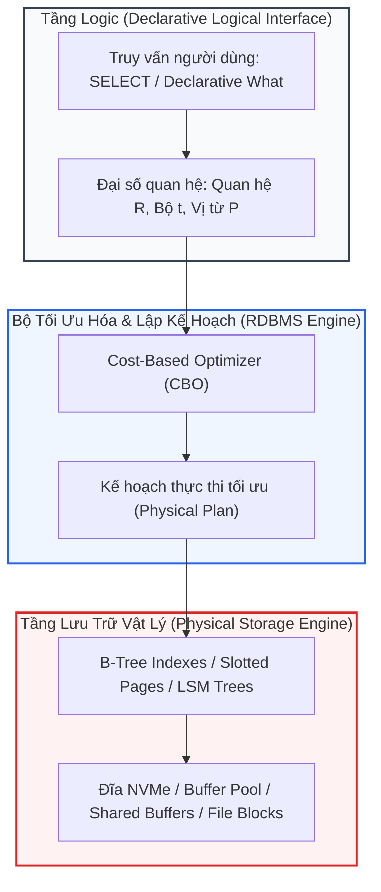
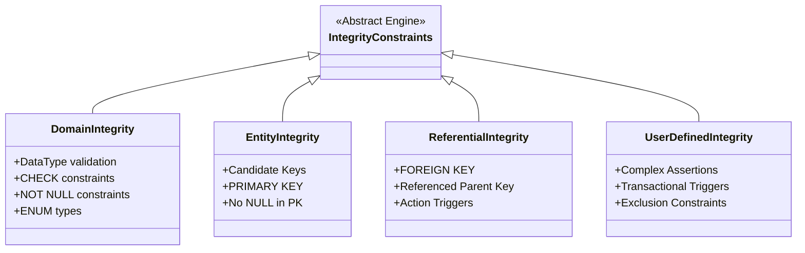
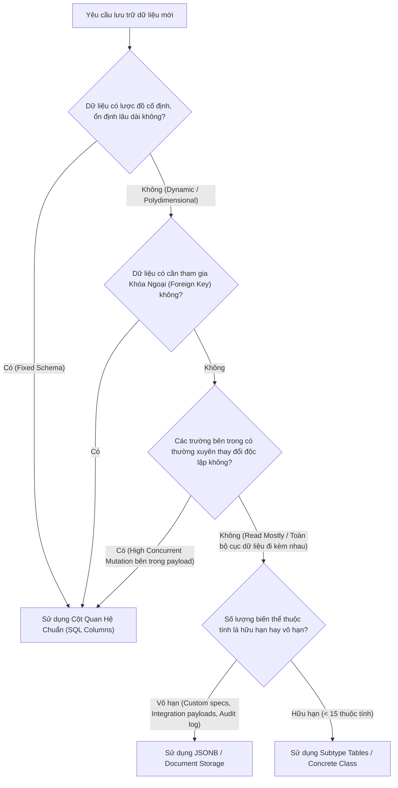
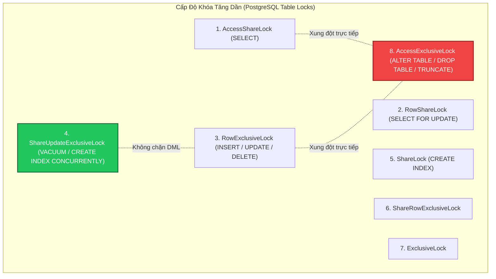
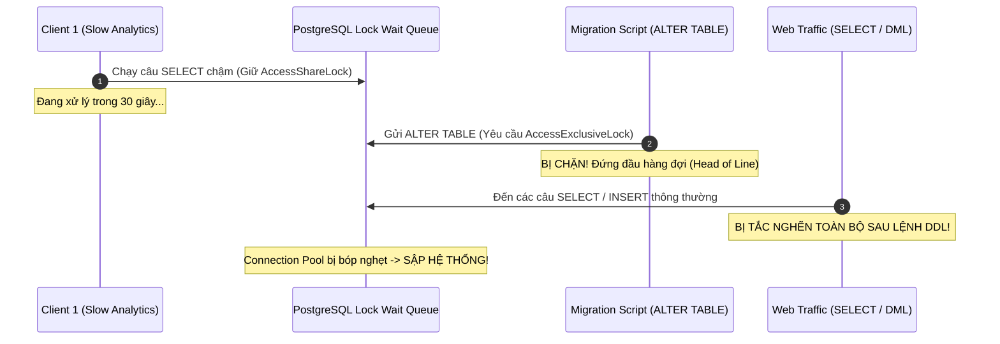
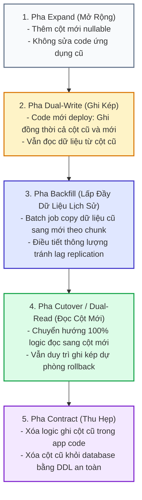
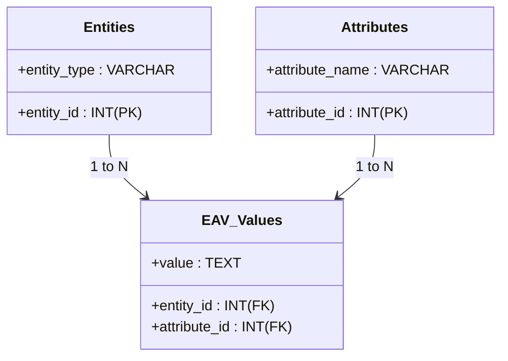
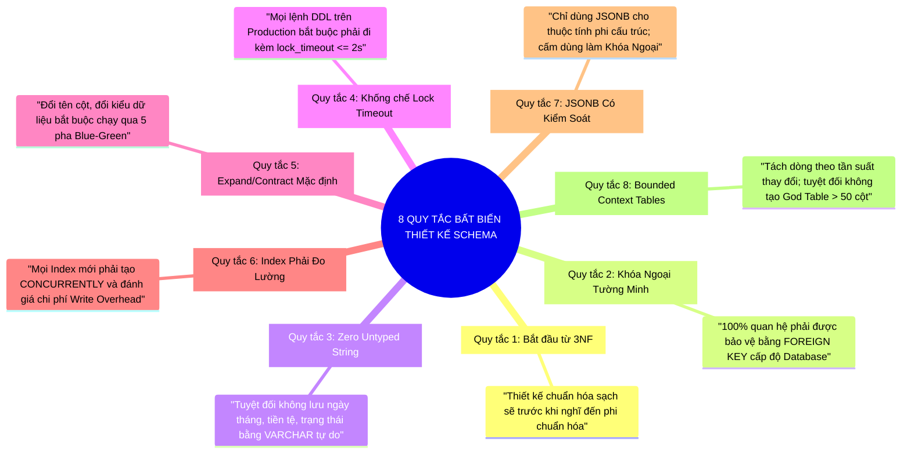

# 🏛️ MODULE 01: RELATIONAL MODELING & SCHEMA ARCHITECTURE
## CHUYÊN ĐỀ 01: MÔ HÌNH QUAN HỆ & KIẾN TRÚC LƯỢC ĐỒ CƠ SỞ DỮ LIỆU CHUẨN DOANH NGHIỆP

> **Vị trí**: Pod 1 — Relational Modeling & Schema Architect  
> **Dự án**: Database Masterclass Enterprise Architecture Series  
> **Mục tiêu**: Thiết lập nền tảng kỹ thuật và toán học chuyên sâu về mô hình quan hệ, lý thuyết chuẩn hóa, nghệ thuật phi chuẩn hóa chiến lược, kỹ thuật di cư schema không gián đoạn (Zero-Downtime Migration) và triệt tiêu các mẫu thiết kế lỗi thời (Anti-patterns).  
> **Hệ quản trị mục tiêu**: PostgreSQL 14–17 (Engine chuẩn ACID & Extensible) & MySQL 8.0/8.4 (InnoDB Engine).

---

## MỤC LỤC CHI TIẾT (TABLE OF CONTENTS)

1. [Bản Chất Mô Hình Quan Hệ (Foundations of the Relational Model)](#1-bản-chất-mô-hình-quan-hệ-foundations-of-the-relational-model)
   - 1.1. Lịch sử & Triết học E.F. Codd: Cuộc cách mạng Độc lập Dữ liệu Vật lý
   - 1.2. Các Thực thể Toán học Cốt lõi: Domain, Attribute, Tuple, Relation
   - 1.3. Đại số Quan hệ Đầy đủ (Relational Algebra): 5 Phép toán Nguyên thủy & Phép toán Phái sinh
   - 1.4. Hệ thống Ràng buộc Toàn vẹn (Integrity Constraints Engine)
2. [Lý Thuyết & Kỹ Thuật Chuẩn Hóa Dữ Liệu (Normalization & Functional Dependencies)](#2-lý-thuyết--kỹ-thuật-chuẩn-hóa-dữ-liệu-normalization--functional-dependencies)
   - 2.1. Nền tảng Phụ thuộc Hàm (Functional Dependencies - FDs) & Hệ tiên đề Armstrong
   - 2.2. Hai Tiêu chuẩn Sống còn của Phân rã: Lossless Join & Dependency Preservation
   - 2.3. Hành trình Chuẩn hóa Từ 1NF Đến BCNF Qua Bài Toán Fulfillment & Logistics
   - 2.4. Bảng Đối Chiếu Tổng Hợp Dạng Chuẩn & Dị Thường Dữ Liệu
3. [Nghệ Thuật Phi Chuẩn Hóa Có Kiểm Soát (Strategic Denormalization)](#3-nghệ-thuật-phi-chuẩn-hóa-có-kiểm-soát-strategic-denormalization)
   - 3.1. Nghịch lý Chuẩn hóa & Nút thắt Hiệu năng ở Quy mô Cực lớn (OLTP Bottlenecks)
   - 3.2. Bốn Chiến lược Phi chuẩn hóa Thực chiến (Concrete Denormalization Patterns)
   - 3.3. Khi nào Dùng JSONB/Document trong RDBMS: Điểm giao thoa Giữa SQL & NoSQL
   - 3.4. Bảng Đánh Đổi Toàn Diện: Write Amplification, Storage Overhead & Consistency Drift
4. [Di Cư Lược Đồ Không Gián Đoạn Dịch Vụ (Zero-Downtime Schema Migrations)](#4-di-cư-lược-đồ-không-gián-đoạn-dịch-vụ-zero-downtime-schema-migrations)
   - 4.1. Cơ chế Khóa Động cơ (Engine Locking Deep-Dive): PostgreSQL Locks vs MySQL InnoDB MDL
   - 4.2. Hiện tượng Tắc nghẽn Hàng đợi Khóa (Lock Queue Head-of-Line Blocking) & Kỹ thuật Khống chế
   - 4.3. Mẫu hình Mở rộng / Thu hẹp (Expand/Contract Pattern - Blue-Green Columns)
   - 4.4. Cẩm nang Kịch bản Di cư Thực tế: Thêm Default, Đổi kiểu Dữ liệu, Đổi tên Cột, Tạo Index
5. [Phân Tích & Triệt Tiêu Các Lỗi Thiết Kế Kinh Điển (Schema Anti-Patterns)](#5-phân-tích--triệt-tiêu-các-lỗi-thiết-kế-kinh-điển-schema-anti-patterns)
   - 5.1. Anti-pattern 1: Entity-Attribute-Value (EAV - Bệnh viện Đa khoa Dữ liệu)
   - 5.2. Anti-pattern 2: Polymorphic Associations (Khóa Ngoại Đa hình)
   - 5.3. Anti-pattern 3: The God Table (Bảng Vạn Năng Hỗn Loạn)
   - 5.4. Anti-pattern 4: Multivalued Attributes (Danh sách Phân tách Dấu phẩy CSV)
   - 5.5. Ma trận Nhận diện & Phương thuốc Chữa trị (Anti-Pattern Remediation Taxonomy)
6. [Tổng Kết Kiểm Định & Quy Tắc Vàng Thiết Kế (Architectural Ledger & Invariants)](#6-tổng-kết-kiểm-định--quy-tắc-vàng-thiết-kế-architectural-ledger--invariants)

---

## 1. BẢN CHẤT MÔ HÌNH QUAN HỆ (FOUNDATIONS OF THE RELATIONAL MODEL)

### 1.1. Lịch Sử & Triết Học E.F. Codd: Cuộc Cách Mạng Độc Lập Dữ Liệu Vật Lý

Trước năm 1970, ngành công nghiệp phần mềm bị trói chặt vào hai kiến trúc cơ sở dữ liệu sơ khai:
- **Hierarchical Model (Mô hình phân cấp)** (tiêu biểu là IBM IMS): Dữ liệu tổ chức theo cấu trúc hình cây (Tree). Quan hệ 1:N được hiện thực hóa bằng con trỏ vật lý trỏ trực tiếp đến địa chỉ sector trên đĩa từ.
- **Network Model (Mô hình mạng)** (tiêu biểu là CODASYL DBTG): Dữ liệu là đồ thị có hướng (Directed Graph) với các tập hợp bản ghi kết nối qua các liên kết con trỏ phức tạp.

**Khuyết tật chí mạng của mô hình cũ**: Tính liên kết chặt chẽ về mặt vật lý (`Physical Tightly-Coupled Binding`). Lập trình viên khi viết mã truy vấn buộc phải đóng vai trò là một "Bộ điều hướng vật lý (`Physical Navigator`)". Nếu cấu trúc lưu trữ thay đổi (ví dụ: bổ sung một chỉ mục B-Tree, đổi định dạng phân vùng đĩa, sắp xếp lại thứ tự record), **toàn bộ các ứng dụng truy xuất dữ liệu đều bị gãy đổ (`broken`)** và phải biên dịch, viết lại logic điều hướng từ đầu.

Vào tháng 6 năm 1970, Tiến sĩ Edgar F. Codd (làm việc tại IBM Research Lab) công bố bài báo khoa học lịch sử:  
> *"A Relational Model of Data for Large Shared Data Banks"* (Communications of the ACM).

Codd đưa ra một tuyên ngôn mang tính cách mạng: **Tách rời hoàn toàn Tầng Logic (Logical Layer) khỏi Tầng Vật Lý (Physical Layer)** — được chuẩn hóa thành nguyên lý:
$$\text{Physical Data Independence (Tính Độc Lập Dữ Liệu Vật Lý)}$$



Trong mô hình này:
1. **Người dùng/Lập trình viên chỉ khai báo cái mình muốn (`Declarative What`)**, không phải mô tả cách lấy dữ liệu (`Imperative How`).
2. **Hệ thống RDBMS chịu trách nhiệm phiên dịch** biểu thức toán học thành kế hoạch quét đĩa vật lý tối ưu nhất dựa trên số liệu thống kê thực tế (`Cost-Based Optimizer - CBO`).
3. Dữ liệu trên đĩa có thể chuyển từ Heap File sang B-Tree, nén khối, phân trang, chia partition mà không làm thay đổi ngữ nghĩa logic của ứng dụng.

---

### 1.2. Các Thực Thể Toán Học Cốt Lõi: Domain, Attribute, Tuple, Relation

Mô hình quan hệ được xây dựng dựa trên lý thuyết tập hợp (`Set Theory`) và logic vị từ bậc nhất (`First-Order Predicate Logic`).

#### 1. Miền giá trị (Domain - $D$)
- **Định nghĩa**: Một tập hợp hữu hạn các giá trị nguyên tử (`Atomic Values`) có cùng ngữ nghĩa và kiểu dữ liệu.
- **Tính nguyên tử (`Atomicity`)**: Mỗi phần tử thuộc miền giá trị không thể phân chia thành các thành phần nhỏ hơn dưới góc nhìn của hệ thống RDBMS.
- *Ví dụ*: $\text{Domain}(\text{UserStatus}) = \{\text{'PENDING'}, \text{'ACTIVE'}, \text{'SUSPENDED'}\}$, $\text{Domain}(\text{Age}) = \{x \in \mathbb{Z} \mid 0 \le x \le 150\}$.

#### 2. Thuộc tính (Attribute - $A$)
- **Định nghĩa**: Một tên gọi định danh đóng vai trò ngữ nghĩa cho một miền giá trị cụ thể trong một quan hệ. Ký hiệu: $A_i$, với miền giá trị tương ứng là $\text{dom}(A_i)$.
- *Ví dụ*: Thuộc tính `created_at` gắn với miền giá trị `TIMESTAMP WITH TIME ZONE`.

#### 3. Bộ dữ liệu (Tuple - $t$)
- **Định nghĩa toán học**: Xét lược đồ quan hệ gồm tập thuộc tính $U = \{A_1, A_2, \dots, A_n\}$. Một tuple $t$ là một ánh xạ toàn phần:
  $$t: U \to \bigcup_{i=1}^{n} \text{dom}(A_i) \quad \text{sao cho} \quad t(A_i) \in \text{dom}(A_i), \forall i \in \{1, \dots, n\}$$
- **Khác biệt cốt lõi giữa Tuple toán học và Row trong SQL**:
  - *Tuple toán học*: Không có thứ tự thuộc tính. Bộ $(A: 1, B: 'x')$ hoàn toàn đồng nhất với bộ $(B: 'x', A: 1)$.
  - *SQL Row*: Các cột có thứ tự vị trí vật lý cố định theo chỉ số ($0, 1, \dots, n-1$). Mệnh đề `SELECT *` hoặc `INSERT INTO t VALUES (...)` chịu ảnh hưởng trực tiếp bởi thứ tự khai báo cột.

#### 4. Quan hệ (Relation - $R$)
- **Định nghĩa toán học**: Một quan hệ $R$ trên lược đồ $R(A_1, A_2, \dots, A_n)$ là một tập con của tích Descartes (`Cartesian Product`) của các miền giá trị tương ứng:
  $$R \subseteq \text{dom}(A_1) \times \text{dom}(A_2) \times \dots \times \text{dom}(A_n)$$
- **Đặc trưng bản chất của Quan hệ**:
  1. *Không có bộ trùng lặp (`No Duplicate Tuples`)*: Do quan hệ là một tập hợp toán học (`Mathematical Set`).
  2. *Không có thứ tự giữa các bộ (`Tuples are Unordered`)*: Không tồn tại khái niệm "bộ đầu tiên" hay "bộ cuối cùng" trừ khi áp dụng toán tử sắp xếp (`ORDER BY`).
  3. *Ngữ nghĩa tập hợp (`Set Semantics`) vs Ngữ nghĩa đa tập hợp (`Bag/Multiset Semantics` trong SQL)*: SQL trên thực tế vận hành mặc định ở chế độ Đa tập hợp (cho phép trùng lặp dòng) vì lý do chi phí khử trùng lặp (`Deduplication Cost`) bằng phép Sort/Hash là cực kỳ đắt đỏ. Khi cần ngữ nghĩa quan hệ thuần khiết, ta bắt buộc phải dùng từ khóa `DISTINCT` hoặc thiết lập `PRIMARY KEY`.

---

### 1.3. Đại Số Quan Hệ Đầy Đủ (Relational Algebra Operators)

Đại số quan hệ là một ngôn ngữ truy vấn hình thức (`Formal Procedural Query Language`). Đầu vào của mỗi phép toán là một hoặc nhiều quan hệ, và đầu ra luôn là một **quan hệ mới** (Tính chất đóng kín - `Closure Property`).

#### 5 Phép Toán Nguyên Thủy (Fundamental Operators)

Mọi thao tác truy vấn dữ liệu phức tạp trong vũ trụ quan hệ đều có thể biểu diễn qua tổ hợp của 5 phép toán nguyên thủy sau:

##### 1. Phép Chọn Lọc (Selection - $\sigma$)
- **Cú pháp toán học**: $\sigma_{\theta}(R) = \{t \in R \mid \theta(t) = \text{TRUE}\}$
- **Ý nghĩa**: Trích xuất các bộ dữ liệu trong quan hệ $R$ thỏa mãn vị từ điều kiện $\theta$. Vị từ $\theta$ là công thức logic kết hợp các toán tử so sánh ($=, \neq, <, \le, >, \ge$) và các liên từ logic ($\land, \lor, \neg$).
- **Ánh xạ SQL**: Mệnh đề `WHERE`.
  ```sql
  -- Đại số quan hệ: \sigma_{status = 'ACTIVE' \land balance > 1000}(Accounts)
  SELECT * FROM accounts 
  WHERE status = 'ACTIVE' AND balance > 1000;
  ```

##### 2. Phép Chiếu (Projection - $\pi$)
- **Cú pháp toán học**: $\pi_{A_1, A_2, \dots, A_k}(R) = \{t[A_1, A_2, \dots, A_k] \mid t \in R\}$
- **Ý nghĩa**: Trích xuất một tập con các thuộc tính $\{A_1, \dots, A_k\}$ từ quan hệ $R$ và tự động loại bỏ tất cả các bộ trùng lặp phát sinh do việc lược bớt cột.
- **Ánh xạ SQL**: Mệnh đề `SELECT DISTINCT`.
  ```sql
  -- Đại số quan hệ: \pi_{country, city}(Customers)
  SELECT DISTINCT country, city FROM customers;
  ```

##### 3. Phép Tích Descartes (Cartesian Product - $\times$)
- **Cú pháp toán học**: $R \times S = \{t \circ s \mid t \in R \land s \in S\}$ (với $\circ$ là phép ghép nối hai bộ dữ liệu).
- **Ý nghĩa**: Tạo ra một quan hệ mới gồm tất cả các tổ hợp ghép đôi giữa mỗi bộ của $R$ với mỗi bộ của $S$. Nếu $|R| = m$ và $|S| = n$, thì $|R \times S| = m \times n$.
- **Ánh xạ SQL**: Mệnh đề `CROSS JOIN`.
  ```sql
  -- Đại số quan hệ: Users \times Roles
  SELECT * FROM users CROSS JOIN roles;
  ```

##### 4. Phép Hợp Tập Hợp (Set Union - $\cup$)
- **Cú pháp toán học**: $R \cup S = \{t \mid t \in R \lor t \in S\}$
- **Điều kiện tiên quyết**: $R$ và $S$ phải tương thích lược đồ (`Union Compatible`) — nghĩa là chúng phải có cùng bậc (`Degree` / số lượng thuộc tính) và các miền giá trị tương ứng từng vị trí phải khả đối chiếu (`Compatible Domains`).
- **Ánh xạ SQL**: Mệnh đề `UNION` (tự động loại bỏ trùng lặp).
  ```sql
  -- Đại số quan hệ: DomesticCustomers \cup InternationalCustomers
  SELECT customer_id, company_name FROM domestic_customers
  UNION
  SELECT customer_id, company_name FROM international_customers;
  ```

##### 5. Phép Hiệu Tập Hợp (Set Difference - $-$)
- **Cú pháp toán học**: $R - S = \{t \mid t \in R \land t \notin S\}$
- **Điều kiện**: $R$ và $S$ phải tương thích lược đồ (`Union Compatible`).
- **Ánh xạ SQL**: Mệnh đề `EXCEPT` (PostgreSQL) hoặc `EXCEPT / MINUS` (Oracle).
  ```sql
  -- Tìm khách hàng đã đăng ký nhưng chưa từng phát sinh bất kỳ đơn hàng nào
  -- Đại số quan hệ: \pi_{customer_id}(Customers) - \pi_{customer_id}(Orders)
  SELECT customer_id FROM customers
  EXCEPT
  SELECT customer_id FROM orders;
  ```

---

#### Các Phép Toán Phái Sinh Quan Trọng (Derived Operators)

##### 1. Phép Giao Tập Hợp (Set Intersection - $\cap$)
- **Biểu diễn qua nguyên thủy**: $R \cap S = R - (R - S)$
- **Ánh xạ SQL**: Mệnh đề `INTERSECT`.

##### 2. Phép Kết Nối Theta (Theta Join - $\bowtie_{\theta}$)
- **Biểu diễn qua nguyên thủy**: $R \bowtie_{\theta} S = \sigma_{\theta}(R \times S)$
- **Ý nghĩa**: Ghép nối các bộ từ hai quan hệ thỏa mãn điều kiện vị từ $\theta$. Trong thực tế, phép Equi-Join (vị từ là phép so sánh bằng $=$) là nền tảng của toàn bộ kiến trúc quan hệ liên kết khóa chính - khóa ngoại.
- **Ánh xạ SQL**: `INNER JOIN ... ON ...`.

##### 3. Phép Chia Quan Hệ (Relational Division - $\div$)
- **Cú pháp toán học**: Cho $R(A, B)$ và $S(B)$. Phép chia $R \div S$ sinh ra quan hệ chứa các giá trị của thuộc tính $A$ sao cho với mọi bộ trong $S$, bộ ghép $(a, b)$ đều tồn tại trong $R$:
  $$R \div S = \pi_{A}(R) - \pi_{A}((\pi_{A}(R) \times S) - R)$$
- **Bài toán nghiệp vụ kinh điển**: *"Tìm tất cả các kỹ sư phần mềm đã thành thạo TẤT CẢ các kỹ năng trong danh mục Kỹ Năng Bắt Buộc của công ty"*.

```sql
-- Hiện thực hóa phép Chia Quan Hệ trong SQL sản xuất:
-- Bảng SkillRequirements (Chứa danh sách kỹ năng bắt buộc: 'PostgreSQL', 'Docker', 'Go')
-- Bảng DeveloperSkills (Chứa kỹ năng thực tế của từng developer)

SELECT ds.developer_id
FROM developer_skills ds
JOIN skill_requirements sr ON ds.skill_id = sr.skill_id
GROUP BY ds.developer_id
HAVING COUNT(DISTINCT ds.skill_id) = (SELECT COUNT(*) FROM skill_requirements);
```

---

### 1.4. Hệ Thống Ràng Buộc Toàn Vẹn (Integrity Constraints Engine)

Ràng buộc toàn vẹn (`Integrity Constraints`) là bức tường lửa toán học đảm bảo trạng thái của cơ sở dữ liệu luôn phản ánh đúng các quy tắc bất biến của thế giới thực (`Business Invariants`).



#### 1. Toàn Vẹn Miền Giá Trị (Domain Integrity)
Bảo đảm mọi giá trị trong một thuộc tính phải thuộc miền giá trị đã quy định: kiểu dữ liệu (data type), kích thước, độ chuẩn xác, cờ `NOT NULL`, và ràng buộc biểu thức `CHECK`.

```sql
CREATE TABLE employee_contracts (
    contract_id UUID PRIMARY KEY DEFAULT gen_random_uuid(),
    employee_code VARCHAR(12) NOT NULL,
    base_salary NUMERIC(15, 2) NOT NULL,
    start_date DATE NOT NULL,
    end_date DATE,
    probation_months SMALLINT DEFAULT 2,
    
    -- Domain Constraint phức hợp qua CHECK:
    CONSTRAINT chk_positive_salary CHECK (base_salary > 0),
    CONSTRAINT chk_valid_contract_period CHECK (end_date IS NULL OR end_date > start_date),
    CONSTRAINT chk_valid_probation CHECK (probation_months BETWEEN 0 AND 12)
);
```

#### 2. Toàn Vẹn Thực Thể (Entity Integrity)
Quy định: Mọi quan hệ bắt buộc phải có một định danh duy nhất gọi là **Khóa chính (`Primary Key`)**, và **không có bất kỳ thuộc tính nào tham gia vào Khóa chính được phép mang giá trị `NULL`**.
- **Superkey (Siêu khóa)**: Một tập hợp thuộc tính $K$ sao cho không có hai bộ dữ liệu phân biệt nào trong $R$ có cùng giá trị trên $K$. Tức là $K \to R$.
- **Candidate Key (Khóa ứng viên)**: Một Siêu khóa tối tiểu (`Minimal Superkey`). Nghĩa là nếu ta loại bỏ bất kỳ thuộc tính nào khỏi Candidate Key, nó sẽ không còn là Siêu khóa nữa.
- **Primary Key (Khóa chính)**: Một Khóa ứng viên được Kiến trúc sư cơ sở dữ liệu chỉ định làm định danh chính thức của bảng.
- **Alternate Key (Khóa thay thế)**: Các Khóa ứng viên còn lại không được chọn làm Khóa chính, thường được bảo vệ bằng ràng buộc `UNIQUE` kết hợp `NOT NULL`.

#### 3. Toàn Vẹn Tham Chiếu (Referential Integrity) & Phân Tích Chuyên Sâu Các Hành Vi Khóa Ngoại
Bảo đảm tính liên kết nhất quán giữa hai quan hệ: Giá trị của thuộc tính Khóa ngoại (`Foreign Key`) trong bảng con (`Referencing Table`) phải hoặc là bằng giá trị của một Khóa ứng viên hợp lệ trong bảng cha (`Referenced Table`), hoặc mang giá trị `NULL`.

Khi một dòng trên bảng cha bị thay đổi (`UPDATE`) hoặc xóa bỏ (`DELETE`), hệ thống thực thi một trong các cơ chế sau:

| Hành vi (`Referential Action`) | Hành vi khi Xóa bản ghi cha (`ON DELETE`) | Hành vi khi Đổi Khóa bản ghi cha (`ON UPDATE`) | Trường hợp Sử dụng Tối ưu |
| :--- | :--- | :--- | :--- |
| **`RESTRICT`** | Chặn đứng thao tác xóa ngay lập tức nếu còn con tham chiếu. Không cho phép trì hoãn (`Non-deferrable`). | Chặn đứng thao tác cập nhật ngay lập tức nếu còn con tham chiếu. | Dữ liệu tài chính, sổ cái, chứng từ bắt buộc bảo toàn. |
| **`NO ACTION`** *(Default)* | Tương tự `RESTRICT`, nhưng cho phép trì hoãn kiểm tra (`DEFERRABLE INITIALLY DEFERRED`) đến cuối Transaction! | Cho phép trì hoãn kiểm tra đến cuối Transaction. | Các mối quan hệ vòng lặp (`Circular Dependencies`) hoặc Bulk update phức tạp. |
| **`CASCADE`** | Tự động xóa sạch toàn bộ các dòng con trỏ tới dòng cha bị xóa. | Tự động cập nhật giá trị khóa mới xuống toàn bộ các dòng con. | Cấu trúc quan hệ Sở hữu tuyệt đối (`Strong Aggregation / Composition`): `Invoice -> InvoiceItems`. |
| **`SET NULL`** | Thiết lập cột Khóa ngoại ở các dòng con thành `NULL` (Cột con phải hỗ trợ NULLable). | Thiết lập cột Khóa ngoại ở các dòng con thành `NULL`. | Quan hệ lỏng lẻo (`Loose Association`): `Task -> assigned_user_id`. |
| **`SET DEFAULT`** | Thiết lập cột Khóa ngoại ở các dòng con về giá trị mặc định của nó. | Thiết lập cột Khóa ngoại ở các dòng con về giá trị mặc định. | Gán về tài khoản quản trị mặc định (`System User`) khi tài khoản chuyên trách bị đóng. |

> ⚠️ **Cảnh báo Kiến trúc**: Tránh lạm dụng `ON DELETE CASCADE` trên các quan hệ nhiều tầng (`Multi-level Cascading`). Một câu lệnh `DELETE FROM tenants WHERE id = ?` có thể vô tình kích hoạt chuỗi khóa bảng và xóa hàng triệu bản ghi con cháu, gây kiệt quệ tài nguyên CPU, bùng nổ WAL log và treo đứng hệ thống production trong nhiều phút!

---

## 2. LÝ THUYẾT & KỸ THUẬT CHUẨN HÓA DỮ LIỆU (NORMALIZATION & FUNCTIONAL DEPENDENCIES)

### 2.1. Nền Tảng Phụ Thuộc Hàm (Functional Dependencies - FDs) & Hệ Tiên Đề Armstrong

#### Định Nghĩa Toán Học Hình Thức
Xét lược đồ quan hệ $R$ với tập thuộc tính $U$. Cho $X, Y \subseteq U$. Ta nói $Y$ **phụ thuộc hàm (`Functionally Dependent`)** vào $X$ (ký hiệu $X \to Y$) khi và chỉ khi:
$$\forall t_1, t_2 \in R, \quad \text{nếu} \quad t_1[X] = t_2[X] \quad \text{thì} \quad t_1[Y] = t_2[Y]$$
Nghĩa là: Nếu hai bộ dữ liệu có giá trị thuộc tính trên tập $X$ giống hệt nhau, thì giá trị trên tập $Y$ của chúng cũng bắt buộc phải giống hệt nhau. Khi đó, $X$ được gọi là **Định danh (`Determinant`)**.

#### Hệ Tiên Đề Armstrong (Armstrong's Axioms)
Năm 1974, William W. Armstrong công bố hệ 3 tiên đề nền tảng giúp suy diễn logic toàn bộ các phụ thuộc hàm tiềm ẩn từ một tập phụ thuộc hàm cho trước:

1. **Luật Phản Xạ (Axiom of Reflexivity)**:
   $$\text{Nếu } Y \subseteq X \text{ thì } X \to Y$$
   *(Thuộc tính con hiển nhiên được xác định bởi tập thuộc tính cha, ví dụ: `{id, email} -> email`)*. Đây là phụ thuộc hàm tầm thường (`Trivial FD`).
2. **Luật Tăng Cường (Axiom of Augmentation)**:
   $$\text{Nếu } X \to Y \text{ thì } XZ \to YZ, \quad \forall Z \subseteq U$$
   *(Bổ sung cùng một tập thuộc tính vào hai vế không làm mất tính phụ thuộc hàm)*.
3. **Luật Bắc Cầu (Axiom of Transitivity)**:
   $$\text{Nếu } X \to Y \text{ và } Y \to Z \text{ thì } X \to Z$$

Từ 3 tiên đề cốt lõi trên, ta chứng minh được 3 quy tắc phái sinh thực dụng:
- **Luật Hợp (Union Rule)**: Nếu $X \to Y$ và $X \to Z$ thì $X \to YZ$.
- **Luật Phân Rã (Decomposition Rule)**: Nếu $X \to YZ$ thì $X \to Y$ và $X \to Z$.
- **Luật Giả Bắc Cầu (Pseudotransitivity Rule)**: Nếu $X \to Y$ và $WY \to Z$ thì $WX \to Z$.

#### Thuật Toán Tìm Bao Đóng Thuộc Tính (Attribute Closure Algorithm - $X^+$)
Bao đóng của tập thuộc tính $X$ dưới tập phụ thuộc hàm $F$, ký hiệu là $X^+$, là tập hợp tất cả các thuộc tính có thể suy diễn logic được từ $X$ thông qua $F$.

```
Thuật toán: Tính Bao Đóng X+ (Compute Attribute Closure)
Đầu vào: Tập thuộc tính X, Tập phụ thuộc hàm F
Đầu ra: Tập thuộc tính bao đóng X+

1. X+ := X
2. LẶP (REPEAT):
3.    Cho mỗi phụ thuộc hàm (Y -> Z) trong F:
4.       NẾU Y \subseteq X+ THÌ:
5.          X+ := X+ \cup Z
6. CHO ĐẾN KHI: X+ không còn phần tử mới nào được bổ sung.
7. TRẢ VỀ X+
```
**Ứng dụng**: Để kiểm tra xem một tập thuộc tính $K$ có phải là Siêu khóa (`Superkey`) của $R$ hay không, ta tính $K^+$. Nếu $K^+ = U$ (bao đóng phủ kín toàn bộ thuộc tính của lược đồ), thì $K$ chắc chắn là Siêu khóa! Nếu không có tập con thực sự nào của $K$ phủ kín $U$, thì $K$ là Khóa ứng viên (`Candidate Key`).

---

### 2.2. Hai Tiêu Chuẩn Sống Còn Của Phân Rã: Lossless Join & Dependency Preservation

Khi phân rã một lược đồ quan hệ $R$ thành các lược đồ con $\{R_1, R_2, \dots, R_k\}$, phép phân rã bắt buộc phải thỏa mãn 2 điều kiện kiến trúc:

#### 1. Phân Rã Kết Nối Không Mất Mát (Lossless Join Decomposition)
Phân rã lược đồ $R$ thành $R_1$ và $R_2$ được gọi là Không mất mát dữ liệu (`Lossless Join`) nếu khi thực hiện phép kết nối tự nhiên giữa hai quan hệ kết quả, ta phục hồi được chính xác $100\%$ quan hệ ban đầu, không xuất hiện các bộ dữ liệu ma quái (`Spurious Tuples`):
$$R = R_1 \bowtie R_2$$

> 📜 **Định lý Heath (Heath's Theorem)**: Phân rã $R$ thành $R_1$ và $R_2$ là Lossless Join đối với tập phụ thuộc hàm $F$ khi và chỉ khi thuộc tính chung của chúng chứa ít nhất một Siêu khóa của một trong hai quan hệ con:
$$(R_1 \cap R_2) \to R_1 \quad \lor \quad (R_1 \cap R_2) \to R_2$$

#### 2. Bảo Toàn Phụ Thuộc Hàm (Dependency Preservation)
Nếu $F_1$ là hình chiếu của $F$ lên $R_1$, và $F_2$ là hình chiếu của $F$ lên $R_2$, thì phân rã bảo toàn phụ thuộc hàm khi:
$$(F_1 \cup F_2)^+ = F^+$$
**Ý nghĩa kỹ thuật**: Nếu bảo toàn phụ thuộc hàm, hệ quản trị cơ sở dữ liệu có thể kiểm tra toàn vẹn mọi ràng buộc kinh doanh cục bộ ngay trên từng bảng đơn lẻ mà **không cần thực hiện phép JOIN liên bảng đắt đỏ** trong quá trình `INSERT` hay `UPDATE`.

---

### 2.3. Hành Trình Chuẩn Hóa Từ 1NF Đến BCNF Qua Bài Toán Fulfillment & Logistics

Xét bài toán thiết kế hệ thống Quản lý Đơn hàng & Vận chuyển (Order Fulfillment & Shipment Logistics).  
Giả sử kỹ sư mới thiết kế một bảng phẳng chưa chuẩn hóa (`Unnormalized Form - UNF`):

```sql
-- Lược đồ bẹt sơ khai (UNF) - Chứa đựng mọi hiểm họa về dị thường dữ liệu
CREATE TABLE raw_shipment_staging (
    order_id INT,
    order_date DATE,
    customer_id INT,
    customer_name VARCHAR(100),
    customer_address VARCHAR(255),
    items_ordered TEXT, -- Mảng chuỗi phân tách dấu phẩy: "SKU1:Qty:Price, SKU2:Qty:Price"
    warehouse_id INT,
    warehouse_city VARCHAR(100),
    warehouse_capacity INT,
    driver_id INT,
    driver_name VARCHAR(100),
    delivery_status VARCHAR(50)
);
```

#### Dạng Chuẩn 1 (First Normal Form - 1NF)
- **Định nghĩa**: Một quan hệ đạt 1NF khi và chỉ khi mọi thuộc tính đều chứa **giá trị nguyên tử (`Atomic Values`)**, không chứa mảng (`Arrays`), không chứa danh sách phân tách dấu phẩy, và không tồn tại nhóm lặp (`Repeating Groups` như `item_1, item_2, item_3`).
- **Xử lý vi phạm**: Tách trường `items_ordered` ra thành các dòng độc lập.
- **Lược đồ đạt 1NF**:
  $$\text{ShipmentFlat}(\underline{\text{order\_id}, \text{sku}}, \text{order\_date}, \text{customer\_id}, \text{customer\_name}, \text{customer\_address}, \text{qty}, \text{unit\_price}, \text{warehouse\_id}, \text{warehouse\_city}, \text{warehouse\_capacity}, \text{driver\_id}, \text{driver\_name})$$
- **Khóa chính**: `(order_id, sku)`.

**Tập Phụ Thuộc Hàm ($F$) của bài toán**:
1. `(order_id, sku) -> qty, unit_price`
2. `order_id -> order_date, customer_id, warehouse_id, driver_id`
3. `customer_id -> customer_name, customer_address`
4. `warehouse_id -> warehouse_city, warehouse_capacity`
5. `driver_id -> driver_name`

---

#### Dạng Chuẩn 2 (Second Normal Form - 2NF)
- **Định nghĩa**: Một quan hệ đạt 2NF khi và chỉ khi nó đã đạt 1NF và **KHÔNG có bất kỳ thuộc tính không khóa (`Non-prime Attribute`) nào bị phụ thuộc hàm một phần (`Partial Dependency`) vào bất kỳ Khóa ứng viên nào**.
- **Phân tích vi phạm 2NF**: Khóa chính là `(order_id, sku)`.
  - Nhưng phụ thuộc hàm `order_id -> order_date, customer_id, warehouse_id, driver_id` chỉ phụ thuộc vào một phần của khóa chính (`order_id`)!
- **Hậu quả của Dị Thường Dữ Liệu (Anomalies)**:
  - *Dị thường cập nhật (`Update Anomaly`)*: Nếu khách hàng thay đổi ngày đặt hàng, ta phải cập nhật trên hàng chục dòng tương ứng với các SKU khác nhau của cùng đơn hàng đó. Nếu quên 1 dòng, dữ liệu bị mâu thuẫn nội tại.
  - *Dị thường chèn (`Insertion Anomaly`)*: Không thể tạo một đơn hàng mới nếu khách hàng chưa quyết định chọn mua SKU nào (vì `sku` thuộc Primary Key nên không được mang giá trị `NULL`).
- **Giải pháp phân rã Lossless sang 2NF**:
  1. $\text{OrderItems}(\underline{\text{order\_id}, \text{sku}}, \text{qty}, \text{unit\_price})$
  2. $\text{OrderShipment}(\underline{\text{order\_id}}, \text{order\_date}, \text{customer\_id}, \text{customer\_name}, \text{customer\_address}, \text{warehouse\_id}, \text{warehouse\_city}, \text{warehouse\_capacity}, \text{driver\_id}, \text{driver\_name})$

---

#### Dạng Chuẩn 3 (Third Normal Form - 3NF)
- **Định nghĩa**: Một quan hệ đạt 3NF khi và chỉ khi nó đã đạt 2NF và **KHÔNG tồn tại thuộc tính không khóa nào phụ thuộc hàm bắc cầu (`Transitive Dependency`) vào Khóa chính**.
  Nói cách khác: Với mọi phụ thuộc hàm không tầm thường $X \to A$, thì hoặc:
  1. $X$ là một Siêu khóa (`Superkey`), HOẶC
  2. $A$ là một Thuộc tính nguyên tố (`Prime Attribute` - tức $A$ thuộc một Khóa ứng viên nào đó).
- **Phân tích vi phạm 3NF trong bảng `OrderShipment`**:
  - `order_id -> customer_id` và `customer_id -> customer_name, customer_address`.
    $\to$ Suy ra: `order_id -> customer_name` là **Phụ thuộc hàm bắc cầu**!
  - `order_id -> warehouse_id` và `warehouse_id -> warehouse_city, warehouse_capacity`.
    $\to$ Suy ra: `order_id -> warehouse_city` là **Phụ thuộc hàm bắc cầu**!
  - `order_id -> driver_id` và `driver_id -> driver_name`.
    $\to$ Suy ra: `order_id -> driver_name` là **Phụ thuộc hàm bắc cầu**!
- **Hậu quả**:
  - *Dị thường xóa (`Deletion Anomaly`)*: Nếu ta xóa toàn bộ các đơn hàng vận chuyển trong tháng qua, toàn bộ thông tin kho bãi và tài xế mới ký hợp đồng cũng sẽ bị xóa vĩnh viễn khỏi hệ thống!
- **Giải pháp phân rã Lossless & Bảo toàn phụ thuộc sang 3NF**:
  1. $\text{Customers}(\underline{\text{customer\_id}}, \text{customer\_name}, \text{customer\_address})$
  2. $\text{Warehouses}(\underline{\text{warehouse\_id}}, \text{warehouse\_city}, \text{warehouse\_capacity})$
  3. $\text{Drivers}(\underline{\text{driver\_id}}, \text{driver\_name})$
  4. $\text{Orders}(\underline{\text{order\_id}}, \text{order\_date}, \text{customer\_id}, \text{warehouse\_id}, \text{driver\_id})$
  5. $\text{OrderItems}(\underline{\text{order\_id}, \text{sku}}, \text{qty}, \text{unit\_price})$

---

#### Dạng Chuẩn Boyce-Codd (Boyce-Codd Normal Form - BCNF / 3.5NF)
- **Định nghĩa**: Một quan hệ đạt BCNF khi và chỉ khi đối với mọi phụ thuộc hàm không tầm thường $X \to A$ tồn tại trong $R$, thì **$X$ BẮT BUỘC PHẢI LÀ MỘT SIÊU KHÓA (`Superkey`)**.
- **Điểm khác biệt chí mạng giữa 3NF và BCNF**:
  Trong 3NF, điều kiện cho phép $A$ là Thuộc tính nguyên tố (`Prime Attribute`) đóng vai trò là một "Cửa thoát hiểm (`Escape Hatch`)". Nếu một phụ thuộc hàm có vế trái không phải Siêu khóa nhưng vế phải là thuộc tính khóa, **3NF vẫn chấp nhận, nhưng BCNF dứt khoát bác bỏ**!

##### Bài toán thực tế vi phạm BCNF dù đã đạt 3NF:
Xét hệ thống phân công khám bệnh chuyên khoa tại Bệnh viện:
$$\text{ClinicSchedule}(\text{patient\_id}, \text{clinic\_room}, \text{specialty}, \text{doctor\_id})$$

**Quy tắc nghiệp vụ bất biến**:
1. Mỗi bệnh nhân tại một chuyên khoa chỉ được khám bởi 1 bác sĩ phụ trách:
   $$(\text{patient\_id}, \text{specialty}) \to \text{doctor\_id}$$
2. Mỗi bác sĩ chỉ có đúng 1 chuyên khoa duy nhất:
   $$\text{doctor\_id} \to \text{specialty}$$
3. Mỗi bác sĩ chỉ khám tại một phòng khám cố định:
   $$\text{doctor\_id} \to \text{clinic\_room}$$

**Phân tích Khóa Ứng Viên**:
- Ta có $(\text{patient\_id}, \text{specialty}) \to \text{doctor\_id} \to \text{clinic\_room}$.
  Vậy khóa ứng viên thứ nhất là: $K_1 = (\text{patient\_id}, \text{specialty})$.
- Do $\text{doctor\_id} \to \text{specialty}$, nên $(\text{patient\_id}, \text{doctor\_id}) \to \text{specialty} \to \text{clinic\_room}$.
  Vậy khóa ứng viên thứ hai là: $K_2 = (\text{patient\_id}, \text{doctor\_id})$.
- Tập thuộc tính nguyên tố (`Prime Attributes`): $\{\text{patient\_id}, \text{specialty}, \text{doctor\_id}\}$.
- Thuộc tính không khóa: $\{\text{clinic\_room}\}$.

**Tại sao bảng này đạt chuẩn 3NF?**
- Xét phụ thuộc hàm $\text{doctor\_id} \to \text{specialty}$:
  - Vế trái `doctor_id` KHÔNG phải là Siêu khóa.
  - Nhưng vế phải `specialty` lại là một **Thuộc tính nguyên tố** (thuộc khóa $K_1$).
  $\to$ Thỏa mãn điều kiện 3NF!

**Tại sao bảng này VI PHẠM BCNF?**
- Trong phụ thuộc hàm $\text{doctor\_id} \to \text{specialty}$, `doctor_id` không phải Siêu khóa. BCNF không chấp nhận ngoại lệ thuộc tính nguyên tố.
- **Dị thường thực tế**: Không thể lưu thông tin một Bác sĩ mới vào biên chế với Chuyên khoa của họ nếu Bác sĩ đó chưa được gán lịch khám cho bất kỳ bệnh nhân nào (`patient_id` là NULL)!

##### Đánh đổi giữa BCNF và Bảo toàn Phụ thuộc Hàm:
Khi phân rã $\text{ClinicSchedule}$ sang BCNF:
1. $\text{DoctorSpecialty}(\underline{\text{doctor\_id}}, \text{specialty}, \text{clinic\_room})$ (Khóa: `doctor_id`, thỏa mãn BCNF).
2. $\text{PatientAssignment}(\underline{\text{patient\_id}, \text{doctor\_id}})$ (Khóa: `(patient_id, doctor_id)`, thỏa mãn BCNF).

> ⚠️ **Sự đánh đổi lịch sử**: Phép phân rã trên là **Lossless Join**, nhưng **KHÔNG BẢO TOÀN PHỤ THUỘC HÀM** $(\text{patient\_id}, \text{specialty}) \to \text{doctor\_id}$!  
> Để kiểm tra xem một bệnh nhân có đăng ký 2 bác sĩ trong cùng một chuyên khoa hay không, hệ quản trị buộc phải thực hiện phép `JOIN` giữa hai bảng. Đây là lý do trong thực tế, các Kiến trúc sư phần mềm thường dừng lại ở **3NF** để giữ trọn vẹn khả năng kiểm tra ràng buộc bằng `UNIQUE / PRIMARY KEY` đơn bảng!

---

### 2.4. Bảng Đối Chiếu Tổng Hợp Dạng Chuẩn & Dị Thường Dữ Liệu

| Dạng chuẩn (`Normal Form`) | Yêu cầu Kỹ thuật Cốt lõi (`Core Requirement`) | Loại Dị thường Dữ liệu Được Triệt tiêu | Rủi ro Khi Cố Tình Bỏ Qua |
| :--- | :--- | :--- | :--- |
| **1NF** | Mọi thuộc tính đều mang giá trị nguyên tử (`Atomic Value`). Không mảng, không CSV. | Khắc phục hoàn toàn việc quét chuỗi chậm chạp và không thể lập chỉ mục B-Tree chuẩn xác. | Quét dữ liệu bằng `LIKE '%val%'` cực kỳ chậm, không thể đặt Foreign Key trỏ vào phần tử con. |
| **2NF** | Đạt 1NF + Không có phụ thuộc hàm một phần (`No Partial Dependencies`) vào khóa chính. | Triệt tiêu dị thường lặp lại thuộc tính của một phần khóa phức hợp. | Cập nhật thông tin dùng chung phải sửa trên hàng nghìn dòng đơn hàng; tốn dung lượng đĩa. |
| **3NF** | Đạt 2NF + Không có phụ thuộc hàm bắc cầu (`No Transitive Dependencies`). | Triệt tiêu dị thường xóa làm mất thông tin thực thể liên đới gián tiếp. | Xóa một đơn hàng làm xóa luôn địa chỉ nhà kho hoặc hồ sơ khách hàng. |
| **BCNF** | Với mọi phụ thuộc hàm $X \to Y$, $X$ bắt buộc phải là Siêu khóa (`Superkey`). | Triệt tiêu toàn bộ các dị thường phát sinh khi các Khóa ứng viên bị gối đầu lên nhau. | Dữ liệu bác sĩ - chuyên khoa mâu thuẫn nội tại khi một bác sĩ bị gán sai khoa. |

---

## 3. NGHỆ THUẬT PHI CHUẨN HÓA CÓ KIỂM SOÁT (STRATEGIC DENORMALIZATION)

### 3.1. Nghịch Lý Chuẩn Hóa & Nút Thắt Hiệu Năng Ở Quy Mô Cực Lớn (OLTP Bottlenecks)

Chuẩn hóa dữ liệu đến 3NF/BCNF là tôn chỉ của sự toàn vẹn logic. Tuy nhiên, trong môi trường sản xuất quy mô cực lớn (`High-Throughput OLTP` hàng chục nghìn truy vấn mỗi giây - QPS), việc tuân thủ giáo điều chuẩn hóa tạo nên **Nghịch lý Chuẩn hóa (`The Normalization Paradox`)**:

```
[Mức độ Chuẩn Hóa Cao (3NF/BCNF)] 
   ---> Toàn vẹn dữ liệu tuyệt đối (Zero Redundancy)
   ---> Phân mảnh dữ liệu thành hàng chục bảng nhỏ
   ---> Chi phí JOIN bùng nổ: Nested Loop, Hash Join, Merge Join
   ---> Phân tán con trỏ đĩa (Random Disk I/O & B-Tree Traversal)
   ---> Suy giảm Thông Lượng Đọc (Severe Read Throughput Degradation)
```

**Chi phí vật lý bên trong Engine khi thực hiện phép JOIN**:
1. **CPU & Memory Overhead**: Mỗi phép `Hash Join` đòi hỏi bộ nhớ `work_mem` để xây dựng bảng băm (`Hash Table`). Khi kích thước bảng vượt quá bộ nhớ, dữ liệu phải tràn xuống đĩa (`Temp File Spill`), biến truy vấn trong bộ nhớ (microsecond) thành truy vấn đĩa (millisecond).
2. **Buffer Pool Thrashing**: Các hàng dữ liệu bị phân mảnh trên nhiều Data Page khác nhau. Để kết xuất 1 đối tượng nghiệp vụ (ví dụ: màn hình Chi tiết Đơn hàng), Engine phải nạp 7-10 trang đĩa vào Buffer Cache, đẩy các trang nóng khác ra ngoài (`Cache Eviction`).

Do đó, **Phi chuẩn hóa có kiểm soát (`Strategic Denormalization`)** là quyết định kiến trúc có chủ đích: Hy sinh một phần không gian lưu trữ và tính thuần khiết toán học để mua lấy thông lượng đọc tối đa và độ trễ thấp nhất.

---

### 3.2. Bốn Chiến Lược Phi Chuẩn Hóa Thực Chiến (Concrete Denormalization Patterns)

#### Pattern 1: Cột Đếm & Tổng Tích Lũy Sẵn (Pre-Aggregated & Counter Fields)
- **Vấn đề**: Truy vấn `SELECT COUNT(*) FROM comments WHERE post_id = ?` trên bài viết có 500.000 bình luận buộc Postgres phải thực hiện Index Only Scan hoặc Bitmap Heap Scan trên nửa triệu tuple, gây quá tải CPU.
- **Giải pháp**: Bổ sung trực tiếp cột `comments_count INT DEFAULT 0` vào bảng `posts`.
- **Cơ chế đảm bảo nhất quán**:
  - *Mô hình Nghiêm ngặt (Strict Consistency)*: Sử dụng PostgreSQL Trigger trong cùng một Transaction (`ACID Locked`).
  - *Mô hình Phi tập trung (High Throughput / Eventual Consistency)*: Sử dụng Message Queue (Kafka/RabbitMQ) hoặc Redis Counter kết hợp định kỳ đối soát bằng Batch Worker.

```sql
-- Pattern 1: Trigger duy trì Counter Cache tự động trong PostgreSQL
CREATE OR REPLACE FUNCTION trg_maintain_post_comment_count()
RETURNS TRIGGER AS $$
BEGIN
    IF TG_OP = 'INSERT' THEN
        UPDATE posts 
        SET comments_count = comments_count + 1 
        WHERE id = NEW.post_id;
    ELSIF TG_OP = 'DELETE' THEN
        UPDATE posts 
        SET comments_count = comments_count - 1 
        WHERE id = OLD.post_id;
    END IF;
    RETURN NULL;
END;
$$ LANGUAGE plpgsql;

CREATE CONSTRAINT TRIGGER trg_comments_counter_sync
AFTER INSERT OR DELETE ON comments
DEFERRABLE INITIALLY DEFERRED
FOR EACH ROW EXECUTE FUNCTION trg_maintain_post_comment_count();
```

---

#### Pattern 2: Sao Chép Thuộc Tính Tra Cứu & Bản Chụp Lịch Sử Bất Biến (Immutable Historical Snapshots)
- **Tình huống nghiệp vụ**: Bảng `order_items` cần biết tên sản phẩm và đơn giá tại thời điểm mua.
- **Sai lầm giáo điều**: Chỉ lưu `product_id`, mỗi lần xem hóa đơn lại `JOIN` với bảng `products`. Khi người quản trị đổi giá sản phẩm từ 10$ lên 15$, **toàn bộ dữ liệu doanh thu quá khứ bị sai lệch hoàn toàn**!
- **Giải pháp**: Sao chép nguyên vẹn `product_name`, `unit_price`, `tax_rate`, và địa chỉ giao hàng của khách hàng vào bảng `orders` và `order_items`. Đây không chỉ là tối ưu hiệu năng đọc mà còn là yêu cầu bắt buộc của **Kiến trúc Bất biến Kế toán (`Accounting Immutability`)**.

---

#### Pattern 3: Tách Dọc & Gộp Bảng (Vertical Splitting vs Table Collapsing)
- **Table Collapsing (Gộp bảng)**: Nếu hai bảng có quan hệ 1:1 nghiêm ngặt và luôn luôn được truy vấn cùng nhau (ví dụ: `users` và `user_profiles`), việc gộp chúng thành một bảng duy nhất giúp giảm thiểu 1 lần B-Tree traversal và xóa bỏ chi phí `JOIN`.
- **Vertical Splitting (Tách dọc bảng)**:
  - *Bản chất vật lý*: Một trang đĩa PostgreSQL (`Slotted Page`) có kích thước cố định là $8\text{KB}$. Nếu một hàng chứa cột `user_bio TEXT` (chứa 4KB văn bản) hoặc `raw_payload BLOB`, một trang đĩa chỉ chứa được tối đa 1-2 hàng.
  - *Giải pháp*: Tách các cột nặng, ít truy vấn sang một bảng phụ riêng biệt (`user_extended_data`). Bảng chính chỉ chứa các cột nhẹ, thường xuyên truy vấn (`id, email, status, password_hash`). Khi đó, một trang đĩa có thể nén được 80-100 hàng, tăng hiệu năng đọc quét bảng (`Index/Sequential Scan`) lên gấp hàng chục lần!

---

#### Pattern 4: Hybrid Relational-Document Model Với JSONB Trong PostgreSQL
Sử dụng trường nhị thức `JSONB` có cấu trúc linh hoạt để lưu trữ các thuộc tính biến động của sản phẩm (`E-commerce EAV alternative`) kết hợp chỉ mục chuyên dụng `GIN (Generalized Inverted Index)`.

```sql
-- Pattern 4: Hybrid Schema - Cột định danh quan hệ kết hợp JSONB thuộc tính động
CREATE TABLE products (
    id UUID PRIMARY KEY DEFAULT gen_random_uuid(),
    sku VARCHAR(64) UNIQUE NOT NULL,
    category_id INT NOT NULL REFERENCES categories(id),
    base_price NUMERIC(12, 2) NOT NULL,
    is_active BOOLEAN DEFAULT TRUE,
    
    -- Thuộc tính động không thể đoán trước (Attributes Dynamic Bucket)
    specifications JSONB NOT NULL DEFAULT '{}'::jsonb,
    
    created_at TIMESTAMPTZ DEFAULT clock_timestamp()
);

-- Tạo chỉ mục GIN tối ưu cho phép toán tìm kiếm lồng nhau (@>)
CREATE INDEX idx_products_specifications_gin ON products USING gin (specifications);

-- Truy vấn tốc độ cao sử dụng toán tử Containment (@>):
-- Tìm tất cả laptop có RAM 32GB và CPU Apple M3
SELECT id, sku, base_price 
FROM products 
WHERE category_id = 42 
  AND specifications @> '{"ram": "32GB", "processor": "Apple M3"}';
```

---

### 3.3. Khi Nào Dùng JSONB/Document Trong RDBMS: Điểm Giao Thoa Giữa SQL & NoSQL

Việc bổ sung kiểu dữ liệu `JSONB` trong PostgreSQL và `JSON` trong MySQL 8.0 mang lại sức mạnh vượt trội, nhưng nếu lạm dụng sẽ biến cơ sở dữ liệu quan hệ thành một "Kho rác phi cấu trúc".



#### Ma Trận Quyết Định Kiến Trúc: SQL Column vs JSONB
1. **NÊN dùng JSONB khi**:
   - Dữ liệu tích hợp của bên thứ ba (`Third-party Webhook / Integration Payloads`) có cấu trúc thay đổi liên tục mà hệ thống không can thiệp được.
   - Thuộc tính cấu hình người dùng (`User Interface Preferences / Dashboard Layout Settings`).
   - Dữ liệu thuộc tính sản phẩm thương mại điện tử đa ngành hàng (Giày dép có Size/Màu; Máy tính có RAM/CPU; Tủ lạnh có Dung tích/Công nghệ Inverter).
   - Bản ghi nhật ký kiểm toán bất biến (`Audit Log Change Diff Snapshots`).
2. **CẤM TUYỆT ĐỐI dùng JSONB khi**:
   - Thuộc tính bắt buộc phải là duy nhất trên toàn bảng (`Unique Constraint` liên bảng).
   - Thuộc tính đóng vai trò là Khóa ngoại trỏ đến bảng khác.
   - Thuộc tính thường xuyên là đối tượng của các phép tính toán tài chính, kết sổ kế toán.

---

### 3.4. Bảng Đánh Đổi Toàn Diện: Write Amplification, Storage Overhead & Consistency Drift

Phi chuẩn hóa không bao giờ là một bữa trưa miễn phí (`No Free Lunch`). Dưới đây là bảng lượng hóa chi phí kiến trúc mà một Lead Architect bắt buộc phải thẩm định:

| Tiêu Chí Đánh Đổi | Mô Hình Chuẩn Hóa Thuần Khiết (3NF/BCNF) | Mô Hình Phi Chuẩn Hóa Chiến Lược | Tác Động Vật Lý Tới Động Cơ RDBMS |
| :--- | :--- | :--- | :--- |
| **Write Amplification (Khuếch đại Ghi)** | **Rất Thấp**: Mỗi giá trị chỉ nằm ở đúng 1 dòng trên 1 bảng duy nhất. Ghi 1 là 1. | **Rất Cao**: Một thao tác cập nhật (ví dụ: đổi tên khách hàng) có thể buộc phải cập nhật hàng chục bảng con/cột bản chụp. | Tăng đột biến lượng ghi WAL (Write-Ahead Logging) trên Postgres và Redo Log/Binlog trên MySQL; nghẽn I/O đĩa. |
| **Storage Overhead (Chi phí Dung Lượng)** | **Tối Thiểu**: Loại bỏ hoàn toàn dư thừa dữ liệu. Dung lượng database là nhỏ nhất. | **Tăng từ 30% – 120%**: Dữ liệu văn bản, ID, trạng thái bị nhân bản trên nhiều bảng và nhiều chỉ mục phụ đi kèm. | Đòi hỏi mở rộng dung lượng đĩa NVMe; thời gian sao lưu (`pg_dump` / snapshot backup) kéo dài hơn. |
| **Buffer Cache Efficiency** | **Trung Bình**: Dữ liệu nhỏ nhưng bị phân tán, đòi hỏi nạp nhiều trang đĩa để hoàn thành 1 truy vấn. | **Hai Mặt**: Truy vấn đơn bảng cực nhanh vì cache cục bộ, nhưng làm phình to dung lượng hàng, giảm số lượng hàng trên mỗi page. | Tăng tỷ lệ Cache Hit cho các truy vấn then chốt, nhưng có thể gây hiện tượng Buffer Thrashing nếu hàng quá dài. |
| **Data Consistency Drift (Lệch Dữ Liệu)** | **Bằng Không (Zero)**: Không bao giờ xảy ra tình trạng mâu thuẫn dữ liệu nhờ Ràng buộc Toàn vẹn cứng. | **Nguy Cơ Tiềm Tàng**: Nếu tiến trình đồng bộ (Trigger/Worker) gặp sự cố mạng hoặc lỗi logic, dữ liệu sẽ bị lệch. | Buộc phải xây dựng các bộ Reconciliation Jobs (Quét và đối soát dữ liệu ngầm định kỳ) để tự động sửa sai. |

---

## 4. DI CƯ LƯỢC ĐỒ KHÔNG GIÁN ĐOẠN DỊCH VỤ (ZERO-DOWNTIME SCHEMA MIGRATIONS)

Trong môi trường điện toán đám mây và hệ thống phục vụ người dùng 24/7/365, **việc dừng hệ thống để bảo trì cơ sở dữ liệu (`Maintenance Downtime Window`) là hoàn toàn không thể chấp nhận**. Di cư lược đồ trực tiếp trên môi trường đang chịu tải cao đòi hỏi sự thấu hiểu tường tận về cơ chế khóa vật lý của động cơ.

### 4.1. Cơ Chế Khóa Động Cơ (Engine Locking Deep-Dive): PostgreSQL Locks vs MySQL InnoDB MDL

#### 1. Hệ Thống Khóa Nặng Trên PostgreSQL (Heavyweight Table Locks)
PostgreSQL quản lý việc truy cập bảng thông qua ma trận 8 cấp độ khóa bảng nặng (`Heavyweight Locks`). Khi một câu lệnh DDL (`ALTER TABLE`) được phát ra, nó thường yêu cầu khóa ở mức cao nhất: `ACCESS EXCLUSIVE`.



##### Ma Trận Xung Đột Khóa Nặng PostgreSQL (PostgreSQL Lock Conflict Matrix):
| Chế độ Khóa Yêu Cầu | AccessShare (SELECT) | RowExclusive (DML) | ShareUpdateExclusive (VACUUM/CIC) | AccessExclusive (DDL) |
| :--- | :---: | :---: | :---: | :---: |
| **AccessShareLock** | ✅ Hợp tác | ✅ Hợp tác | ✅ Hợp tác | ❌ **XUNG ĐỘT** |
| **RowExclusiveLock** | ✅ Hợp tác | ✅ Hợp tác | ✅ Hợp tác | ❌ **XUNG ĐỘT** |
| **ShareUpdateExclusiveLock** | ✅ Hợp tác | ✅ Hợp tác | ❌ **XUNG ĐỘT** | ❌ **XUNG ĐỘT** |
| **AccessExclusiveLock** | ❌ **XUNG ĐỘT** | ❌ **XUNG ĐỘT** | ❌ **XUNG ĐỘT** | ❌ **XUNG ĐỘT** |

---

#### 2. Cơ Chế Metadata Locking (MDL) & Online DDL Trên MySQL InnoDB
Trong MySQL 5.7 và 8.0+, mọi thao tác DDL đều được kiểm soát bởi hệ thống Khóa Siêu Dữ Liệu (`Metadata Lock - MDL`).  
MySQL 8.0 phân loại các thuật toán DDL thành 3 nhóm:

1. **`ALGORITHM=COPY`**: Tạo một bảng tạm mới rỗng với schema mới, khóa bảng cũ ở chế độ đọc (`SHARED LOCK`), sao chép toàn bộ dữ liệu từ bảng cũ sang bảng mới, sau đó hoán đổi tên bảng (`RENAME`). Chặn hoàn toàn thao tác Ghi (`DML`) trong suốt thời gian sao chép!
2. **`ALGORITHM=INPLACE`**: Thay đổi cấu trúc bảng trực tiếp trong không gian lưu trữ của InnoDB mà không cần sao chép bảng sang bảng tạm mới. Hỗ trợ ghi đồng thời (`LOCK=NONE`) bằng cách ghi nhận các thay đổi DML trong quá trình chạy DDL vào bộ đệm `Online DDL Log`.
3. **`ALGORITHM=INSTANT`** *(Đột phá từ MySQL 8.0.12+)*: Thao tác chỉ cập nhật siêu dữ liệu trong Data Dictionary của hệ thống. **Thời gian thực thi < 2 millisecond**, không đụng chạm đến dữ liệu vật lý trên đĩa, không phụ thuộc vào kích thước bảng (Dù bảng có 100 GB hay 2 TB thì thời gian chạy vẫn là tức thì!).

---

### 4.2. Hiện Tượng Tắc Nghẽn Hàng Đợi Khóa (Lock Queue Head-of-Line Blocking) & Kỹ Thuật Khống Chế

Đây là nguyên nhân số 1 dẫn đến các đại án sập hệ thống (SEV-1 Outages) tại các công ty công nghệ lớn:

```
[Thời điểm T0]: Client 1 chạy câu SELECT phân tích kéo dài 30 giây (Đang giữ AccessShareLock).
[Thời điểm T1]: Script DDL phát ra câu lệnh: ALTER TABLE users ADD COLUMN age INT;
                -> Engine yêu cầu AccessExclusiveLock.
                -> Do Client 1 đang giữ AccessShareLock, DDL buộc phải đứng chờ trong Lock Queue!
[Thời điểm T2]: Hàng nghìn truy vấn SELECT, INSERT, UPDATE thông thường của người dùng ập đến.
                -> Dù SELECT bình thường không xung đột với SELECT của Client 1, 
                   nhưng trong kiến trúc hàng đợi công bằng (Fair Queue FIFO),
                   TẤT CẢ CÁC TRUY VẤN ĐẾN SAU BẮT BUỘC PHẢI ĐỨNG SAU LỆNH DDL ĐANG ĐÒI ACCESSEXCLUSIVE!
[Thời điểm T3]: Toàn bộ Connection Pool (200-500 kết nối) bị lấp đầy bởi các câu SELECT bị treo.
                -> Ứng dụng Backend cạn kiệt Connection, báo lỗi HTTP 504 Gateway Timeout hàng loạt!
```



#### Vũ Khí Phòng Chống: Thiết Lập Lock Timeout & Retry Loop
Tuyệt đối không bao giờ chạy DDL thô trên Production mà không khóa chặt tham số `lock_timeout`!

```sql
-- Kỹ thuật DDL Phòng hộ Chuẩn Enterprise trên PostgreSQL
SET lock_timeout = '2s';           -- Nếu sau 2 giây không xin được AccessExclusiveLock, HỦY NGAY LẬP TỨC!
SET statement_timeout = '10s';      -- Giới hạn thời gian chạy tối đa của chính câu lệnh DDL

-- Thực thi DDL trong một khối giao dịch có bảo vệ:
DO $$
BEGIN
    ALTER TABLE users ADD COLUMN phone_number VARCHAR(20);
EXCEPTION
    WHEN lock_not_available THEN
        RAISE NOTICE 'Không thể lấy khóa bảng do kẹt hàng đợi. Huỷ DDL để bảo vệ hệ thống.';
        -- Ứng dụng/Migration tool sẽ retry lại sau một khoảng thời gian jitter backoff
END $$;
```

---

### 4.3. Mẫu Hình Mở Rộng / Thu Hẹp (The Expand/Contract Pattern - Blue-Green Columns)

Mẫu hình Mở rộng / Thu hẹp (còn gọi là `Parallel Run` hoặc `Blue-Green Columns`) là tiêu chuẩn công nghiệp vàng để thực hiện các thay đổi schema phức tạp (đổi tên cột, tách cột, đổi kiểu dữ liệu) mà không cần downtime và hỗ trợ khả năng Rollback ngược phiên bản phần mềm an toàn.



---

### 4.4. Cẩm Nang Kịch Bản Di Cư Thực Tế: Best Practices An Toàn Tuyệt Đối

#### Kịch Bản 1: Đổi Tên Cột (Rename Column)
- **Sai lầm chết người**: Phát lệnh `ALTER TABLE users RENAME COLUMN email TO contact_email;`.
  Ngay khi DDL chạy xong, toàn bộ các phiên bản phần mềm hiện tại (đang chạy câu lệnh `SELECT email FROM users`) sẽ ném ra lỗi `Column "email" does not exist` dẫn đến sập ứng dụng diện rộng.
- **Quy trình chuẩn hóa Expand/Contract**:
  1. *Bước 1 (Expand)*: Thêm cột mới `contact_email`.
  2. *Bước 2 (Sync)*: Thiết lập PostgreSQL Trigger hoặc Generated Column để tự động đồng bộ giá trị từ `email` sang `contact_email` khi có thao tác ghi mới.
  3. *Bước 3 (Backfill)*: Chạy batch script cập nhật các dòng cũ.
  4. *Bước 4 (Deploy App)*: Phát hành phiên bản ứng dụng mới trỏ vào `contact_email`.
  5. *Bước 5 (Contract)*: Gỡ bỏ trigger và xóa cột cũ `email`.

#### Kịch Bản 2: Thêm Cột Có DEFAULT Value & NOT NULL
- **Lịch sử tiến hóa động cơ**:
  - *PostgreSQL $\le$ 10*: Việc thêm một cột có `DEFAULT` đòi hỏi động cơ phải quét toàn bộ bảng và ghi đè giá trị mặc định lên từng dòng trên đĩa vật lý (`Table Rewrite`). Với bảng 100 triệu dòng, thao tác này giữ `AccessExclusiveLock` trong 45 phút, gây sập hệ thống!
  - *PostgreSQL $\ge$ 11*: Đột phá tính năng **Metadata-Only Default Value**. Giá trị mặc định được lưu trữ trong siêu dữ liệu `pg_attribute`. Khi đọc một dòng cũ, nếu giá trị cột là null trên đĩa, engine tự động trả về giá trị mặc định ảo. **Thời gian chạy: 1 miligiây**!
- **Kỹ thuật phòng hộ chuẩn trên mọi phiên bản**:
  Nếu bảng có dữ liệu khổng lồ và cần ràng buộc `NOT NULL`:

```sql
-- Bước 1: Thêm cột NULLable (Không khóa bảng)
ALTER TABLE transactions ADD COLUMN status_code VARCHAR(10);

-- Bước 2: Thiết lập giá trị DEFAULT cho các bản ghi mới trong tương lai
ALTER TABLE transactions ALTER COLUMN status_code SET DEFAULT 'PENDING';

-- Bước 3: Lấp đầy dữ liệu lịch sử theo từng khối nhỏ (Batch Backfilling)
-- Chạy qua script lặp (Background Worker)
UPDATE transactions 
SET status_code = 'PENDING' 
WHERE id BETWEEN 1 AND 50000 AND status_code IS NULL;

-- Bước 4: Áp dụng ràng buộc NOT NULL mà KHÔNG KHÓA BẢNG bằng NOT VALID
ALTER TABLE transactions 
ADD CONSTRAINT chk_transactions_status_not_null 
CHECK (status_code IS NOT NULL) NOT VALID;

-- Bước 5: Thẩm định ràng buộc (Chỉ yêu cầu ShareUpdateExclusiveLock, không chặn DML!)
ALTER TABLE transactions 
VALIDATE CONSTRAINT chk_transactions_status_not_null;
```

#### Kịch Bản 3: Đổi Kiểu Dữ Liệu Cột (Ví dụ: INT $\to$ BIGINT do Tràn ID)
Khi bảng `payments` sắp cạn kiệt giá trị của kiểu `INTEGER` ($2.14$ tỷ ID), ta không thể chạy `ALTER TABLE payments ALTER COLUMN id TYPE BIGINT;` vì nó sẽ rewrite toàn bộ bảng và toàn bộ các bảng con có Foreign Key!
- **Giải pháp**: Tạo cột mới `id_bigint BIGINT`, sử dụng Trigger ghi kép đồng bộ ID, chạy backfill chunk theo Primary Key, sau đó sử dụng view hoặc swap cột an toàn.

#### Kịch Bản 4: Tạo Chỉ Mục Trên Bảng Lớn (Index Creation)
- **PostgreSQL**: Luôn sử dụng từ khóa `CONCURRENTLY`.
  ```sql
  -- Tuyệt đối cấm dùng CREATE INDEX thông thường trên bảng sản xuất!
  CREATE INDEX CONCURRENTLY idx_orders_customer_created 
  ON orders (customer_id, created_at);
  ```
  *Bản chất*: `CREATE INDEX CONCURRENTLY` chạy qua 2 lượt quét bảng (`2-phase table scan`). Lượt 1 tạo cấu trúc rỗng và ghi nhận các transaction mới; Lượt 2 quét lại để đồng bộ. Nó chỉ giữ khóa `ShareUpdateExclusiveLock`, cho phép các thao tác `SELECT, INSERT, UPDATE, DELETE` diễn ra bình thường 100%!
  > *Lưu ý*: Nếu xảy ra deadlock, index sẽ ở trạng thái `INVALID`. Cần kiểm tra qua truy vấn `SELECT * FROM pg_class WHERE relname = ...` và chạy `DROP INDEX CONCURRENTLY` trước khi tạo lại.
- **MySQL 8.0**:
  ```sql
  ALTER TABLE orders ADD INDEX idx_customer_created (customer_id, created_at), 
  ALGORITHM=INPLACE, LOCK=NONE;
  ```

---

## 5. PHÂN TÍCH & TRIỆT TIÊU CÁC LỖI THIẾT KẾ KINH ĐIỂN (SCHEMA ANTI-PATTERNS)

### 5.1. Anti-Pattern 1: Entity-Attribute-Value (EAV - Bệnh Viện Đa Khoa Dữ Liệu)

#### 1. Cấu Trúc Khuyết Tật
Khi đối mặt với yêu cầu: "Hệ thống cần lưu hàng trăm loại thuộc tính sản phẩm không cố định", lập trình viên thường thiết kế theo mô hình EAV gồm 3 bảng:

```sql
-- Anti-Pattern EAV: Bệnh viện Đa Khoa Dữ Liệu
CREATE TABLE entities (
    entity_id INT PRIMARY KEY,
    entity_type VARCHAR(50)
);

CREATE TABLE attributes (
    attribute_id INT PRIMARY KEY,
    attribute_name VARCHAR(100) -- 'color', 'screen_size', 'expiry_date'
);

CREATE TABLE eav_values (
    entity_id INT REFERENCES entities(entity_id),
    attribute_id INT REFERENCES attributes(attribute_id),
    value TEXT, -- Chứa chung số, ngày tháng, chuỗi, boolean!
    PRIMARY KEY (entity_id, attribute_id)
);
```



#### 2. Cái Giá Phải Trả Trong Thực Tế (Architectural Deficiencies)
1. **Phá hủy hoàn toàn tính toàn vẹn kiểu dữ liệu (`Data Type Integrity Lost`)**: Vì cột `value` là `TEXT`, người dùng có thể nhập ngày tháng thành `'abc'`, nhập giá trị giá tiền thành `'FREE'`. Không thể áp dụng toán tử số học hoặc so sánh ngày tháng một cách an toàn.
2. **Không thể đặt Ràng buộc Toàn vẹn (`Cannot Enforce NOT NULL or FK`)**: Không có cách nào dùng DDL để bắt buộc một điện thoại thông minh *phải có* thuộc tính `screen_size`.
3. **Cơn ác mộng Truy vấn Phức tạp & Sụp đổ Hiệu năng (`The SQL Query Hell`)**:
   Để lấy thông tin của một chiếc điện thoại gồm 5 thuộc tính, ta phải `JOIN` bảng `eav_values` chính nó **5 LẦN**:

```sql
-- Cơn ác mộng JOIN 5 lần để trích xuất 1 thực thể đơn lẻ:
SELECT e.entity_id,
       v_color.value AS color,
       v_size.value AS screen_size,
       v_ram.value AS ram,
       v_cpu.value AS cpu
FROM entities e
LEFT JOIN eav_values v_color ON e.entity_id = v_color.entity_id AND v_color.attribute_id = 1
LEFT JOIN eav_values v_size  ON e.entity_id = v_size.entity_id  AND v_size.attribute_id = 2
LEFT JOIN eav_values v_ram   ON e.entity_id = v_ram.entity_id   AND v_ram.attribute_id = 3
LEFT JOIN eav_values v_cpu   ON e.entity_id = v_cpu.entity_id   AND v_cpu.attribute_id = 4
WHERE e.entity_id = 1001;
```

#### 3. Phương Thuốc Chữa Trị Chuẩn Doanh Nghiệp (Remedies)
- **Giải pháp 1: PostgreSQL JSONB kết hợp JSON Schema**: Giữ lại các cột quan hệ cốt lõi (`id, name, sku, price, category_id`), dồn các thuộc tính động vào một cột `attributes JSONB` và đánh chỉ mục `GIN`.
- **Giải pháp 2: Single Table Inheritance / Class Table Inheritance (Martin Fowler PoEAA)**: Nếu số lượng loại thực thể là hữu hạn (Laptop, Quần áo, Sách), tạo các bảng phân lớp cụ thể (`laptops`, `apparel`, `books`) kế thừa khóa chính từ bảng cha `products`.

---

### 5.2. Anti-Pattern 2: Polymorphic Associations (Khóa Ngoại Đa Hình)

#### 1. Cấu Trúc Khuyết Tật
Lập trình viên áp dụng tư duy Hướng đối tượng (OOP) mù quáng vào cơ sở dữ liệu quan hệ: Một `Comment` có thể gắn vào một `Post`, một `Image`, hoặc một `Order`.

```sql
-- Anti-Pattern: Polymorphic Association trong bảng Comments
CREATE TABLE comments (
    id UUID PRIMARY KEY DEFAULT gen_random_uuid(),
    body TEXT NOT NULL,
    commentable_id UUID NOT NULL,          -- Trỏ đến post_id HOẶC image_id HOẶC order_id!
    commentable_type VARCHAR(50) NOT NULL  -- 'Post', 'Image', 'Order'
);
```

#### 2. Cái Giá Phải Trả Trong Thực Tế
- **KHÔNG THỂ THIẾT LẬP FOREIGN KEY CONSTRAINT Ở CẤP ĐỘ DATABASE**: Cột `commentable_id` không thể tham chiếu cùng lúc đến 3 bảng khác nhau.
- **Mồ Côi Dữ Liệu (`Orphaned Records`)**: Khi một bài viết (`Post`) bị xóa, cơ sở dữ liệu không thể tự động dọn dẹp các dòng comment liên quan. Hệ thống nhanh chóng bị rác dữ liệu tích tụ qua nhiều năm.
- **Không thể thực hiện Inner Join một cách tự nhiên**: Phải dùng `CASE` hoặc `UNION` phức tạp.

#### 3. Phương Thuốc Chữa Trị Chuẩn Doanh Nghiệp (Remedies)

##### Phương Án A: Exclusive Arc Tables (Mutually Exclusive Foreign Keys)
Tạo các cột khóa ngoại riêng biệt và bảo vệ bằng ràng buộc `CHECK` loại trừ lẫn nhau:

```sql
CREATE TABLE comments (
    id UUID PRIMARY KEY DEFAULT gen_random_uuid(),
    body TEXT NOT NULL,
    
    -- Khóa ngoại tường minh có kiểm soát của DB:
    post_id UUID REFERENCES posts(id) ON DELETE CASCADE,
    image_id UUID REFERENCES images(id) ON DELETE CASCADE,
    order_id UUID REFERENCES orders(id) ON DELETE CASCADE,
    
    -- Ràng buộc loại trừ lẫn nhau: Đúng duy nhất 1 cột được phép mang giá trị!
    CONSTRAINT chk_exactly_one_parent CHECK (
        (CASE WHEN post_id IS NOT NULL THEN 1 ELSE 0 END +
         CASE WHEN image_id IS NOT NULL THEN 1 ELSE 0 END +
         CASE WHEN order_id IS NOT NULL THEN 1 ELSE 0 END) = 1
    )
);
```

##### Phương Án B: Bảng Trung Gian Độc Lập Cho Từng Quan Hệ (Join Tables)
Tách bảng `comments` độc lập, và tạo các bảng liên kết: `post_comments`, `image_comments`, `order_comments`. Cách này đạt chuẩn 3NF tuyệt đối và hoàn toàn độc lập.

---

### 5.3. Anti-Pattern 3: The God Table (Bảng Vạn Năng Hỗn Loạn)

#### 1. Cấu Trúc Khuyết Tật
Bảng `users` hoặc `orders` phình to lên tới 150-250 cột. Mọi tính năng mới sinh ra (Authentication, Profiles, KYC Verification, Loyalty Points, Notification Settings, Social Links, Fraud Scoring) đều được "nhét tạm" thêm cột vào bảng `users`.

```sql
-- Anti-Pattern: Bảng Vạn Năng (The God Table)
CREATE TABLE users (
    id BIGINT PRIMARY KEY,
    email VARCHAR(255),
    password_hash VARCHAR(255),
    first_name VARCHAR(100),
    last_name VARCHAR(100),
    -- Cột KYC
    id_card_number VARCHAR(50),
    id_card_front_url TEXT,
    id_card_back_url TEXT,
    kyc_status VARCHAR(20),
    -- Cột Cài đặt thông báo
    notify_email BOOLEAN,
    notify_sms BOOLEAN,
    notify_push BOOLEAN,
    -- Cột Game hóa & Điểm thưởng
    loyalty_tier VARCHAR(20),
    reward_points INT,
    -- Cột Telemetry & Gian lận
    last_login_ip INET,
    risk_score NUMERIC(5,2),
    device_fingerprint TEXT
    -- ... và 100 cột khác!
);
```

#### 2. Cái Giá Phải Trả Trong Thực Tế
1. **Phá vỡ Ngưỡng Kích Thước Trang Đĩa (TOAST & Off-Page Overhead)**: Khi kích thước dòng vượt quá $2\text{KB}$, PostgreSQL buộc phải nén và đẩy dữ liệu vào bảng phụ `TOAST` (`The Oversized-Attribute Storage Technique`). Việc truy xuất dữ liệu TOAST làm tăng số lượng con trỏ đĩa I/O lên gấp đôi.
2. **Kẹt Khóa Hàng Loạt (High Row-Lock Contention)**: Khi tiến trình KYC đang chạy `UPDATE users SET kyc_status = 'VERIFIED'` (giữ khóa Exclusive trên dòng), người dùng không thể cập nhật `notify_email` hay đăng nhập để đổi `last_login_ip` vì toàn bộ các tác vụ độc lập đều tranh chấp trên **cùng một dòng vật lý duy nhất**!
3. **Pha loãng Bộ Đệm Cache (Buffer Pool Pollution)**: Mỗi lần truy vấn đơn giản để xác thực đăng nhập (`SELECT id, password_hash FROM users`), engine phải nạp toàn bộ dòng khổng lồ chứa hàng trăm cột không liên quan vào RAM.

#### 3. Phương Thuốc Chữa Trị Chuẩn Doanh Nghiệp (Remedies)
Áp dụng nguyên lý Phân tách Ngữ cảnh Giới hạn (`Bounded Contexts` trong Domain-Driven Design) và chu kỳ biến động (`Mutation Frequency`):
- `user_identities`: Chỉ chứa thông tin đăng nhập tối thiểu (`id, email, password_hash, status`).
- `user_profiles`: Thông tin cá nhân (`first_name, last_name, avatar`).
- `user_kyc_verifications`: Thông tin định danh pháp lý (`id_card, photos, verified_at`).
- `user_preferences`: Tách thành cột `JSONB` hoặc bảng riêng.

---

### 5.4. Anti-Pattern 4: Multivalued Attributes (Danh Sách Phân Tách Dấu Phẩy CSV)

#### 1. Cấu Trúc Khuyết Tật
Lưu danh sách ID hoặc vai trò người dùng trong một cột chuỗi đơn lẻ:

```sql
-- Anti-Pattern: Multivalued Attribute (Vi phạm 1NF)
CREATE TABLE users (
    id INT PRIMARY KEY,
    name VARCHAR(100),
    role_ids VARCHAR(255) -- Chứa: '1,4,12,25'
);
```

#### 2. Cái Giá Phải Trả Trong Thực Tế
1. **Truy vấn cực kỳ chậm và tiềm ẩn lỗi logic**: Để tìm người dùng có role ID là `4`, lập trình viên buộc phải viết:
   ```sql
   -- Nguy hiểm: Sẽ tìm nhầm cả '14', '41', '140'!
   SELECT * FROM users WHERE role_ids LIKE '%4%';
   ```
   Để sửa lỗi, phải viết chuỗi phức tạp: `WHERE ',' || role_ids || ',' LIKE '%,4,%'`. Câu lệnh này **vô hiệu hóa 100% các chỉ mục B-Tree**, buộc hệ thống phải quét toàn bộ bảng (`Full Table Scan`)!
2. **Không thể thực hiện toàn vẹn tham chiếu**: Nếu một Role bị xóa khỏi bảng `roles`, cơ sở dữ liệu không thể phát hiện để cảnh báo.
3. **Chi phí cập nhật và khóa dòng đắt đỏ**: Để thêm một vai trò mới, ứng dụng phải đọc chuỗi ra, nối thêm chuỗi, rồi ghi đè lại toàn bộ cột. Nếu hai tiến trình cùng sửa đồng thời, hiện tượng mất dữ liệu cập nhật (`Lost Update`) chắc chắn xảy ra.

#### 3. Phương Thuốc Chữa Trị Chuẩn Doanh Nghiệp (Remedies)
- **Giải pháp Chuẩn tắc**: Tạo bảng liên kết quan hệ nhiều-nhiều (`Many-to-Many Bridge Table`):
  ```sql
  CREATE TABLE user_roles (
      user_id INT NOT NULL REFERENCES users(id) ON DELETE CASCADE,
      role_id INT NOT NULL REFERENCES roles(id) ON DELETE RESTRICT,
      granted_at TIMESTAMPTZ DEFAULT clock_timestamp(),
      PRIMARY KEY (user_id, role_id)
  );
  CREATE INDEX idx_user_roles_role_id ON user_roles(role_id);
  ```
- **Giải pháp Bổ trợ (Chỉ áp dụng trên PostgreSQL khi danh sách mang tính nguyên tử cục bộ)**: Sử dụng mảng bản địa `INT[]` kết hợp chỉ mục `GIN`:
  ```sql
  ALTER TABLE users ADD COLUMN role_ids INT[];
  CREATE INDEX idx_users_roles_gin ON users USING GIN (role_ids);
  
  -- Truy vấn sử dụng toán tử mảng cực nhanh:
  SELECT * FROM users WHERE role_ids @> ARRAY[4];
  ```

---

### 5.5. Ma Trận Nhận Diện & Phương Thuốc Chữa Trị (Anti-Pattern Remediation Taxonomy)

| Anti-Pattern Tên Gọi | Dấu Hiệu Nhận Diện Trong Codebase | Hậu Quả Về Mặt Vật Lý Engine | Phương Thuốc Kiến Trúc Thay Thế |
| :--- | :--- | :--- | :--- |
| **Entity-Attribute-Value (EAV)** | Bảng gồm các cột `(entity_id, attr_id, value)`. Các câu SQL có 5-10 phép self-join. | Mất kiểm soát kiểu dữ liệu, CPU quá tải do Hash Join liên tục, bộ nhớ tràn đĩa. | PostgreSQL `JSONB` với GIN index hoặc Single/Class Table Inheritance. |
| **Polymorphic Association** | Cột cặp `(parent_id, parent_type)` đi cùng nhau mà không có Foreign Key constraint. | Dữ liệu mồ côi (`Orphans`), không thể thực thi `ON DELETE CASCADE` tự động của DB. | Exclusive Arc Tables (CHECK constraint) hoặc Bảng liên kết trung gian tường minh. |
| **The God Table** | Bảng có $> 80$ cột, nhiều nhóm cột có tiền tố riêng biệt (`kyc_`, `billing_`, `pref_`). | Kích thước dòng vượt 2KB đẩy vào TOAST, tranh chấp khóa dòng (`Row-lock contention`) kịch liệt. | Bounded Context Decomposition: Tách bảng theo miền dữ liệu và tần suất đột biến. |
| **Multivalued Attributes (CSV)** | Cột lưu chuỗi phân tách dấu phẩy `1,2,3` hoặc JSON array thuần text. | Full Table Scan do dùng `LIKE '%val%'`, không thể đặt Foreign Key, rủi ro Lost Update. | Tạo Bảng quan hệ Many-to-Many chuẩn tắc hoặc dùng PostgreSQL Native Array với GIN index. |

---

## 6. TỔNG KẾT KIỂM ĐỊNH & QUY TẮC VÀNG THIẾT KẾ (ARCHITECTURAL LEDGER & INVARIANTS)

Để bảo đảm mọi hệ thống cơ sở dữ liệu do Anh chủ quản và Em phụ trách luôn vận hành với độ ổn định tuyệt đối và khả năng mở rộng không giới hạn, Pod 1 đúc kết **8 Quy Tắc Bất Biến trong Thiết Kế Lược Đồ (`Schema Architectural Invariants`)**:



### Bản Ghi Nhớ Bất Biến Của Senior Database Architect:
1. **Chuẩn Hóa Trước, Tối Ưu Sau (`Normalize First, Denormalize with Evidence`)**: Luôn khởi đầu với mô hình đạt chuẩn 3NF. Chỉ thực hiện phi chuẩn hóa khi có bằng chứng số liệu đo đạc thực tế (`Execution Plan & Profiling Metrics`) chứng minh phép JOIN là nút thắt cổ chai không thể giải quyết bằng chỉ mục.
2. **Khóa Ngoại Là Hàng Rào Phòng Thủ Cuối Cùng (`Foreign Keys are Non-Negotiable`)**: Không bao giờ tin tưởng tuyệt đối vào tầng logic ứng dụng. Một transaction bị timeout, một worker bị kill giữa chừng, hoặc một script chạy tay của kỹ sư vận hành có thể phá nát toàn bộ tính nhất quán dữ liệu nếu thiếu Foreign Key constraints ở tầng database engine.
3. **Kỷ Luật Di Cư Không Downtime (`Zero-Downtime Rigor`)**: Không có ngoại lệ cho việc gây gián đoạn dịch vụ vì lý do bảo trì lược đồ. Mọi kỹ sư trong đội ngũ bắt buộc phải thành thạo mô hình Expand/Contract và các kỹ thuật DDL an toàn trên PostgreSQL/MySQL.

---
*Tài liệu được biên soạn và kiểm chứng độc lập bởi Pod 1: Relational Modeling & Schema Architect.*  
*Đóng dấu kỹ thuật: `POD_01_RELATIONAL_MODELING_APPROVED`.*
