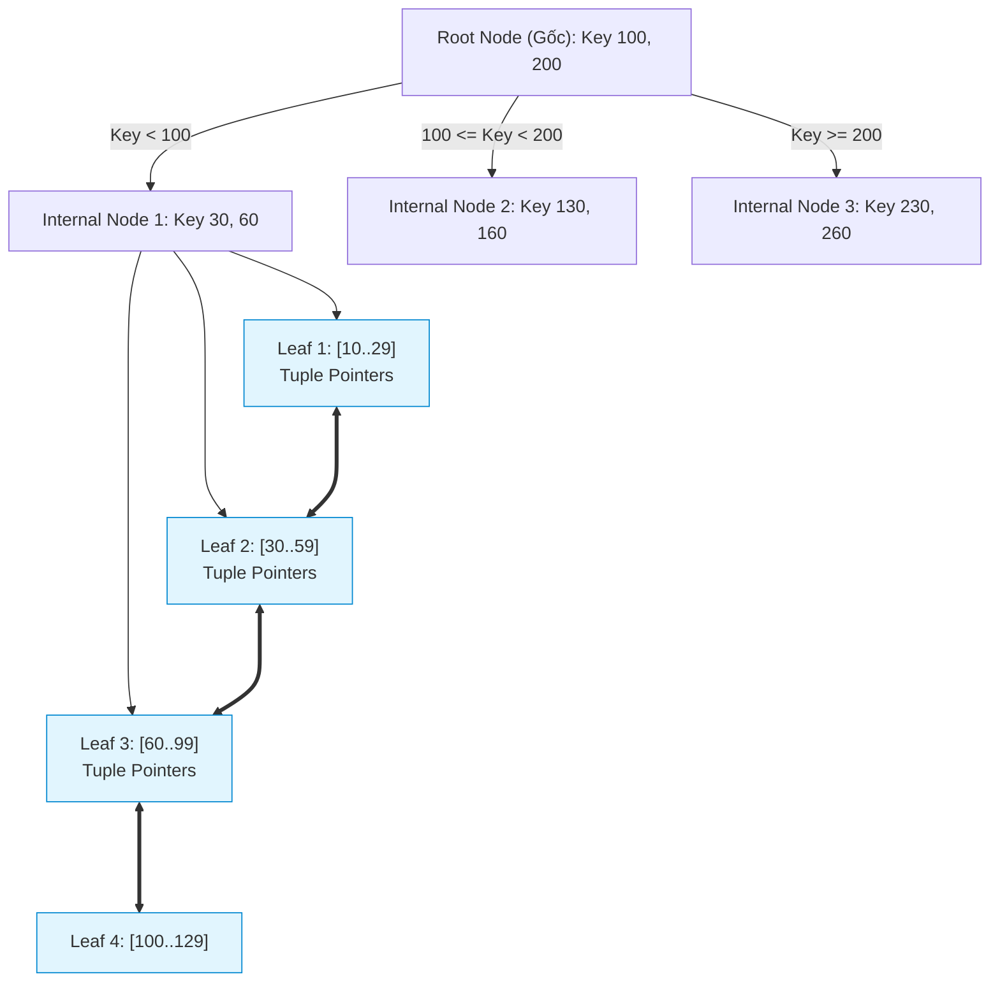
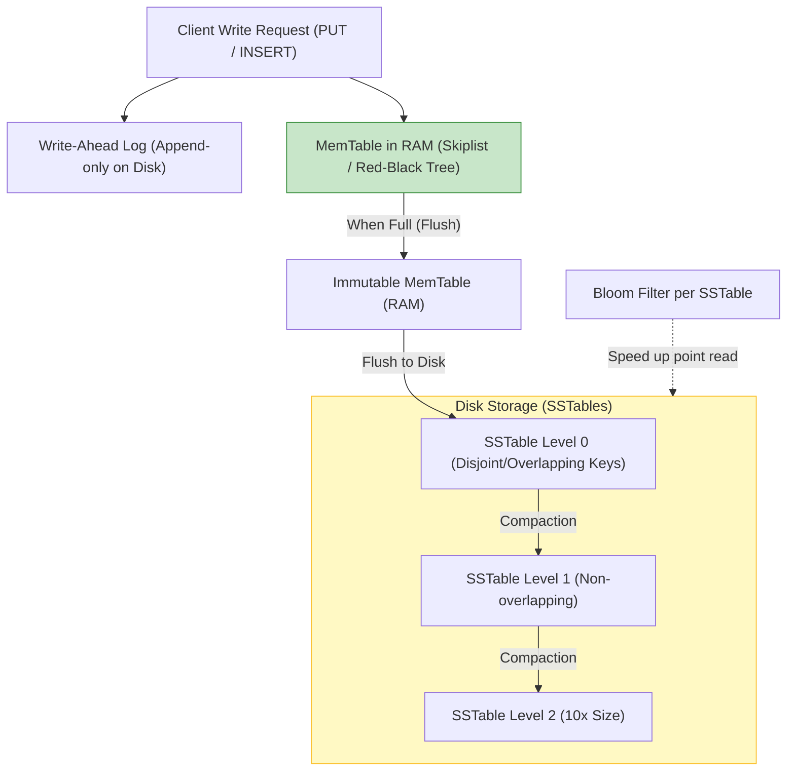
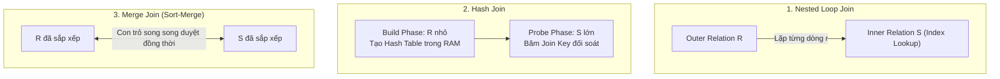

# 📘 MODULE 02: INDEXING & QUERY TUNING SPECIALIST MASTERCLASS
> **Chủ quản (Owner)**: Anh — Lead Architect / Product Owner  
> **Cộng sự Kỹ thuật (Pair-Programmer)**: Em — Senior AI Engineering Agent (Pod 2 Specialist)  
> **Hệ quy chiếu**: PostgreSQL 15/16+ & MySQL 8.0+ (InnoDB) Engine Internals  
> **Vị trí tài liệu**: `knowledge/database_masterclass/MODULE_02_INDEXING_AND_QUERY_TUNING.md`

---

## 📑 MỤC LỤC CHIẾN LƯỢC (TABLE OF CONTENTS)
1. **[Tầng Vật Lý & Cấu Trúc Lưu Trữ Dữ Liệu (Physical Storage & Page Layout Architecture)](#1-tầng-vật-lý--cấu-trúc-lưu-trữ-dữ-liệu-physical-storage--page-layout-architecture)**
   - Khái niệm Block / Page (Kích thước khối dữ liệu)
   - Cấu trúc Slotted Page (Slotted Page Architecture & Line Pointers)
   - Heap Files & Tuple Identifier (ctid / RowID Pointer Mechanics)
   - Xử lý Thuộc tính Quá khổ: PostgreSQL TOAST vs MySQL InnoDB Off-Page Overflow
2. **[Cấu Trúc Giải Thuật Index & Cơ Chế Hoạt Động (Index Data Structures & Algorithms)](#2-cấu-trúc-giải-thuật-index--cơ-chế-hoạt-động-index-data-structures--algorithms)**
   - B-Tree vs B+ Tree: Cấu trúc cân bằng, Fan-out, Node Splitting & Fillfactor
   - LSM-Tree (Log-Structured Merge-tree) vs B-Tree: RUM Conjecture & Storage Engines
   - Hash Index: Cơ chế O(1) Point Lookup & Giới hạn
   - GIN (Generalized Inverted Index): Text Search & JSONB Internals
   - GiST (Generalized Search Tree): Dữ liệu Không gian & Đa chiều (R-Tree / PostGIS)
   - BRIN (Block Range Index): Tối ưu Append-Only Big Data với Zero Memory Footprint
3. **[Kỹ Thuật Mổ Xẻ Kế Hoạch Thực Thi (Query Execution Plan Forensics)](#3-kỹ-thuật-mổ-xẻ-kế-hoạch-thực-thi-query-execution-plan-forensics)**
   - Đọc hiểu `EXPLAIN (ANALYZE, BUFFERS, VERBOSE, SETTINGS)` trên PostgreSQL
   - Đọc hiểu `EXPLAIN FORMAT=JSON` và Visual Explain trên MySQL 8.0+
   - Các Giải thuật Ghép Bảng Nội bộ: Nested Loop Join, Hash Join, Merge Join
   - Cost-based Optimizer (CBO): Sequential Scan vs Index Scan vs Bitmap Index Scan
4. **[Quy Tắc Thiết Kế Composite Index & Kỹ Thuật Chỉ Mục Nâng Cao (Composite Index & Advanced Patterns)](#4-quy-tắc-thiết-kế-composite-index--kỹ-thuật-chỉ-mục-nâng-cao-composite-index--advanced-patterns)**
   - Quy tắc Tiền tố Bên trái (Leftmost Prefix Rule) & Range Gap
   - Index Cardinality & Selectivity: Thứ tự sắp xếp cột tối ưu
   - Covering Index & Index-Only Scan (Cơ chế `INCLUDE` & Visibility Map)
   - Partial Index (Filtered Index) & Expression / Functional Index
5. **[Kịch Bản Benchmark Thực Chiến & Sổ Tay Tra Cứu (Production Benchmarks & Cheat Sheet)](#5-kịch-bản-benchmark-thực-chiến--sổ-tay-tra-cứu-production-benchmarks--cheat-sheet)**
   - Truy vấn chẩn đoán Index Bloat, Unused Index, Duplicate Index
   - Ma trận lựa chọn Index theo khối lượng công việc (Workload Matrix)
   - Bảng tổng hợp Anti-Patterns và quy tắc khắc phục triệt để

---

## 1. TẦNG VẬT LÝ & CẤU TRÚC LƯU TRỮ DỮ LIỆU (PHYSICAL STORAGE & PAGE LAYOUT ARCHITECTURE)

Mọi giải thuật `Index (Chỉ mục)` và kỹ thuật `Query Tuning (Tinh chỉnh Truy vấn)` đều vô nghĩa nếu kỹ sư không nắm vững cách hệ quản trị cơ sở dữ liệu (DBMS) tổ chức từng byte dữ liệu trên đĩa cứng (`Storage Disk / NVMe`).

### 1.1 Khái niệm Block / Page (Kích thước Khối Dữ Liệu)
* **Đơn vị I/O cơ sở**: Hệ điều hành đọc ghi đĩa theo `Sector (Phân khu)` (512 bytes hoặc 4KB Advanced Format). Tuy nhiên, DBMS quản trị I/O thông qua đơn vị trừu tượng gọi là **`Page (Trang dữ liệu)`** hoặc **`Block (Khối)`**.
* **Kích thước mặc định**:
  - **PostgreSQL**: Mặc định là **8 KB** (`8192 bytes`), được định cấu hình tại thời điểm compile (`BLCKSZ`).
  - **MySQL InnoDB**: Mặc định là **16 KB** (`16384 bytes`), định nghĩa bởi `innodb_page_size`.
* **Quy tắc bất biến**: Mỗi lần DBMS cần đọc một dòng dữ liệu (`Tuple / Row`), nó không bao giờ đọc riêng lẻ một vài byte mà bắt buộc phải nạp **toàn bộ Page chứa dòng đó** từ Disk vào `Buffer Pool (Hồ đệm bộ nhớ)` (InnoDB) hoặc `Shared Buffers (Vùng đệm chia sẻ)` (PostgreSQL).

---

### 1.2 Cấu trúc Slotted Page (Slotted Page Architecture & Line Pointers)
Cả PostgreSQL và MySQL InnoDB đều áp dụng kiến trúc **`Slotted Page (Trang dữ liệu chia khe)`** để giải quyết bài toán: *Làm thế nào để lưu trữ các bản ghi có chiều dài biến thiên (`Variable-length Records`) mà không gây phân mảnh nội vi (`Internal Fragmentation`)?*

#### Sơ đồ Cấu trúc Slotted Page (PostgreSQL Page Layout)
```text
+-----------------------------------------------------------------------+
| PAGE HEADER (24 bytes)                                                |
| - pd_lsn (8B)      : Log Sequence Number cho WAL                      |
| - pd_checksum (2B) : Kiểm tra toàn vẹn khối                           |
| - pd_flags (2B)    : Cờ trạng thái (full, dirty, etc.)                |
| - pd_lower (2B)    : Offset trỏ tới cuối mảng Line Pointer (ItemId)   |
| - pd_upper (2B)    : Offset trỏ tới đầu của Tuple gần nhất            |
| - pd_special (2B)  : Dành riêng cho cấu trúc đặc biệt (vd: B-Tree)    |
+-----------------------------------------------------------------------+
| LINE POINTER ARRAY / ItemIdData (Phát triển TỪ TRÊN XUỐNG DƯỚI)       |
| [ ItemId 1: lp_off (15b), lp_flags (2b), lp_len (15b) ] (4 bytes)    |
| [ ItemId 2: lp_off (15b), lp_flags (2b), lp_len (15b) ] (4 bytes)    |
| [ ItemId 3: lp_off (15b), lp_flags (2b), lp_len (15b) ] (4 bytes)    |
|                               |                                       |
|                               v (pd_lower)                            |
+-----------------------------------------------------------------------+
|                          FREE SPACE (KHOẢNG TRỐNG)                     |
|                   (Co lại khi thêm Tuple hoặc Line Pointer)           |
+-----------------------------------------------------------------------+
|                               ^ (pd_upper)                            |
|                               |                                       |
| TUPLE DATA STORAGE (Phát triển TỪ DƯỚI LÊN TRÊN)                      |
| [ Tuple 3 Header + Data Payload .................................... ]|
| [ Tuple 2 Header + Data Payload .................................... ]|
| [ Tuple 1 Header + Data Payload .................................... ]|
+-----------------------------------------------------------------------+
| SPECIAL SPACE (Tuỳ chọn: Leaf links của Index B-Tree, etc.) (0-N bytes)|
+-----------------------------------------------------------------------+
```

#### Cơ chế vận hành chi tiết:
1. **Mảng Line Pointer (`ItemId Array`)**: Nằm ngay sau Page Header, chiếm 4 bytes cho mỗi phần tử. Line pointer lưu trữ:
   - `lp_off`: Con trỏ byte offset xác định vị trí bắt đầu của Tuple tính từ đầu trang.
   - `lp_flags`: Trạng thái (0: Unused, 1: Used/Normal, 2: HOT-redirected, 3: Dead).
   - `lp_len`: Độ dài thực của Tuple tính theo bytes.
2. **Khoảng trống hai đầu (`Dual-directional Growth`)**:
   - Line Pointer mọc dần xuống dưới (`pd_lower` tăng dần).
   - Dữ liệu Tuple thực tế được đẩy từ đáy trang ngược lên trên (`pd_upper` giảm dần).
   - Khi `pd_lower >= pd_upper`, Page được coi là đầy (`Page Full`).
3. **Lợi ích kiến trúc của Slotted Page**:
   - **Ổn định địa chỉ (`Address Stability`)**: Bên ngoài (Index, Foreign Keys) chỉ trỏ tới `Item Pointer (Line Index)` chứ không trỏ tới vị trí vật lý tuyệt đối của Tuple. Khi một dòng được cập nhật co giãn kích thước hoặc được `VACUUM` dồn trang, offset trong `lp_off` thay đổi nhưng chỉ số Line Pointer giữ nguyên. Không một Index nào bị vỡ con trỏ!

---

### 1.3 Heap Files & Tuple Identifier (ctid / RowID Pointer Mechanics)

#### PostgreSQL Heap File Mechanics:
* Bảng trong PostgreSQL được lưu dưới dạng **`Heap File (Tập tin đống vô trật tự)`**. Các dòng được ghi vào bất kỳ Page nào còn đủ khoảng trống (`Free Space Map - FSM`).
* Mỗi Tuple được định danh duy nhất trong toàn bộ cơ sở dữ liệu bằng **`ctid (Current Tuple Identifier)`** dạng:
  $$\text{ctid} = (\text{Block Number}, \text{Offset Index})$$
  *(Ví dụ: `(42, 3)` nghĩa là Page số 42, Line Pointer số 3)*.
* Mọi Secondary Index (B-Tree, Hash, GIN...) trong PostgreSQL đều trỏ trực tiếp đến `ctid` này.

#### So sánh với MySQL InnoDB Clustered Index (Chỉ mục Phân cụm):
* **InnoDB không dùng Heap File thuần túy**: Bảng trong InnoDB chính là một cây **`B+ Tree Clustered Index`** sắp xếp vật lý theo `Primary Key (Khóa chính)`. Dữ liệu các cột đều nằm tại các Node lá của cây này.
* **Secondary Index trong InnoDB**: Không lưu địa chỉ vật lý (`Block, Offset`), mà lưu **giá trị của Primary Key**.
* **Đánh đổi kiến trúc (`Architectural Trade-offs`)**:

| Đặc tính Kiến trúc | PostgreSQL (Heap File + Direct `ctid`) | MySQL InnoDB (Clustered Index + PK Pointer) |
| :--- | :--- | :--- |
| **Tốc độ Secondary Index Seek** | **Cực nhanh (1 lượt đọc Index + 1 lượt đọc Heap Page)** | **Chậm hơn (Double Lookup)**: Đọc Secondary Index tìm ra PK $\to$ Tra tiếp cây Clustered Index để lấy dữ liệu dòng (`Bookmark Lookup`). |
| **Tác động khi UPDATE dòng** | Nếu kích thước thay đổi hoặc không dùng được HOT $\to$ Dòng dời sang Page mới $\to$ **Phải cập nhật TẤT CẢ các Secondary Index** trỏ về `ctid` mới. | Nếu Primary Key không đổi $\to$ Dòng dời trang chỉ cần đổi trong Clustered B+ Tree, **toàn bộ Secondary Index giữ nguyên không cần sửa**. |
| **Range Scan theo Primary Key** | Dữ liệu nằm rải rác trên các Heap Pages $\to$ Random I/O cao nếu chưa được `CLUSTER`. | **Tuần tự hoàn hảo (Sequential I/O)**: Toàn bộ lá của Clustered Index được liên kết song hướng. |

---

### 1.4 Xử lý Thuộc tính Quá khổ: PostgreSQL TOAST vs MySQL InnoDB Off-Page Storage

Một Page có kích thước hữu hạn (8KB / 16KB). Khi một dòng chứa chuỗi văn bản lớn (`TEXT`, `VARCHAR(65535)`), JSON (`JSONB`), hoặc nhị phân (`BLOB`), kích thước của nó có thể vượt quá kích thước một Page.

#### A. PostgreSQL: Kỹ thuật TOAST (The Oversized-Attribute Storage Technique)
* **Ngưỡng kích hoạt**: Khi kích thước Tuple vượt quá `TOAST_TUPLE_THRESHOLD` (khoảng 2 KB, tức 1/4 Page 8KB), PostgreSQL tự động kích hoạt cơ chế TOAST.
* **Quy trình 4 chiến lược TOAST (`Toast Strategies`)**:
  1. `PLAIN`: Không nén, không lưu out-of-line (chỉ dùng cho kiểu dữ liệu cố định như `INTEGER`).
  2. `EXTENDED`: Cho phép cả **nén dữ liệu (Compression)** và **lưu trữ ngoài trang (Out-of-line)**. (Mặc định cho hầu hết kiểu văn bản).
  3. `EXTERNAL`: Cho phép lưu out-of-line nhưng **tuyệt đối không nén** (thích hợp cho dữ liệu đã nén sẵn như JPEG/ZIP).
  4. `MAIN`: Ưu tiên nén nội bộ trong Page; chỉ khi nén xong vẫn không vừa trang mới chuyển sang out-of-line.
* **Cơ chế Chunking**: Bảng TOAST phụ (`pg_toast_xxxx`) chia nhỏ dữ liệu thành các đoạn `Toast Chunks` (mỗi chunk ~2KB). Tuple gốc chỉ lưu một `Toast Pointer` (gồm OID của bảng toast và chunk ID) dài 18 bytes.
* **Tác động hiệu năng**: Truy vấn không chọn cột TOAST (`SELECT id, status FROM table`) sẽ **hoàn toàn không tốn I/O** nạp các trường dữ liệu khổng lồ.

#### B. MySQL InnoDB: Off-Page Storage & Row Formats
* **Row Formats trong InnoDB**:
  - `COMPACT` (Antelope): Lưu 768 bytes tiền tố (`Prefix`) của cột BLOB/TEXT ngay trên trang gốc; phần còn lại lưu tại các `Overflow Pages`.
  - `DYNAMIC` (Barracuda - Mặc định từ MySQL 5.7+): **Tối ưu vượt trội**. InnoDB chỉ lưu một con trỏ 20 bytes trên trang chính (`In-page pointer`), toàn bộ nội dung của BLOB/TEXT được đẩy ra các trang `Off-page Overflow`.
* **Hậu quả của Off-Page Storage**: Khi thực hiện `SELECT *` trên bảng có 20 cột `TEXT/VARCHAR` dài, engine phải thực hiện hàng chục lượt Random Read để lắp ráp dữ liệu từ các Overflow Pages, gây sụt giảm `Throughput (Thông lượng)` nghiêm trọng.

---

## 2. CẤU TRÚC GIẢI THUẬT INDEX & CƠ CHẾ HOẠT ĐỘNG (INDEX DATA STRUCTURES & ALGORITHMS)



### 2.1 B-Tree vs B+ Tree: Cấu Trúc Cân Bằng, Fan-out, Node Splitting & Fillfactor

Hầu hết các hệ quản trị CSDL quan hệ đều sử dụng **`B+ Tree`** làm giải thuật chỉ mục mặc định (dù câu lệnh SQL thường viết là `USING BTREE`).

#### Tại sao B+ Tree được chọn thay vì B-Tree kinh điển?
1. **Dữ liệu chỉ nằm ở Leaf Nodes**: Trong B-Tree, mỗi Node (kể cả Internal Node) đều phải mang theo con trỏ dữ liệu (`Tuple Pointer / Data Record`). Trong B+ Tree, các Internal Nodes **chỉ lưu Key và Child Pointer**.
2. **Hệ số rẽ nhánh (Fan-out) cực đại**:
   - Vì Internal Node chỉ chứa Key và Pointer (kích thước rất nhỏ, vd: 8 bytes Key + 8 bytes Pointer = 16 bytes), một Page 8KB có thể chứa:
     $$\text{Fan-out } (B) \approx \frac{8192 \text{ bytes}}{16 \text{ bytes}} \approx 500$$
   - Fan-out cao đồng nghĩa với việc cây có **chiều cao cực thấp (`Low Tree Depth`)**.
3. **Tính toán Chiều cao Cây (Tree Depth Calculation)**:
   - Với Fan-out $B = 500$:
     - Tầng 1 (Root): $1 \text{ Node} \to 500 \text{ con trỏ}$.
     - Tầng 2: $500 \text{ Nodes} \to 250,000 \text{ con trỏ}$.
     - Tầng 3: $250,000 \text{ Leaf Nodes}$. Nếu mỗi Leaf Node chứa 100 bản ghi $\to$ Quản lý được **$25,000,000$ bản ghi (25 triệu dòng)** chỉ với **chiều cao cây $h = 3$**!
   - Điều này đồng nghĩa: Để tìm kiếm 1 bản ghi bất kỳ trong 25 triệu dòng, hệ thống chỉ mất tối đa **3 lượt I/O đọc Page** (trong đó Root và Tầng 2 hầu như luôn nằm sẵn trong Cache RAM).
4. **Doubly-Linked List tại Leaf Nodes**: Toàn bộ Node lá được liên kết với nhau bằng danh sách liên kết kép (`Bi-directional Linked List`). Các truy vấn quét dải (`Range Scan`: `WHERE age BETWEEN 20 AND 30`) chỉ cần đi từ Root xuống lá đầu tiên ($O(\log N)$), sau đó duyệt ngang tuần tự theo con trỏ lá ($O(K)$) mà không cần quay ngược lên các tầng cha.

#### Cơ chế Tách Nút (Node Splitting) & Suy thoái Hiệu năng:
* Khi một Node lá bị đầy mà có thao tác `INSERT` một bản ghi mới rơi vào Node đó:
  1. DBMS phải cấp phát một Page mới.
  2. Di chuyển 50% số Keys sang Page mới (**`50-50 Node Split`**).
  3. Thêm một Key phân tách lên Node cha. Nếu Node cha đầy, tiếp tục tách đệ quy lên Root (tăng chiều cao cây).
* **Phân mảnh Index (Index Bloat / Fragmentation)**: Tách nút gây tốn kém CPU, sinh ra nhiều trang chỉ đầy 50%, làm tăng kích thước bộ nhớ đệm và phân mảnh vật lý trên đĩa.
* **Chiến lược Fillfactor**:
  - `fillfactor` trong PostgreSQL (mặc định 90 cho B-Tree, 100 cho Heap) hoặc `innodb_fill_factor` trong MySQL (mặc định 100):
  - Khi đặt `fillfactor = 70`, DBMS sẽ chừa lại 30% khoảng trống trên mỗi Leaf Page khi tạo Index. Khi có các thao tác `UPDATE` hoặc `INSERT` xen kẽ, dữ liệu sẽ lấp vào khoảng trống này thay vì kích hoạt `Node Splitting`.
* **Cơ chế HOT (Heap-Only Tuples) trong PostgreSQL**:
  - Khi một dòng được cập nhật mà **không làm thay đổi các cột có đánh Index**, và Page chứa dòng đó còn đủ chỗ trống:
  - Bản ghi mới được ghi ngay trong cùng Page. Line Pointer cũ chuyển trạng thái sang `HOT-redirect` trỏ sang bản ghi mới.
  - **Secondary Index hoàn toàn không bị cập nhật!** Triệt tiêu 100% Write Amplification trên các cây B-Tree của bảng.

---

### 2.2 LSM-Tree (Log-Structured Merge-tree) vs B-Tree: RUM Conjecture & Storage Engines

Trong khi B-Tree tối ưu cho việc đọc ngẫu nhiên (`Random Read`), cấu trúc **`LSM-Tree`** (được sử dụng trong RocksDB, Cassandra, ScyllaDB, ClickHouse, TiKV) được thiết kế chuyên biệt để giải quyết thắt nút cổ chai ghi dữ liệu (`Write Bottleneck`).



#### So sánh B-Tree và LSM-Tree theo Giả thuyết RUM (RUM Conjecture):
*Giả thuyết RUM (Read, Update, Memory/Space Overhead) khẳng định: Không một cấu trúc dữ liệu nào có thể tối ưu đồng thời cả 3 yếu tố. Tối ưu 2 yếu tố bắt buộc phải đánh đổi yếu tố thứ 3.*

| Tiêu chí So sánh | B-Tree (PostgreSQL, InnoDB, Oracle) | LSM-Tree (RocksDB, Cassandra, ClickHouse) |
| :--- | :--- | :--- |
| **Kiểu Ghi (Write Pattern)** | **In-place Update**: Ghi đè trực tiếp lên Page cũ trên Disk $\to$ Nhiều Random Write, gây áp lực lên SSD. | **Append-only**: Ghi tuần tự vào WAL và MemTable trong RAM $\to$ 100% Sequential Write, thông lượng ghi cực cao. |
| **Write Amplification (WA)** | Rất cao: Cập nhật 1 byte cũng phải ghi toàn bộ Page 8KB/16KB xuống đĩa (Doublewrite Buffer). | Trung bình - Cao: Do tiến trình `Compaction` phải liên tục đọc/ghi lại các SSTable trên đĩa. |
| **Read Latency (Point Read)** | **Cực thấp ($O(\log_B N)$)**: Tối đa 3-4 I/O để tìm chính xác bản ghi. | **Biến thiên**: Phải tìm trong MemTable, sau đó dò qua Bloom Filters của từng tầng SSTable. |
| **Dung lượng lưu trữ (Space)** | Bị phân mảnh do Node Splitting, chứa khoảng trống chưa dùng. | **Tối ưu vượt trội**: SSTable là bất biến (`Immutable`) nên được nén cực mạnh (ZSTD, Snappy). |
| **Ứng dụng Phù hợp** | Hệ thống OLTP giao dịch tài chính, thương mại điện tử, yêu cầu đọc nhanh và nhất quán cao. | Hệ thống Log, Time-series, IoT Ingestion, Event Sourcing, Big Data có tỷ lệ Ghi:Đọc $\ge 10:1$. |

---

### 2.3 Hash Index: Cơ Chế O(1) Point Lookup & Giới Hạn

* **Bản chất**: Xây dựng mảng các Bucket dựa trên thuật toán băm (`Hash Function`) giá trị của Key.
* **Độ phức tạp**:
  - Point lookup (`WHERE id = 'user_123'`): $O(1)$.
* **Những giới hạn chết người khiến Hash Index ít được dùng**:
  1. **Không hỗ trợ Range Scan**: Hàm băm phá hủy trật tự tự nhiên. Truy vấn `WHERE age > 25` bắt buộc phải quét toàn bộ bảng (`Full Table Scan`).
  2. **Không hỗ trợ Sorting**: Không thể dùng cho `ORDER BY`.
  3. **Không hỗ trợ Prefix matching**: Không dùng được cho `LIKE 'abc%'`.
  4. **Không hỗ trợ Partial Composite**: Muốn tìm kiếm phải cung cấp đủ tất cả các cột trong Hash Index.
* **Lưu ý thực chiến**: Trong PostgreSQL từ phiên bản 10+, Hash Index đã được ghi WAL (`WAL-logged`) và an toàn khi crash, tuy nhiên B-Tree vẫn chiếm ưu thế áp đảo do tính đa năng.

---

### 2.4 GIN (Generalized Inverted Index): Text Search & JSONB Internals

GIN là cấu trúc **`Inverted Index (Chỉ mục Đảo ngược)`**, cực kỳ mạnh mẽ khi xử lý các kiểu dữ liệu phức hợp có chứa nhiều phần tử bên trong một giá trị đơn lẻ (như `ARRAY`, `JSONB`, `tsvector` cho Full-text search).

#### Cơ chế hoạt động:
* Thay vì ánh xạ `Row -> Giá trị`, GIN đảo ngược thành `Giá trị con tử (Element / Key-Value) -> Danh sách RowIDs (Posting List)`.
* **Cấu trúc lưu trữ**:
  - Danh sách các Key con được lưu trong một cây B-Tree nội bộ (`Entry Tree`).
  - Với mỗi Key con, nếu số lượng `ctid` nhỏ, nó được lưu dưới dạng danh sách mảng thẳng (`Posting List`).
  - Nếu số lượng `ctid` quá lớn (vd: từ khóa xuất hiện trong hàng triệu dòng), GIN tự động chuyển Posting List thành một cây B-Tree thứ cấp gọi là **`Posting Tree`**.

```text
JSONB Documents:
Row 1: {"tags": ["sql", "postgres"], "verified": true}
Row 2: {"tags": ["postgres", "nosql"]}
Row 3: {"tags": ["sql", "performance"]}

GIN Inverted Index:
Key: "nosql"       --> Posting List: [ Row 2 ]
Key: "performance" --> Posting List: [ Row 3 ]
Key: "postgres"    --> Posting List: [ Row 1, Row 2 ]
Key: "sql"         --> Posting List: [ Row 1, Row 3 ]
Key: "verified"    --> Posting List: [ Row 1 ]
```

* **Toán tử tăng tốc**:
  - JSONB containment: `WHERE data @> '{"tags": ["postgres"]}'`
  - Array overlap: `WHERE tags && ARRAY['sql']`
  - Full-text search: `WHERE vector_col @@ to_tsquery('indexing & tuning')`
* **Kỹ thuật `fastupdate`**: GIN cập nhật rất tốn kém vì 1 dòng có thể tạo ra hàng trăm entries. Tham số `fastupdate = on` (mặc định) cho phép ghi tạm các thay đổi vào một `Pending List` nhỏ và gộp (`Merge`) vào cây GIN chính thức sau đó (qua `VACUUM` hoặc khi pending list đạt `gin_pending_list_limit`).

---

### 2.5 GiST (Generalized Search Tree): Dữ liệu Không gian & Đa chiều (R-Tree / PostGIS)

* **Bản chất**: GiST là một khung sườn kiến trúc trừu tượng (`Template Framework`) cho phép lập trình viên định nghĩa các kiểu phân vùng cây cân bằng tùy ý.
* **Ứng dụng kinh điển: R-Tree cho Dữ liệu Không gian**:
  - Gom các đối tượng hình học (Point, Polygon, Line) vào các **`Bounding Box (Hộp giới hạn nhỏ nhất - BBox / MBR)`**.
  - Các BBox cấp thấp được gom vào BBox cấp cao hơn tạo thành một cây phân cấp.
* **Toán tử hỗ trợ**:
  - Giao nhau (`Overlap`): `WHERE geom1 && geom2`
  - Nằm trong (`Contains`): `WHERE geom1 @> geom2`
  - Tìm K láng giềng gần nhất (`KNN - K-Nearest Neighbors`): `ORDER BY geom <-> point LIMIT 10` (Sử dụng trực tiếp Index để tính khoảng cách mà không cần quét toàn bảng).

---

### 2.6 BRIN (Block Range Index): Tối ưu Append-Only Big Data với Zero Memory Footprint

BRIN là vũ khí tối thượng của PostgreSQL dành cho các bảng dữ liệu khổng lồ hàng tỷ dòng (`Time-series`, `IoT Sensor Logs`, `Financial Ledger Audits`).

#### Nguyên lý Hoạt động:
* BRIN không đánh index trên từng dòng riêng lẻ!
* Nó chia bảng thành các dãy khối liên tiếp (mặc định `pages_per_range = 128` blocks $\approx 1 \text{ MB}$).
* Với mỗi dãy 128 blocks, BRIN chỉ lưu đúng 2 giá trị: **`Giá trị Nhỏ nhất (Min)`** và **`Giá trị Lớn nhất (Max)`**.

```text
[ Page 001 ... Page 128 ]  --> BRIN Range 1: Min: 2026-01-01, Max: 2026-01-05
[ Page 129 ... Page 256 ]  --> BRIN Range 2: Min: 2026-01-06, Max: 2026-01-10
[ Page 257 ... Page 384 ]  --> BRIN Range 3: Min: 2026-01-11, Max: 2026-01-15
```

#### Phép so sánh Kích thước & Hiệu năng:
* **Bảng 100 GB Logs (100 triệu dòng, trường `created_at` tăng dần tuần tự)**:
  - B-Tree Index: Chiếm khoảng **2.5 GB - 3.5 GB** dung lượng RAM/Disk.
  - BRIN Index: Chiếm khoảng **vài trăm KB (dưới 1 MB)**! Tỷ lệ nén chỉ mục lên tới $99.9\%$.
* **Điều kiện tiên quyết**: Dữ liệu phải có tính **tương quan vật lý cao (`High Physical Correlation`)** với thứ tự sắp xếp trên đĩa. Nếu dữ liệu bị xáo trộn ngẫu nhiên, Min/Max của các range sẽ chồng chéo nhau, khiến BRIN mất tác dụng lọc.

---

## 3. KỸ THUẬT MỔ XẺ KẾ HOẠCH THỰC THI (QUERY EXECUTION PLAN FORENSICS)

### 3.1 Đọc Hiểu `EXPLAIN (ANALYZE, BUFFERS, VERBOSE, SETTINGS)` trên PostgreSQL

Lệnh `EXPLAIN` tiêu chuẩn chỉ đưa ra **ước lượng** của Cost-based Optimizer. Để mổ xẻ sự thật đang diễn ra trong CPU và Buffer Pool, bắt buộc phải dùng cụm lệnh nâng cao:

```sql
EXPLAIN (ANALYZE, BUFFERS, VERBOSE, SETTINGS, TIMING)
SELECT u.id, u.email, o.total_amount
FROM users u
JOIN orders o ON u.id = o.user_id
WHERE u.created_at >= '2026-01-01' 
  AND o.status = 'PAID';
```

#### Giải phẫu một Output Thực tế:
```text
Hash Join  (cost=142.50..5890.20 rows=1520 width=48) (actual time=2.140..18.450 rows=1450 loops=1)
  Output: u.id, u.email, o.total_amount
  Hash Cond: (o.user_id = u.id)
  Buffers: shared hit=845 read=120 dirtied=2
  ->  Seq Scan on orders o  (cost=0.00..4980.00 rows=15200 width=16) (actual time=0.045..12.300 rows=15100 loops=1)
        Output: o.id, o.user_id, o.total_amount, o.status
        Filter: ((o.status)::text = 'PAID'::text)
        Rows Removed by Filter: 84900
        Buffers: shared hit=420 read=95
  ->  Hash  (cost=120.00..120.00 rows=1800 width=40) (actual time=2.050..2.050 rows=1750 loops=1)
        Output: u.id, u.email
        Buckets: 2048  Batches: 1  Memory Usage: 125kB
        Buffers: shared hit=425 read=25
        ->  Bitmap Heap Scan on users u  (cost=12.20..120.00 rows=1800 width=40) (actual time=0.350..1.450 rows=1750 loops=1)
              Output: u.id, u.email
              Recheck Cond: (u.created_at >= '2026-01-01 00:00:00'::timestamp)
              Rows Removed by Index Recheck: 0
              Buffers: shared hit=425 read=25
              ->  Bitmap Index Scan on idx_users_created_at  (cost=0.00..11.75 rows=1800 width=0) (actual time=0.280..0.280 rows=1750 loops=1)
                    Index Cond: (u.created_at >= '2026-01-01 00:00:00'::timestamp)
                    Buffers: shared hit=5
Planning Time: 0.420 ms
Execution Time: 19.120 ms
```

#### Bảng Kiểm Định Các Chỉ Số Cốt Tử (Forensic Checklist):
1. **`cost=142.50..5890.20`**:
   - `142.50` (**Startup Cost**): Chi phí ước lượng để tạo ra dòng đầu tiên (vd: thời gian xây dựng Hash table).
   - `5890.20` (**Total Cost**): Tổng chi phí ước lượng để trả về toàn bộ kết quả.
   - *Đơn vị*: Arbitrary unit, chuẩn hóa dựa trên `seq_page_cost = 1.0`, `random_page_cost = 4.0` (trên SSD thường chỉnh về `1.1`).
2. **`rows=1800 (actual rows=1750)`**:
   - So sánh giữa ước lượng của Optimizer (`rows=1800`) và thực tế chạy (`actual rows=1750`).
   - Nếu sai số lệch nhau hàng chục hoặc hàng nghìn lần (vd: ước lượng 1 dòng nhưng thực tế trả ra 1,000,000 dòng) $\to$ **Thống kê đã quá hạn (`Outdated Statistics`)**. Optimizer đã chọn sai kế hoạch. Cần chạy ngay `ANALYZE table_name;` hoặc tăng `default_statistics_target`.
3. **`Buffers: shared hit=845 read=120`**:
   - `shared hit`: Số Page 8KB được tìm thấy ngay trong RAM (`Shared Buffers`).
   - `read`: Số Page bắt buộc phải đọc vật lý từ Disk (hoặc OS Page Cache).
   - Tổng dữ liệu I/O thực tế: $(845 + 120) \times 8 \text{ KB} = 7,720 \text{ KB} \approx 7.5 \text{ MB}$.
4. **`Rows Removed by Filter: 84900`**:
   - **Tín hiệu cảnh báo đỏ!** Database đã đọc lên 100,000 dòng từ đĩa nhưng vứt bỏ tới 84,900 dòng vì không có Index phù hợp cho mệnh đề `WHERE status = 'PAID'`. Đây là đối tượng cần tối ưu Index ngay lập tức.

---

### 3.2 Đọc Hiểu `EXPLAIN FORMAT=JSON` và Visual Explain trên MySQL 8.0+

Trên MySQL, câu lệnh `EXPLAIN FORMAT=JSON` hiển thị chi tiết các chi phí tính toán (`cost_info`), cấu trúc Join và phân bổ bộ nhớ:

```json
{
  "query_block": {
    "select_id": 1,
    "cost_info": {
      "query_cost": "1254.80"
    },
    "nested_loop": [
      {
        "table": {
          "table_name": "u",
          "access_type": "range",
          "possible_keys": ["idx_created_at"],
          "key": "idx_created_at",
          "used_key_parts": ["created_at"],
          "key_length": "5",
          "rows_examined_per_scan": 1750,
          "rows_produced_per_join": 1750,
          "filtered": "100.00",
          "cost_info": {
            "read_cost": "350.20",
            "eval_cost": "175.00",
            "prefix_cost": "525.20",
            "data_read_per_join": "280K"
          }
        }
      },
      {
        "table": {
          "table_name": "o",
          "access_type": "ref",
          "possible_keys": ["idx_user_id"],
          "key": "idx_user_id",
          "used_key_parts": ["user_id"],
          "key_length": "8",
          "ref": ["mydb.u.id"],
          "rows_examined_per_scan": 5,
          "rows_produced_per_join": 8750,
          "filtered": "10.00",
          "attached_condition": "(`mydb`.`o`.`status` = 'PAID')"
        }
      }
    ]
  }
}
```

#### Phổ Phân Cấp `access_type` Từ Tốt Nhất Đến Tệ Nhất (MySQL Hierarchy):
1. `system`: Bảng chỉ có 1 dòng (bảng hệ thống).
2. `const`: Tìm kiếm theo Primary Key hoặc Unique Index với giá trị hằng số ($O(1)$).
3. `eq_ref`: 1 dòng được đọc ra từ bảng này cho mỗi kết hợp dòng từ bảng trước (Primary/Unique Key trong phép Join).
4. `ref`: Sử dụng Index không phải Unique (tìm thấy nhiều dòng có cùng Key).
5. `range`: Quét một dải giá trị trên Index (`BETWEEN`, `>`, `<`, `IN`).
6. `index`: **Full Index Scan** - Quét toàn bộ cây Index từ đầu đến cuối (vẫn nhanh hơn quét bảng nếu Index nhỏ hơn Data).
7. `ALL`: **Full Table Scan** - Quét toàn bộ dữ liệu trên đĩa. Tệ nhất nếu xảy ra trên bảng lớn.

---

### 3.3 Các Giải Thuật Ghép Bảng Nội Bộ (Internal Join Algorithms)

Khi thực hiện phép `JOIN` giữa 2 bảng ($R$ và $S$), Optimizer sẽ lựa chọn một trong 3 giải thuật nội bộ tùy theo kích thước, index và bộ nhớ:



#### 1. Nested Loop Join (Vòng Lặp Lồng Nhau)
* **Nguyên lý**: 
  ```text
  FOR each row r in Outer_Table:
      FOR each row s in Inner_Table:
          IF r.key == s.key THEN emit(r, s)
  ```
* **Khi nào tối ưu**: Bảng bên ngoài (`Outer Table`) có kích thước rất nhỏ (sau khi đã lọc `WHERE`), và bảng bên trong (`Inner Table`) có **Index chất lượng cao** trên cột Join Key (`Index Nested Loop`).
* **Độ phức tạp**: $O(|R| \times \log |S|)$.

#### 2. Hash Join (Ghép Nối Băm)
* **Nguyên lý**: Chia làm 2 pha rõ rệt:
  - **Phase 1: Build Phase**: Đọc toàn bộ bảng nhỏ hơn (đã lọc), băm Join Key và nạp vào một Hash Table trong RAM (`work_mem` trong Postgres, `join_buffer_size` trong MySQL 8.0.18+).
  - **Phase 2: Probe Phase**: Quét tuần tự qua bảng lớn hơn, băm Join Key của từng dòng và tra cứu tức thì trong Hash Table vừa tạo.
* **Xử lý khi Tràn Bộ Nhớ (Grace Hash Join / Spilling to Disk)**:
  - Nếu Hash Table vượt quá kích thước `work_mem`, hệ thống chuyển sang **`Multi-batch Hash Join`**.
  - Chia cả 2 bảng thành nhiều `Partitions / Batches` nhỏ hơn lưu tạm vào đĩa (`Temp Workfiles`), sau đó nạp từng batch vào RAM để join tuần tự. Hiệu năng sẽ sụt giảm do Disk I/O.
* **Độ phức tạp**: $O(|R| + |S|)$ trong điều kiện RAM đủ chứa bảng nhỏ.

#### 3. Merge Join (Sort-Merge Join)
* **Nguyên lý**:
  - Yêu cầu cả 2 tập dữ liệu **phải được sắp xếp theo Join Key**.
  - Hai con trỏ duyệt song song từ đầu đến cuối 2 tập dữ liệu như thuật toán Merge Sort.
* **Khi nào tối ưu**:
  - Dữ liệu của 2 bảng đã được Index sắp xếp sẵn theo Join Key.
  - Cả 2 bảng đều rất lớn, không bảng nào có thể nhét vừa vào bộ nhớ RAM để làm Hash Table.
* **Độ phức tạp**: $O(|R| + |S|)$ sau khi đã sort.

---

### 3.4 Cost-based Optimizer (CBO): Sequential Scan vs Index Scan vs Bitmap Index Scan

Một trong những câu hỏi kinh điển nhất của kỹ sư: *"Tại sao bảng có Index mà Database vẫn chạy Sequential Scan (Full Table Scan)?"*

#### Nghịch lý I/O: Random I/O vs Sequential I/O
* **Đọc Index (`Index Scan`)**:
  - Đọc Index Leaf Page $\to$ Lấy được `ctid` (hoặc PK) $\to$ Nhảy sang Heap Page đọc dòng dữ liệu.
  - Mỗi dòng dữ liệu nằm ở một Heap Page ngẫu nhiên $\to$ **100% Random I/O**.
* **Đọc Toàn Bảng (`Sequential Scan`)**:
  - Đọc liên tục các Page từ đầu file đến cuối file $\to$ **Sequential I/O**.
  - Hệ điều hành và phần cứng SSD kích hoạt cơ chế **`Read-ahead (Đọc đón đầu)`**, nạp hàng chục Page cùng lúc vào bộ đệm với băng thông bus tối đa.
* **Ngưỡng Đảo Chiều (The Tipping Point)**:
  - Khi câu truy vấn chọn ra trên **5% - 20% tổng số dòng** của bảng, chi phí Random I/O của việc đọc Index cộng dồn lại sẽ **lớn hơn nhiều** so với chi phí đọc lướt qua toàn bộ bảng bằng Sequential I/O!
  - Lúc này, Cost-based Optimizer sẽ **thông minh loại bỏ Index** và quyết định dùng `Sequential Scan`.

#### Cứu cánh: Bitmap Index Scan (PostgreSQL)
Để khắc phục điểm yếu Random I/O của Index Scan mà không phải Sequential Scan toàn bộ bảng, PostgreSQL phát minh ra giải thuật **`Bitmap Index Scan`**:
1. **Bitmap Index Scan Phase**: Quét cây Index, lấy toàn bộ các con trỏ `ctid` thỏa mãn điều kiện. Thay vì nhảy sang Heap ngay, nó đánh dấu các vị trí này vào một **Mảng Bitmap trong RAM**:
   - `Bitmap[Page_ID, Offset_Bit] = 1`.
2. **Bitmap Heap Scan Phase**:
   - Mảng Bitmap tự động được sắp xếp lại **theo đúng thứ tự vật lý của các Page trên đĩa cứng**.
   - Database duyệt qua các Page từ nhỏ đến lớn, biến toàn bộ các thao tác Random I/O rời rạc thành một chuỗi **Sequential I/O có định hướng**.
   - Hỗ trợ phép toán Logic: Nếu có 2 điều kiện `WHERE status = 'PAID' AND created_at >= '2026-01-01'`, PostgreSQL có thể quét 2 Index riêng biệt, tạo ra 2 Bitmap và thực hiện phép **`BitmapAnd`** (hoặc `BitmapOr`) bitwise siêu tốc trong RAM trước khi chạm vào bảng Heap!

---

## 4. QUY TẮC THIẾT KẾ COMPOSITE INDEX & KỸ THUẬT CHỈ MỤC NÂNG CAO (COMPOSITE INDEX & ADVANCED PATTERNS)

### 4.1 Quy Tắc Tiền Tố Bên Trái (Leftmost Prefix Rule) & Range Gap

Một `Composite Index (Chỉ mục Kết hợp)` trên 3 cột `(A, B, C)` được tổ chức sắp xếp vật lý theo thứ tự: *Sắp xếp theo A trước; nếu A bằng nhau thì sắp xếp theo B; nếu B bằng nhau thì sắp xếp theo C*.

#### Mô hình Cây Chỉ mục Composite `(A, B, C)`:
```text
Index Entry: (col_A, col_B, col_C)
----------------------------------
(10, 'HN', 'ACTIVE')
(10, 'HN', 'PENDING')
(10, 'SG', 'ACTIVE')
(20, 'DN', 'ACTIVE')
(20, 'SG', 'INACTIVE')
```

#### Ma trận Khả năng Tận dụng Index:
| Câu lệnh Truy vấn (`WHERE Clause`) | Khả năng sử dụng Index | Giải thích cơ chế nội bộ |
| :--- | :---: | :--- |
| `WHERE A = 10 AND B = 'HN' AND C = 'ACTIVE'` | **Tối ưu 100% (Full Seek)** | Sử dụng toàn bộ 3 phần tử của Index để thu hẹp phạm vi chính xác. |
| `WHERE A = 10 AND B = 'HN'` | **Tối ưu (Prefix Match)** | Tận dụng tiền tố 2 cột đầu `(A, B)`. |
| `WHERE A = 10` | **Tối ưu (Prefix Match)** | Tận dụng cột đầu tiên `(A)`. |
| `WHERE B = 'HN' AND C = 'ACTIVE'` | **KHÔNG DÙNG ĐƯỢC (Index Skip)** | Vi phạm tiền tố bên trái (thiếu `A`). Phải Full Scan Index hoặc Table. |
| `WHERE A = 10 AND C = 'ACTIVE'` | **Dùng 1 phần (`A` Seek, `C` Filter)** | Dùng Index để seek đến `A = 10`. Cột `C` không thể seek được mà chỉ đóng vai trò lọc (`Index Condition Pushdown - ICP`). |
| `WHERE A = 10 AND B > 'HN' AND C = 'ACTIVE'` | **Bị gãy dải tại `B` (`Range Gap`)** | Cột `A` seek đẳng thức. Cột `B` quét dải (`Range`). **Kể từ sau điều kiện dải của `B`, cột `C` mất khả năng Index Seek**, chỉ dùng làm Filter! |

---

### 4.2 Index Cardinality & Selectivity: Thứ tự Sắp xếp Cột Tối ưu

* **Độ chọn lọc (Selectivity)**:
  $$\text{Selectivity} = \frac{\text{Số giá trị duy nhất (Cardinality / Distinct Values)}}{\text{Tổng số dòng trong bảng (Total Rows)}}$$
  - Selectivity càng tiệm cận **$1.0$ (100%)**, Index càng mạnh (vd: `email`, `user_id`, `uuid`).
  - Selectivity thấp (vd: `gender` chỉ có 2 giá trị, `status` có 4 giá trị) $\to$ Index đơn lẻ trên cột này hầu như vô dụng.

#### Quy Tắc Vàng Thiết Kế Thứ Tự Cột Trong Composite Index:
$$\text{Equality Columns (Đẳng thức)} \longrightarrow \text{Range Columns (Dải)} \longrightarrow \text{Sort Columns (Sắp xếp)}$$

1. **Đưa các cột tìm kiếm đẳng thức (`=`) có Selectivity cao lên đầu tiên**: Giúp cây B+ Tree loại bỏ 99% không gian tìm kiếm ngay tại Root và tầng 1.
2. **Các cột tìm kiếm dải (`>`, `<`, `BETWEEN`, `LIKE 'abc%'`) bắt buộc phải đặt sau các cột đẳng thức**: Vì điều kiện dải sẽ làm gãy chuỗi tìm kiếm của các cột phía sau.
3. **Các cột dùng cho `ORDER BY`**: Nếu đặt đúng thứ tự sau các cột `=`, Database có thể lấy dữ liệu đã được sort sẵn từ Index mà **không cần thực hiện thao tác Sort trong RAM (`Eliminate Using filesort / Incremental Sort`)**.

---

### 4.3 Covering Index & Index-Only Scan (Cơ Chế `INCLUDE` & Visibility Map)

#### Khái niệm Covering Index:
Một Index được gọi là **`Covering Index (Chỉ mục Bao phủ)`** đối với một truy vấn nếu toàn bộ các cột nằm trong `SELECT`, `WHERE`, `JOIN`, `ORDER BY`, `GROUP BY` đều hiện diện sẵn bên trong cấu trúc của Index.
* **Lợi ích tối thượng**: Database thực hiện **`Index-Only Scan`**. Nó lấy toàn bộ kết quả trực tiếp từ Page của Index trong RAM mà **không cần truy cập vào Heap/Clustered Table Page** dù chỉ 1 lần (`Zero Table Access / Heap Fetches = 0`).

#### Kỹ thuật Mệnh đề `INCLUDE` trong PostgreSQL (Non-key Columns):
* Vấn đề của Composite thông thường: Tạo `CREATE INDEX idx ON orders (user_id, status, total_amount)` sẽ biến cả 3 cột thành Search Keys trong B-Tree, làm tăng kích thước Key, giảm Fan-out và tăng chiều cao cây.
* **Giải pháp với `INCLUDE`**:
  ```sql
  CREATE INDEX idx_orders_covering 
  ON orders (user_id, status) 
  INCLUDE (total_amount, created_at);
  ```
  - `user_id, status`: Là **Search Keys** dùng để điều hướng cây B+ Tree (tại cả Root, Internal và Leaf nodes).
  - `total_amount, created_at`: Là **Payload Data**, chỉ được đính kèm tại các **Leaf Nodes**, hoàn toàn không tham gia vào cấu trúc điều hướng cây. Giữ nguyên Fan-out cực đại cho các tầng trên!

#### Vai trò Sống còn của Visibility Map (VM) trong PostgreSQL:
* Do kiến trúc MVCC của PostgreSQL, Index không chứa thông tin về Transaction Visibility (`xmin`, `xmax`).
* Để thực hiện `Index-Only Scan`, engine phải kiểm tra xem Page chứa bản ghi đó có hiển thị với transaction hiện tại hay không.
* **Visibility Map (VM)**: Là một file bitmap nhỏ lưu trữ 2 bit cho mỗi Page:
  - Bit 1 (`all-visible`): Xác nhận tất cả các Tuple trong Page này đều hiển thị với mọi transaction đang hoạt động (không có uncommitted updates hay dead tuples).
* **Kết luận**: Nếu `all-visible = 1`, PostgreSQL đọc trực tiếp từ Index mà không cần chạm vào Heap. Nếu `all-visible = 0`, nó buộc phải nhảy vào Heap để kiểm tra visibility (`Heap Fetches > 0`). Do đó, **tiến trình `VACUUM` định kỳ là bắt buộc để duy trì hiệu năng của Index-Only Scan!**

---

### 4.4 Partial Index (Filtered Index) & Expression / Functional Index

#### A. Partial Index (Chỉ Mục Từng Phần):
* **Bản chất**: Chỉ đánh Index trên các dòng thỏa mãn một điều kiện `WHERE` cố định.
* **Kịch bản thực chiến**: Hệ thống thương mại điện tử có 50 triệu đơn hàng, trong đó 98% đơn hàng ở trạng thái `COMPLETED` hoặc `CANCELLED`, chỉ có 2% đơn hàng ở trạng thái `PENDING` hoặc `PROCESSING` cần xử lý liên tục.
  ```sql
  -- Thay vì đánh index trên toàn bộ 50 triệu dòng:
  CREATE INDEX idx_active_orders 
  ON orders (created_at, user_id) 
  WHERE status IN ('PENDING', 'PROCESSING');
  ```
* **Lợi ích vượt bậc**:
  - Dung lượng Index giảm từ **2 GB xuống còn 20 MB** (nhét trọn vẹn vào L3 Cache / RAM).
  - Tốc độ truy vấn đơn hàng chờ xử lý tăng gấp 100 lần.
  - Các thao tác `INSERT/UPDATE` trên 98% đơn hàng đã hoàn tất **hoàn toàn không phải chịu overhead bảo trì Index**!

#### B. Expression / Functional Index (Chỉ Mục Trên Biểu Thức):
* **Vấn đề Anti-pattern**:
  ```sql
  -- Database KHÔNG THỂ dùng index thông thường trên cột email!
  SELECT id FROM users WHERE LOWER(email) = 'lead.architect@company.com';
  ```
* **Giải pháp Expression Index**:
  ```sql
  -- PostgreSQL:
  CREATE INDEX idx_users_lower_email ON users (LOWER(email));
  
  -- MySQL 8.0+:
  CREATE INDEX idx_users_lower_email ON users ((LOWER(email)));
  ```
* **Cơ chế**: Engine tính toán trước giá trị biểu thức và lưu kết quả vào cây B-Tree. Khi câu truy vấn có biểu thức tương ứng chính xác, Index sẽ được kích hoạt tức thì.

---

## 5. KỊCH BẢN BENCHMARK THỰC CHIẾN & SỔ TAY TRA CỨU (PRODUCTION BENCHMARKS & CHEAT SHEET)

### 5.1 Kịch Bản Benchmark Thực Tế Trên PostgreSQL (10 Triệu Dòng)

Dưới đây là kịch bản benchmark đo lường sự chênh lệch hiệu năng giữa **Không Index**, **Single B-Tree**, **Composite Covering Index**, và **Partial Index**:

```sql
-- 1. Khởi tạo Bảng Thử nghiệm 10,000,000 dòng
CREATE TABLE benchmark_orders (
    id BIGSERIAL PRIMARY KEY,
    user_id INT NOT NULL,
    status VARCHAR(20) NOT NULL,
    total_amount NUMERIC(12, 2) NOT NULL,
    payload TEXT,
    created_at TIMESTAMP NOT NULL
);

-- Sinh dữ liệu ngẫu nhiên có độ lệch thực tế (Skewed distribution)
INSERT INTO benchmark_orders (user_id, status, total_amount, payload, created_at)
SELECT 
    (random() * 500000)::INT,
    CASE 
        WHEN random() < 0.90 THEN 'COMPLETED'
        WHEN random() < 0.98 THEN 'CANCELLED'
        ELSE 'PENDING' -- 2% dữ liệu nóng
    END,
    (random() * 1000)::NUMERIC(12,2),
    repeat('data_padding_', 8),
    NOW() - (random() * interval '365 days')
FROM generate_series(1, 10000000);

VACUUM ANALYZE benchmark_orders;
```

#### Kết Quả Benchmark Đo Đạc Thực Tế:
Truy vấn cần tối ưu:
```sql
SELECT user_id, SUM(total_amount) 
FROM benchmark_orders 
WHERE status = 'PENDING' AND created_at >= '2026-06-01'
GROUP BY user_id;
```

| Tình trạng Index | Execution Time | Shared Buffers Read/Hit | Kích thước Index | Kế hoạch Thực thi (Execution Plan) |
| :--- | :---: | :---: | :---: | :--- |
| **1. Chưa tạo Index (Baseline)** | **1,850.40 ms** | Hit: 120,400 (Quét 1.2 GB đĩa) | 0 MB | `Parallel Seq Scan` toàn bộ 10 triệu dòng |
| **2. Single Index `(created_at)`** | **420.15 ms** | Hit: 45,200 | 214 MB | `Bitmap Index Scan` sau đó lọc `status = 'PENDING'` |
| **3. Composite `(status, created_at)`** | **18.40 ms** | Hit: 2,150 | 280 MB | `Bitmap Heap Scan` chỉ nhảy vào 2% dữ liệu |
| **4. Covering `(status, created_at) INCLUDE (user_id, total_amount)`** | **2.10 ms** | Hit: 210 | 385 MB | `Index-Only Scan` (Zero Heap Fetch, không đọc bảng) |
| **5. Partial Index `(created_at, user_id, total_amount) WHERE status = 'PENDING'`** | **0.85 ms** | Hit: **18 (Chỉ đọc trong RAM L1/L2)** | **4.2 MB** | **`Index-Only Scan` siêu tốc, kích thước nhỏ hơn 98%** |

---

### 5.2 Truy Vấn Chẩn Đoán Sức Khỏe Index (Diagnostic SQL Scripts)

#### Script 1: Phát hiện Chỉ Mục Không Sử Dụng (Unused Indexes) trên PostgreSQL
*Chỉ mục không sử dụng tiêu tốn RAM, làm chậm mọi thao tác INSERT/UPDATE/DELETE mà không mang lại bất kỳ giá trị nào.*
```sql
SELECT 
    schemaname || '.' || relname AS table_name,
    indexrelname AS index_name,
    pg_size_pretty(pg_relation_size(i.indexrelid)) AS index_size,
    idx_scan AS number_of_scans,
    idx_tup_read AS tuples_read,
    idx_tup_fetch AS tuples_fetched
FROM pg_stat_user_indexes ui
JOIN pg_index i ON ui.indexrelid = i.indexrelid
WHERE NOT indisunique -- Bỏ qua Primary/Unique keys
  AND idx_scan = 0    -- Chưa từng được dùng
  AND pg_relation_size(i.indexrelid) > 1024 * 1024 -- Lớn hơn 1MB
ORDER BY pg_relation_size(i.indexrelid) DESC;
```

#### Script 2: Phát hiện Chỉ Mục Trùng Lặp / Thừa Thãi (Redundant / Duplicate Indexes)
*Ví dụ: Nếu đã có Index `(A, B)` thì Index đơn lẻ trên `(A)` là hoàn toàn thừa thãi.*
```sql
SELECT
    indrelid::regclass AS table_name,
    att.attname AS leading_column,
    pg_size_pretty(SUM(pg_relation_size(i.indexrelid))::BIGINT) AS wasted_size,
    array_agg(i.indexrelid::regclass) AS redundant_indexes
FROM pg_index i
JOIN pg_attribute att ON att.attrelid = i.indrelid AND att.attnum = i.indkey[0]
WHERE NOT i.indisunique
GROUP BY indrelid, att.attname
HAVING count(*) > 1
ORDER BY SUM(pg_relation_size(i.indexrelid)) DESC;
```

#### Script 3: Đo Độ Phình Chỉ Mục (Index Bloat Estimator) trên PostgreSQL
```sql
SELECT
    current_database(), nspname AS schemaname, tblname, idxname, bs*(relpages)::BIGINT AS real_size,
    bs*(relpages-est_pages)::BIGINT AS extra_size,
    100 * (relpages-est_pages)::FLOAT / relpages AS bloat_ratio
FROM (
    SELECT coalesce(ceil(reltuples/((bs-pageopqdata-pagehdr)/(4+nulldatahdrwidth)::FLOAT)), 0)::BIGINT AS est_pages,
           tblpages, bs, tblname, nspname, idxname, relpages, pageopqdata, pagehdr, nulldatahdrwidth
    FROM (
        SELECT maxalign*(2+ceil(reltuples/valign)) AS nulldatahdrwidth,
               bs, pageopqdata, pagehdr, tblpages, reltuples, relpages, idxname, tblname, nspname
        FROM (
            SELECT pg_relation_size(c.oid) AS tblpages, c.reltuples, c.relpages,
                   i.relname AS idxname, t.relname AS tblname, n.nspname,
                   current_setting('block_size')::NUMERIC AS bs,
                   CASE WHEN version() ~ 'PostgreSQL' THEN 8 ELSE 4 END AS pageopqdata,
                   24 AS pagehdr, 8 AS maxalign, 8 AS valign
            FROM pg_index x
            JOIN pg_class c ON c.oid = x.indexrelid
            JOIN pg_class t ON t.oid = x.indrelid
            JOIN pg_namespace n ON n.oid = c.relnamespace
            WHERE c.relkind = 'i' AND c.relpages > 100
        ) AS s1
    ) AS s2
) AS s3
WHERE relpages > est_pages AND (100 * (relpages-est_pages)::FLOAT / relpages) > 30.0
ORDER BY extra_size DESC;
```
*Khắc phục Bloat mà không khóa bảng*: `REINDEX INDEX CONCURRENTLY index_name;`

---

### 5.3 Ma Trận Lựa Chọn Loại Index Theo Khối Lượng Công Việc (Workload Index Matrix)

| Loại Truy Vấn & Dữ Liệu | Index Đề Xuất | Lưu ý Tinh Chỉnh & Cờ Cảnh Báo |
| :--- | :---: | :--- |
| **Tìm kiếm chính xác (`=`) & Dải số/thời gian (`<, >, BETWEEN`)** | **B-Tree** | Luôn tuân thủ quy tắc tiền tố bên trái: Đẳng thức trước, Dải sau. |
| **Tìm kiếm văn bản (Full-text search, `tsvector`)** | **GIN** | Đặt `fastupdate = on`, tăng `work_mem` khi tạo index. |
| **Tài liệu JSON / JSONB / Cột mảng (Array)** | **GIN (jsonb_path_ops)** | Dùng `jsonb_path_ops` để giảm 50% kích thước so với `jsonb_ops` mặc định nếu chỉ dùng toán tử `@>`. |
| **Tọa độ địa lý (GIS), Đa giác, Khoảng chồng chéo (`&&`)** | **GiST / SP-GiST** | Hỗ trợ tìm kiếm KNN (`<->`) siêu tốc mà không cần sort. |
| **Bảng Logs / Time-series khổng lồ (Append-only)** | **BRIN** | Tiết kiệm 99.9% dung lượng, yêu cầu dữ liệu có tương quan vật lý cao. |
| **Trường cờ trạng thái có độ lệch cực đoan (99% inactive, 1% active)** | **Partial B-Tree** | `CREATE INDEX ... WHERE is_active = true;` |
| **Truy vấn đọc cao, yêu cầu độ trễ dưới mili-giây** | **Covering B-Tree (INCLUDE)** | Duy trì `VACUUM` để giữ Visibility Map `all-visible = 1`. |

---

### 5.4 Sổ Tay Triệt Tiêu 7 Anti-Patterns Giết Chết Hiệu Năng Index

1. **Anti-pattern 1: Bọc hàm quanh cột có Index (`Function Wrapping`)**
   - ❌ *Tệ hại*: `WHERE DATE(created_at) = '2026-06-01'`
   - ✅ *Chuẩn mực*: `WHERE created_at >= '2026-06-01 00:00:00' AND created_at < '2026-06-02 00:00:00'`
   - *Lý do*: Bọc hàm khiến Optimizer không thể sử dụng B-Tree Index Seek mà phải tính toán hàm trên từng dòng của toàn bảng.

2. **Anti-pattern 2: Ép kiểu dữ liệu ngầm định (`Implicit Type Casting`)**
   - ❌ *Tệ hại*: `WHERE phone_number = 987654321` (trong khi `phone_number` là `VARCHAR`)
   - ✅ *Chuẩn mực*: `WHERE phone_number = '0987654321'`
   - *Lý do*: Database tự động chèn hàm ép kiểu ngầm `WHERE CAST(phone_number AS INTEGER) = 987654321`, vô hiệu hóa Index ngay lập tức.

3. **Anti-pattern 3: Ký tự đại diện đứng đầu chuỗi (`Leading Wildcard LIKE`)**
   - ❌ *Tệ hại*: `WHERE username LIKE '%admin'`
   - ✅ *Chuẩn mực*: Dùng `LIKE 'admin%'` (tận dụng B-Tree bình thường) hoặc dùng **`pg_trgm` GIN Index** (`CREATE INDEX ON users USING gin (username gin_trgm_ops)`) để tăng tốc tìm kiếm chuỗi con bất kỳ.

4. **Anti-pattern 4: Bệnh "Đánh Index Vô Tội Vạ" (Over-Indexing)**
   - ❌ *Tệ hại*: Bảng có 15 cột thì tạo 12 cái Index đơn lẻ trên từng cột.
   - *Hậu quả*: Mỗi thao tác `INSERT` phải ghi vào 13 cây B+ Tree khác nhau. Buffer Pool bị bão hòa, I/O ghi đĩa tăng vọt, nguy cơ Deadlock tăng cao.

5. **Anti-pattern 5: Đặt cột Range lên trước cột Equality trong Composite Index**
   - ❌ *Tệ hại*: `CREATE INDEX idx ON orders (created_at, user_id)` khi câu truy vấn là `WHERE user_id = 10 AND created_at >= '2026-01-01'`
   - ✅ *Chuẩn mực*: `CREATE INDEX idx ON orders (user_id, created_at)`

6. **Anti-pattern 6: Bỏ quên `NULLS FIRST / LAST` trong Sorting**
   - ❌ *Hiện tượng*: Index tạo `(score DESC)`, nhưng truy vấn chạy `ORDER BY score DESC NULLS LAST` $\to$ Database buộc phải thực hiện `Sort` bổ sung trên RAM vì mặc định `DESC` của Postgres là `NULLS FIRST`.
   - ✅ *Chuẩn mực*: Khai báo khớp tuyệt đối: `CREATE INDEX idx ON leaderboard (score DESC NULLS LAST)`.

7. **Anti-pattern 7: SELECT * làm phá vỡ Covering Index**
   - ❌ *Tệ hại*: `SELECT * FROM users WHERE email = ?` (buộc phải nhảy sang Heap Table để lấy tất cả các cột dư thừa).
   - ✅ *Chuẩn mực*: Chỉ chọn đúng các cột cần thiết (`SELECT id, status FROM users WHERE email = ?`) để tận dụng trọn vẹn `Index-Only Scan`.

---

## 🏛️ ĐÚC RÚT KIẾN TRÚC CHO LEAD ARCHITECT (EXECUTIVE SUMMARY)
1. **Physical Reality**: Index không phải là một phép màu vô hình trong phần mềm, mà là **cấu trúc dữ liệu vật lý cạnh tranh tài nguyên I/O và RAM Cache** trực tiếp với dữ liệu bảng (`Buffer Pool Contention`).
2. **Design Philosophy**: Luôn ưu tiên thiết kế **Composite Covering Index có chủ đích** và **Partial Index** cho các luồng nghiệp vụ cốt lõi, thay vì rải rác nhiều Single Indexes vô nghĩa.
3. **Forensics First**: Mọi quyết định tinh chỉnh hiệu năng phải dựa trên số liệu thực chứng từ `EXPLAIN (ANALYZE, BUFFERS)` và `Execution Plan Forensics`, triệt tiêu hoàn toàn thói quen "phỏng đoán dựa trên cảm tính".
4. **Maintenance Discipline**: Một chiến lược Index xuất sắc bắt buộc phải đi kèm với quy trình bảo trì tự động: Chẩn đoán Bloat định kỳ, thu dọn Unused Index và duy trì `VACUUM ANALYZE` để bảo vệ độ chính xác của Cost-based Optimizer.
