# 🏛️ DATABASE MASTERCLASS — MODULE 04: DISTRIBUTED DATABASES & CONSENSUS ARCHITECTURE
> **Chủ quản Khóa học (Course Owner)**: Anh — Lead Architect / Product Owner  
> **Chuyên gia Biên soạn (Author)**: Pod 4 — Distributed Database & Consensus Architect  
> **Cấp độ (Level)**: Masterclass / Staff-Principal Distributed Systems Engineer  
> **Phiên bản (Version)**: 2.0 Enterprise Blueprint

---

## 📑 MỤC LỤC CHI TIẾT (TABLE OF CONTENTS)
1. [Nền Tảng Lý Thuyết Hệ Phân Tán (Distributed Systems Theoretical Foundations)](#1-nền-tảng-lý-thuyết-hệ-phân-tán)
   - 1.1. Ảo Tưởng Mạng Phân Tán (Fallacies of Distributed Computing) & Vấn Đề Thời Gian
   - 1.2. Định Lý CAP (CAP Theorem): Phân Tích Hình Thức & Bằng Chứng Khoa Học
   - 1.3. Định Lý PACELC (PACELC Theorem): Chiều Kích Trạng Thái Bình Thường
   - 1.4. Ma Trận Phân Loại PACELC Cơ Sở Dữ Liệu Thực Tế
2. [Quang Phổ Các Mô Hình Nhất Quán Dữ Liệu (Data Consistency Models Spectrum)](#2-quang-phổ-các-mô-hình-nhất-quán-dữ-liệu)
   - 2.1. Phân Cấp Nhất Quán Toàn Cục (Data-Centric Consistency Hierarchy)
   - 2.2. Nhất Quán Hướng Client (Client-Centric Consistency Models)
   - 2.3. Đối Chiếu: ACID Consistency vs CAP Consistency vs Isolation Levels
3. [Cơ Chế Nhân Bản Dữ Liệu (Replication Topologies & Trade-Offs)](#3-cơ-chế-nhân-bản-dữ-liệu)
   - 3.1. Single-Leader Replication (Master-Replica / Active-Passive)
   - 3.2. Multi-Leader Replication (Active-Active) & Xử Lý Xung Đột (Conflict Resolution)
   - 3.3. Leaderless Replication & Dynamo-Style Quorums
   - 3.4. Các Chế Độ Đồng Bộ Hóa (Sync vs Async vs Semi-Sync) & Hiện Tượng Replication Lag
4. [Thuật Toán Đồng Thuận Phân Tán (Distributed Consensus Protocols)](#4-thuật-toán-đồng-thuận-phân-tán)
   - 4.1. Bản Chất Bài Toán Đồng Thuận & Định Lý Bất Khả Thi FLP (FLP Impossibility)
   - 4.2. Giao Thức Raft (Raft Consensus Protocol): Bầu Cử, Nhân Bản Log & 5 Bất Biến An Toàn
   - 4.3. Paxos & Multi-Paxos: Kiến Trúc Cổ Điển vs Tối Ưu Hóa Production
   - 4.4. Ma Trận So Sánh Toàn Diện: Raft vs Multi-Paxos vs Zab vs EPaxos
5. [Kỹ Thuật Phân Mảnh & Định Tuyến Dữ Liệu (Sharding & Partitioning)](#5-kỹ-thuật-phân-mảnh--định-tuyến-dữ-liệu)
   - 5.1. So Sánh Range Partitioning vs Hash Partitioning vs Directory-Based
   - 5.2. Vòng Băm Nhất Quán (Consistent Hashing Ring) & Thuật Toán Ánh Xạ
   - 5.3. Nút Ảo (Virtual Nodes / Tokens): Cân Bằng Tải Tuyệt Đối Không Downtime
6. [Giao Dịch Phân Tán & Điều Phối (Distributed Transactions & Coordination)](#6-giao-dịch-phân-tán--điều-phối)
   - 6.1. Two-Phase Commit (2PC): Cơ Chế, Điểm Nghẽn Khóa & Bài Toán Coordinator Crash
   - 6.2. Three-Phase Commit (3PC): Ý Tưởng Non-Blocking & Hạn Chế Phân Rã Mạng
   - 6.3. Saga Pattern: Choreography vs Orchestration & Giao Dịch Bù Trừ (Compensating Transactions)
   - 6.4. Transactional Outbox Pattern: Triệt Tiêu Dual-Write với Change Data Capture (CDC)
   - 6.5. Kỹ Thuật Phòng Chống Split-Brain: Quorum Leases, Fencing Tokens & STONITH
7. [Ma Trận Đánh Giá Kiến Trúc & Cẩm Nang Production (Production Architecture Matrix)](#7-ma-trận-đánh-giá-kiến-trúc--cẩm-nang-production)

---

## 1. NỀN TẢNG LÝ THUYẾT HỆ PHÂN TÁN

### 1.1. Ảo Tưởng Mạng Phân Tán (Fallacies of Distributed Computing) & Vấn Đề Thời Gian

Mọi kiến trúc cơ sở dữ liệu phân tán (Distributed Database Architecture) đều phải được xây dựng trên sự thừa nhận thực tế rằng: **Mạng máy tính vật lý không bao giờ đáng tin cậy**. Năm 1994, L. Peter Deutsch và các cộng sự tại Sun Microsystems đã đúc kết 8 ảo tưởng kinh điển:

1. **The network is reliable (Mạng luôn tin cậy)**: Gói tin bị drop, đứt cáp quang biển, switch quá tải, buffer overflow.
2. **Latency is zero (Độ trễ bằng 0)**: Truy cập RAM mất ~100ns, SSD mất ~100µs, nhưng gói tin xuyên lục địa qua cáp quang mất 50ms – 150ms.
3. **Bandwidth is infinite (Băng thông là vô hạn)**: Tắc nghẽn mạng xảy ra khi rebalance hàng terabyte dữ liệu giữa các node.
4. **The network is secure (Mạng tuyệt đối an toàn)**: Man-in-the-middle, replay attack giữa các nút nội bộ.
5. **Topology doesn't change (Cấu trúc mạng không đổi)**: Server chết, VM di trú, auto-scaling thêm bớt node liên tục.
6. **There is one administrator (Chỉ có một người quản trị duy nhất)**: Xung đột cấu hình giữa các trung tâm dữ liệu.
7. **Transport cost is zero (Chi phí truyền tải bằng 0)**: Serialization/Deserialization JSON/Protobuf đốt CPU.
8. **The network is homogeneous (Mạng đồng nhất)**: Hỗn hợp phần cứng từ bare-metal cao cấp đến cloud VM giá rẻ bị "noisy neighbor".

#### Vấn Đề Thời Gian Vật Lý vs Thời Gian Logic (Physical Time vs Logical Time)
Trong một máy tính đơn lẻ, CPU sử dụng thạch anh dao động để đếm chu kỳ. Nhưng trong cụm phân tán:
- **Clock Drift & Clock Skew (Độ trôi & Độ lệch đồng hồ)**: Hai máy chủ chạy Network Time Protocol (NTP) vẫn có thể lệch nhau từ 5ms đến hàng trăm mili-giây. Dựa vào thời gian vật lý của hệ điều hành (`System.currentTimeMillis()`) để sắp xếp thứ tự ghi nhận dữ liệu phân tán là **nguyên nhân số một gây mất mát dữ liệu âm thầm (Silent Data Loss)**.
- **Lamport Timestamps (Dấu thời gian Lamport, 1978)**: Thiết lập quan hệ nhân quả $A \to B$ (*happens-before*) thông qua một bộ đếm số nguyên tăng đơn điệu được đính kèm vào mỗi gói tin mạng.
- **Vector Clocks (Đồng hồ vector)**: Mở rộng Lamport Timestamps thành một mảng $[V_1, V_2, ..., V_n]$ giúp phát hiện chính xác hai thao tác là có quan hệ nhân quả hay xảy ra đồng thời (Concurrent/Conflicting).
- **Google TrueTime (Spanner)**: Sử dụng đồng hồ nguyên tử (Atomic Clocks) kết hợp máy thu GPS chuyên dụng trong từng Data Center, đưa sai số thời gian vật lý về một khoảng bất định giới hạn $\epsilon \approx [1\text{ms}, 7\text{ms}]$. TrueTime biểu diễn thời gian dưới dạng khoảng $[t_{earliest}, t_{latest}]$ với $t_{latest} - t_{earliest} = 2\epsilon$, cho phép Spanner đạt được **External Consistency (Nhất quán đối ngoại)** mà không cần điều phối toàn cục đắt đỏ cho các giao dịch đọc.

---

### 1.2. Định Lý CAP (CAP Theorem): Phân Tích Hình Thức & Bằng Chứng Khoa Học

Được đề xuất bởi Eric Brewer vào năm 2000 tại hội thảo PODC và được chứng minh toán học chặt chẽ bởi Seth Gilbert & Nancy Lynch (MIT) vào năm 2002:

> **Định lý CAP Phát Biểu**: Trong một hệ thống dữ liệu phân tán không đồng bộ, khi xảy ra hiện tượng **Phân rã mạng (Network Partition - P)**, hệ thống **bắt buộc phải lựa chọn** giữa **Tính nhất quán (Consistency - C)** hoặc **Tính khả dụng (Availability - A)**. Không thể thỏa mãn đồng thời cả ba yếu tố.

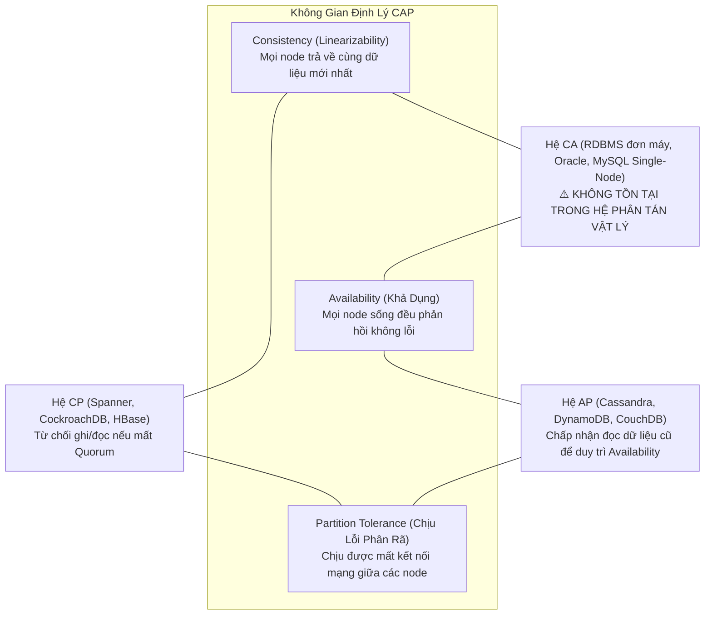

#### Định Nghĩa Hình Thức Theo Gilbert & Lynch (2002):
1. **Consistency (C - Linearizability / Single-Copy Consistency)**:
   Mọi thao tác đọc (`Read`) đều phải trả về giá trị của thao tác ghi (`Write`) thành công gần đây nhất trong thời gian thực toàn cục, tương đương như toàn bộ hệ thống chỉ là một bản ghi đơn lẻ trên một máy duy nhất.
2. **Availability (A - High Availability)**:
   Mỗi yêu cầu (request) gửi tới một nút **không bị lỗi (non-failing node)** đều phải nhận được phản hồi **thành công (non-error response)** mà không bị timeout hoặc bị chặn vĩnh viễn (lưu ý: không quan tâm dữ liệu trả về có mới nhất hay không).
3. **Partition Tolerance (P - Chịu đựng phân rã mạng)**:
   Hệ thống vẫn tiếp tục vận hành ngay cả khi số lượng thông điệp tùy ý bị trễ hoặc thất lạc hoàn toàn giữa các nút trong mạng.

#### Ảo Tưởng Phổ Biến: "Chọn 2 trong 3 (Pick 2 of 3)"
Trong thế giới vật lý thực tế, **Partition Tolerance (P) là một thuộc tính bất khả kháng của phần cứng mạng**. Bạn không có quyền "chọn không có P" trừ khi bạn nhét toàn bộ cơ sở dữ liệu vào một máy chủ vật lý duy nhất (khi đó nó là hệ đơn máy, không còn là hệ phân tán). Do đó, câu hỏi thực tế của kiến trúc sư không phải là "Chọn 2 trong 3", mà là:
$$\text{Khi Network Partition xảy ra: Bạn chọn Consistency (CP) hay Availability (AP)?}$$

- **Hệ CP**: Khi đường mạng nối giữa Data Center 1 và Data Center 2 bị đứt, cụm phân vùng thiểu số (Minority Partition) sẽ chủ động từ chối phục vụ (trả về lỗi `WriteTimeoutException` hoặc `TransactionAborted`) để ngăn chặn việc phân kỳ dữ liệu.
- **Hệ AP**: Cả hai phân vùng tiếp tục nhận lệnh ghi và đọc bình thường. Hệ thống giữ cho ứng dụng hoạt động 100%, nhưng chấp nhận tình trạng dữ liệu hai bên phân kỳ và sẽ xử lý xung đột sau khi mạng nối lại (Reconciliation).

---

### 1.3. Định Lý PACELC (PACELC Theorem): Chiều Kích Trạng Thái Bình Thường

Được công bố bởi Giáo sư Daniel Abadi (Yale University) vào năm 2012, định lý PACELC chỉ ra rằng định lý CAP quá đơn giản hóa vì nó **chỉ mô tả hệ thống khi có sự cố mạng (Network Partition)**. Tuy nhiên, 99.99% thời gian vận hành thực tế của hệ thống là **trạng thái mạng bình thường (Normal / Failure-Free Execution)**.

$$\mathbf{P - A} \quad / \quad \mathbf{C} \qquad \mathbf{E} - \mathbf{L} \quad / \quad \mathbf{C}$$

> **Quy Tắc PACELC**:  
> **If Partitioned (P)**: Hệ thống đánh đổi giữa **Availability (A)** và **Consistency (C)**;  
> **Else (E - Khi mạng bình thường)**: Hệ thống đánh đổi giữa **Latency (L - Độ trễ)** và **Consistency (C - Tính nhất quán)**.

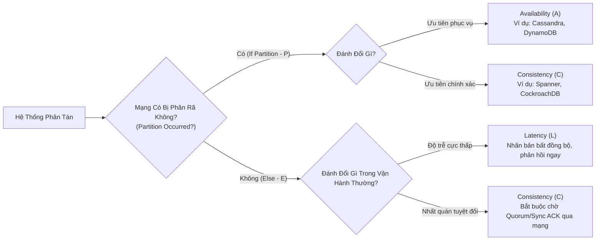

Khi mạng bình thường (Else):
- Nếu muốn **Consistency (C)**: Leader phải đợi các Replica xác nhận qua mạng (bằng network round-trip) trước khi phản hồi Client $\to$ **Latency (L) tăng cao**.
- Nếu muốn **Latency thấp (L)**: Leader phản hồi ngay cho Client sau khi ghi vào bộ nhớ/disk cục bộ rồi gửi log bất đồng bộ cho Replica $\to$ Chấp nhận rủi ro **Stale Read / Data Loss (Mất Consistency)**.

---

### 1.4. Ma Trận Phân Loại PACELC Cơ Sở Dữ Liệu Thực Tế

| Phân Loại PACELC | Cơ Sở Dữ Liệu | Hành Vi Khi Phân Rã (P) | Hành Vi Khi Bình Thường (E) | Trường Hợp Ứng Dụng Điển Hình (Use Cases) |
| :--- | :--- | :--- | :--- | :--- |
| **PC / EC** | **Google Cloud Spanner**, **CockroachDB**, **TiDB**, **YugabyteDB** | Dừng phục vụ trên phân vùng thiểu số (Minority Partition) để bảo vệ tính nhất quán dữ liệu. | Buộc phải qua vòng đồng thuận Paxos/Raft (tối thiểu 1 RTT mạng) trước khi commit. Chấp nhận độ trễ vài mili-giây để có tính nhất quán tuần tự hóa (Serializable Consistency). | Giao dịch tài chính, số dư ví điện tử, sổ cái ngân hàng lõi (Core Banking Ledger), quản lý kho vận vé máy bay. |
| **PA / EL** | **Apache Cassandra**, **Amazon DynamoDB** (mặc định), **ScyllaDB**, **Riak** | Trả lời thành công trên mọi node sống (Sloppy Quorum / Local Read/Write), chấp nhận dữ liệu cũ. | Ghi nhận cục bộ và trả về Client siêu nhanh (~1ms). Nhân bản dữ liệu ngầm bất đồng bộ qua mạng. | Giỏ hàng thương mại điện tử, mạng xã hội (Like, View counts), telemetry IoT, log aggregation, user activity feed. |
| **PC / EL** | **MongoDB** (với `w: 1` hoặc `w: majority` tùy chỉnh), **VoltDB** | Ngắt kết nối phân vùng thiểu số, bầu leader mới. | Mặc định ghi với write concern nhẹ để đạt độ trễ thấp; nếu cấu hình `w: majority` sẽ chuyển sang PC/EC. | Ứng dụng web tổng hợp, quản lý danh mục sản phẩm, phiên người dùng (Session stores). |
| **PA / EC** | **Megastore** (Google - lịch sử), một số cấu hình In-memory Grid | Tiếp tục phục vụ đọc ghi cục bộ khi đứt mạng. | Khi bình thường áp dụng đồng bộ hóa chặt chẽ (Heavy synchronization). | Cực kỳ hiếm trong thực tế vì tính chất đánh đổi bất cân xứng. |

---

## 2. QUANG PHỔ CÁC MÔ HÌNH NHẤT QUÁN DỮ LIỆU

Trong hệ phân tán, tính nhất quán không phải là một công tắc nhị phân (Đúng/Sai), mà là một **phổ liên tục (Continuum Spectrum)** trải dài từ mô hình chặt chẽ nhất (đắt đỏ nhất) đến mô hình lỏng lẻo nhất (hiệu năng cao nhất).

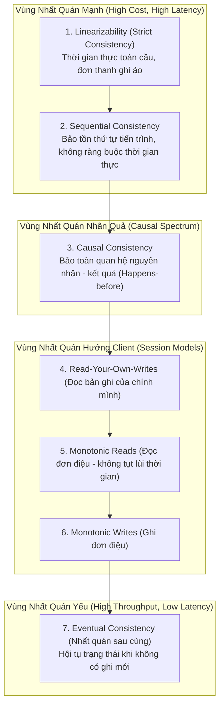

### 2.1. Phân Cấp Nhất Quán Toàn Cục (Data-Centric Consistency Hierarchy)

#### 1. Linearizability (Strict Consistency / External Consistency)
- **Định nghĩa**: Được định nghĩa bởi Maurice Herlihy và Jeannette Wing (1990). Một hệ thống đạt Linearizability nếu mọi thao tác đọc/ghi dường như có hiệu lực tức thời tại một điểm thời gian logic $t$ nằm giữa thời điểm bắt đầu ($t_{start}$) và thời điểm kết thúc ($t_{end}$) của thao tác đó theo đồng hồ thời gian thực toàn cầu (Wall-Clock Time).
- **Hệ quả**: Nếu Client A ghi giá trị $x = 5$ và nhận phản hồi `OK` tại thời điểm $T_1$, thì bất kỳ Client B nào bắt đầu đọc $x$ tại thời điểm $T_2 > T_1$ (trên bất kỳ node nào trong vũ trụ) **bắt buộc phải đọc được giá trị 5** (hoặc giá trị mới hơn).
- **Chi phí**: Cực kỳ đắt đỏ. Đòi hỏi đồng thuận phân tán (Consensus) hoặc đồng hồ nguyên tử chính xác cao (Google TrueTime). Bị giới hạn bởi tốc độ ánh sáng trong cáp quang.

#### 2. Sequential Consistency (Nhất Quán Tuần Tự - Leslie Lamport, 1979)
- **Định nghĩa**: Kết quả của bất kỳ lần thực thi nào cũng giống như thể các thao tác của tất cả các tiến trình được thực thi theo một **thứ tự tuần tự duy nhất (Single Global Sequence)**, và các thao tác của từng tiến trình riêng lẻ xuất hiện trong chuỗi này theo đúng thứ tự do chương trình của nó quy định (Program Order).
- **Khác biệt với Linearizability**: Sequential Consistency **không có khái niệm thời gian thực toàn cầu**. Nếu Client B đọc sau Client A 10 giây trong thế giới thực, hệ thống vẫn hợp lệ nếu nó xếp thao tác của B trước A, miễn là **tất cả mọi node trong cụm đều nhìn thấy chung một thứ tự duy nhất đó**.

#### 3. Causal Consistency (Nhất Quán Nhân Quả)
- **Định nghĩa**: Các thao tác có quan hệ nhân quả với nhau ($A \to B$, nghĩa là thao tác $B$ được kích hoạt hoặc dựa trên kết quả của thao tác $A$) phải được tất cả các nút trong hệ thống quan sát theo **cùng một thứ tự**. Ngược lại, các thao tác đồng thời (Concurrent / Không liên quan nhân quả) có thể được quan sát theo thứ tự khác nhau giữa các nút.
- **Hiện thực hóa**: Sử dụng **Vector Clocks (Đồng hồ vector)** gắn kèm trong metadata của bản ghi để theo dõi chuỗi phụ thuộc nhân quả.
- **Ví dụ thực tế**: Trong một bình luận mạng xã hội, câu hỏi (Thao tác A) và câu trả lời (Thao tác B) có tính nhân quả ($A \to B$). Không một người dùng nào được phép nhìn thấy câu trả lời xuất hiện trước câu hỏi. Tuy nhiên, hai câu hỏi độc lập từ hai người dùng ở hai bài viết khác nhau có thể xuất hiện theo thứ tự bất kỳ.

#### 4. Eventual Consistency (Nhất Quán Sau Cùng - Werner Vogels, Amazon CTO)
- **Định nghĩa**: Nếu không có thêm thao tác cập nhật mới nào được thực hiện trên một đối tượng dữ liệu, thì theo thời gian (eventually), tất cả các bản sao phân tán sẽ hội tụ về cùng một giá trị trạng thái giống hệt nhau.
- **Cơ chế hội tụ (Convergence Mechanisms)**:
  - Last-Write-Wins (LWW): Dựa vào timestamp lớn nhất (nguy hiểm nếu có clock skew).
  - Conflict-free Replicated Data Types (CRDTs): Cấu trúc dữ liệu tự động giải quyết xung đột toán học thông qua phép hợp toán học (Join Semi-lattice).

---

### 2.2. Nhất Quán Hướng Client (Client-Centric Consistency Models)

Trong các hệ thống phân tán sử dụng nhân bản bất đồng bộ (Replication Lag lớn), người dùng thường gặp phải các trải nghiệm kỳ quặc nếu không có các đảm bảo hướng Client:

#### 1. Read-Your-Own-Writes (RYOW - Đọc bản ghi của chính mình)
- **Kịch bản lỗi**: Người dùng cập nhật tiểu sử cá nhân trên Facebook, nhấn Lưu (dữ liệu ghi vào Master). Sau đó nhấn F5, yêu cầu đọc gửi đến Read Replica chưa kịp nhận log nhân bản $\to$ Giao diện hiển thị tiểu sử cũ. Người dùng hoang mang tưởng hệ thống bị lỗi và nhấn Lưu liên tục.
- **Giải pháp kỹ thuật**:
  - **Sticky Routing / Pinning**: Khi một client thực hiện thao tác ghi, router gán một cookie hoặc token phiên, ép buộc mọi thao tác đọc từ client đó trong vòng $\Delta t$ (ví dụ: 10 giây, lớn hơn replication lag tối đa) phải đi thẳng vào Master node hoặc Replica đã đồng bộ.
  - **LSN Tracking**: Client giữ giá trị Log Sequence Number (LSN) của thao tác ghi cuối cùng của mình. Khi gửi request đọc đến Replica, gửi kèm LSN này. Replica chỉ trả lời nếu `Replica_LSN >= Client_LSN`, nếu chưa kịp thì giữ request chờ (wait-polling) hoặc chuyển tiếp sang Master.

#### 2. Monotonic Reads (Đọc Đơn Điệu - Chống Tụt Lùi Thời Gian)
- **Kịch bản lỗi**: Người dùng F5 lần 1 đọc từ Replica A (đã sync tới $T = 100$), nhìn thấy bài viết mới. F5 lần 2 load balancer điều hướng sang Replica B (chậm chạp, mới sync tới $T = 80$) $\to$ Bài viết biến mất như thể thời gian bị quay ngược.
- **Giải pháp**: Gán chặt một client vào một Replica cố định trong suốt phiên làm việc (Session Affinity qua Hash Client IP / User ID). Nếu Replica đó chết, chỉ chuyển sang Replica mới có LSN lớn hơn hoặc bằng LSN cao nhất mà Client đã từng thấy.

#### 3. Monotonic Writes (Ghi Đơn Điệu)
- Hệ thống bảo đảm rằng các thao tác ghi từ một client cụ thể sẽ được áp dụng tuần tự theo đúng thứ tự mà client đã phát ra. Không thể có chuyện cập nhật mật khẩu lần 2 lại bị ghi đè bởi cập nhật mật khẩu lần 1 do gói tin mạng đến sau.

#### 4. Writes-Follow-Reads (Causal Writes)
- Một thao tác ghi dựa trên một trạng thái đã đọc trước đó sẽ luôn được áp dụng sau thao tác ghi đã tạo ra trạng thái đó trên tất cả các replica.

---

### 2.3. Đối Chiếu: ACID Consistency vs CAP Consistency vs Isolation Levels

Một trong những sự nhầm lẫn tai hại nhất của kỹ sư phần mềm là đánh đồng chữ **"C"** trong **ACID** với chữ **"C"** trong **CAP**:

| Tiêu Chí Phân Định | ACID "C" (Consistency trong RDBMS) | CAP "C" (Linearizability trong Hệ Phân Tán) | ANSI SQL Isolation Levels (Độ Cô Lập Giao Dịch) |
| :--- | :--- | :--- | :--- |
| **Bản Chất Cốt Lõi** | **Tính toàn vẹn dữ liệu (Application Invariants)**. | **Tính tức thời của dữ liệu qua không gian mạng (Single-Copy Illusion)**. | **Mức độ ảnh hưởng giữa các giao dịch chạy đồng thời (Concurrent Transactions)**. |
| **Trách Nhiệm Thuộc Về** | Lập trình viên ứng dụng và DB Constraints (Foreign Key, Unique, Check constraint). | Thuật toán đồng thuận của hạ tầng phân tán (Raft, Paxos, Quorum protocols). | Trình quản lý khóa (Lock Manager), MVCC engine trong Database Engine. |
| **Ví Dụ Điển Hình** | Tổng tiền tài khoản gửi + tài khoản nhận phải bằng 0 sau giao dịch chuyển khoản. | Client B đọc dữ liệu ngay sau khi Client A ghi xong thì bắt buộc phải thấy giá trị của A. | Tránh hiện tượng Dirty Read, Non-repeatable Read, Phantom Read, Write Skew. |
| **Mối Quan Hệ Chéo** | Có thể đạt ACID trên một máy tính độc lập mà không cần quan tâm đến mạng phân tán. | Liên quan chặt chẽ đến độ trễ mạng và thứ tự thông điệp giữa nhiều máy tính vật lý. | **Strict Serializability (External Consistency)** chính là giao thoa giữa Serializable Isolation (ACID) + Linearizability (CAP). |

---

## 3. CƠ CHẾ NHÂN BẢN DỮ LIỆU (REPLICATION TOPOLOGIES)

Nhân bản dữ liệu (Replication) giải quyết 3 bài toán: **Tăng cường khả năng chịu lỗi (High Availability)**, **Giảm độ trễ địa lý (Geographic Proximity)**, và **Mở rộng thông lượng đọc (Read Scalability)**.

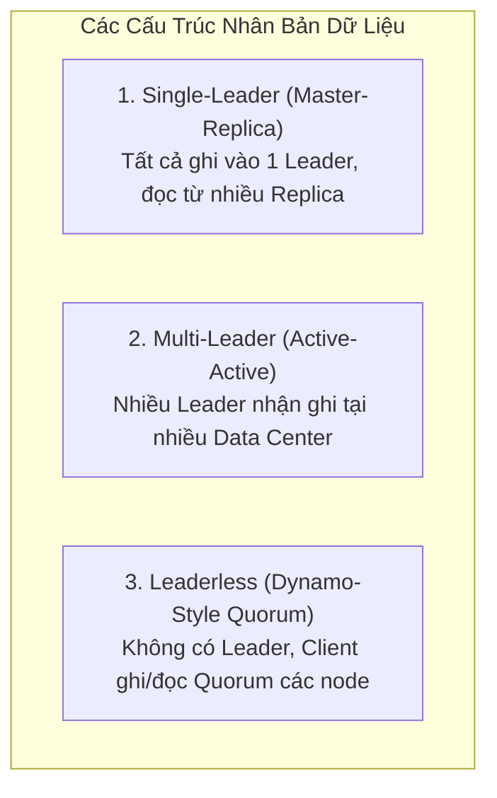

---

### 3.1. Single-Leader Replication (Master-Replica / Active-Passive)

Mô hình phổ biến nhất trong thế giới RDBMS (PostgreSQL streaming replication, MySQL binlog replication).

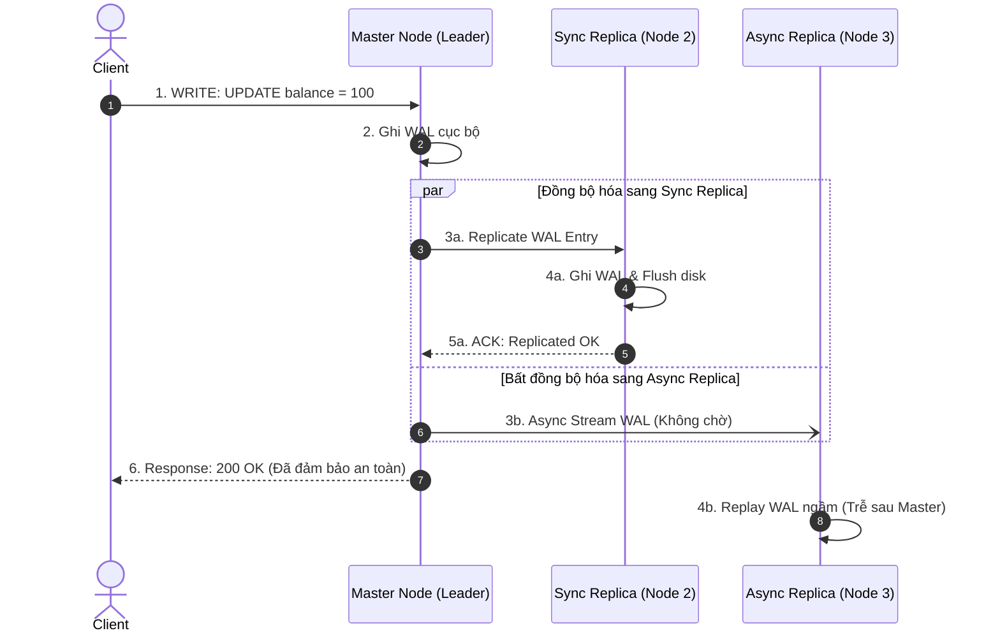

#### Ưu Điểm & Nhược Điểm:
- **Ưu điểm**: Triệt tiêu hoàn toàn xung đột ghi (Write Conflicts) vì mọi lệnh ghi đều được serialize qua một hàng đợi duy nhất trên Leader.
- **Điểm nghẽn (Bottlenecks)**: 
  - Toàn bộ thông lượng ghi bị giới hạn bởi CPU/Disk I/O của một node duy nhất.
  - Quá trình chuyển đổi dự phòng (Failover) phức tạp: Cần phát hiện Leader chết (Heartbeat timeout), bầu Leader mới, chuyển hướng traffic client, và xử lý dữ liệu chưa kịp đồng bộ của Leader cũ.

---

### 3.2. Multi-Leader Replication (Active-Active) & Xử Lý Xung Đột

Áp dụng cho các hệ thống đa trung tâm dữ liệu (Multi-datacenter) để đảm bảo nếu một trung tâm dữ liệu bị ngập lụt hay mất điện hoàn toàn, các trung tâm khác vẫn duy trì tiếp nhận ghi cục bộ mà không bị gián đoạn.

#### Thách Thức Tử Huyệt: Xung Đột Ghi (Write Conflicts)
Giả sử User 1 sửa tiêu đề tài liệu thành "Bản Thảo A" tại datacenter US-East, đồng thời User 2 sửa thành "Bản Thảo B" tại datacenter EU-West. Cả hai Master đều chấp nhận ghi cục bộ. Khi hai Master đồng bộ log cho nhau, xung đột xảy ra.

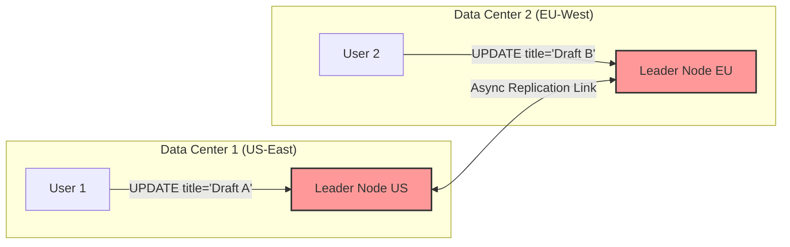

#### Các Chiến Lược Giải Quyết Xung Đột (Conflict Resolution Strategies):

1. **Conflict Avoidance (Phòng tránh xung đột - Khuyên dùng nhất)**:
   - Định tuyến toàn bộ các yêu cầu ghi của một người dùng cụ thể hoặc một thực thể cụ thể (Record/Tenant) về duy nhất một trung tâm dữ liệu cố định (ví dụ dựa trên Geo-DNS hoặc Hash của User ID). Xung đột không thể xảy ra nếu chỉ có một Leader duy nhất xử lý dữ liệu của người dùng đó.

2. **Last-Write-Wins (LWW - Ghi sau cùng thắng)**:
   - Gán timestamp vật lý cho mỗi lần ghi; bản ghi có timestamp cao nhất sẽ ghi đè các bản ghi khác.
   - **Rủi ro chí mạng**: Do Clock Skew giữa các datacenter, một thao tác ghi thực sự xảy ra sau có thể nhận timestamp nhỏ hơn và bị xóa vĩnh viễn $\to$ **Mất mát dữ liệu âm thầm**.

3. **Conflict-free Replicated Data Types (CRDTs - Cấu trúc dữ liệu không xung đột)**:
   - Được chứng minh toán học bởi Marc Shapiro et al. (INRIA, 2011). Dữ liệu được thiết kế sao cho các thao tác hội tụ tự nhiên mà không cần điều phối trung tâm.
   - **State-based CRDTs (CvRDT)**: Các node gửi toàn bộ trạng thái cho nhau và kết hợp bằng một hàm toán học Hợp (Join semi-lattice) có tính chất:
     - Giao hoán (Commutative): $A \sqcup B = B \sqcup A$
     - Kết hợp (Associative): $(A \sqcup B) \sqcup C = A \sqcup (B \sqcup C)$
     - Lũy thừa (Idempotent): $A \sqcup A = A$
   - **Operation-based CRDTs (CmRDT)**: Các node chỉ gửi thao tác (Operations) qua kênh truyền có thứ tự nhân quả.
   - Ứng dụng thực tế: Đếm số lượng phân tán (PN-Counter), tập hợp thêm/xóa phần tử (ORSet - Observed-Removed Set trong Riak/Redis Enterprise), soạn thảo đồng thời thời gian thực (Figma, Google Docs).

---

### 3.3. Leaderless Replication & Dynamo-Style Quorums

Kiến trúc bắt nguồn từ bài báo kinh điển **"Dynamo: Amazon’s Highly Available Key-value Store"** (DeCandia et al., SOSP 2007). Được áp dụng thành công trong Apache Cassandra, ScyllaDB và Riak.

Trong mô hình này, **mọi nút đều bình đẳng (Symmetric Architecture)**. Client có thể gửi request ghi hoặc đọc tới bất kỳ nút nào (đóng vai trò là Coordinator Node cho request đó).

```mermaid
flowchart TD
    Client["Client App"]
    
    subgraph Cluster ["Dynamo Cluster (N = 3, Quorum W = 2, R = 2)"]
        Node1["Node 1 (Replica A)"]
        Node2["Node 2 (Replica B)"]
        Node3["Node 3 (Replica C)"]
    end
    
    Client -->|1. WRITE k=v (gửi song song)| Node1
    Client -->|1. WRITE k=v| Node2
    Client -.->|1. WRITE k=v (Chậm/Down)| Node3
    
    Node1 -->>|2. ACK OK| Client
    Node2 -->>|2. ACK OK| Client
    
    Note["Đã nhận W=2 ACK >= 2<br/>Thao tác ghi THÀNH CÔNG!"]
```

#### Công Thức Quorum Toán Học:
Hệ thống được cấu hình bởi 3 tham số cốt lõi:
- $N$: Hệ số nhân bản (Replication Factor - Số node lưu trữ bản sao của một key).
- $W$: Số node tối thiểu phải xác nhận ghi thành công (Write Quorum).
- $R$: Số node tối thiểu phải phản hồi khi đọc (Read Quorum).

$$\mathbf{R} + \mathbf{W} > \mathbf{N}$$

> **Nguyên Lý Lồng Nhau (Pigeonhole Principle)**:  
> Khi $R + W > N$, tập hợp các node được đọc ($R$) và tập hợp các node được ghi ($W$) **bắt buộc phải giao nhau tại ít nhất một node chung** ($V_{overlap} \ge 1$). Node chung này được đảm bảo chứa giá trị ghi mới nhất!

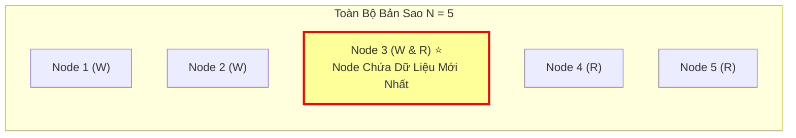

#### Các Kỹ Thuật Bù Đắp Dữ Liệu Trong Leaderless Replication:
1. **Sloppy Quorum & Hinted Handoff**:
   - Nếu một số node trong nhóm quorum chính thống của Key bị mất kết nối mạng, cụm chấp nhận ghi tạm dữ liệu lên các node láng giềng khác ngoài vòng quorum (Sloppy Quorum).
   - Node láng giềng lưu kèm một gợi ý (Hint). Khi node chính thống phục hồi, node láng giềng sẽ tự động đẩy dữ liệu về lại (Hinted Handoff). Đảm bảo tính khả dụng ghi cực đại nhưng hy sinh tính nhất quán chặt chẽ.
2. **Read Repair (Tự Sửa Lỗi Khi Đọc)**:
   - Khi Client đọc từ $R$ nodes, Coordinator so sánh version/timestamp của các phản hồi. Nếu phát hiện Node 1 có version 2 nhưng Node 2 chỉ có version 1, Coordinator sẽ trả về version 2 cho Client, đồng thời gửi một thao tác ghi ngầm (Background Write) để cập nhật version 2 cho Node 2.
3. **Anti-Entropy with Merkle Trees (Chống Hỗn Loạn Bằng Cây Merkle)**:
   - Các node định kỳ chạy tiến trình nền so sánh dữ liệu giữa các replica. Để tránh truyền tải hàng gigabyte dữ liệu qua mạng, mỗi node xây dựng một Cây băm Merkle (Merkle Tree - Cây nhị phân mà node lá là hash của từng key-value, node cha là hash của các node con).
   - Hai node chỉ cần so sánh Root Hash. Nếu khớp $\to$ Dữ liệu giống nhau 100%. Nếu khác $\to$ So sánh đệ quy xuống các nhánh con để tìm chính xác dải key bị lệch và chỉ truyền tải đúng phần sai lệch đó.

---

### 3.4. Các Chế Độ Đồng Bộ Hóa & Hiện Tượng Replication Lag

| Chế Độ Nhân Bản | Cơ Chế Hoạt Động | RPO (Mất Mát Dữ Liệu Khi Crash) | RTO (Thời Gian Phục Hồi) | Đánh Đổi Độ Trễ Ghi (Latency) |
| :--- | :--- | :--- | :--- | :--- |
| **Fully Synchronous** | Chờ **TẤT CẢ** các Replica ghi đĩa và gửi ACK về trước khi trả lời Client. | **RPO = 0** (Tuyệt đối không mất một byte dữ liệu). | Trung bình. | **Cực cao**. Bị kéo tụt bởi replica chậm nhất trong toàn bộ cụm (Straggler problem). Nếu 1 replica down, toàn bộ luồng ghi bị đóng băng. |
| **Fully Asynchronous** | Leader ghi đĩa cục bộ, trả lời Client ngay lập tức. Luồng nền stream log sang Replica sau. | **RPO > 0** (Mất toàn bộ các giao dịch nằm trong Replication Lag khi Leader cháy nổ đột ngột). | Thấp. | **Cực thấp** (Chỉ tốn chi phí ghi local disk WAL). |
| **Semi-Synchronous** *(Khuyên dùng)* | Chờ Leader + **ít nhất 1 Replica** (hoặc đa số Quorum $\lfloor N/2 \rfloor + 1$) xác nhận đã nhận log vào bộ nhớ/disk. | **RPO $\approx$ 0** (Trong thực tế kiểm thử enterprise). | Tối ưu. | Cân bằng hoàn hảo. Chỉ tốn 1 network round-trip tới replica gần nhất. |

---

## 4. THUẬT TOÁN ĐỒNG THUẬN PHÂN TÁN (DISTRIBUTED CONSENSUS)

Bài toán đồng thuận phân tán là nền tảng cốt lõi của các hệ thống cơ sở dữ liệu hiện đại: Làm thế nào để một tập hợp các máy tính độc lập **thống nhất được một giá trị hoặc một chuỗi các thao tác duy nhất**, ngay cả khi một số máy tính bị crash hoặc đường truyền mạng bị trễ/mất gói?

### 4.1. Bản Chất Bài Toán & Định Lý Bất Khả Thi FLP (FLP Impossibility)

Năm 1985, Fischer, Lynch và Paterson (FLP) đã công bố một trong những định lý nền tảng quan trọng nhất của khoa học máy tính:

> **Định lý FLP (1985)**: Trong một hệ thống phân tán **hoàn toàn bất đồng bộ (Asynchronous Network)**, **không tồn tại** bất kỳ thuật toán đồng thuận xác định (deterministic consensus algorithm) nào có thể đảm bảo đồng thời cả hai yếu tố:
> 1. **Safety (Tính an toàn)**: Không bao giờ quyết định sai (Mọi node đều thống nhất cùng một giá trị hợp lệ).
> 2. **Liveness (Tính sống động)**: Luôn đưa ra được quyết định cuối cùng (Không bị treo vô hạn định).
> Ngay cả khi trong hệ thống **chỉ có duy nhất một nút bị lỗi crash**!

#### Cách Kỹ Sư Giải Thoát Khỏi Ràng Buộc Của FLP:
Các giao thức thực tế (Paxos, Raft, Zab) không vận hành trong mạng bất đồng bộ thuần túy. Chúng dựa trên giả định mạng **Bán đồng bộ (Partially Synchronous Network)**:
- **Khóa Chết Tính An Toàn (Safety Invariant)**: Bất kể mạng có bị phân rã, chậm trễ bao lâu, hệ thống **tuyệt đối không bao giờ quyết định sai** (Safety luôn được bảo toàn 100%).
- **Chấp Nhận Hy Sinh Tạm Thời Tính Sống Động (Liveness)**: Khi mạng bị phân rã hoặc nghẽn nghiêm trọng, hệ thống có thể tạm thời không bầu được Leader mới và treo lệnh ghi, chờ tới khi mạng ổn định trở lại (Global Stabilization Time - GST) thì thuật toán sẽ tự động hoàn tất.

---

### 4.2. Giao Thức Raft (Raft Consensus Protocol)

Được thiết kế bởi Diego Ongaro và John Ousterhout (Stanford University, 2014) với mục tiêu tối thượng: **Khả năng hiểu được (Understandability)** nhằm thay thế sự phức tạp khó hiểu của Paxos. Raft phân rã bài toán đồng thuận thành 3 bài toán con hoàn toàn độc lập:

1. **Leader Election (Bầu cử trưởng nhóm)**
2. **Log Replication (Nhân bản nhật ký tuần tự)**
3. **Safety (Đảm bảo an toàn trạng thái)**

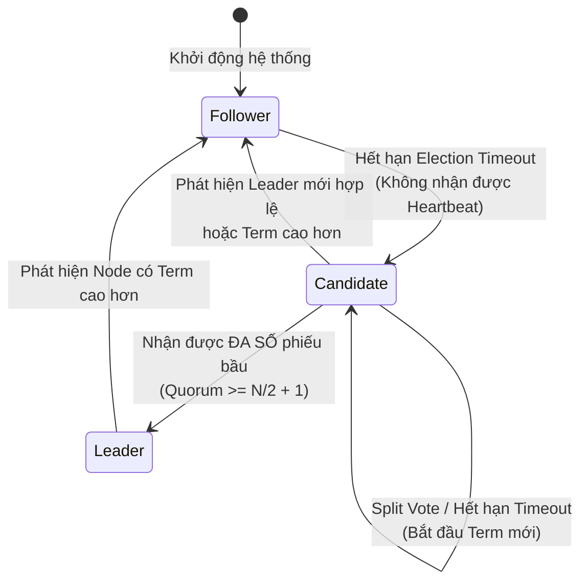

#### 1. Bầu Cử Trưởng Nhóm (Leader Election):
- Mỗi node duy trì một bộ đếm số nguyên tăng đơn điệu gọi là **`Term` (Nhiệm kỳ)**.
- **Randomized Election Timers (Bộ hẹn giờ ngẫu nhiên)**: Đây là phát minh thiên tài của Raft. Mỗi node chọn một khoảng thời gian chờ ngẫu nhiên trong khoảng $[150\text{ms}, 300\text{ms}]$ (hoặc $[1.5\text{s}, 3\text{s}]$ tùy môi trường).
  - Khi timeout mà không nhận được heartbeat từ Leader, node tự tăng `Term`, chuyển sang trạng thái `Candidate`, tự bỏ phiếu cho mình và gửi `RequestVote RPC` tới tất cả các node khác.
  - Nhờ thời gian ngẫu nhiên, xác suất hai node cùng trở thành Candidate cùng một lúc là cực kỳ thấp, triệt tiêu gần như hoàn toàn hiện tượng **Chia phiếu (Split Vote)**.
- **Quy Tắc Log Up-To-Date (Bảo vệ tính toàn vẹn)**: Node nhận phiếu chỉ vote cho Candidate nếu log của Candidate **chứa ít nhất toàn bộ các committed entries** so với log của chính nó:
  $$\text{Candidate\_LastTerm} > \text{Voter\_LastTerm} \quad \lor \quad (\text{Equal Terms} \land \text{Candidate\_LastIndex} \ge \text{Voter\_LastIndex})$$

#### 2. Nhân Bản Log (Log Replication):
Mọi yêu cầu từ Client đều gửi tới Leader. Leader thực thi luồng Replicated State Machine:

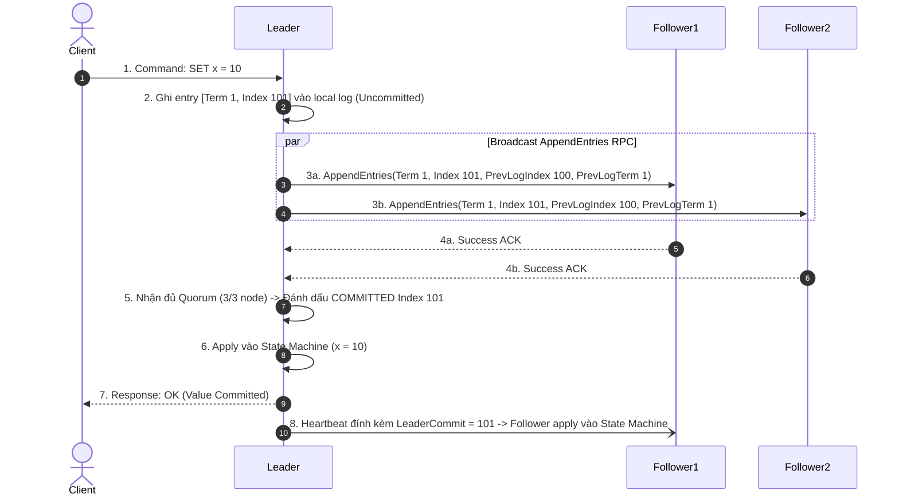

#### 3. Năm Bất Biến An Toàn Tuyệt Đối (Raft Safety Invariants):
1. **Election Safety**: Tối đa một Leader duy nhất được bầu trong một Term cụ thể.
2. **Leader Append-Only**: Leader không bao giờ sửa đổi, ghi đè hoặc cắt bớt log của chính nó; nó chỉ thêm mới (Append-only).
3. **Log Matching Property**: Nếu hai cuốn log trên hai server khác nhau có chung một entry với cùng `Index` và `Term`, thì chúng lưu cùng một command và toàn bộ các entry phía trước trong log của hai server đó **giống nhau 100%**.
4. **Leader Completeness**: Nếu một log entry đã được commit trong một term nào đó, thì entry đó **bắt buộc phải xuất hiện trong log của tất cả các Leader ở các term trong tương lai**.
5. **State Machine Safety**: Nếu một server đã apply một log entry tại index $i$ vào state machine của nó, thì không có bất kỳ server nào khác trong cụm được phép apply một entry khác tại index $i$.

---

### 4.3. Paxos & Multi-Paxos: Kiến Trúc Cổ Điển vs Tối Ưu Hóa Production

Được sáng tạo bởi nhà khoa học đoạt giải Turing - Leslie Lamport (1998). Paxos là nền tảng của hệ thống Chubby Lock Service của Google và Apache ZooKeeper (biến thể Zab).

#### Classic Paxos (Single-Decree Paxos):
Dùng để đồng thuận **chỉ một giá trị duy nhất**. Gồm 2 pha mạng (2 Round Trips):

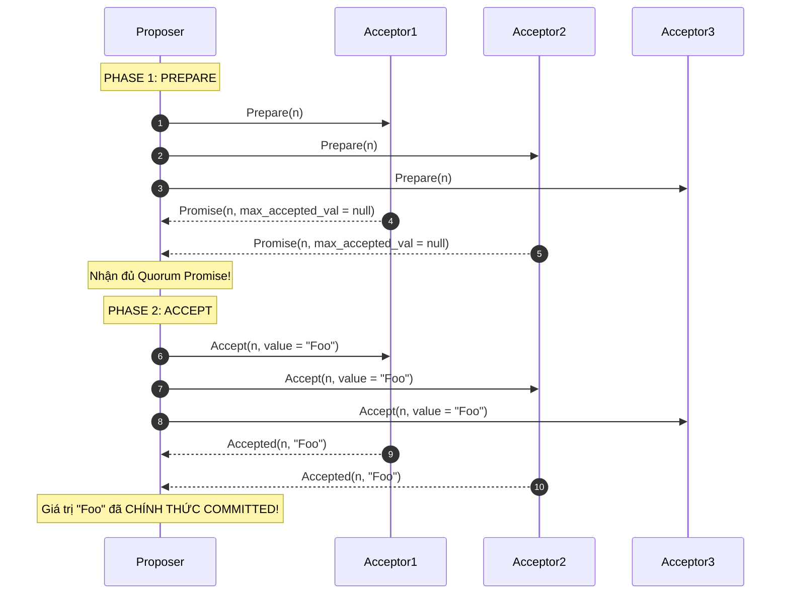

- **Tử huyệt của Classic Paxos: Livelock (Dueling Proposers)**:
  Nếu Proposer 1 gửi `Prepare(n1)`, trước khi kịp gửi `Accept`, Proposer 2 gửi `Prepare(n2)` với $n2 > n1$. Các Acceptor từ chối `Accept` của Proposer 1. Proposer 1 liền tăng lên $n3 > n2$ và gửi `Prepare(n3)`. Hai Proposer tranh chấp liên tục khiến hệ thống bị treo vô hạn định mà không thể commit được bất kỳ giá trị nào!

#### Multi-Paxos (Giải Pháp Thực Chiến):
- Bầu một **Stable Leader** (Leader ổn định) duy nhất thông qua Phase 1 một lần duy nhất.
- Sau khi Leader được thiết lập, mọi lệnh ghi tiếp theo **bỏ qua Phase 1**, đi thẳng vào **Phase 2 (Chỉ tốn 1 Round Trip Time - 1 RTT)**. Nếu Leader chết, cụm mới chạy lại Phase 1 để bầu Leader mới.

---

### 4.4. Ma Trận So Sánh Toàn Diện: Raft vs Multi-Paxos vs Zab vs EPaxos

| Tiêu Chí So Sánh | Raft (Ongaro & Ousterhout) | Multi-Paxos (Lamport / Chubby) | Zab (ZooKeeper Atomic Broadcast) | Egalitarian Paxos (EPaxos) |
| :--- | :--- | :--- | :--- | :--- |
| **Mô Hình Lãnh Đạo (Leadership Model)** | **Strong Leader** (Tất cả log và commit đều chạy độc quyền qua Leader). | **Leader-based** (Có thể có nhiều proposer nhưng tối ưu với single leader). | **Primary-Backup** (Leader phát sóng log tuần tự). | **Leaderless** (Bất kỳ node nào cũng có thể nhận ghi, tối ưu đa trung tâm dữ liệu). |
| **Xử Lý Lỗ Hổng Log (Log Holes)** | **Tuyệt đối cấm**. Log phải liên tục, tuần tự không có khoảng trống. | Cho phép log holes (khoảng trống log được lấp sau bằng no-op). | Tuyệt đối cấm. Phải đảm bảo Total Order qua Zxid. | Cho phép. Xử lý phụ thuộc đồ thị (Dependency Graph). |
| **Độ Trễ Ghi Ổn Định (Normal Write Latency)** | **1 RTT** (AppendEntries broadcast $\to$ Quorum ACK). | **1 RTT** (Phase 2 Accept $\to$ Quorum ACK). | **1 RTT** (Proposal $\to$ Quorum ACK). | **1 RTT** (Nếu không xung đột key); **2 RTT** (Nếu có xung đột). |
| **Độ Phức Tạp Triển Khai (Implementation Complexity)** | **Thấp - Trung bình** (Thiết kế modular, có test suite chính thức). | **Cực cao** (Lamport chỉ mô tả ý tưởng, thiếu chi tiết triển khai cụ thể). | **Cao** (Gắn chặt với kiến trúc ZooKeeper). | **Cực kỳ cao** (Đòi hỏi thuật toán giải quyết chu trình đồ thị phân tán). |
| **Ứng Dụng Nổi Tiếng** | **etcd** (Kubernetes Core), **CockroachDB**, **TiKV**, **HashiCorp Consul**. | **Google Spanner**, **Apache Cassandra** (Lightweight Transactions). | **Apache ZooKeeper**, **Apache Kafka** (thời kỳ trước KRaft). | Các hệ thống nghiên cứu hiệu năng cao đa vùng (Academic prototypes). |

---

## 5. KỸ THUẬT PHÂN MẢNH & ĐỊNH TUYẾN DỮ LIỆU (SHARDING & PARTITIONING)

Khi dung lượng dữ liệu vượt quá sức chứa của một ổ cứng đơn lẻ (thường > 2TB - 10TB) hoặc thông lượng ghi vượt quá giới hạn I/O của một CPU, hệ thống buộc phải phân mảnh dữ liệu (Sharding) trên nhiều node độc lập (Shared-Nothing Architecture).

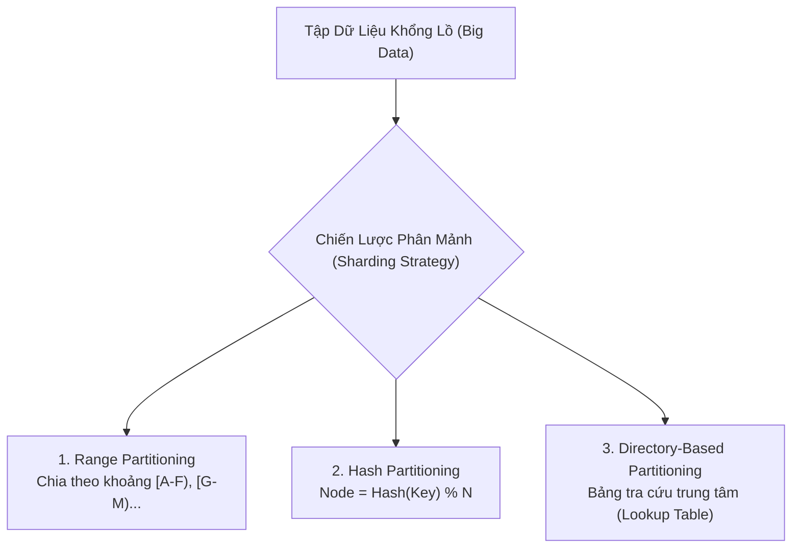

---

### 5.1. So Sánh Range Partitioning vs Hash Partitioning vs Directory-Based

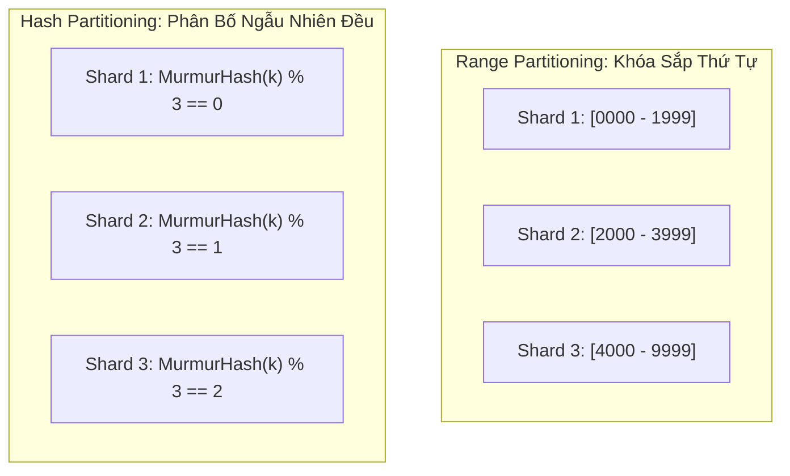

| Tiêu Chí | Range Partitioning (Phân Mảnh Theo Khoảng) | Hash Partitioning (Phân Mảnh Theo Băm) | Directory-Based (Dựa Trên Thư Mục) |
| :--- | :--- | :--- | :--- |
| **Cơ Chế Phân Bổ** | Gán các dải giá trị liên tục vào từng Shard (ví dụ: Shard 1 giữ User A-D, Shard 2 giữ E-H). | Dùng hàm băm ngẫu nhiên phân bố đều (Murmur3, CityHash) trên khóa: $Hash(Key) \pmod N$. | Lưu trữ một bảng định tuyến phân tán (Routing Table) trong etcd/Zookeeper để trỏ từng Key vào Shard cụ thể. |
| **Truy Vấn Theo Khoảng (Range Scan)** | **Cực kỳ tối ưu** (`WHERE age BETWEEN 20 AND 30` chỉ cần đọc đúng 1 Shard duy nhất). | **Cực kỳ tồi tệ (Scatter-Gather)**: Bắt buộc phải phát sóng truy vấn tới tất cả các shard trong cụm và gom kết quả lại. | Trung bình (Tùy thuộc vào thiết kế bảng thư mục). |
| **Rủi Ro Điểm Nóng (Hotspotting)** | **Rất cao**: Nếu khóa là trường tự tăng (Timestamp, Auto-increment ID), toàn bộ lệnh ghi mới sẽ dồn 100% vào Shard cuối cùng, làm tê liệt shard đó. | **Gần như bằng 0**: Hàm băm phân tán đều dữ liệu trên toàn bộ không gian số nguyên. | Thấp (Có thể chủ động điều phối thủ công). |
| **Cơ Sở Dữ Liệu Áp Dụng** | **Google Cloud Spanner**, **CockroachDB**, **HBase**, **TiDB**. | **Amazon DynamoDB**, **Apache Cassandra**, **MongoDB** (Hashed Sharding). | **Couchbase**, các hệ thống lưu trữ tệp lớn (HDFS NameNode). |

---

### 5.2. Vòng Băm Nhất Quán (Consistent Hashing Ring) & Thuật Toán Ánh Xạ

Trong giải pháp băm thông thường: $Node = Hash(Key) \pmod N$.  
Khi hệ thống cần mở rộng từ $N$ lên $N+1$ node:
$$\text{Xác suất một key bị đổi vị trí node} = \frac{N}{N+1} \approx 100\%$$
Điều này đồng nghĩa với việc **toàn bộ dữ liệu của toàn bộ hệ thống phải bị di dời qua mạng cùng lúc**, gây sập toàn bộ cache và làm tê liệt đường truyền mạng (Thảm họa Cache Stampede / Massive Data Migration).

#### Phát Minh Consistent Hashing (Karger et al. - MIT, 1997):
Ánh xạ cả **Khóa Dữ Liệu (Keys)** và **Các Nút Máy Chủ (Nodes)** lên cùng một **Vòng Tròn Số Nguyên Khép Kín (Hash Ring)** có dải giá trị từ $0$ đến $2^{32}-1$ (hoặc $2^{128}-1$ với MD5/Murmur3).

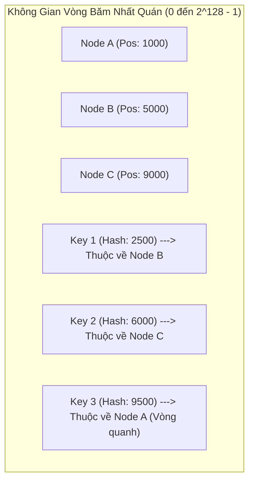

- **Quy tắc định vị Key**: Băm `Key` thành một số nguyên trên vòng tròn. Đi theo chiều kim đồng hồ, **node đầu tiên xuất hiện sẽ là node sở hữu và lưu trữ Key đó**.
- **Khi thêm Node mới (Node New)** vào giữa Node A và Node B: **Chỉ có các key nằm giữa Node A và Node New bị chuyển giao**. Tất cả các key còn lại trên toàn bộ cluster hoàn toàn không bị ảnh hưởng!
$$\text{Số lượng key cần di chuyển trung bình} = \frac{K}{N}$$
*(Với $K$ là tổng số key, $N$ là số node máy chủ).*

---

### 5.3. Nút Ảo (Virtual Nodes / Tokens): Cân Bằng Tải Tuyệt Đối Không Downtime

#### Vấn Đề Của Consistent Hashing Cơ Bản:
1. **Phân bố tải không đều (Non-uniform distribution)**: Với số lượng node vật lý ít (ví dụ 5 server), các node có thể bị nằm sát nhau trên vòng tròn, tạo ra các dải phân cách khổng lồ khiến một node phải gánh 70% dữ liệu của toàn cụm.
2. **Hiệu ứng thác đổ khi một node chết (Hotspot on failure)**: Khi Node B chết, toàn bộ tải của Node B sẽ đổ dồn 100% lên node kế tiếp theo chiều kim đồng hồ (Node C), khiến Node C bị quá tải và chết theo (Cascading Failure).

#### Giải Pháp Nút Ảo (Virtual Nodes / Vnodes):
Thay vì một máy chủ vật lý chỉ đại diện cho 1 vị trí trên vòng tròn, **mỗi máy chủ vật lý được gán hàng trăm vị trí ngẫu nhiên (ví dụ 128 hoặc 256 Vnodes)** trên vòng băm.

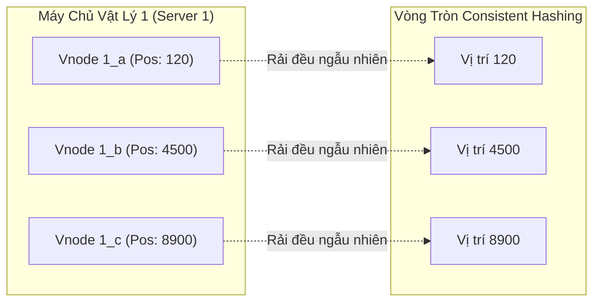

#### Ba Lợi Điểm Chiến Lược Của Vnodes Trong Production:
1. **Phân bố dữ liệu đồng đều tuyệt đối**: Theo định luật số lớn (Law of Large Numbers), khi có hàng nghìn vnodes rải rác, độ lệch tải giữa các máy chủ vật lý chỉ còn $< 1\% - 2\%$.
2. **Chia đều tải khi có sự cố**: Khi Server 1 chết, hàng trăm vnodes của nó bị phân tán rải rác khắp vòng tròn. Do đó, **tất cả các máy chủ còn lại trong cluster cùng chia đều tải mất mát** (mỗi máy gánh thêm một phần rất nhỏ), loại bỏ hoàn toàn hiện tượng quá tải cục bộ.
3. **Hỗ trợ phần cứng không đồng nhất (Heterogeneous Hardware)**: Máy chủ server xịn (64 cores, 256GB RAM) có thể được cấu hình 512 vnodes, trong khi máy chủ yếu hơn (16 cores, 64GB RAM) được cấu hình 128 vnodes. Dữ liệu tự động phân bổ tỷ lệ thuận chính xác theo năng lực phần cứng.

---

## 6. GIAO DỊCH PHÂN TÁN & ĐIỀU PHỐI (DISTRIBUTED TRANSACTIONS)

Khi một thao tác nghiệp vụ đòi hỏi cập nhật nguyên tử (Atomic) trên nhiều cơ sở dữ liệu hoặc nhiều microservices khác nhau (ví dụ: Trừ tiền ví điện tử $\to$ Tạo đơn hàng kho $\to$ Tích điểm khách hàng), chúng ta bước vào lãnh địa của **Giao Dịch Phân Tán**.

### 6.1. Two-Phase Commit (2PC): Cơ Chế, Điểm Nghẽn Khóa & Bài Toán Coordinator Crash

Two-Phase Commit (2PC) là giải pháp cổ điển để đạt được nguyên tử tuyệt đối (All-or-Nothing) giữa nhiều node tham gia (Cohorts / Participants) dưới sự chỉ huy của một Coordinator.

```mermaid
sequenceDiagram
    autonumber
    participant Coord as Transaction Coordinator
    participant C1 as Participant Node A
    participant C2 as Participant Node B

    Note over Coord,C2: PHASE 1: PREPARE (Bình Chọn - Voting)
    Coord->>C1: 1. PREPARE Transaction T
    Coord->>C2: 1. PREPARE Transaction T
    C1->>C1: 2a. Thực thi ngầm, ghi WAL, GIỮ KHÓA TÀI NGUYÊN (Locks held)
    C2->>C2: 2b. Thực thi ngầm, ghi WAL, GIỮ KHÓA TÀI NGUYÊN (Locks held)
    C1-->>Coord: 3a. VOTE_COMMIT
    C2-->>Coord: 3b. VOTE_COMMIT

    Note over Coord,C2: PHASE 2: COMMIT (Ra Quyết Định - Decision)
    Note over Coord: Nhận đủ 100% VOTE_COMMIT!<br/>Ghi "COMMIT T" vào Local WAL
    Coord->>C1: 4. GLOBAL_COMMIT
    Coord->>C2: 4. GLOBAL_COMMIT
    C1->>C1: 5a. Áp dụng thay đổi, NHẢ KHÓA (Release locks)
    C2->>C2: 5b. Áp dụng thay đổi, NHẢ KHÓA (Release locks)
    C1-->>Coord: 6a. ACK
    C2-->>Coord: 6b. ACK
    Note over Coord: Giao dịch thành công hoàn toàn!
```

#### Hai Điểm Nghẽn Chí Mạng (The Fatal Flaws of 2PC):
1. **The Blocking Problem (Tử huyệt treo tài nguyên vô hạn)**:
   Nếu Coordinator bị cháy nổ hoặc mất kết nối mạng ở giữa Phase 1 và Phase 2 (ngay sau khi Node A và Node B đã gửi `VOTE_COMMIT`):
   - Node A và Node B rơi vào trạng thái lơ lửng **In-Doubt State**.
   - Node A không thể tự ý Commit (vì lỡ Node B đã vote Abort và Coordinator đã quyết định Rollback thì sao?).
   - Node A cũng không thể tự ý Abort (vì lỡ Coordinator đã kịp gửi Global Commit cho Node B thì sao?).
   - Kết quả: **Node A và Node B phải tiếp tục giữ chặt các khóa dữ liệu (Locks)**, làm tắc nghẽn hàng nghìn giao dịch khác trong hệ thống cho đến khi Coordinator được sửa chữa vật lý xong!
2. **Kéo tụt hiệu năng thông lượng (Throughput Collapse)**:
   Mọi tài nguyên bị khóa suốt 2 vòng truyền tin qua mạng (2 RTTs) kết hợp với các thao tác `fsync` ghi đĩa nhật ký trên toàn bộ các node. Trong môi trường microservices có độ trễ mạng cao, 2PC làm giảm thông lượng hệ thống từ hàng chục nghìn req/s xuống còn vài trăm req/s.

---

### 6.2. Three-Phase Commit (3PC): Ý Tưởng Non-Blocking & Hạn Chế Phân Rã Mạng

3PC được thiết kế bởi Dale Skeen (1981) nhằm xóa bỏ trạng thái treo của 2PC bằng cách chia nhỏ pha Commit thành 2 bước và bổ sung cơ chế Timeout:

1. **Phase 1: Can-Commit?** (Kiểm tra xem các node có sẵn sàng không).
2. **Phase 2: Pre-Commit** (Yêu cầu các node chuẩn bị commit, không cho phép abort tùy tiện nữa).
3. **Phase 3: Do-Commit** (Thực hiện commit chính thức).

- **Cơ chế Non-blocking**: Nếu node tham gia bị mất liên lạc với Coordinator trong trạng thái `PreCommit`, sau một khoảng timeout nó có thể **tự động quyết định Commit** vì nó biết chắc chắn mọi node khác cũng đã vượt qua bước `Can-Commit`.
- **Vì sao 3PC thất bại trong thực tế?**: 3PC chỉ hoạt động nếu mạng **không bao giờ bị phân rã (Network Partition)**. Nếu mạng bị chia cắt đôi, một nửa cụm có thể timeout và tự commit, trong khi nửa kia timeout và tự abort $\to$ **Dẫn đến trạng thái dữ liệu mâu thuẫn không thể cứu vãn**. Do đó, 3PC gần như không bao giờ được dùng trong các kiến trúc phân tán hiện đại.

---

### 6.3. Saga Pattern: Choreography vs Orchestration & Giao Dịch Bù Trừ

Được đề xuất lần đầu bởi Hector Garcia-Molina và Kenneth Salem (Princeton University, 1987). Saga là tiêu chuẩn vàng của ngành phần mềm để quản trị giao dịch dài hạn (Long-Running Transactions) trong kiến trúc Microservices.

#### Bản Chất Cốt Lõi Của Saga:
Một Saga là một chuỗi các giao dịch cục bộ độc lập (Local Transactions) $T_1, T_2, ..., T_n$.
- Mỗi giao dịch $T_i$ cập nhật dữ liệu cục bộ trong một service duy nhất và giải phóng khóa ngay lập tức (Không giữ khóa phân tán!).
- Với mỗi giao dịch $T_i$, kỹ sư phải lập trình một **Giao dịch bù trừ (Compensating Transaction - $C_i$)** tương ứng để hoàn tác mặt ngữ nghĩa (Semantic Undo) nếu một bước sau đó bị thất bại.

$$\text{Luồng thành công}: T_1 \to T_2 \to T_3 \to T_n$$
$$\text{Luồng thất bại tại } T_3: T_1 \to T_2 \to T_3 (\text{Fail}) \to \mathbf{C_2} \to \mathbf{C_1}$$

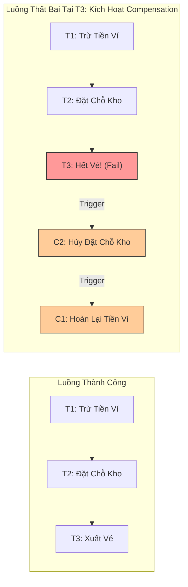

#### Hai Phong Cách Triển Khai Saga:

```mermaid
flowchart TD
    subgraph Choreography_Model ["1. Choreography-Based Saga (Phi Tập Trung)"]
        S1["Order Service"] -->|Event: OrderCreated| S2["Payment Service"]
        S2 -->|Event: PaymentSuccess| S3["Inventory Service"]
        S3 -.->|Event: OutOfStock| S2
        S2 -.->|Event: RefundProcessed| S1
    end
    
    subgraph Orchestration_Model ["2. Orchestration-Based Saga (Tập Trung - Khuyên Dùng)"]
        Orch["Saga Orchestrator<br/>(Temporal / Camunda / AWS Step Functions)"]
        Orch -->|1. Command: ProcessPayment| PaySvc["Payment Service"]
        PaySvc -->>|ACK: OK| Orch
        Orch -->|2. Command: ReserveStock| InvSvc["Inventory Service"]
        InvSvc -->>|ACK: Failed| Orch
        Orch -.->|3. Compensate: RefundPayment| PaySvc
    end
```

1. **Choreography (Biên đạo múa phi tập trung)**:
   - Các service giao tiếp hoàn toàn qua việc lắng nghe và phát sóng sự kiện trên Message Broker (Apache Kafka, RabbitMQ).
   - **Ưu điểm**: Đơn giản cho các luồng nghiệp vụ ngắn (2–3 bước), loose coupling.
   - **Nhược điểm**: Khó theo dõi (Monitoring), nguy cơ phụ thuộc vòng lặp (Cyclic dependency), cực kỳ khó debug khi hệ thống có 10–20 services.
2. **Orchestration (Nhạc trưởng chỉ huy tập trung - Best Practice)**:
   - Sử dụng một Service chuyên trách đóng vai trò Orchestrator chạy một State Machine (sử dụng các framework chuyên nghiệp như **Temporal.io**, **Camunda**, hoặc AWS Step Functions).
   - Orchestrator gửi command rõ ràng tới từng service, lưu trữ vết thực thi vào database và chịu trách nhiệm gọi các bước bù trừ $C_i$ nếu có lỗi.
   - **Ưu điểm**: Quản lý tập trung trạng thái, trực quan hóa luồng nghiệp vụ trên UI, dễ dàng xử lý timeout và retry tự động.

---

### 6.4. Transactional Outbox Pattern: Triệt Tiêu Dual-Write với Change Data Capture (CDC)

Một trong những lỗi nghiêm trọng nhất khi thiết kế microservices là bài toán **Dual-Write (Ghi hai nơi cùng lúc)**:
```python
# ❌ ANTI-PATTERN: NGUY CƠ BẤT ĐỒNG BỘ NẶNG NỀ
def create_order(order_data):
    db.save(order_data)              # Bước 1: Ghi database thành công
    kafka.send("order_created", ...)  # Bước 2: Bị rớt mạng Kafka! -> Dữ liệu DB có nhưng Event không có!
```
Hoặc ngược lại: Nếu gửi Kafka trước, ghi DB bị lỗi rollback $\to$ Kafka đã phát tán sự kiện rác cho toàn bộ hệ sinh thái!

#### Giải Pháp Kiến Trúc: Transactional Outbox Pattern
Tận dụng **ACID Transaction cục bộ của chính Database** để ghi đồng thời dữ liệu nghiệp vụ và sự kiện vào một bảng gọi là `outbox_table`.

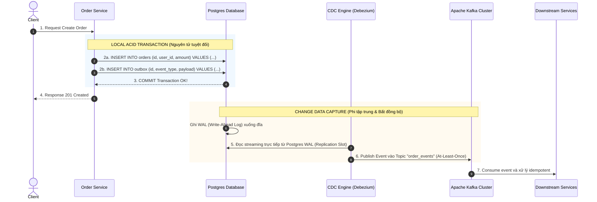

- **Nguyên lý CDC (Change Data Capture)**: Debezium không thực hiện truy vấn `SELECT` định kỳ (Polling) vì polling gây quá tải database. Thay vào đó, Debezium đóng vai trò như một Read Replica, đọc trực tiếp các byte nhị phân từ file **Write-Ahead Log (WAL)** của PostgreSQL hoặc binlog của MySQL ngay khi transaction được commit, đảm bảo độ trễ xuất bản sự kiện $< 10\text{ms}$ với chi phí CPU gần như bằng 0.

---

### 6.5. Kỹ Thuật Phòng Chống Split-Brain (Não Phân Rã)

Hiện tượng **Split-Brain (Não phân rã)** xảy ra khi kết nối mạng giữa hai nửa của cụm phân tán bị đứt hoàn toàn:
- Nửa A (gồm các node 1, 2) cho rằng các node 3, 4, 5 đã chết $\to$ Tự bầu Node 1 làm Leader.
- Nửa B (gồm các node 3, 4, 5) cho rằng các node 1, 2 đã chết $\to$ Tự bầu Node 3 làm Leader.
- **Thảm họa**: Cả hai Leader đều nhận lệnh ghi độc lập từ client $\to$ Dữ liệu bị phân kỳ hoàn toàn, gây hỏng cơ sở dữ liệu vĩnh viễn không thể merge.

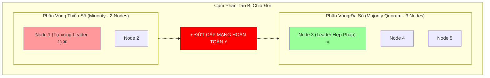

#### Ba Cơ Chế Phòng Thủ Bất Biến:

#### 1. Quorum Majority Protection ($\lfloor N/2 \rfloor + 1$):
- Một phân vùng **chỉ được phép bầu Leader và chấp nhận lệnh ghi** nếu nó chứa **đa số tuyệt đối các node** ($> 50\%$).
- Với cụm 5 nodes:
  - Phân vùng A (2 nodes): $2 \le 5/2$ $\to$ Không có Quorum $\to$ Tự động hạ cấp xuống Read-Only hoặc từ chối phục vụ.
  - Phân vùng B (3 nodes): $3 > 5/2$ $\to$ Có Quorum $\to$ Tiếp tục bầu Leader và phục vụ bình thường.
- **Quy tắc vàng của Architect**: Luôn cấu hình số lượng node trong cụm đồng thuận là **SỐ LẺ (3, 5, 7 nodes)** để luôn luôn tồn tại một phân vùng đa số duy nhất khi mạng bị cắt đôi.

#### 2. Fencing Tokens (Thẻ Rào Lũy Tiến Đơn Điệu):
Giải quyết trường hợp Leader cũ không chết hẳn mà chỉ bị treo do Garbage Collection (GC Pause) quá lâu. Khi Leader cũ tỉnh dậy, nó vẫn tưởng mình là Leader và cố gắng ghi dữ liệu vào Shared Storage.

```mermaid
sequenceDiagram
    autonumber
    participant OldLeader as Leader Cũ (Epoch 1)
    participant LockSvc as Consensus Lock Service (etcd)
    participant NewLeader as Leader Mới (Epoch 2)
    participant Storage as Shared Storage Engine

    Note over OldLeader: Bị treo STW GC Pause 30 giây...
    LockSvc->>LockSvc: Hết hạn Lease của Leader cũ
    NewLeader->>LockSvc: Yêu cầu quyền Leader
    LockSvc-->>NewLeader: Cấp Lease kèm FENCING TOKEN = 42
    NewLeader->>Storage: Ghi dữ liệu kèm Token 42 (Storage ghi nhận Max Token = 42)
    Storage-->>NewLeader: Ghi thành công!
    
    Note over OldLeader: Tỉnh dậy sau GC Pause, tưởng mình vẫn là Leader!
    OldLeader->>Storage: Ghi dữ liệu kèm TOKEN CŨ = 41
    Storage-->>OldLeader: ❌ LỖI: Token 41 < Max Token 42! TỪ CHỐI GHI!
```

- Mỗi lần cấp quyền điều phối, Lock Service trả về một con số tăng đơn điệu ($Epoch / Generation / Token$).
- Server lưu trữ tài nguyên kiểm tra: Nếu request gửi tới có Token nhỏ hơn Token lớn nhất mà nó từng xử lý $\to$ **Thẳng thừng từ chối thực thi**.

#### 3. STONITH (Shoot The Other Node In The Head):
- Trong các hệ thống hạ tầng quan trọng (High-Availability Linux Clusters, SAN Storage), node phát hiện sự cố sẽ kích hoạt thiết bị điều khiển nguồn vật lý (PDU - Power Distribution Unit qua mạng IPMI) để **ngắt điện trực tiếp máy chủ của node nghi ngờ bị split-brain**. Một máy tính đã tắt nguồn thì 100% không thể phá hoại dữ liệu.

---

## 7. MA TRẬN ĐÁNH GIÁ KIẾN TRÚC & CẨM NANG PRODUCTION

### 7.1. Bảng So Sánh Các Hệ Quản Trị Cơ Sở Dữ Liệu Phân Tán Đỉnh Cao

| Tiêu Chí Kỹ Thuật | Google Cloud Spanner | CockroachDB | Apache Cassandra | Amazon DynamoDB | TiDB |
| :--- | :--- | :--- | :--- | :--- | :--- |
| **Mô Hình Dữ Liệu** | Relational / NewSQL | Relational / NewSQL (Postgres-compatible) | Wide-Column / NoSQL | Key-Value & Document | Relational / NewSQL (MySQL-compatible) |
| **Phân Loại CAP / PACELC** | **CP / PC/EC** | **CP / PC/EC** | **AP / PA/EL** | **AP hoặc CP (Configurable)** | **CP / PC/EC** |
| **Thuật Toán Đồng Thuận** | Multi-Paxos + TrueTime | Raft (Multi-Raft Groups) | Leaderless Paxos (chỉ cho LWT) | Multi-Paxos nội bộ | Raft (Multi-Raft trên TiKV) |
| **Chiến Lược Sharding** | Range Partitioning (Dynamic Splits) | Range Partitioning (Ranges 64MB) | Consistent Hashing Ring (Vnodes) | Consistent Hashing (Partitions) | Range Partitioning (Regions 96MB) |
| **Đồng Bộ Đồng Hồ (Clocks)** | **TrueTime API** (GPS + Atomic Clocks) | **Hybrid Logical Clocks (HLC)** | NTP thông thường (Dễ dính clock drift) | Internal TimeSync Service | **Placement Driver (PD)** Timestamp Oracle (TSO) |
| **Hỗ Trợ Giao Dịch** | Full ACID (Strict Serializability) | Full ACID (Serializable Isolation) | Không hỗ trợ multi-row ACID (chỉ có LWT) | ACID transactions (tính phí x2 RCU/WCU) | Full ACID (Snapshot Isolation & Pessimistic) |
| **Chi Phí & Triển Khai** | Độc quyền Google Cloud (Cực kỳ đắt đỏ) | Mã nguồn mở / Cloud / Self-hosted | Mã nguồn mở Apache / Tự vận hành phức tạp | Độc quyền AWS (Serverless pay-per-use) | Mã nguồn mở PingCAP / Cloud / On-premise |
| **Trường Hợp Nên Chọn** | Ứng dụng ngân hàng toàn cầu cần độ chính xác tuyệt đối trên nhiều châu lục. | Ứng dụng enterprise cần chuẩn giao thức PostgreSQL, scale ngang không downtime. | Dữ liệu time-series khổng lồ, IoT ghi hàng triệu ops/s, chấp nhận eventual consistency. | Ứng dụng web/mobile trên AWS cần độ trễ micro-second không cần quản trị server. | Hệ thống đang dùng MySQL bị quá tải dung lượng, cần migrate không sửa code app. |

---

### 7.2. Cẩm Nang Quyết Định Kiến Trúc Dành Cho Lead Architect (Decision Framework)

```mermaid
flowchart TD
    Start["Bắt Đầu Lựa Chọn Kiến Trúc Dữ Liệu"] --> Q1{"Dữ Liệu Có Đòi Hỏi Giao Dịch ACID Đa Bảng Chặt Chẽ Không?"}
    
    Q1 -- "Bắt Buộc ACID (Tài chính, Đơn hàng, Sổ cái)" --> Q2{"Dung Lượng & Tải Ghi Có Vượt Quá 1 Server Vật Lý (10TB) Không?"}
    Q2 -- "Không (<= 10TB, <= 20,000 TPS)" --> Sol_RDBMS["CHỌN: PostgreSQL / MySQL Single-Node<br/>+ Read Replicas + Connection Pooler<br/>(Đơn giản, an toàn, chi phí thấp nhất)"]
    Q2 -- "Có (Cần Scale Ngang Hàng Trăm TB)" --> Sol_NewSQL["CHỌN: Distributed SQL (CockroachDB / TiDB / Spanner)<br/>(Bảo toàn ACID + Sharding tự động qua Raft/Paxos)"]
    
    Q1 -- "Không Bắt Buộc (Log, Event, Metrics, Chat, Cart)" --> Q3{"Thông Lượng Ghi & Đọc Cực Đại Cần Gì?"}
    Q3 -- "Ghi khổng lồ (>100k writes/s), Độ trễ thấp <5ms" --> Sol_Cassandra["CHỌN: Apache Cassandra / ScyllaDB<br/>(Leaderless Quorum, Append-only LSM-Tree)"]
    Q3 -- "Key-Value đơn giản, Serverless, Không bảo trì" --> Sol_Dynamo["CHỌN: Amazon DynamoDB / Redis Cluster"]
```

#### Quy Tắc Vàng Khi Thiết Kế Hệ Thống Phân Tán Trong Production:
1. **Không phân tán nếu không bắt buộc (Avoid Distributed Systems if Possible)**:
   Một cụm PostgreSQL được tối ưu hóa chỉ mục tốt kết hợp với phần cứng NVMe SSD hiện đại có thể xử lý mượt mà 30,000 – 50,000 truy vấn mỗi giây và lưu trữ 5TB dữ liệu mà không cần đến sự phức tạp của Raft, Paxos hay 2PC.
2. **Luôn sử dụng Idempotency Key (Khóa bất biến lũy thừa)**:
   Trong mạng phân tán, mọi yêu cầu mạng đều có thể bị gửi lặp lại (At-least-once delivery). Mọi API nhận thanh toán hoặc ghi dữ liệu đều bắt buộc phải kiểm tra Idempotency Key để ngăn chặn việc trừ tiền hoặc tạo đơn hàng hai lần.
3. **Giám Sát Chặt Chẽ Replication Lag**:
   Không bao giờ tin tưởng mù quáng vào Read Replicas cho các luồng nghiệp vụ quan trọng ngay sau khi ghi. Luôn thiết lập cảnh báo PagerDuty khi Replication Lag vượt quá 1 giây.
4. **Thiết Kế Cho Thất Bại (Design for Failure)**:
   Mọi cuộc gọi mạng liên server đều phải có **Timeout ngắn hạn**, **Circuit Breaker** (như Resilience4j), và cơ chế **Graceful Degradation** (Hạ cấp dịch vụ an toàn) khi một phân vùng mạng bị cô lập.

---
> 🏁 **KẾT THÚC MODULE 04**  
> *Tài liệu thuộc Bản quyền Khóa học Database Masterclass do Anh (Lead Architect) và Pod 4 (Distributed Systems Architect) đồng kiến tạo.*
