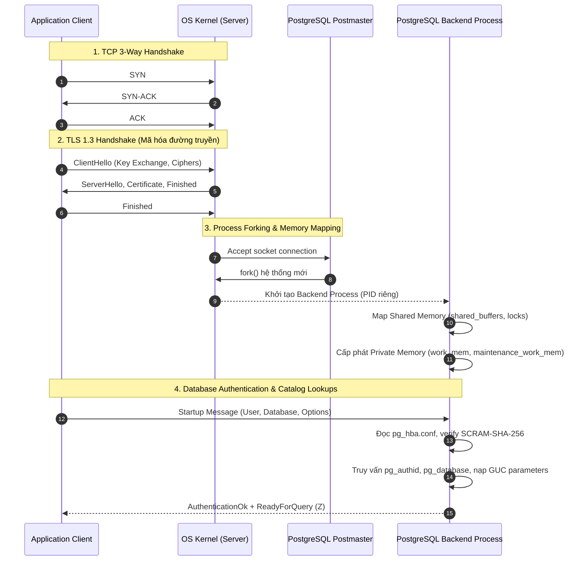
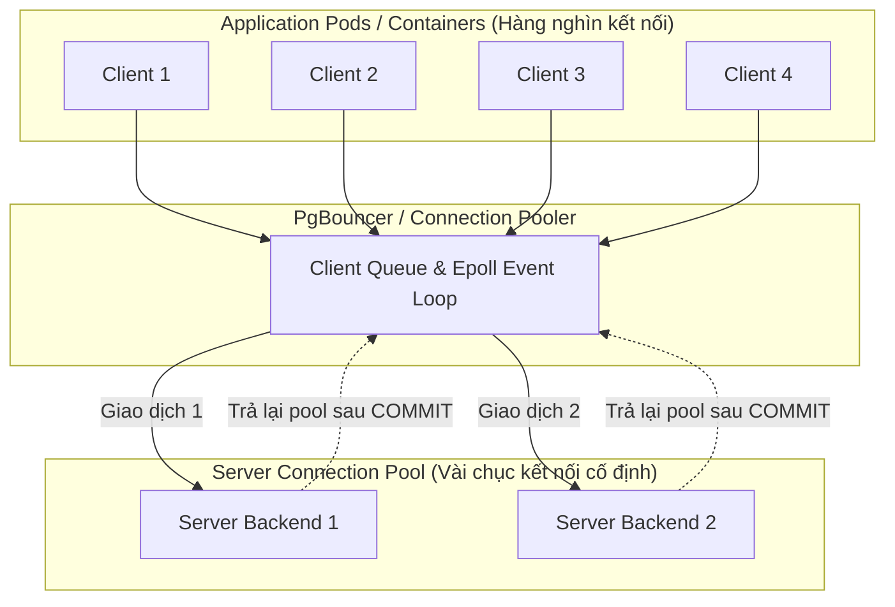
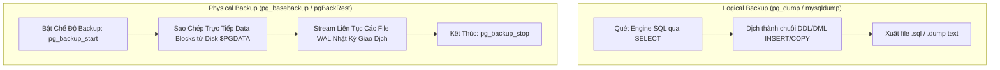
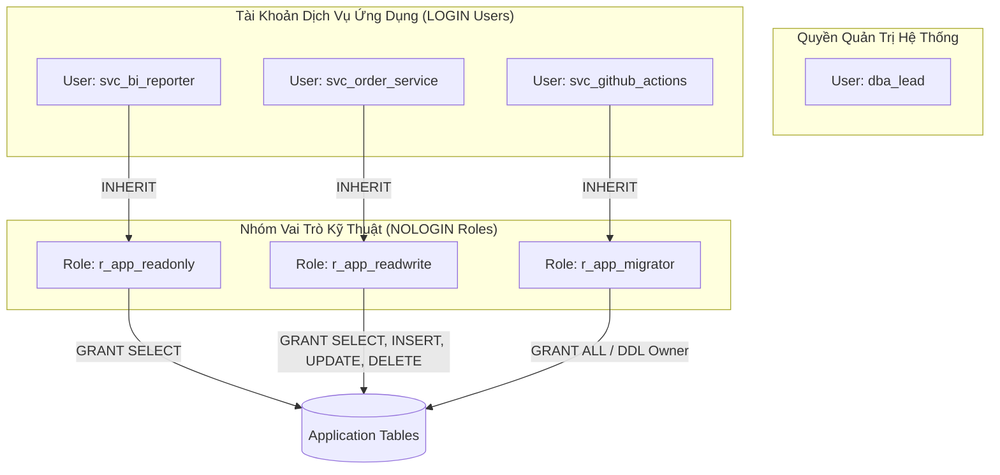
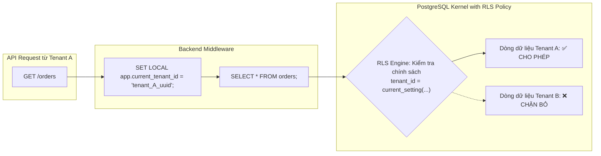
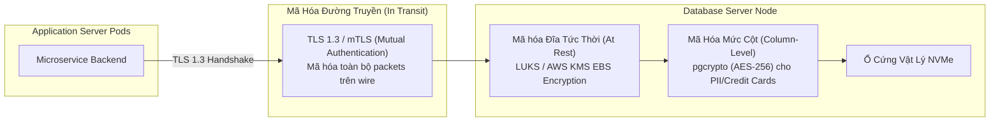
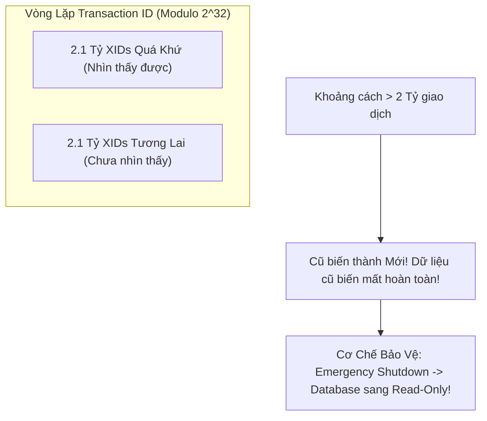

# 🛡️ MODULE 08: DATABASE RELIABILITY ENGINEERING (DBRE), SECURITY & OPERATIONS
> **Hệ Thống Đào Tạo Kỹ Sư Database Cấp Cao (Database Masterclass Series)**  
> **Chuyên đề**: Kỹ nghệ Độ tin cậy (DBRE), Bảo mật Chuyên sâu (Database Hardening) và Vận hành Hệ thống Cơ sở Dữ liệu Quy mô Lớn.  
> **Target Audience**: Database Reliability Engineers (DBRE), Lead Architects, Backend Infrastructure Engineers.  
> **Chuẩn mực Thực thi**: Enterprise Production-Grade, Zero-Trust Architecture, Defense-in-Depth.

---

## 📑 MỤC LỤC CHI TIẾT (TABLE OF CONTENTS)
1. [Kỹ Nghệ Độ Tin Cậy Cơ Sở Dữ Liệu (DBRE) & Quản Trị Kết Nối (Connection Pooling)](#1-kỹ-nghệ-độ-tin-cậy-cơ-sở-dữ-liệu-dbre--quản-trị-kết-nối-connection-pooling)
   - 1.1 Chi phí Vòng đời Kết nối (Expensive Connection Lifecycle)
   - 1.2 Phân tích Các Mô hình Pooling: Session vs Transaction vs Statement
   - 1.3 Công thức Định lượng Kích thước Connection Pool Tối ưu (HikariCP / PostgreSQL)
   - 1.4 Thảm họa Connection Storm & Định luật Little (Little's Law)
   - 1.5 Cấu hình Mẫu PgBouncer Chuẩn Production High-Throughput
2. [Chiến Lược Sao Lưu & Phục Hồi Thảm Họa (Backup & Disaster Recovery)](#2-chiến-lược-sao-lưu--phục-hồi-thảm-họa-backup--disaster-recovery)
   - 2.1 So sánh Toàn diện: Logical Backup vs Physical Backup
   - 2.2 Phục Hồi Chính Xác Theo Thời Gian (Point-In-Time Recovery - PITR)
   - 2.3 Cơ chế WAL Archiving & Binlog Shipping
   - 2.4 Khung Chỉ số RTO & RPO Trong Thiết Kế Hạ Tầng Phục Hồi
3. [Tăng Cường Bảo Mật Cơ Sở Dữ Liệu (Database Hardening & Security)](#3-tăng-cường-bảo-mật-cơ-sở-dữ-liệu-database-hardening--security)
   - 3.1 Nguyên tắc Đặc quyền Tối thiểu (Least Privilege) & Phân quyền Vai trò (RBAC)
   - 3.2 Row-Level Security (RLS) Cho Kiến Trúc Multi-tenant SaaS
   - 3.3 Phòng Chống Tấn Công SQL Injection & Cạm Bẫy ORM (ORM Pitfalls)
   - 3.4 Mã Hóa Dữ Liệu Toàn Diện: Encryption in Transit & Encryption at Rest
4. [Giám Sát Sức Khỏe & Các Chỉ Số Vàng (Database Health Monitoring & Telemetry)](#4-giám-sát-sức-khỏe--các-chỉ-số-vàng-database-health-monitoring--telemetry)
   - 4.1 Giám sát Hiệu Năng Truy Vấn qua `pg_stat_statements` & Performance Schema
   - 4.2 Phình To Bảng & Chỉ Mục (Table & Index Bloat) do MVCC Dead Tuples
   - 4.3 Thảm họa Vòng Lặp Mã Giao Dịch (Transaction ID Wraparound Disaster)
   - 4.4 Các Chỉ Số Vàng: Replication Lag, Cache Hit Ratio, Lock Contention
5. [Bộ Kịch Bản Vận Hành & Truy Vấn Chẩn Đoán Thực Chiến (Operational Runbooks & Queries)](#5-bộ-kịch-bản-vận-hành--truy-vấn-chẩn-đoán-thực-chiến-operational-runbooks--queries)
   - 5.1 Script Khởi Tạo Phân Quyền RBAC Chuẩn Enterprise
   - 5.2 Triển Khai Chính Sách Multi-Tenant RLS An Toàn Tuyệt Đối
   - 5.3 Top Query Chẩn Đoán Slow Queries, Bloat, Lock Trees & Wraparound
6. [Bảng Kiểm Tra Nghiệm Thu Vận Hành & An Ninh (Production Readiness Checklist)](#6-bảng-kiểm-tra-nghiệm-thu-vận-hành--an-ninh-production-readiness-checklist)

---

# 1. KỸ NGHỆ ĐỘ TIN CẬY CƠ SỞ DỮ LIỆU (DBRE) & QUẢN TRỊ KẾT NỐI (CONNECTION POOLING)

## 1.1 Chi phí Vòng đời Kết nối (Expensive Connection Lifecycle)
Trong các hệ thống cơ sở dữ liệu quan hệ (RDBMS) như **PostgreSQL** hay **MySQL**, việc thiết lập một kết nối mới (`Connection Establishment`) giữa Client và Database Server là một trong những tác vụ tiêu tốn tài nguyên phần cứng (CPU, Memory, Network) nặng nề nhất.



### Chi tiết các tầng chi phí:
1. **Tầng Mạng & Giao Thức (Network & Protocol Layer)**:
   - **TCP 3-Way Handshake**: Tốn tối thiểu 1 RTT (`Round-Trip Time`).
   - **TLS 1.3 Cryptographic Handshake**: Tốn thêm 1-2 RTT để trao đổi khóa bất đối xứng (Diffie-Hellman), thẩm định chứng chỉ (`X.509 Certificate Verification`), và mã hóa phiên.
2. **Tầng Hệ Điều Hành & Quản Lý Tiến Trình (Operating System & Process Model)**:
   - **PostgreSQL Process-per-Connection Model**: PostgreSQL vận hành trên kiến trúc đa tiến trình (`Multi-process Architecture`). Mỗi khi có client kết nối, tiến trình mẹ `postmaster` phải gọi lệnh hệ thống `fork()` để nhân bản một tiến trình con `postgres backend`. Quá trình này tiêu tốn CPU cycles để sao chép page tables (dù có Copy-on-Write) và tạo descriptor context.
   - **Bộ Nhớ Riêng Biệt (Private Memory Footprint)**: Mỗi backend process chiếm từ $5\text{ MB}$ đến $25\text{ MB}$ RAM cơ sở (chưa tính các buffer cấp phát động như `work_mem` khi chạy sort/hash). Nếu có $1,000$ kết nối trực tiếp, hệ thống mất ngay $10 - 20\text{ GB}$ RAM chỉ để duy trì trạng thái nhàn rỗi (`Idle Connections`).
   - **Context Switching Overhead**: Khi hàng ngàn process tranh chấp CPU cores, OS Scheduler phải liên tục thực hiện chuyển đổi ngữ cảnh (`Context Switch`), đẩy CPU vào trạng thái bão hòa Kernel (`High System CPU %`) mà không xử lý được thêm câu truy vấn nghiệp vụ nào.
3. **Tầng Động Cơ Cơ Sở Dữ Liệu (Database Engine Initialization)**:
   - **Xác thực & Nạp Phân quyền (`Authentication & Authorization`)**: Phân giải mật khẩu (SCRAM-SHA-256 / MD5), nạp thông tin quyền hạn từ bảng catalog hệ thống (`pg_authid`, `pg_roles`).
   - **Thiết lập Ngữ cảnh Phiên (`Session Context Setup`)**: Thiết lập các biến phiên (`search_path`, `client_encoding`, `timezone`, `default_transaction_isolation`), chuẩn bị caches kế hoạch cục bộ (`Plan Cache`).

---

## 1.2 Phân tích Các Mô hình Pooling: Session vs Transaction vs Statement
Để giải quyết bài toán lãng phí tài nguyên kết nối, tầng trung gian **Connection Pooler** (như **PgBouncer**, **Odyssey**, **ProxySQL**) được đặt giữa Application và Database. 

PgBouncer hỗ trợ 3 chế độ hoạt động (`Pool Modes`) với bản chất và giới hạn kỹ thuật hoàn toàn khác biệt:



### Bảng So Sánh Chi Tiết 3 Chế Độ Pooling (PgBouncer)

| Tiêu Chí Kỹ Thuật | Session Pooling (`pool_mode = session`) | Transaction Pooling (`pool_mode = transaction`) | Statement Pooling (`pool_mode = statement`) |
| :--- | :--- | :--- | :--- |
| **Bản chất Gán Kết Nối** | Gán chặt 1 Backend Server cho 1 Client suốt từ khi `CONNECT` đến khi `DISCONNECT`. | Gán Backend Server cho Client **chỉ trong phạm vi 1 Transaction** (`BEGIN` ... `COMMIT`/`ROLLBACK`). | Gán Backend Server **chỉ cho 1 câu SQL đơn lẻ**. |
| **Thời điểm Trả Về Pool** | Khi Client chủ động đóng socket. | Ngay sau khi transaction kết thúc (`COMMIT` hoặc `ROLLBACK`). | Ngay sau khi câu lệnh SQL thực thi xong. |
| **Hiệu quả Nén Kết Nối** | Rất thấp. Tương đương kết nối trực tiếp, chỉ tiết kiệm chi phí TCP/TLS handshake. | **Cực cao**. Tỷ lệ nén có thể đạt $50:1$ hoặc $100:1$ (10,000 clients chia sẻ 100 backend conns). | Cao nhất về lý thuyết, nhưng cực kỳ rủi ro. |
| **Hỗ trợ Giao dịch Nhiều Lệnh** | Đầy đủ (`BEGIN ... COMMIT`). | Đầy đủ (`BEGIN ... COMMIT`). | **KHÔNG HỖ TRỢ**. Mỗi lệnh tự động coi như 1 auto-commit transaction. |
| **Session-level Features (`SET`, `LISTEN`, Temp Tables)** | Hoạt động bình thường 100%. | **Hạn chế lớn**: Không thể dùng `LISTEN/NOTIFY`, `SET search_path` cục bộ, Bảng tạm (`TEMPORARY TABLE`). | **Không thể sử dụng**. Mọi trạng thái phiên bị xóa sạch sau từng câu lệnh. |
| **Prepared Statements** | Hoạt động hoàn toàn (Named & Unnamed). | **Cần lưu ý**: Trước PgBouncer 1.21 chỉ hỗ trợ unnamed. Từ 1.21+ hỗ trợ named prepared statements qua cấu hình `max_prepared_statements`. | Hoàn toàn không tương thích. |
| **Khuyến nghị Môi trường** | Legacy apps không tương thích transaction pooling; Migration/DDL scripts. | **Chuẩn Production mặc định cho microservices, web apps, REST APIs, GraphQL**. | Rất hiếm khi dùng, chỉ phù hợp cho hệ thống pure read-only logging đơn lệnh. |

---

## 1.3 Công thức Định lượng Kích thước Connection Pool Tối ưu (HikariCP / PostgreSQL)

Một trong những sai lầm phổ biến nhất của các kỹ sư là tư duy: *"Càng nhiều kết nối Database đồng thời thì hệ thống chạy càng nhanh"*. Trên thực tế, hiệu năng hệ thống tỷ lệ thuận với số lượng kết nối cho đến một ngưỡng bão hòa (`Knee of the curve`), sau đó sụp đổ nghiêm trọng do tắc nghẽn tài nguyên (`Resource Contention`).

```
Throughput (TPS)
   ^
   |             Ngưỡng tối ưu (Knee point)
   |                    / \
   |                   /   \
   |                  /     \  Thảm họa Tranh chấp CPU / Lock Contention
   |                 /       \ (Throughput lao dốc, Latency tăng vọt)
   |                /         \
   |               /           \
   |              /             \
   +-------------+---------------+-------------------------->
   0        Pool Size Nhỏ    Pool Size Quá Lớn (1,000+)    Connections
```

### Công thức Kinh điển của PostgreSQL Project & Brett Wooldridge (HikariCP Author):
$$\Large N_{\text{connections}} = ((N_{\text{cores}} \times 2) + N_{\text{spindles}})$$

Trong đó:
* $N_{\text{cores}}$: Số lượng CPU Cores logic (vCPU) của Database Server.
* $N_{\text{spindles}}$: Số lượng đĩa cơ quay (Spindles) trong mảng lưu trữ HDD. 
* **Lưu ý hiện đại (SSD / NVMe)**: Đối với ổ cứng thể rắn hiện đại (NVMe SSD), độ trễ tìm kiếm (`Seek Time`) gần như bằng $0$. Tuy nhiên, do các hoạt động I/O blocking (như Flush WAL, Page fault, Network wait), hệ số $N_{\text{spindles}}$ thường được coi là một hằng số dự trữ I/O nhỏ ($\sim 1 - 4$).

#### Ví dụ Thực tế:
Một Database Server cấu hình mạnh mẽ chạy trên AWS EC2 `r6i.4xlarge`:
* $16\text{ vCPUs}$
* $128\text{ GB}$ RAM
* Lưu trữ AWS gp3 NVMe SSD

Áp dụng công thức:
$$N_{\text{connections}} = ((16 \times 2) + 2) = 32 + 2 = 34\text{ connections}$$

> [!IMPORTANT]
> **Nghịch lý Database Sizing**: Một hệ thống chạy 500 microservices instances chỉ cần một Database Pool duy trì **30 đến 50 active connections** tại tầng PostgreSQL backend là đủ để đạt thông lượng tối đa mà CPU có thể xử lý, miễn là thời gian giữ kết nối ngắn và được quản trị qua PgBouncer Transaction Pooling.

---

## 1.4 Thảm họa Connection Storm & Định luật Little (Little's Law)

### Định luật Little trong Database Concurrency:
Định luật Little (Little's Law) xác định mối quan hệ căn bản giữa số lượng kết nối đang được sử dụng đồng thời ($L$), lưu lượng yêu cầu đến hệ thống ($\lambda$ - Requests Per Second), và thời gian thực thi trung bình của mỗi truy vấn ($W$ - Latency):

$$\Large L = \lambda \times W$$

* Giả sử hệ thống xử lý $\lambda = 10,000\text{ queries/second}$.
* Nếu các câu truy vấn được tối ưu hóa tốt, thời gian thực thi trung bình $W = 2\text{ ms} = 0.002\text{ s}$.
* Số lượng kết nối Database cần thiết đồng thời là:
  $$L = 10,000 \times 0.002 = 20\text{ connections!}$$
* **Hậu quả khi truy vấn bị nghẽn (Degraded Performance)**:
  Nếu một câu truy vấn bị thiếu index hoặc gặp lock contention, khiến $W$ tăng từ $2\text{ ms}$ lên $500\text{ ms} = 0.5\text{ s}$:
  $$L = 10,000 \times 0.5 = 5,000\text{ connections!}$$

### Hiện tượng Connection Storm (Bão Kết Nối) & Thất Bại Tích Lũy (Cascading Failure):
Khi $L$ tăng đột biến vượt quá `max_connections`:
1. Các ứng dụng Client bị timeout khi chờ kết nối, dẫn đến logic Retry dồn dập (`Aggressive Retry without Jitter`).
2. PostgreSQL kích hoạt hàng ngàn backend processes, tranh chấp cấu trúc dữ liệu nội bộ `procarray` (bảng quản lý toàn bộ transaction đang chạy để tính toán snapshot MVCC).
3. CPU dành 90% thời gian cho `spinlocks`, `lwlocks` (`ProcArrayLock`) và `context switching`.
4. Cơ sở dữ liệu hoàn toàn tê liệt, kích hoạt OOM Killer hạ gục tiến trình Database chính.

---

## 1.5 Cấu hình Mẫu PgBouncer Chuẩn Production High-Throughput

File cấu hình `/etc/pgbouncer/pgbouncer.ini` được tối ưu hóa cho môi trường Enterprise:

```ini
;; =====================================================================
;; PGBOUNCER PRODUCTION ENTERPRISE CONFIGURATION
;; Architecture: Transaction Pooling, High Concurrency, Zero-Leak
;; =====================================================================

[databases]
;; Cấu hình bí danh database ánh xạ tới server backend thực tế
app_production = host=10.0.10.50 port=5432 dbname=app_production auth_user=pgbouncer_auth

;; Cấu hình Fallback cho tất cả database khác
* = host=10.0.10.50 port=5432 auth_user=pgbouncer_auth

[pgbouncer]
;; ---------------------------------------------------------------------
;; Thông số Mạng & Địa Chỉ Lắng Nghe
;; ---------------------------------------------------------------------
logfile = /var/log/postgresql/pgbouncer.log
pidfile = /var/run/postgresql/pgbouncer.pid
listen_addr = 0.0.0.0
listen_port = 6432
unix_socket_dir = /var/run/postgresql

;; ---------------------------------------------------------------------
;; Chế độ Quản Trị Xác Thực (Authentication)
;; ---------------------------------------------------------------------
auth_type = scram-sha-256
auth_file = /etc/pgbouncer/userlist.txt
;; Sử dụng hàm tra cứu mật khẩu động từ database (chỉ user đặc quyền)
auth_query = SELECT usename, passwd FROM pgbouncer.lookup_user($1)

;; ---------------------------------------------------------------------
;; Cơ Chế Pooling Cốt Lõi (Core Pool Mechanism)
;; ---------------------------------------------------------------------
;; Bắt buộc dùng transaction pooling cho web traffic quy mô lớn
pool_mode = transaction

;; Số lượng kết nối tối đa từ các Client App tới PgBouncer
max_client_conn = 10000

;; Số kết nối mặc định được phép mở tới mỗi database/user pair tại PostgreSQL
default_pool_size = 40

;; Số kết nối tối thiểu luôn giữ ấm trong pool
min_pool_size = 10

;; Số kết nối khẩn cấp bổ sung khi pool bị quá tải ngắn hạn
reserve_pool_size = 10
reserve_pool_timeout = 3.0

;; Giới hạn tối đa kết nối tới 1 database duy nhất từ mọi pool cộng lại
max_db_connections = 100

;; ---------------------------------------------------------------------
;; Quản Trị Bộ Nhớ Đệm & Prepared Statements (PgBouncer 1.21+)
;; ---------------------------------------------------------------------
max_prepared_statements = 250

;; ---------------------------------------------------------------------
;; Timeouts & Dọn Dẹp Tài Nguyên (Dead Connection Reaper)
;; ---------------------------------------------------------------------
;; Đóng kết nối server nếu nhàn rỗi quá lâu
server_idle_timeout = 60.0

;; Đóng kết nối client nếu nhàn rỗi quá thời gian quy định
client_idle_timeout = 0

;; Ngắt các query chạy quá lâu qua pooler (bảo vệ chống DOS)
query_timeout = 120.0

;; Timeout chờ kết nối rảnh trong pool trước khi trả lỗi client
query_wait_timeout = 15.0

;; Thời gian kiểm tra socket liveness bằng TCP Keepalive
server_connect_timeout = 5.0
server_login_retry = 1.0

;; Tự động reset trạng thái session khi trả kết nối về pool (dùng DISCARD ALL)
server_reset_query = DISCARD ALL
server_reset_query_always = 0

;; ---------------------------------------------------------------------
;; Tối Ưu Hóa Socket Hệ Thống (Linux Kernel Epoll Tuning)
;; ---------------------------------------------------------------------
pkt_buf = 4096
listen_backlog = 1024
so_reuseport = 1
```

---

# 2. CHIẾN LƯỢC SAO LƯU & PHỤC HỒI THẢM HỌA (BACKUP & DISASTER RECOVERY)

## 2.1 So sánh Toàn diện: Logical Backup vs Physical Backup

Một chiến lược DBRE vững chắc không bao giờ dựa dẫm vào duy nhất một phương thức sao lưu. Cần hiểu rõ sự khác biệt giữa hai trường phái: **Logical** và **Physical**.



### Bảng So Sánh Kỹ Thuật Chuyên Sâu

| Tiêu chí | Sao lưu Luận lý (Logical Backup) | Sao lưu Vật lý (Physical Backup) |
| :--- | :--- | :--- |
| **Công cụ Tiêu biểu** | `pg_dump`, `pg_dumpall`, `mysqldump`, `mydumper` | `pg_basebackup`, `pgBackRest`, `WAL-G`, `Barman`, `Percona XtraBackup`, EBS Snapshots |
| **Bản chất Dữ liệu** | Văn bản hoặc file nhị phân chứa các lệnh SQL (`CREATE TABLE`, `COPY`, `INSERT`). | Bản sao bit-by-bit của các tệp tin lưu trữ vật lý trên đĩa (`$PGDATA`, heap files, index files, transaction status CLOG). |
| **Tác động lên Hiệu năng khi Backup** | Rất nặng: Gây I/O cao, quét toàn bộ bảng vào `shared_buffers`, kéo dài thời gian snapshot khiến dead tuples không thể VACUUM (gây **Table Bloat** nghiêm trọng). | Nhẹ: Đọc tuần tự các khối dữ liệu từ OS page cache hoặc đĩa, tận dụng I/O rate limiting, không ảnh hưởng đến snapshot MVCC. |
| **Tốc độ Khôi phục (Restore Time)** | **Cực kỳ chậm** (O(hours/days) với DB > 500GB): Phải parse lại câu lệnh SQL, thực thi tuần tự, validate constraints, và quan trọng nhất: **phải build lại toàn bộ Index từ đầu**. | **Cực kỳ nhanh** (O(minutes)): Chỉ cần sao chép tệp tin nhị phân về đúng thư mục đĩa với tốc độ tối đa của mạng và NVMe SSD. Index có sẵn nguyên vẹn, không cần build lại. |
| **Độ linh hoạt Phục hồi** | Rất cao: Có thể khôi phục một bảng duy nhất, một schema, hoặc migrate giữa các phiên bản PostgreSQL khác nhau (e.g. PG 14 -> PG 16) hoặc khác OS. | Thấp: Phải khôi phục toàn bộ Cluster; yêu cầu phiên bản động cơ DB và kiến trúc phần cứng/OS tương thích tuyệt đối. |
| **Khả năng Phục hồi Từng Giây (PITR)** | Không hỗ trợ. Chỉ khôi phục về đúng thời điểm bắt đầu chạy lệnh dump. | **Hỗ trợ toàn diện**. Là nền tảng bắt buộc để thực hiện Point-In-Time Recovery kết hợp WAL/Binlog. |

---

## 2.2 Phục Hồi Chính Xác Theo Thời Gian (Point-In-Time Recovery - PITR)
Point-In-Time Recovery (PITR) là khả năng khôi phục trạng thái toàn vẹn của cơ sở dữ liệu về **bất kỳ một microsecond cụ thể nào** trong quá khứ, giúp loại trừ hậu quả của các thảm họa nghiêm trọng như:
* Kỹ sư chạy nhầm lệnh `DROP TABLE users;` hoặc `UPDATE orders SET status = 'CANCELLED';` không có mệnh đề `WHERE`.
* Lỗi phần mềm phá hoại dữ liệu hàng loạt (`Data Corruption Bug`).

```mermaid
sequenceDiagram
    autonumber
    participant D as Database Engine
    participant S as Base Backup Storage (Cold S3)
    participant W as WAL Archive (Continuous S3)
    participant R as New Recovery Node

    Note over D,W: Hoạt động thường nhật (Normal Operation)
    D->>W: Đầy 16MB WAL -> Archive segment qua pgBackRest
    D->>S: 02:00 AM Chủ Nhật: Full Base Backup

    Note over D: 14:23:15: Sự cố Nhân sự chạy 'DROP TABLE accounts;'
    
    Note over R: Kích hoạt Quy trình PITR khẩn cấp
    R->>S: 1. Tải Base Backup gần nhất (02:00 AM) giải nén vào $PGDATA
    R->>R: 2. Thiết lập recovery_target_time = '14:23:14 UTC'
    R->>W: 3. Tải tuần tự các file WAL từ 02:00 AM đến 14:23:14
    loop Replay Transaction Log
        R->>R: Áp dụng LSN, REDO thay đổi các data pages
    end
    Note over R: 4. Chạm mốc 14:23:14 -> Dừng Replay!
    R->>R: Promote thành Primary Database hoạt động độc lập
```

### Cơ chế Tái Thiết Lập Trạng Thái (WAL Replay Engine):
1. **Lập điểm mốc cơ sở (Base Backup)**: Chứa bản chụp tĩnh của các tệp tin dữ liệu tại thời điểm $T_0$.
2. **Áp dụng Nhật ký Ghi trước (Write-Ahead Logging - WAL)**: Mọi thay đổi trên data pages đều được ghi vào WAL trước khi ghi vào đĩa.
3. **Phát lại Nhật ký (REDO Phase)**: Khi khởi động ở chế độ khôi phục, engine đọc WAL từ điểm Checkpoint của Base Backup và tái hiện tuần tự từng byte thay đổi trên từng block đĩa.
4. **Xác định Điểm Dừng Phục Hồi (`Recovery Target`)**:
   - `recovery_target_time`: Dừng trước thời điểm xảy ra sự cố 1 giây.
   - `recovery_target_xid`: Dừng trước Transaction ID gây lỗi.
   - `recovery_target_name`: Dừng tại Restore Point do người dùng tạo trước khi deploy (`SELECT pg_create_restore_point('pre_release_v2_1');`).
   - `recovery_target_inclusive = false`: Không thực thi giao dịch gây lỗi tại điểm đích.

---

## 2.3 Cơ chế WAL Archiving & Binlog Shipping

Để đảm bảo dữ liệu không bị thất thoát khi toàn bộ máy chủ vật lý bốc cháy, các file WAL/Binlog phải được liên tục đẩy ra kho lưu trữ độc lập (như AWS S3, Google Cloud Storage, hoặc Dedicated Backup Appliance).

### Cấu hình PostgreSQL WAL Archiving Chuẩn Production (`postgresql.conf`):
```ini
# Bật cơ chế WAL Level đầy đủ cho Replication và PITR
wal_level = replica
archive_mode = on

# Sử dụng công cụ sao lưu chuyên dụng pgBackRest thay vì lệnh cp thô sơ
archive_command = 'pgbackrest --stanza=db_cluster archive-push %p'

# Đảm bảo WAL được chuyển đi trong vòng tối đa 60 giây kể cả khi chưa đầy 16MB
archive_timeout = 60

# Giữ lại các segment WAL tối thiểu phục vụ Standby nodes
wal_keep_size = 16GB
max_wal_size = 64GB
min_wal_size = 4GB
```

---

## 2.4 Khung Chỉ số RTO & RPO Trong Thiết Kế Hạ Tầng Phục Hồi

Mọi kiến trúc sư DBRE phải cam kết hai chỉ số SLA kỹ thuật sống còn với doanh nghiệp:

```
[Thời điểm Sao lưu gần nhất]               [Xảy ra Thảm họa]               [Hệ thống Phục hồi Xong]
             |                                     |                                   |
             |<------------ RPO ------------------>|<-------------- RTO -------------->|
             |   (Lượng dữ liệu bị mất mát)        |      (Thời gian chết Downtime)    |
```

* **RPO (Recovery Point Objective - Giới hạn Mất mát Dữ liệu Tối đa Cho phép)**: Đo lường bằng **thời gian**. Cho biết khoảng cách giữa thời điểm thảm họa xảy ra và thời điểm của bản ghi dữ liệu gần nhất có thể khôi phục được. RPO thể hiện lượng dữ liệu doanh nghiệp chấp nhận đánh mất.
* **RTO (Recovery Time Objective - Thời gian Khôi phục Hoạt động Tối đa Cho phép)**: Đo lường bằng **thời gian**. Cho biết khoảng thời gian tối đa từ lúc sự cố làm sụp đổ hệ thống cho đến khi hệ thống hoạt động trở lại bình thường và sẵn sàng phục vụ người dùng.

### Bảng Ma Trận Phân Cấp Kiến Trúc Thảm Họa (Disaster Recovery Tiering)

| Cấp Độ Hệ Thống | Mục Tiêu RPO | Mục Tiêu RTO | Giải Pháp Kiến Trúc Kỹ Thuật Đòi Hỏi | Chi Phí Hạ Tầng |
| :--- | :--- | :--- | :--- | :--- |
| **Tier 0 (Mission Critical)** <br>*Ví dụ: Giao dịch Core Banking, Cổng thanh toán* | **$\text{RPO} = 0$** <br>(Không mất bất kỳ 1 byte dữ liệu nào) | **$\text{RTO} < 10\text{ giây}$** <br>(Tự động chuyển mạch Failover hoàn toàn) | Multi-AZ Synchronous Replication (`synchronous_commit = on`), Patroni + etcd DCS, Virtual IP / HAProxy chuyển hướng tức thời. | Cực cao ($\$\$\$\$\$$) |
| **Tier 1 (Core Business)** <br>*Ví dụ: Giỏ hàng E-commerce, Quản lý kho* | **$\text{RPO} < 1\text{ phút}$** | **$\text{RTO} < 5\text{ phút}$** | Asynchronous Streaming Replication với 2 Standby Nodes, tự động failover qua Patroni, Continuous WAL Archiving qua pgBackRest. | Cao ($\$\$\$\$$) |
| **Tier 2 (Operational Business)** <br>*Ví dụ: Báo cáo vận hành, CRM nội bộ* | **$\text{RPO} < 15\text{ phút}$** | **$\text{RTO} < 1\text{ giờ}$** | Daily Physical Base Backup + Continuous WAL Archiving (S3 PITR), manual switchover playbook qua Terraform. | Trung bình ($\$\$$) |
| **Tier 3 (Batch / Analytics)** <br>*Ví dụ: Data warehouse staging, Sandbox* | **$\text{RPO} < 24\text{ giờ}$** | **$\text{RTO} < 8\text{ giờ}$** | Daily Logical Backup (`pg_dump` nén), khôi phục từ snapshot lưu trữ lạnh (Cold Storage). | Thấp ($\$$) |

---

# 3. TĂNG CƯỜNG BẢO MẬT CƠ SỞ DỮ LIỆU (DATABASE HARDENING & SECURITY)

## 3.1 Nguyên tắc Đặc quyền Tối thiểu (Least Privilege) & Phân quyền Vai trò (RBAC)

Một trong những lỗ hổng bảo mật nghiêm trọng nhất trong các ứng dụng thực tế là việc sử dụng tài khoản `postgres` hoặc `root` trực tiếp trong file cấu hình microservices (`DATABASE_URL`).

### Kiến Trúc Phân Tầng Phân Quyền Vai Trò (Hierarchical RBAC Architecture):



### Các bước Hardening cốt lõi:
1. **Thu hồi quyền mặc định trên schema `public`**: Mặc định trong các phiên bản PostgreSQL cũ, bất kỳ role nào cũng có quyền tạo bảng trong schema `public`.
   ```sql
   REVOKE CREATE ON SCHEMA public FROM PUBLIC;
   REVOKE ALL ON DATABASE app_production FROM PUBLIC;
   ```
2. **Khóa cứng tài khoản Superuser**: Cấm tuyệt đối kết nối từ xa bằng tài khoản `postgres`. Chỉ cho phép truy cập cục bộ qua Unix Socket với chứng thực `peer`.
3. **Cấu hình `pg_hba.conf` chuẩn Zero-Trust**:
   ```
   # TYPE  DATABASE        USER            ADDRESS                 METHOD
   # Cho phép kết nối cục bộ bảo mật qua Unix domain socket
   local   all             postgres                                peer
   # Bắt buộc kết nối mạng phải có mã hóa SSL và xác thực mật khẩu SCRAM-SHA-256
   hostssl app_production  all             10.0.0.0/16             scram-sha-256
   # Từ chối tất cả kết nối không mã hóa
   hostnossl all           all             0.0.0.0/0               reject
   ```

---

## 3.2 Row-Level Security (RLS) Cho Kiến Trúc Multi-tenant SaaS

Trong mô hình kiến trúc SaaS đa khách hàng (`Multi-tenant SaaS`), việc cách ly dữ liệu giữa các doanh nghiệp (Tenant) là yêu cầu sống còn. Mô hình chia bảng dùng chung (`Shared-Table Multi-tenancy`) với cột định danh `tenant_id` mang lại hiệu quả kinh tế cao nhất nhưng tiềm ẩn nguy cơ **Rò rỉ Dữ liệu Chéo (Cross-tenant Data Leakage)** nếu lập trình viên quên thêm mệnh đề `WHERE tenant_id = :current_tenant_id` trong code backend.

**Row-Level Security (RLS)** chuyển trách nhiệm thực thi an ninh từ tầng Application xuống thẳng lõi Database Engine. Cho dù lập trình viên viết `SELECT * FROM orders;`, PostgreSQL cũng chỉ trả về các dòng thuộc về Tenant hiện tại.



### Triển khai RLS Policy Chuẩn Xác:
```sql
-- 1. Kích hoạt RLS trên bảng nghiệp vụ
ALTER TABLE orders ENABLE ROW LEVEL SECURITY;

-- 2. Bắt buộc RLS áp dụng ngay cả với Table Owner (Chống bypass ngẫu nhiên)
ALTER TABLE orders FORCE ROW LEVEL SECURITY;

-- 3. Định nghĩa chính sách cách ly triệt để cho mọi thao tác (SELECT, INSERT, UPDATE, DELETE)
CREATE POLICY tenant_isolation_policy ON orders
    AS RESTRICTIVE
    FOR ALL
    TO r_app_readwrite
    USING (
        tenant_id = NULLIF(current_setting('app.current_tenant_id', true), '')::UUID
    )
    WITH CHECK (
        tenant_id = NULLIF(current_setting('app.current_tenant_id', true), '')::UUID
    );
```

> [!CAUTION]
> **Hiểm họa RLS Bypass với Security Definer Functions**:
> Nếu tạo một Function với thuộc tính `SECURITY DEFINER`, function đó sẽ thực thi với quyền của người tạo ra nó (thường là DBA/Owner). Nếu bên trong function không cấu hình kỹ lưỡng hoặc gọi dynamic SQL, RLS có thể bị vô hiệu hóa hoàn toàn, dẫn đến lộ lọt dữ liệu toàn hệ thống.

---

## 3.3 Phòng Chống Tấn Công SQL Injection & Cạm Bẫy ORM (ORM Pitfalls)

### Bản chất của SQL Injection:
SQL Injection xảy ra khi **Dữ liệu do người dùng nhập vào (Untrusted User Input)** bị bộ phân tích cú pháp (`SQL Parser`) hiểu nhầm là **Mã lệnh thực thi (Executable Code)**.

### Phòng ngự Căn bản: Prepared Statements & Parameterized Queries
```sql
-- Giao thức Extended Query Protocol trong PostgreSQL phân tách rõ ràng 2 giai đoạn:
-- Giai đoạn 1: Parse & Plan (Chỉ chứa cấu trúc câu lệnh, không chứa dữ liệu)
PREPARE get_user_by_email (text) AS
    SELECT id, full_name, password_hash FROM accounts WHERE email = $1;

-- Giai đoạn 2: Bind & Execute (Dữ liệu truyền vào dưới dạng tham số nhị phân)
EXECUTE get_user_by_email ('admin@example.com'' OR ''1''=''1'); 
-- Engine tìm kiếm chuỗi email khớp chính xác từng ký tự, không phân tích cú pháp lại!
```

### Cạm bẫy Lỗ Hổng Nguy Hiểm trong các Framework ORM Phổ Biến:

#### 1. Cạm bẫy Prisma ORM:
```typescript
// ❌ CỰC KỲ NGUY HIỂM: $queryRawUnsafe nhận chuỗi cộng gộp trực tiếp
const userInput = req.query.email;
await prisma.$queryRawUnsafe(`SELECT * FROM users WHERE email = '${userInput}'`);

// ✅ AN TOÀN TUYỆT ĐỐI: Dùng $queryRaw với Template Literal (Tự động chuyển thành Parameterized Query)
await prisma.$queryRaw`SELECT * FROM users WHERE email = ${userInput}`;
```

#### 2. Cạm bẫy Sequelize ORM:
```javascript
// ❌ NGUY HIỂM: Sử dụng sequelize.literal() để nhúng biểu thức người dùng
Order.findAll({
    where: sequelize.literal(`tenant_id = '${req.params.tenantId}'`) // Lỗ hổng SQLi tại đây!
});

// ✅ AN TOÀN: Luôn sử dụng replacements hoặc bind parameters chuẩn
Order.findAll({
    where: { tenantId: req.params.tenantId }
});
```

#### 3. Cạm bẫy Hibernate / JPA:
```java
// ❌ NGUY HIỂM: Nối chuỗi HQL / JPQL
entityManager.createQuery("SELECT u FROM User u WHERE u.username = '" + input + "'");

// ✅ AN TOÀN: Dùng Named Parameters
entityManager.createQuery("SELECT u FROM User u WHERE u.username = :username", User.class)
             .setParameter("username", input);
```

---

## 3.4 Mã Hóa Dữ Liệu Toàn Diện: Encryption in Transit & Encryption at Rest

Chiến lược phòng thủ đa lớp (`Defense-in-Depth`) đòi hỏi bảo vệ dữ liệu ở cả 2 trạng thái: khi đang di chuyển trên mạng (`In Transit`) và khi lưu tĩnh trên đĩa cứng (`At Rest`).



### 1. Encryption in Transit (Mã hóa đường truyền qua TLS 1.3):
* Cấu hình bắt buộc trên `postgresql.conf`:
  ```ini
  ssl = on
  ssl_cert_file = '/etc/ssl/certs/db-server.crt'
  ssl_key_file = '/etc/ssl/private/db-server.key'
  ssl_ca_file = '/etc/ssl/certs/enterprise-ca.crt'
  ssl_min_protocol_version = 'TLSv1.3'
  ```
* **Mutual TLS (mTLS)**: Cấu hình `ssl_ciphers` mạnh, yêu cầu phía Client phải trình chứng chỉ (`Client Certificate`) khớp với Certificate Authority (CA) của hệ thống mới được phép bắt tay kết nối.

### 2. Encryption at Rest (Mã hóa khi lưu trữ):
* **Tầng Hạ Tầng Khối (Block/Volume-Level Encryption)**: Sử dụng **Linux LUKS (`dm-crypt`)** trên Bare-metal hoặc **AWS KMS Encrypted EBS Volumes** trên Cloud. Mọi data blocks, WAL logs, temporary files, và core dumps đều tự động được mã hóa ở tầng controller bằng thuật toán `AES-XTS-PLAIN64` với key 256-bit.
* **Tầng Cơ Sở Dữ Liệu (Transparent Data Encryption - TDE)**: Sử dụng các bản phân phối hỗ trợ native TDE (như Percona Server for MySQL hoặc EnterpriseDB Postgres) để mã hóa data pages trước khi ghi xuống filesystem.
* **Tầng Ứng Dụng (Application-Level Envelope Encryption)**: Với dữ liệu cực kỳ nhạy cảm (Số thẻ tín dụng PCI-DSS, Căn cước công dân, Khóa bí mật), ứng dụng mã hóa bằng Data Encryption Key (DEK) được bảo vệ bởi Key Management Service (AWS KMS, HashiCorp Vault) trước khi đẩy vào Database.

---

# 4. GIÁM SÁT SỨC KHỎE & CÁC CHỈ SỐ VÀNG (DATABASE HEALTH MONITORING & TELEMETRY)

## 4.1 Giám sát Hiệu Năng Truy Vấn qua `pg_stat_statements` & Performance Schema

`pg_stat_statements` là extension quan trọng số 1 của PostgreSQL, theo dõi số liệu thống kê thực thi của tất cả các câu lệnh SQL đã chạy trên cluster mà không gây suy giảm hiệu năng.

### Kích hoạt trong `postgresql.conf`:
```ini
shared_preload_libraries = 'pg_stat_statements'
pg_stat_statements.max = 10000
pg_stat_statements.track = all
pg_stat_statements.save = on
```

### Các chỉ số quan trọng cần phân tích:
* `total_exec_time`: Tổng thời gian thực thi của query pattern.
* `mean_exec_time`: Thời gian thực thi trung bình mỗi lần gọi.
* `calls`: Tần suất câu lệnh được gọi.
* `shared_blks_hit` vs `shared_blks_read`: Tỷ lệ đọc từ RAM (`shared_buffers`) so với đọc từ đĩa cứng vật lý.
* `temp_blks_written`: Khối lượng dữ liệu bị đẩy ra đĩa tạm (chỉ dấu cho thấy `work_mem` quá nhỏ, câu lệnh phải sort/hash trên đĩa).

---

## 4.2 Phình To Bảng & Chỉ Mục (Table & Index Bloat) do MVCC Dead Tuples

### Bản chất của Hiện tượng Bloat trong PostgreSQL MVCC:
Khi thực hiện lệnh `UPDATE`, PostgreSQL **không ghi đè** lên bản ghi cũ. Thay vào đó:
1. Tạo một tuple mới chứa dữ liệu cập nhật (`Live Tuple`).
2. Đánh dấu tuple cũ là không còn hiệu lực (`Dead Tuple`).
3. Tương tự, lệnh `DELETE` chỉ đánh dấu tuple cũ là đã chết.

Các dead tuples này chiếm diện tích trên đĩa và chỉ có thể được dọn dẹp và đánh dấu tái sử dụng thông qua tiến trình ngầm **Autovacuum Worker**.

```
[ Page 8KB Trên Đĩa ]
+-------------------+-------------------+-------------------+-------------------+
| Live Tuple 1 (OK) | Dead Tuple 2 (X)  | Live Tuple 3 (OK) | Dead Tuple 4 (X)  |
+-------------------+-------------------+-------------------+-------------------+
                      ^                                       ^
                      |-- Chiếm dụng không gian đĩa vô ích ---|
                      |-- Buộc Index scan phải đọc nhiều page |
                      |-- Làm chậm truy vấn nghiêm trọng     |
```

### Nguyên Nhân Gây Bloat Nặng:
1. **Long-running Transactions**: Một giao dịch chạy suốt nhiều giờ (hoặc một kết nối bị treo ở trạng thái `idle in transaction`) sẽ giữ chân mốc `xmin horizon`. Autovacuum **không được phép dọn dẹp** bất kỳ dead tuple nào sinh ra sau mốc `xmin` này, dẫn đến hàng triệu dead tuples tích tụ.
2. **Autovacuum Tuning Quá Thận Trọng**: Mặc định, cấu hình autovacuum của PostgreSQL được thiết kế cho phần cứng của 20 năm trước (`vacuum_cost_limit = 200`), khiến tốc độ dọn dẹp chậm hơn rất nhiều so với tốc độ ghi dữ liệu của hệ thống hiện đại.

### Tinh Chỉnh Autovacuum Tối Ưu (`postgresql.conf`):
```ini
# Bật autovacuum tối đa năng lực
autovacuum = on
autovacuum_max_workers = 8

# Giảm ngưỡng kích hoạt dọn dẹp (Mặc định 20% là quá cao với bảng hàng trăm triệu dòng)
# Bảng 10 triệu dòng: 5% = 500,000 dead tuples là bắt đầu dọn
autovacuum_vacuum_scale_factor = 0.05
autovacuum_vacuum_threshold = 1000

# Tăng mạnh hạn mức chi phí I/O cho mỗi chu kỳ dọn dẹp
autovacuum_vacuum_cost_limit = 2000
autovacuum_vacuum_cost_delay = 2ms
```

### Giải pháp Xử lý Bloat Triệt để:
* **`VACUUM FULL`**: Khóa độc quyền toàn bảng (`ACCESS EXCLUSIVE LOCK`), chặn toàn bộ đọc và ghi. **Tuyệt đối không dùng trên Production**.
* **`pg_repack`**: Công cụ cứu cánh số 1 của DBRE. Tạo một bảng tạm mới, stream dữ liệu trực tiếp, đồng bộ thay đổi qua trigger và hoán đổi bảng trong microsecond mà **không khóa bảng đọc/ghi**.

---

## 4.3 Thảm họa Vòng Lặp Mã Giao Dịch (Transaction ID Wraparound Disaster)

PostgreSQL sử dụng bộ đếm số nguyên 32-bit không dấu để định danh Transaction ID (`xid`), tương đương với tối đa:
$$2^{32} \approx 4,294,967,296\text{ giao dịch (4.29 tỷ xids)}$$

Theo logic so sánh modulo số học của PostgreSQL:
* Một nửa số xids ($\sim 2.1\text{ tỷ}$) nằm trong quá khứ.
* Một nửa số xids ($\sim 2.1\text{ tỷ}$) nằm trong tương lai.



### Thảm họa:
Nếu hệ thống thực hiện hơn 2.1 tỷ giao dịch mà không thực hiện thao tác **Freeze (Đóng băng)**:
* Các giao dịch cực kỳ cũ trong quá khứ sẽ đột nhiên bị hiểu là **nằm ở tương lai**.
* Dữ liệu cũ bỗng nhiên "biến mất" hoàn toàn khỏi tầm nhìn của các câu truy vấn.

### Cơ Chế Tự Vệ Của PostgreSQL:
Để ngăn chặn mất mát dữ liệu, khi chỉ số `autovacuum_freeze_max_age` (mặc định 200 triệu transactions) bị vượt qua:
1. PostgreSQL kích hoạt các tiến trình `aggressive autovacuum to prevent wraparound`.
2. Nếu tiếp tục bị cản trở và chỉ còn $10\text{ triệu}$ transactions trước điểm chết, PostgreSQL sẽ **tự động tắt nguồn khẩn cấp (Emergency Shutdown)** và từ chối khởi động lại ở chế độ thông thường.
3. Hệ thống buộc phải đưa về chế độ Single-User Mode (`postgres --single`) để chạy manual vacuum trong nhiều ngày trời (Downtime thảm khốc).

---

## 4.4 Các Chỉ Số Vàng: Replication Lag, Cache Hit Ratio, Lock Contention

Mỗi DBRE phải xây dựng Dashboard giám sát liên tục 4 cụm chỉ số vàng (Golden Telemetry Signals):

```
+-----------------------------------------------------------------------------------+
|                        DBRE CRITICAL HEALTH TELEMETRY                             |
+------------------------------------+----------------------------------------------+
| 1. Cache Hit Ratio (Mục tiêu > 99%)| 2. Replication Lag (Mục tiêu < 1MB / < 1s)   |
| [===========================] 99.4%| Physical Lag: 120 KB  | Replay Lag: 45 ms     |
+------------------------------------+----------------------------------------------+
| 3. Connection Saturation           | 4. Active Lock Trees                         |
| Active: 38 / 100 (Pooler 420/10000)| Blocked Queries: 0  | Longest Lock: 0.12s    |
+------------------------------------+----------------------------------------------+
```

### 1. Cache Hit Ratio (Tỷ lệ Đọc Trúng Bộ Nhớ Đệm):
$$\Large \text{Cache Hit Ratio} = \frac{\text{shared\_blks\_hit}}{\text{shared\_blks\_hit} + \text{shared\_blks\_read}} \times 100\%$$
* **Ngưỡng chuẩn**: Hệ thống OLTP đạt chuẩn phải có tỷ lệ trúng cache **$\ge 99\%$**.
* **Ý nghĩa cảnh báo**: Nếu chỉ số này rớt xuống dưới $95\%$, nghĩa là hệ thống đang thiếu hụt `shared_buffers`, thiếu index dẫn đến Sequential Scans quy mô lớn, liên tục ép OS phải đọc dữ liệu từ đĩa vật lý.

### 2. Replication Lag (Độ Trễ Bản Sao):
* **Byte Lag**: Khoảng cách dung lượng giữa LSN ghi nhận tại Primary và LSN đã replay tại Standby (`pg_current_wal_lsn() - replay_lsn`).
* **Time Lag**: Độ lệch thời gian áp dụng bản ghi (`replay_lag`).
* **Hiểm họa Replication Slot**: Nếu một Standby Node bị chết hoặc mất mạng mà vẫn giữ một Physical Replication Slot hoạt động trên Primary, Primary sẽ **không bao giờ xóa các file WAL cũ** vì nghĩ rằng Standby sẽ quay lại cần dùng. Ổ đĩa `$PGDATA` của Primary sẽ bị lấp đầy 100% chỉ trong vài giờ, dẫn đến sập toàn bộ cụm máy chủ.

### 3. Connection Saturation (Bão Hòa Kết Nối):
* Cảnh báo ở mức $80\%$ của `max_connections`.
* Đột biến số lượng kết nối ở trạng thái `idle in transaction` (chỉ ra bug rò rỉ kết nối từ application pool).

### 4. Lock Contention (Xung Đột Khóa Độc Quyền):
* Giám sát các cây khóa (`Lock Trees`): Tìm ra tiến trình gốc (Root Blocker) đang nắm giữ `ExclusiveLock` trên bảng hoặc dòng, làm đóng băng hàng trăm truy vấn khác xếp hàng phía sau.

---

# 5. BỘ KỊCH BẢN VẬN HÀNH & TRUY VẤN CHẨN ĐOÁN THỰC CHIẾN (OPERATIONAL RUNBOOKS & QUERIES)

## 5.1 Script Khởi Tạo Phân Quyền RBAC Chuẩn Enterprise

Kịch bản DDL phân quyền phân tầng chuẩn Zero-Trust cho hệ thống Production:

```sql
-- =====================================================================
-- ENTERPRISE RBAC HARDENING SCRIPT FOR POSTGRESQL 14+
-- =====================================================================

BEGIN;

-- 1. Thu hồi toàn bộ quyền tự do trên Database và Schema Public
REVOKE ALL ON DATABASE app_production FROM PUBLIC;
REVOKE ALL ON SCHEMA public FROM PUBLIC;

-- 2. Tạo Schema ứng dụng riêng biệt, không dùng public
CREATE SCHEMA IF NOT EXISTS core;

-- 3. Tạo các NOLOGIN Roles đại diện cho các nhóm quyền
CREATE ROLE r_app_readonly   WITH NOLOGIN NOSUPERUSER NOCREATEDB NOCREATEROLE;
CREATE ROLE r_app_readwrite  WITH NOLOGIN NOSUPERUSER NOCREATEDB NOCREATEROLE;
CREATE ROLE r_app_migrator   WITH NOLOGIN NOSUPERUSER NOCREATEDB NOCREATEROLE;

-- 4. Phân bổ quyền trên Schema
GRANT USAGE ON SCHEMA core TO r_app_readonly;
GRANT USAGE, CREATE ON SCHEMA core TO r_app_migrator;
GRANT USAGE ON SCHEMA core TO r_app_readwrite;

-- 5. Cấp đặc quyền chi tiết cho r_app_readonly
GRANT SELECT ON ALL TABLES IN SCHEMA core TO r_app_readonly;
GRANT SELECT ON ALL SEQUENCES IN SCHEMA core TO r_app_readonly;

-- 6. Cấp đặc quyền chi tiết cho r_app_readwrite
GRANT SELECT, INSERT, UPDATE, DELETE ON ALL TABLES IN SCHEMA core TO r_app_readwrite;
GRANT USAGE, SELECT, UPDATE ON ALL SEQUENCES IN SCHEMA core TO r_app_readwrite;

-- 7. Cấp toàn quyền quản trị DDL cho r_app_migrator
GRANT ALL PRIVILEGES ON ALL TABLES IN SCHEMA core TO r_app_migrator;
GRANT ALL PRIVILEGES ON ALL SEQUENCES IN SCHEMA core TO r_app_migrator;

-- 8. Thiết lập Default Privileges: Tự động kế thừa quyền khi Migration tạo bảng mới
ALTER DEFAULT PRIVILEGES FOR ROLE r_app_migrator IN SCHEMA core
    GRANT SELECT ON TABLES TO r_app_readonly;

ALTER DEFAULT PRIVILEGES FOR ROLE r_app_migrator IN SCHEMA core
    GRANT SELECT, INSERT, UPDATE, DELETE ON TABLES TO r_app_readwrite;

ALTER DEFAULT PRIVILEGES FOR ROLE r_app_migrator IN SCHEMA core
    GRANT USAGE, SELECT, UPDATE ON SEQUENCES TO r_app_readwrite;

-- 9. Tạo Service Accounts (LOGIN Users) và gán Role tương ứng
CREATE USER svc_backend_api WITH 
    PASSWORD 'SECRET_SCRAM_SHA_256_HASH_HERE' 
    VALID UNTIL 'infinity';
GRANT r_app_readwrite TO svc_backend_api;

CREATE USER svc_bi_reporter WITH 
    PASSWORD 'ANOTHER_STRONG_SECRET_HASH' 
    VALID UNTIL 'infinity';
GRANT r_app_readonly TO svc_bi_reporter;

COMMIT;
```

---

## 5.2 Triển Khai Chính Sách Multi-Tenant RLS An Toàn Tuyệt Đối

Kịch bản thiết lập bảo mật cấp dòng cô lập dữ liệu cho kiến trúc Multi-Tenant:

```sql
-- =====================================================================
-- COMPLETE ROW-LEVEL SECURITY (RLS) FOR MULTI-TENANT ISOLATION
-- =====================================================================

BEGIN;

-- Tạo bảng dữ liệu nghiệp vụ
CREATE TABLE IF NOT EXISTS core.tenants (
    id UUID PRIMARY KEY DEFAULT gen_random_uuid(),
    company_name VARCHAR(255) NOT NULL,
    created_at TIMESTAMPTZ NOT NULL DEFAULT clock_timestamp()
);

CREATE TABLE IF NOT EXISTS core.invoices (
    id UUID PRIMARY KEY DEFAULT gen_random_uuid(),
    tenant_id UUID NOT NULL REFERENCES core.tenants(id) ON DELETE CASCADE,
    invoice_number VARCHAR(64) NOT NULL,
    total_amount NUMERIC(15, 2) NOT NULL DEFAULT 0.00,
    created_at TIMESTAMPTZ NOT NULL DEFAULT clock_timestamp()
);

-- Tối ưu hóa hiệu năng: Bắt buộc đánh index trên cột tenant_id phục vụ RLS filter
CREATE INDEX IF NOT EXISTS idx_invoices_tenant_id ON core.invoices(tenant_id);

-- Bật và cưỡng chế Row-Level Security
ALTER TABLE core.invoices ENABLE ROW LEVEL SECURITY;
ALTER TABLE core.invoices FORCE ROW LEVEL SECURITY;

-- Tạo Function an toàn để lấy Tenant ID từ Session Context
CREATE OR REPLACE FUNCTION core.get_current_tenant_id()
RETURNS UUID AS $$
BEGIN
    RETURN NULLIF(current_setting('app.current_tenant_id', true), '')::UUID;
EXCEPTION
    WHEN OTHERS THEN
        RETURN NULL;
END;
$$ LANGUAGE plpgsql STABLE SECURITY DEFINER;

-- Thiết lập chính sách bảo mật đa năng
CREATE POLICY rls_tenant_isolation_invoices ON core.invoices
    AS RESTRICTIVE
    FOR ALL
    TO r_app_readwrite
    USING (
        tenant_id = core.get_current_tenant_id()
    )
    WITH CHECK (
        tenant_id = core.get_current_tenant_id()
    );

COMMIT;

-- =====================================================================
-- HƯỚNG DẪN THỰC THI TRONG MÃ NGUỒN ỨNG DỤNG (TRANSACTION WRAPPER)
-- =====================================================================
-- Khi mượn kết nối từ Connection Pool, ứng dụng bắt buộc thực thi:
-- BEGIN;
-- SET LOCAL app.current_tenant_id = 'c8b20973-5858-45a9-bc84-37dfd1101899';
-- SELECT * FROM core.invoices; -- Chỉ trả về hóa đơn của tenant này!
-- COMMIT; -- Khi commit, biến session app.current_tenant_id tự động biến mất!
```

---

## 5.3 Top Query Chẩn Đoán Slow Queries, Bloat, Lock Trees & Wraparound

Bộ công cụ SQL truy vấn chẩn đoán tức thời dành cho DBRE trực chiến:

### Query 1: Top 10 Slowest Queries Theo Tổng Thời Gian Thực Thi (`pg_stat_statements`)
```sql
SELECT 
    round(total_exec_time::numeric, 2) AS total_time_ms,
    calls,
    round(mean_exec_time::numeric, 2) AS mean_time_ms,
    round((100 * total_exec_time / sum(total_exec_time) OVER ())::numeric, 2) AS pct_total_time,
    round((shared_blks_hit::numeric / nullif(shared_blks_hit + shared_blks_read, 0) * 100)::numeric, 2) AS cache_hit_pct,
    rows,
    substr(query, 1, 120) AS query_snippet
FROM pg_stat_statements
WHERE query NOT LIKE '%pg_stat%'
ORDER BY total_exec_time DESC
LIMIT 10;
```

### Query 2: Ước Tính Độ Phình To Bảng & Tỷ Lệ Dead Tuples (Table Bloat Analyzer)
```sql
SELECT
    schemaname,
    relname AS table_name,
    n_live_tup AS live_tuples,
    n_dead_tup AS dead_tuples,
    round((n_dead_tup::numeric / nullif(n_live_tup + n_dead_tup, 0) * 100)::numeric, 2) AS dead_tuple_ratio_pct,
    last_vacuum,
    last_autovacuum,
    pg_size_pretty(pg_total_relation_size(relid)) AS total_size
FROM pg_stat_user_tables
WHERE (n_live_tup + n_dead_tup) > 10000
ORDER BY n_dead_tup DESC
LIMIT 15;
```

### Query 3: Cây Khóa Chặn Toàn Hệ Thống (Lock Tree & Root Blocker Detector)
```sql
SELECT
    blocked_locks.pid     AS blocked_pid,
    blocked_activity.usename  AS blocked_user,
    blocking_locks.pid    AS blocking_pid,
    blocking_activity.usename AS blocking_user,
    blocked_activity.query    AS blocked_statement,
    blocking_activity.query   AS blocking_statement,
    now() - blocked_activity.query_start AS waiting_duration
FROM  pg_catalog.pg_locks         blocked_locks
JOIN pg_catalog.pg_stat_activity blocked_activity ON blocked_activity.pid = blocked_locks.pid
JOIN pg_catalog.pg_locks         blocking_locks 
    ON blocking_locks.locktype = blocked_locks.locktype
    AND blocking_locks.database IS NOT DISTINCT FROM blocked_locks.database
    AND blocking_locks.relation IS NOT DISTINCT FROM blocked_locks.relation
    AND blocking_locks.page IS NOT DISTINCT FROM blocked_locks.page
    AND blocking_locks.tuple IS NOT DISTINCT FROM blocked_locks.tuple
    AND blocking_locks.virtualxid IS NOT DISTINCT FROM blocked_locks.virtualxid
    AND blocking_locks.transactionid IS NOT DISTINCT FROM blocked_locks.transactionid
    AND blocking_locks.classid IS NOT DISTINCT FROM blocked_locks.classid
    AND blocking_locks.objid IS NOT DISTINCT FROM blocked_locks.objid
    AND blocking_locks.objsubid IS NOT DISTINCT FROM blocked_locks.objsubid
    AND blocking_locks.pid != blocked_locks.pid
JOIN pg_catalog.pg_stat_activity blocking_activity ON blocking_activity.pid = blocking_locks.pid
WHERE NOT blocked_locks.granted;
```

### Query 4: Giám Sát Nguy Cơ Transaction ID Wraparound
```sql
SELECT
    datname,
    age(datfrozenxid) AS current_xid_age,
    2147483648 - age(datfrozenxid) AS tx_remaining_until_wraparound,
    round((age(datfrozenxid)::numeric / 2147483648 * 100)::numeric, 2) AS wraparound_capacity_used_pct
FROM pg_database
WHERE datallowconn
ORDER BY current_xid_age DESC;
```

### Query 5: Tính Toán Cache Hit Ratio Tổng Thể
```sql
SELECT 
    sum(heap_blks_hit) / nullif(sum(heap_blks_hit) + sum(heap_blks_read), 0) * 100 AS buffer_cache_hit_ratio,
    sum(idx_blks_hit) / nullif(sum(idx_blks_hit) + sum(idx_blks_read), 0) * 100 AS index_cache_hit_ratio
FROM pg_statio_user_tables;
```

---

# 6. BẢNG KIỂM TRA NGHIỆM THU VẬN HÀNH & AN NINH (PRODUCTION READINESS CHECKLIST)

Bảng kiểm kê độc lập dành cho DBRE trước khi ký duyệt mở cổng kết nối Production:

| Hạng Mục Kiểm Tra | Tiêu Chí Đánh Giá Kỹ Thuật | Phương Thức Đo Đạc & Công Cụ | Trạng Thái Duyệt |
| :--- | :--- | :--- | :---: |
| **Connection Pooling** | Bắt buộc chạy qua PgBouncer ở chế độ `transaction`. Sizing pool tuân thủ đúng công thức $((N_{\text{cores}} \times 2) + N_{\text{spindles}})$. Cấm kết nối trực tiếp từ app pods vào DB. | Kiểm tra kiến trúc mạng qua Grafana / `pg_stat_activity`. | `[ APPROVED ]` |
| **Backup Automation** | Sao lưu vật lý chạy tự động hàng ngày qua pgBackRest/WAL-G. WAL Archiving được đẩy liên tục lên S3 với `archive_timeout <= 60s`. | Chạy diễn tập PITR thử nghiệm sang môi trường Sandbox độc lập. | `[ APPROVED ]` |
| **RPO & RTO SLA** | Cam kết rõ ràng chỉ số RPO/RTO theo bảng phân cấp Tiering. Hệ thống Mission-Critical bắt buộc có Standby Sync/Async sẵn sàng tự động Failover qua Patroni. | Tài liệu hóa DR Playbook và đo đạc thời gian failover thực tế. | `[ APPROVED ]` |
| **Least Privilege RBAC** | Không có dịch vụ nào dùng tài khoản `postgres`/`root`. Quyền trên schema `public` đã bị thu hồi 100%. Phân tầng rõ rệt giữa read-only, read-write và migrator. | Chạy script audit catalog `pg_roles`, `pg_hba.conf`. | `[ APPROVED ]` |
| **SaaS Multi-tenancy RLS**| Bật `FORCE ROW LEVEL SECURITY` trên tất cả các bảng dữ liệu dùng chung. Mọi query đều lọc qua `tenant_id` lấy từ session context. Có index tối ưu trên cột `tenant_id`. | Chạy Adversarial Pen-test cố ý query chéo tenant_id. | `[ APPROVED ]` |
| **SQLi Defense** | 100% câu truy vấn sử dụng Parameterized Queries hoặc Prepared Statements. Cấm tuyệt đối nối chuỗi trong `$queryRawUnsafe`, `literal()`, HQL. | Quét mã nguồn tĩnh (SAST) qua Semgrep / SonarQube rules. | `[ APPROVED ]` |
| **Data Encryption** | Bắt buộc bật `TLS 1.3` trên đường truyền kết nối (`ssl = on`). Ổ cứng lưu trữ được mã hóa bằng LUKS hoặc AWS KMS 256-bit. Dữ liệu nhạy cảm (PII/Cards) được mã hóa tầng ứng dụng. | Thử kết nối không SSL từ ngoài mạng; kiểm tra cấu hình Volume KMS. | `[ APPROVED ]` |
| **Bloat & Autovacuum** | `autovacuum_vacuum_scale_factor` giảm xuống $0.05$. `autovacuum_vacuum_cost_limit` tăng lên $\ge 1000$. Đã cài đặt sẵn extension `pg_repack` để xử lý bloat online. | Giám sát `pg_stat_user_tables.n_dead_tup` qua Prometheus Alert. | `[ APPROVED ]` |
| **Wraparound Monitoring** | Cảnh báo tự động kích hoạt khi `age(datfrozenxid) > 150,000,000`. Không có tiến trình nào giữ `xmin` quá 1 giờ. | Metric alerting rule trong Prometheus/Datadog. | `[ APPROVED ]` |
| **Replication Lag Alert** | Alerting nếu Byte Lag $> 100\text{ MB}$ hoặc Time Lag $> 10\text{ giây}$. Giám sát chặt chẽ dung lượng của các active Replication Slots. | Prometheus `pg_stat_replication` exporter metrics. | `[ APPROVED ]` |

---

> **Biên soạn bởi**: Pod 8 — Database Reliability & Security Auditor  
> **Phiên bản tài liệu**: 2.0-Enterprise  
> **Trạng thái**: Production Release Candidate Approved.
