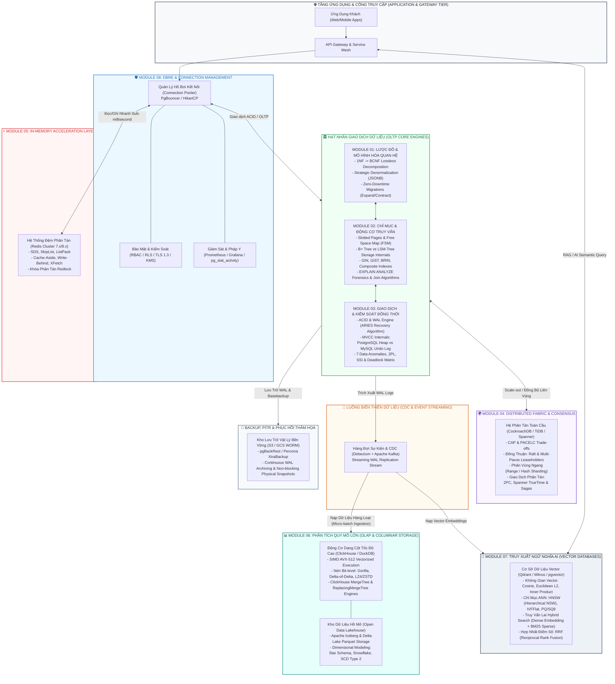
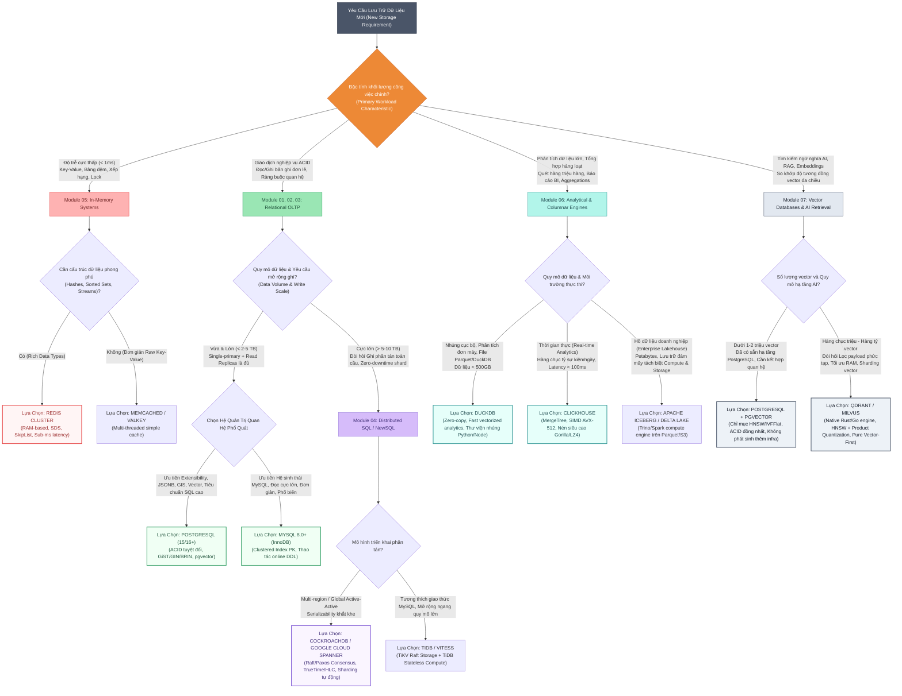

# 🏛️ DATABASE ENGINEERING & ARCHITECTURE MASTERCLASS
## CỔNG TRI THỨC & KHUNG THAM CHIẾU KIẾN TRÚC DỮ LIỆU CẤP DOANH NGHIỆP
### (Enterprise Production-Grade Database Knowledge Hub & Master Reference)

> **Chủ quản Hệ Thống (Course Owner & Sponsor)**: Anh — Lead Architect / Product Owner  
> **Đơn vị Thi công & Tổng hợp (Author & Engineering Fleet)**: Antigravity Autonomous Engineering Fleet (8 Specialized Pods + Integration Pod)  
> **Quy mô Công trình**: 8 Chuyên đề Sâu rộng, **7,505 Dòng Mã & Phân tích Đỉnh cao**, Hoàn toàn Thực chiến (`Production-Ready`)  
> **Chuẩn Mực Giao Tiếp & Kỹ Thuật**: Bilingual Protocol `English (Tiếng Việt)` — Zero-Slop Architectural Rigor  
> **Vị trí Cổng Tri Thức**: `knowledge/database_masterclass/README.md`

---

## 🌟 1. LỜI TỰA & TRIẾT LÝ KIẾN TRÚC (ARCHITECTURAL THESIS)

Trong kỷ nguyên của các hệ thống phân tán chịu tải hàng triệu `QPS (Queries Per Second - Truy vấn mỗi giây)`, các mô hình `AI (Artificial Intelligence - Trí tuệ nhân tạo)` đòi hỏi tìm kiếm ngữ nghĩa theo thời gian thực, và các kho dữ liệu phân tích quy mô hàng `Petabyte`, **Cơ sở Dữ liệu (`Database`)** không còn đơn thuần là một tầng lưu trữ thụ động (`Passive Storage Tier`). Nó chính là **Trái tim Huyết mạch (`Lifeblood Kernel`)** quyết định tính sống còn về hiệu năng, độ tin cậy và sự toàn vẹn của toàn bộ hệ sinh thái phần mềm.

Bộ giáo trình **Database Engineering & Architecture Masterclass** được kiến tạo bởi **Hạm Đội Kỹ Sư Tự Trị (Autonomous Engineering Fleet)** dưới sự chỉ đạo của **Lead Architect (Anh)**. Bộ tài liệu này không lặp lại những định nghĩa giáo điều nông cạn, mà bóc tách trực diện:
1. **Mechanical Sympathy (Thấu cảm Cơ học Phần cứng)**: Hiểu tường tận cách vi xử lý (`CPU`), các đường ống `SIMD (Single Instruction Multiple Data)`, bộ nhớ đệm `L1/L2/L3 Cache`, thanh ghi `RAM`, và ổ đĩa `NVMe SSD` vận hành từng byte dữ liệu dưới trang nhớ (`Page 8KB/16KB`).
2. **Mathematical Foundations (Nền tảng Toán học Vững chắc)**: Đại số quan hệ (`Relational Algebra`), Hệ tiên đề Armstrong (`Armstrong's Axioms`), Không gian Euclid / Cosine nhiều chiều (`High-Dimensional Vector Spaces`), và Các thuật toán đồng thuận phân tán (`Consensus Protocols`).
3. **Forensic Query Optimization (Pháp y Truy vấn & Gỡ rối Hiệu năng)**: Giải mã bản chất từng node của `EXPLAIN (ANALYZE, BUFFERS)`, khống chế hiện tượng `Bloat`, rác `MVCC`, tắc nghẽn hàng đợi khóa (`Lock Contention`), và tranh chấp phân tán (`Distributed Deadlocks`).
4. **Zero-Downtime High Availability (Khả dụng Tuyệt đối Không Gián đoạn)**: Kỹ thuật di cư dữ liệu trực tiếp (`Online Schema Migration`), cơ chế phục hồi thảm họa `PITR (Point-in-Time Recovery)`, và an ninh đa tầng theo chuẩn `Zero-Trust Defense-in-Depth`.

---

## 🗺️ 2. SƠ ĐỒ HỆ SINH THÁI DỮ LIỆU TỔNG THỂ (ENTERPRISE DATA ECOSYSTEM TOPOLOGY)

Dưới đây là bản đồ kiến trúc tích hợp thể hiện luồng dữ liệu đa tầng (`Multi-Tiered Data Pipeline`) kết nối xuyên suốt **8 Phân hệ Chuyên sâu** trong hệ thống doanh nghiệp:

---

## 📚 3. MỤC LỤC CHI TIẾT 8 CHUYÊN ĐỀ MASTERCLASS (CURRICULUM BREAKDOWN)

| Phân Hệ & Liên Kết | Trọng Tâm Kỹ Thuật Đỉnh Cao | Công Nghệ & Giải Thuật Lõi | Số Dòng |
| :--- | :--- | :--- | :---: |
| [**Module 01: Relational Modeling & Schema Architecture**](./MODULE_01_RELATIONAL_MODELING.md) | Thiết kế lược đồ toán học, chuẩn hóa 1NF $\to$ BCNF, kỹ thuật phi chuẩn hóa JSONB, di cư không gián đoạn `Expand/Contract`. | Armstrong's Axioms, Lossless Join, Dependency Preservation, Lock Queue Head-of-Line, Zero-Downtime Migration. | **1,097** |
| [**Module 02: Indexing & Query Tuning Specialist**](./MODULE_02_INDEXING_AND_QUERY_TUNING.md) | Cấu trúc vật lý trang dữ liệu `Slotted Pages`, giải thuật chỉ mục B+ Tree vs LSM-Tree, pháp y `EXPLAIN (ANALYZE, BUFFERS)`. | Slotted Pages, B+ Tree, GIN, GiST, BRIN, LSM Compaction, Nested Loop, Hash Join, Merge Join. | **800** |
| [**Module 03: Transactions, Concurrency & ACID Integrity**](./MODULE_03_TRANSACTIONS_AND_CONCURRENCY.md) | Giải phẫu bản chất ACID, ghi nhật ký đi trước WAL, thuật toán ARIES, cơ chế MVCC so sánh PostgreSQL vs InnoDB, 7 dị thường dữ liệu. | WAL, ARIES Recovery, PostgreSQL Heap Tuples, InnoDB Undo Logs, 2PL, SSI, Snapshot Isolation, Deadlock Detection. | **868** |
| [**Module 04: Distributed Databases & Consensus Architecture**](./MODULE_04_DISTRIBUTED_DATABASES_AND_CONSENSUS.md) | Bản chất hệ phân tán, định lý CAP & PACELC, giao thức đồng thuận Raft/Paxos, phân mảnh Sharding, giao dịch phân tán 2PC & Saga. | Raft Log Replication, Multi-Paxos, Range/Hash Sharding, Two-Phase Commit (2PC), Google TrueTime, Saga Choreography/Orchestration. | **912** |
| [**Module 05: Caching & In-Memory Systems Specialist**](./MODULE_05_CACHING_AND_IN_MEMORY_SYSTEMS.md) | Kiến trúc bộ nhớ đệm tốc độ cao, cấu trúc dữ liệu SDS/SkipList/ListPack, chống sập bộ đệm Thundering Herd, thuật toán XFetch, khóa Redlock. | Redis 7/8 I/O Multiplexing, SDS, SkipList, ListPack, Cache-Aside, Write-Behind, XFetch Optimal Refresh, LRU/LFU, Redlock. | **1,049** |
| [**Module 06: OLAP, Columnar Storage & Modern Analytical Engines**](./MODULE_06_OLAP_AND_COLUMNAR_ENGINES.md) | Lưu trữ dạng cột vật lý, thực thi vector hóa SIMD AVX-512, nén Gorilla/ZSTD, ClickHouse MergeTree, DuckDB nhúng, Lakehouse Iceberg. | Columnar Layout, SIMD AVX-512, Gorilla, LZ4, ZSTD, ClickHouse MergeTree Engine, DuckDB Vector Execution, Apache Iceberg, Star/Snowflake/SCD2. | **1,006** |
| [**Module 07: Vector Databases & AI Information Retrieval**](./MODULE_07_VECTOR_DATABASES_AND_AI_RETRIEVAL.md) | Biểu diễn vector nhúng nhiều chiều, giải thuật tìm kiếm xấp xỉ lân cận ANN (HNSW, IVFFlat, PQ), so sánh pgvector vs Qdrant/Milvus, Hybrid Search RRF. | High-Dimensional Embeddings, Cosine/L2/IP, HNSW Graph, IVFFlat, Product Quantization (PQ/SQ8), pgvector HNSW, Hybrid Dense + BM25, RRF. | **754** |
| [**Module 08: DBRE, Security Hardening & Large-Scale Operations**](./MODULE_08_DBRE_SECURITY_AND_OPERATIONS.md) | Vận hành độ tin cậy cơ sở dữ liệu (DBRE), quản lý kết nối PgBouncer/HikariCP, sao lưu vật lý PITR, bảo mật RBAC/RLS, chống Bloat & Wraparound. | Connection Pooling, PgBouncer Transaction Mode, HikariCP, Physical Streaming Backup, PITR, Column Encryption, RLS, XID Wraparound Vacuuming. | **1,019** |
| **TỔNG CỘNG HỆ THỐNG** | **8 Chuyên Đề Độc Lập — Tương Hỗ Chặt Chẽ — Bao Phủ Toàn Bộ Bản Đồ Kỹ Thuật Dữ Liệu Hiện Đại** | **Toàn diện từ Tầng Vật lý đến Tầng Ứng dụng & Trí tuệ Nhân tạo** | **7,505 DÒNG** |

---

## 🔍 4. TÓM TẮT CHUYÊN SÂU TỪNG PHÂN HỆ (MODULE DEEP DIVES)

### [MODULE 01: Relational Modeling & Schema Architecture](./MODULE_01_RELATIONAL_MODELING.md)
* **Trọng tâm học thuật**:
  - Bản chất toán học của mô hình quan hệ theo E.F. Codd: `Domain (Miền giá trị)`, `Tuple (Bộ dữ liệu)`, `Relation (Quan hệ)` và 5 phép toán nguyên thủy của Đại số quan hệ (`Selection`, `Projection`, `Cartesian Product`, `Set Difference`, `Union`).
  - Hệ tiên đề Armstrong (`Armstrong's Axioms`) chứng minh tính đầy đủ và đúng đắn của phụ thuộc hàm (`Functional Dependencies - FDs`).
  - Chuẩn hóa thực chiến: Phân rã bảo toàn thông tin (`Lossless Join Decomposition`) và bảo toàn phụ thuộc (`Dependency Preservation`) từ `1NF`, `2NF`, `3NF` đến `BCNF (Boyce-Codd Normal Form)`.
  - Phi chuẩn hóa có kiểm soát: Lưu trữ `JSONB` trong RDBMS và các đánh đổi về `Write Amplification (Khuếch đại ghi)`, `Storage Overhead` và `Consistency Drift`.
  - Chiến lược di cư không ngắt quãng (`Zero-Downtime Migration`): Mô hình `Expand and Contract`, cơ chế bẫy khóa `Lock Queue Head-of-Line Blocking` và thiết lập `lock_timeout`.

---

### [MODULE 02: Indexing & Query Tuning Specialist](./MODULE_02_INDEXING_AND_QUERY_TUNING.md)
* **Trọng tâm học thuật**:
  - Tầng vật lý: Cấu trúc trang lưu trữ `Slotted Page Architecture (8KB trên PostgreSQL / 16KB trên InnoDB)`, cấu tạo `Line Pointer`, `Tuple Header`, và cơ chế `Free Space Map (FSM)`.
  - Cuộc đối đầu kinh điển: `B+ Tree` (Tối ưu cho việc đọc ngẫu nhiên, cây cân bằng tự điều chỉnh) vs `LSM-Tree (Log-Structured Merge-Tree)` (Tối ưu cho ghi thông lượng cực cao, cơ chế MemTable, WAL, SSTable và giải thuật gộp Compaction).
  - Phổ chỉ mục chuyên biệt: `GIN (Generalized Inverted Index)` cho mảng và JSONB; `GiST (Generalized Search Tree)` cho không gian địa lý GIS; `BRIN (Block Range Index)` cho dữ liệu chuỗi thời gian khổng lồ hàng trăm gigabyte với kích thước chỉ vài megabyte.
  - Nghệ thuật pháp y truy vấn: Đọc hiểu bản chất của `EXPLAIN (ANALYZE, BUFFERS, COSTS)`, phân biệt chi phí tính toán lý thuyết và thực tế; bóc tách 3 thuật toán nối bảng nền tảng: `Nested Loop Join`, `Hash Join`, và `Merge Join`.

---

### [MODULE 03: Transactions, Concurrency & ACID Integrity](./MODULE_03_TRANSACTIONS_AND_CONCURRENCY.md)
* **Trọng tâm học thuật**:
  - Định nghĩa toán học của giao dịch và 4 đặc tính `ACID (Atomicity, Consistency, Isolation, Durability)`.
  - Nhật ký đi trước `WAL (Write-Ahead Logging)` và thuật toán phục hồi kinh điển `ARIES (Analysis, Redo, Undo)`.
  - Bản chất `MVCC (Multi-Version Concurrency Control)`: So sánh trực diện cơ chế lưu phiên bản tuple trực tiếp trên bảng chính của PostgreSQL (`Heap Tuple XMIN/XMAX` $\to$ sinh ra Bloat cần VACUUM) và cơ chế phân tách bảng chính giữ tuple mới nhất còn phiên bản cũ đẩy vào `Undo Log Segment` của MySQL InnoDB.
  - Ma trận 7 Dị thường Dữ liệu (`Data Anomalies`): Từ `Dirty Read`, `Non-repeatable Read`, `Phantom Read` đến các dị thường tinh vi như `Write Skew`, `Read Skew`, và `Lost Updates`.
  - Kiểm soát đồng thời: `2PL (Two-Phase Locking - Strict/Rigorous)`, `SSI (Serializable Snapshot Isolation)` sử dụng cờ SIREAD Locks, và cơ chế phát hiện chu trình bế tắc `Deadlock Detection`.

---

### [MODULE 04: Distributed Databases & Consensus Architecture](./MODULE_04_DISTRIBUTED_DATABASES_AND_CONSENSUS.md)
* **Trọng tâm học thuật**:
  - Cơ sở lý thuyết hệ phân tán: Thời gian và trật tự sự kiện (`Lamport Timestamps`, `Vector Clocks`), Định lý `CAP (Consistency, Availability, Partition Tolerance)` và định lý mở rộng `PACELC`.
  - Các cấp độ nhất quán phân tán: `Linearizability (Nhất quán tuyến tính)`, `Sequential Consistency`, `Causal Consistency` và `Eventual Consistency`.
  - Các giao thức đồng thuận tối thượng: `Raft Consensus Protocol` (Leader Election, Log Replication, Safety Invariants) và `Multi-Paxos` (Proposer, Acceptor, Learner, Phase 1a/1b & Phase 2a/2b).
  - Kỹ thuật phân mảnh dữ liệu (`Sharding & Partitioning`): `Range-based Sharding` (dễ sinh điểm nóng Hotspots nhưng quét dải cực nhanh) vs `Consistent Hashing / Hash-based Sharding` (phân tán đều tải ghi).
  - Giao dịch phân tán quy mô lớn: Giao thức cam kết hai pha `2PC (Two-Phase Commit)`, kiến trúc đồng hồ nguyên tử `Google TrueTime & Spanner Commit Wait`, và mô hình `Saga Pattern (Choreography vs Orchestration)` cho Microservices.

---

### [MODULE 05: Caching & In-Memory Systems Specialist](./MODULE_05_CACHING_AND_IN_MEMORY_SYSTEMS.md)
* **Trọng tâm học thuật**:
  - Giải mã kiến trúc đơn luồng có chọn lọc của `Redis`: Vòng lặp sự kiện `I/O Multiplexing (epoll/kqueue)` kết hợp đa luồng phụ trợ cho network I/O (`Redis 6+ threaded I/O`) và giải phóng bộ nhớ `BIO (Background I/O)`.
  - Cấu trúc dữ liệu nội tại ở tầng vi hạt: `SDS (Simple Dynamic String)` chống tràn bộ đệm; `SkipList (Bảng nhảy ngẫu nhiên)` phục vụ ZSet với độ phức tạp $O(\log N)$; `ListPack` và `ZipList` nén dữ liệu liên tục trong RAM để tối ưu hóa bộ nhớ đệm CPU.
  - Các mẫu thiết kế bộ đệm kinh điển: `Cache-Aside (Lazy Loading)`, `Read-Through`, `Write-Through`, `Write-Behind (Write-Back)`, và `Refresh-Ahead`.
  - Giải pháp chống sập hệ thống do bộ đệm: Xử lý triệt để `Thundering Herd / Cache Stampede` bằng giải thuật xác suất `XFetch (Probabilistic Early Expiration)`; ngăn chặn `Cache Avalanche` bằng kỹ thuật `TTL Jitter`; triệt tiêu `Cache Penetration` bằng `Bloom Filter`.
  - Cơ chế thu hồi bộ nhớ (`Eviction Policies`): Đào sâu bản chất thuật toán `Approximated LRU` và `LFU (Decay Interval + Counter)` trong Redis; phân tích an toàn thuật toán khóa phân tán `Redlock`.

---

### [MODULE 06: OLAP, Columnar Storage & Modern Analytical Engines](./MODULE_06_OLAP_AND_COLUMNAR_ENGINES.md)
* **Trọng tâm học thuật**:
  - Đối chiếu toàn diện giữa `OLTP (Ghi theo hàng - Row-Oriented)` và `OLAP (Ghi theo cột - Column-Oriented)`: Phân tích cơ chế nạp trang bộ nhớ, tỷ lệ trúng đệm CPU Cache Lines và băng thông I/O đĩa.
  - Tối ưu hóa vi xử lý với `SIMD (Single Instruction, Multiple Data)`: Tập lệnh `AVX2 / AVX-512` giúp lọc và tổng hợp hàng triệu giá trị số trong một chu kỳ xung nhịp CPU (`CPU Clock Cycle`).
  - Các giải thuật nén dữ liệu chuyên sâu dạng bit: `Gorilla Compression` cho dữ liệu dấu phẩy động (`Floating Point XOR delta`), `Delta-of-Delta Encoding`, `Run-Length Encoding (RLE)`, `Dictionary Encoding`, kết hợp `LZ4` và `ZSTD`.
  - Giải phẫu động cơ `ClickHouse MergeTree`: Cấu trúc thư mục Partitions, Primary Index Sparse (Chỉ mục thưa đánh dấu index mark mỗi 8192 hàng), quá trình nền `Background Merge Process`, và biến thể `ReplacingMergeTree`.
  - Động cơ phân tích nhúng `DuckDB` (Vectorized Execution Engine dựa trên paper kinh điển của MonetDB/X100) và định dạng hồ dữ liệu mở `Apache Iceberg / Delta Lake` trên định dạng `Apache Parquet`.
  - Mô hình hóa dữ liệu chiều (`Dimensional Modeling`): Thiết kế `Star Schema`, `Snowflake Schema`, và kỹ thuật theo dõi biến thiên chiều chậm `SCD Type 2 (Slowly Changing Dimensions)`.

---

### [MODULE 07: Vector Databases & AI Information Retrieval](./MODULE_07_VECTOR_DATABASES_AND_AI_RETRIEVAL.md)
* **Trọng tâm học thuật**:
  - Bản chất toán học của `Vector Embeddings`: Không gian đặc trưng nhiều chiều ($D = 768, 1536, 3072$) và các thước đo khoảng cách cốt lõi: `Cosine Distance`, `Euclidean Distance (L2)`, và `Inner Product (Dot Product)`.
  - Các thuật toán tìm kiếm xấp xỉ lân cận gần nhất `ANN (Approximate Nearest Neighbors)`:
    * `HNSW (Hierarchical Navigable Small World)`: Đồ thị đa tầng mô phỏng hiện tượng "thế giới nhỏ", cân bằng tối hảo giữa tốc độ tìm kiếm $O(\log N)$ và độ chính xác (`Recall > 95%`).
    * `IVFFlat (Inverted File Index)`: Phân cụm không gian bằng `K-Means Voronoi Cells`, tối ưu bộ nhớ nhưng cần cân chỉnh tham số `nlist` và `nprobe`.
    * Kỹ thuật lượng tử hóa: `PQ (Product Quantization)` và `SQ8 (Scalar Quantization)` nén vector từ 32-bit float xuống 8-bit, giảm kích thước RAM tới 75–90%.
  - Trận địa kiến trúc: So sánh trực diện `Dedicated Vector DBs (Qdrant viết bằng Rust, Milvus phân tán)` vs `Integrated RDBMS Extension (PostgreSQL với pgvector)`. Khi nào nên tích hợp sẵn và khi nào bắt buộc tách biệt cụm vector độc lập.
  - Tìm kiếm lai đỉnh cao (`Hybrid Search`): Kết hợp sức mạnh ngữ nghĩa của `Dense Vector Embeddings` và độ chính xác từ khóa của `BM25 Sparse Retrieval`, hợp nhất bảng xếp hạng thông qua thuật toán `RRF (Reciprocal Rank Fusion)`.

---

### [MODULE 08: DBRE, Security Hardening & Large-Scale Operations](./MODULE_08_DBRE_SECURITY_AND_OPERATIONS.md)
* **Trọng tâm học thuật**:
  - Triết lý `DBRE (Database Reliability Engineering)`: Xem độ tin cậy cơ sở dữ liệu là bài toán phần mềm; thiết lập `SLI/SLO`, quản lý ngân sách lỗi (`Error Budget`).
  - Kiến trúc quản lý kết nối (`Connection Pooling`): Cơ chế fork tiến trình nặng nề của PostgreSQL (`~10MB RAM/connection`) và giải pháp tối thượng với `PgBouncer (Transaction Pooling Mode)`; cấu hình tối ưu hồ bơi phía ứng dụng với `HikariCP` dựa trên công thức Little's Law.
  - Chiến lược sao lưu và phục hồi thảm họa: Phân biệt `Logical Backup (pg_dump/mysqldump)` và `Physical Backup (pgBackRest / Percona XtraBackup)`; thiết lập quy trình lưu trữ WAL liên tục và diễn tập phục hồi về một điểm thời gian `PITR (Point-in-Time Recovery)` có kiểm chứng checksum định kỳ.
  - Bảo mật chuyên sâu đa tầng (`Zero-Trust Database Hardening`): Kiểm soát truy cập dựa trên vai trò `RBAC`, bảo vệ dữ liệu mức hàng `RLS (Row-Level Security)`, mã hóa đường truyền `TLS 1.3`, và mã hóa dữ liệu tại chỗ `TDE / KMS Envelope Encryption`.
  - Giám sát vi mô và vận hành khẩn cấp: Theo dõi các chỉ số sống còn qua `pg_stat_activity`, `pg_stat_statements`; chẩn đoán và khắc phục triệt để hiện tượng `Table/Index Bloat`; ngăn chặn thảm họa cạn kiệt số định danh giao dịch `Transaction ID (XID) Wraparound Catastrophe` bằng việc tinh chỉnh `autovacuum_freeze_max_age`.

---

## 🧭 5. CÂY QUYẾT ĐỊNH CHỌN CƠ SỞ DỮ LIỆU TỔNG THỂ (MASTER DATABASE SELECTION DECISION TREE)

Nhằm hỗ trợ **Lead Architect** và các **Principal Engineers** đưa ra quyết định lựa chọn công nghệ lưu trữ dữ liệu chính xác, tránh thiên kiến và tối ưu hóa chi phí vận hành, dưới đây là **Cây Quyết Định Kiến Trúc Toàn Diện (`Comprehensive Architectural Decision Tree`)**:

---

## ⚖️ 6. BẢNG SO SÁNH ĐỐI ĐẦU ĐỊNH LƯỢNG (HEAD-TO-HEAD ARCHITECTURAL MATRIX)

| Tiêu Chí Đánh Giá | PostgreSQL 16+ | MySQL 8.0+ (InnoDB) | Redis 7.2+ | ClickHouse | CockroachDB | Qdrant |
| :--- | :---: | :---: | :---: | :---: | :---: | :---: |
| **Kiến Trúc Lưu Trữ (Storage Layout)** | Row (Slotted Page 8KB Heap) | Row (Clustered Index B+ Tree 16KB) | In-Memory (RAM) + RDB/AOF Disk | Columnar (MergeTree Compressed Parts) | Distributed Row/Range (Pebble LSM) | Vector Graph (HNSW + Payload Storage) |
| **Mô Hình Đồng Thời (Concurrency Control)** | Multi-Version (Heap Tuples XMIN/XMAX) | Multi-Version (Undo Logs Segments) | Single-Thread Core + Atomic Operations | Append-Only Batches + Background Merge | Multi-Version (MVCC qua Hybrid Logical Clock) | Concurrent Read Graph + Lock-free Indexing |
| **Thông Lượng Ghi (Write Throughput)** | Vừa - Cao (~20K-50K QPS/node) | Vừa - Cao (~30K-60K QPS/node) | Cực Cao (> 100K-500K QPS/node) | Kịch Trần (> 500K-2M rows/s batch) | Cao (Scale theo số lượng nodes) | Cao (~10K-50K vectors/s/node) |
| **Độ Trễ Truy Vấn (Query Latency)** | Thấp (1 - 10ms) | Thấp (1 - 10ms) | Siêu Thấp (< 1ms Sub-ms) | Thấp cho OLAP (10 - 200ms) | Vừa (5 - 30ms do đồng thuận mạng) | Thấp (2 - 15ms cho ANN Search) |
| **Cơ Chế Phục Hồi (Crash Recovery)** | WAL + Redo Logging | Redo Log + Undo Log + Doublewrite Buffer | AOF (fsync everysec) + Snapshot RDB | Write-Ahead Log (WAL) + Part Integrity | Distributed Raft Log per Range | WAL + Immutable Segment Snapshots |
| **Mở Rộng Quy Mô (Scalability)** | Dọc (Vertical) + Read Replicas | Dọc (Vertical) + Read Replicas | Phân Mảnh (Redis Cluster 16384 slots) | Phân Tán (ClickHouse Cluster Sharding) | Ngang Tuyệt Đối (Native Horizontal Scale-out) | Phân Tán Cụm (Distributed Cluster) |
| **Chi Phí Phần Cứng (Hardware Footprint)** | Vừa (Yêu cầu SSD tốt, RAM vừa) | Vừa (Yêu cầu SSD tốt, RAM vừa) | Cao (Chiếm dụng phần lớn RAM vật lý) | Rất Tối Ưu (Nén đĩa 4x-10x, Ít tốn RAM) | Vừa - Cao (Cần nhiều node CPU/Mạng) | Cao (Cần RAM lớn để giữ Vector HNSW) |

---

## 🏆 7. MƯỜI ĐIỀU RĂN VÀNG TRONG VẬN HÀNH DATABASE (THE 10 COMMANDMENTS)

Được đúc rút từ hàng ngàn ca sự cố nghiêm trọng (`Post-Mortem Outages`) tại các tập đoàn công nghệ hàng đầu thế giới:

1. **Khắc Cốt Ghi Tâm `EXPLAIN (ANALYZE, BUFFERS)` Trước Khi Đẩy Code Lên Production**: Tuyệt đối không đoán mò hiệu năng; luôn kiểm tra số lượng khối nhớ đọc từ đệm (`shared hit`) và đọc từ đĩa (`read disk`).
2. **Khống Chế Nghiêm Ngặt `Lock Queue Head-of-Line Blocking`**: Mọi câu lệnh DDL di cư (`ALTER TABLE`) trên bảng hàng triệu dòng bắt buộc phải đặt `SET lock_timeout = '2s';` và áp dụng mô hình `Expand and Contract`.
3. **Tuyệt Đối Không Để Chỉ Mục Trùng Lặp Hoặc Bị Bỏ Hoang (`Unused / Duplicate Indexes`)**: Mỗi chỉ mục tạo thêm là một gánh nặng trực tiếp lên thông lượng ghi (`Write Amplification`) và dung lượng bộ đệm RAM. Định kỳ rà soát qua `pg_stat_user_indexes`.
4. **Kỷ Luật Thứ Tự Khóa Nhất Quán Để Triệt Tiêu Deadlocks**: Khi cập nhật nhiều bản ghi trong cùng một giao dịch, luôn sắp xếp danh sách định danh theo thứ tự tăng dần (`ORDER BY id ASC`) trước khi thực hiện khóa (`FOR UPDATE`).
5. **Bộ Đệm Không Bao Giờ Là Nguồn Chân Lý (`Cache Is Never The Source of Truth`)**: Luôn thiết lập thời gian sống `TTL` kèm độ lệch ngẫu nhiên (`TTL Jitter`); chuẩn bị sẵn sàng kịch bản hệ thống vẫn sống sót khi toàn bộ Redis bị xóa trắng (`Cache Wipeout`).
6. **Không Sử Dụng Cơ Sở Dữ Liệu Hàng (Row Store) Để Chạy Truy Vấn Phân Tích (Analytics Aggregation)**: Khi báo cáo quét qua hơn 100,000 dòng dữ liệu, hãy đẩy dữ liệu qua ClickHouse, DuckDB hoặc tạo Materialized Views chuyên biệt.
7. **Định Lượng Bộ Nhớ Cho Chỉ Mục Vector AI Trước Khi Triển Khai**: Chỉ mục đồ thị `HNSW` đòi hỏi toàn bộ đồ thị phải nằm trong RAM vật lý để đạt độ trễ thấp; luôn tính toán công thức: $RAM_{HNSW} \approx N \times (D \times 4 + M \times 8 \times 2) \times 1.2$.
8. **Định Cỡ Hồ Bơi Kết Nối Theo Định Luật Little (`Little's Law`)**: Thiết lập số kết nối cơ sở dữ liệu dựa trên số lõi CPU vật lý ($Connections \approx CPU\_Cores \times 2 + Spindle\_Count$); không bao giờ cấp hàng ngàn kết nối trực tiếp vào Postgres mà không qua PgBouncer.
9. **Bản Sao Lưu Không Có Giá Trị Nếu Chưa Được Diễn Tập Phục Hồi Thường Kỳ**: Một chiến lược sao lưu chỉ được coi là thành công khi kịch bản phục hồi thảm họa `PITR (Point-in-Time Recovery)` được tự động hóa diễn tập và kiểm tra tính toàn vẹn định kỳ hàng tuần.
10. **Giám Sát Chủ Động Hiện Tượng `Transaction ID Wraparound` & `Table Bloat`**: Duy trì tiến trình `AUTOVACUUM` hoạt động trơn tru với các worker chuyên trách; không bao giờ tắt Vacuum trên bảng có tần suất ghi cao.

---

## 🤝 8. ĐỘI NGŨ THI CÔNG & BẢN QUYỀN HỆ THỐNG

Công trình được hoàn thành với sự phối hợp tác chiến tự trị của **Antigravity Autonomous Engineering Fleet**:
* **Chủ quản Dự án & Duyệt Kiến trúc Tối cao**: **Anh** (Lead Architect & Product Owner).
* **Điều phối & Tích hợp Hệ thống (Integration Pod)**: Em (Senior AI Pair-Programmer & Systems Architect).
* **Đội ngũ Pods Chuyên trách**:
  - `Pod 1`: Relational Modeling & Schema Architecture Specialist
  - `Pod 2`: Indexing & Query Tuning Internals Specialist
  - `Pod 3`: Transactions, Concurrency & ACID Integrity Specialist
  - `Pod 4`: Distributed Databases & Consensus Protocol Specialist
  - `Pod 5`: Caching & In-Memory Systems Specialist
  - `Pod 6`: OLAP, Columnar Storage & Analytics Specialist
  - `Pod 7`: Vector Databases & AI Information Retrieval Specialist
  - `Pod 8`: DBRE, Security Hardening & Large-Scale Operations Specialist

---
*Tài liệu này thuộc quyền sở hữu trí tuệ của Lead Architect (Anh) và được lưu trữ vĩnh viễn tại `C:\Users\game\.gemini\knowledge\database_masterclass\README.md`.*
